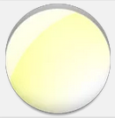
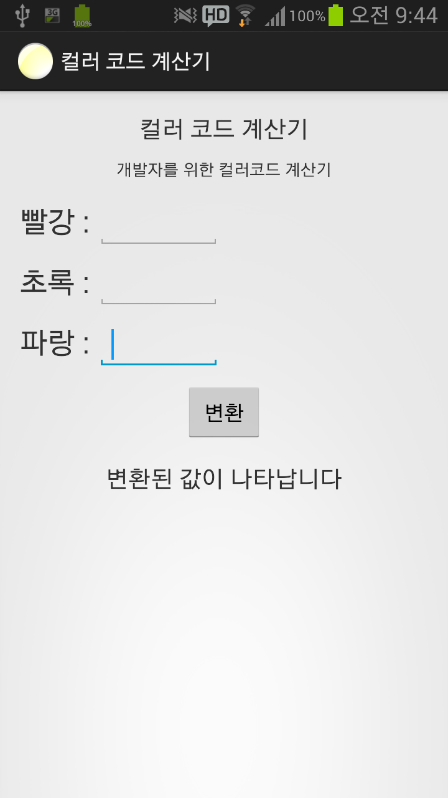
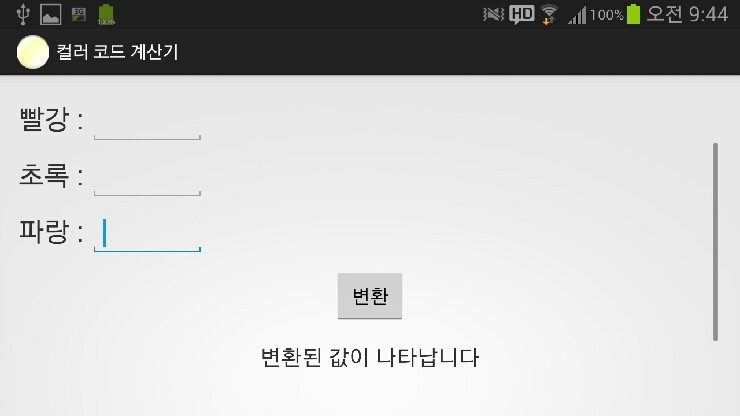
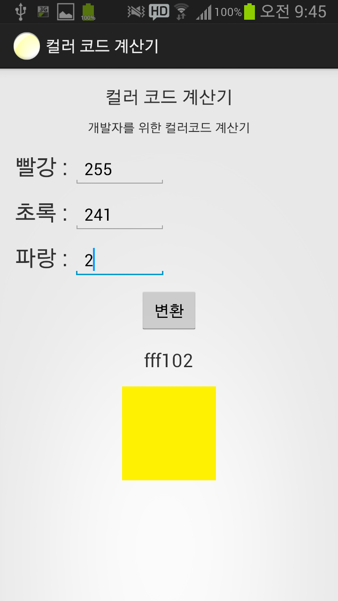
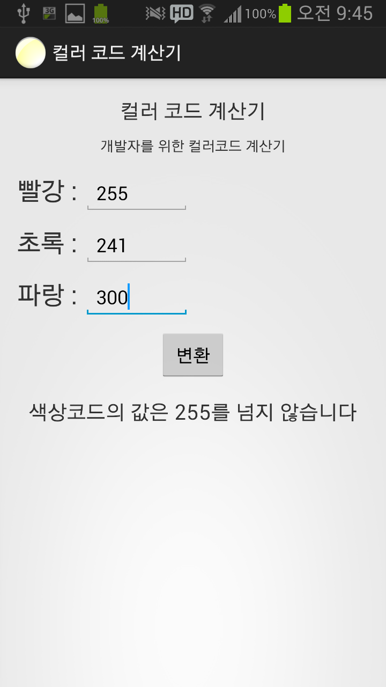
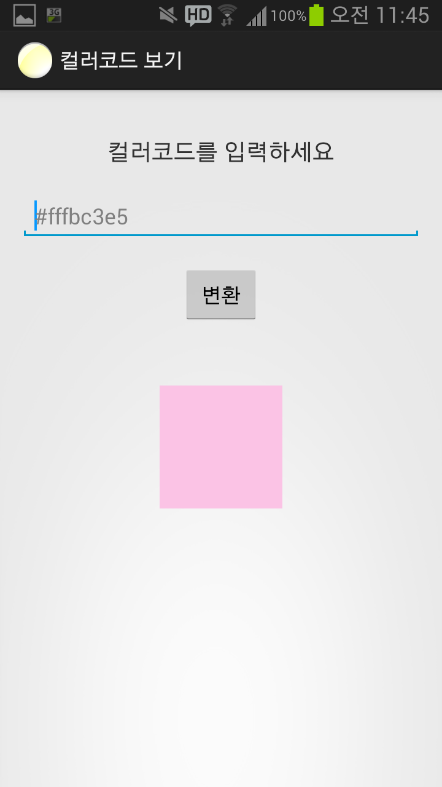

https://play.google.com/store/apps/details?id=com.leejonghwan.colorcode

마켓에 업로드 되어 있습니다 ㅎㅎ

컬러코드 계산기라 검색하시면 됩니다 ㅎㅎ

불편했던 빨강, 초록, 파랑의 세 값을 입력하면 아래에 컬러코드가 계산되어 나오며,

그 컬러코드 색이 나타나는 구조입니다.

가로모드 스크롤 지원하고 있습니다 ㅎㅎ

(v1.5업데이트)

이렇게 빨강, 초록, 파랑의 세가지 값을 입력하면 색코드가 나오며 그 색의 미리보기도 가능합니다.

파랑의 값이 2인대 10진수 2와 16진수 2는 같습니다 그래서 2가 나와야 하지만 가독성 향상을 위해 02로 표시합니다.

(v1.5 업데이트)

색상코드는 255가 최대 값이기 때문에 계산기에서는 255를 넘는 값의 경우 계산을 하지 않도록 합니다.

(v1.5 업데이트)

방금 업데이트 한 기능인데요.

사용자가 원하는 컬러코드를 입력하면 아래에 미리보기로 표시합니다.

(v1.8 업데이트)

입력한 컬러코드 값은 hint로 표시되어 까먹지 않도록 해주며,

만약 #ff를 붙히지 않아도 자동으로 붙혀주고,

또한 색코드 전체 9자 제한, 잘못된 색코드는 표시하지 않도록 업데이트 되어 있습니다.

html, css, xml작업에 편리한 어플이니 한번 다운받으셔서 좋은 평점 부탁드립니다. ㅎㅎ
