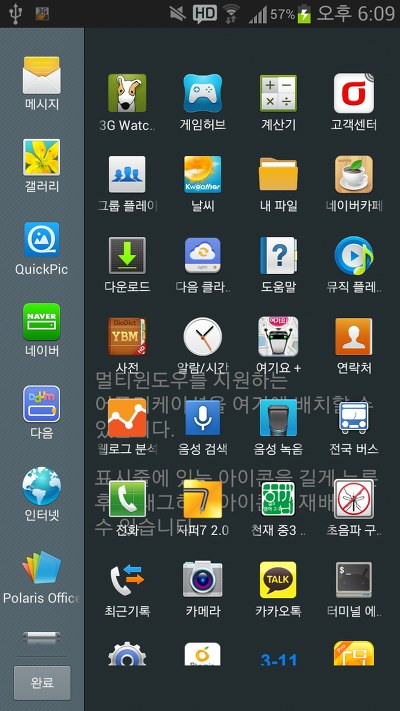

ㅎㅎ

마켓에 삼성 멀티윈도우 관리자(?)였나요? 이런 어플이 있더라고요.

그래서 휴가였던 어제, 피같은 3g 3mb를 사용해가며 어플을 받고 패치를 적용했습니다.

잘되더군요~

그런대 리뷰에 있던 "가끔 설정이 초기화 되요"가 제게도 일어나더군요;;

다시 설정하기는 너무 귀찮고 또 풀릴수도 있어서 그냥 제가 smali수정해가지고 모든 어플이 지원할수 있게 만들었습니다.



원리라 하자면 아주 간단합니다.

전에보니 멀티윈도우에 추가하기 위해서는

```xml
<category android:name="android.intent.category.LAUNCHER" />
```

밑에

```xml
<category android:name="android.intent.category.MULTIWINDOW_LAUNCHER" />
```

을 추가해야 하더군요

```xml
<category android:name="android.intent.category.LAUNCHER" />
```

이 구문은 한 액티비티를 아이콘과 함께 런처에 표시하게 하겠다~라는 구문입니다

이를 응용하여 사라지게 하고픈 어플을 디컴파일하여 AndroidManifast.xml에서 저 구문만 쏙 지워버리거나 하면 나타나지 않습니다

멀티윈도우도 하나의 런처라 생각하면

```xml
<category android:name="android.intent.category.MULTIWINDOW_LAUNCHER" />
```

이라는 구문이 있는 어플만 저 화면에 뜨게 되는것 이지요  
검색해보면 smali\com\sec\android\app\FlashBarService\FlashBarInfo.smali에서 담당하고 있습니다

그럼 간단합니다

저 어플을 디컴파일해서 쑈로롱 바꿔주면 되는겁니다 ㅎㅎ

다른 어플의 도움을 받는것도 아니고 저 멀원어플만 수정한거니 아마 설정이 날아갈 일은 없을겁니다 ㅎㅎ

너무 간단하게 끝나서 좋군요 ㅋㅋ
