안녕하세요~

아마 이 이미지 뷰까지 배우고 나면 기본 위젯은 마스터 하실겁니다 ㅎㅎ

이미지뷰는 이미지를 띄워주는 뷰입니다

비슷한 예로는 이미지 버튼도 있지요 ㅎㅎ

여담입니다만 저는 이미지 뷰 쓸려고 했다가 이미지가 왜곡되서 편법으로 일반 버튼에 백그라운드를 이미지로 지정해버리는 수를 사용했...

아무튼 시작해 보겠습니다~

## 8 이미지뷰를 정복하자 (최종결과:버튼으로 이미지 바꾸기)

### 8-1 프로젝트 생성 생략

### 8-2 이미지 뷰 추가하기

프로젝트 생성은 저번 7강좌 동안 꾸준히 사진으로 설명했으므로 생략합니다

이미지뷰를 추가해 볼까요?

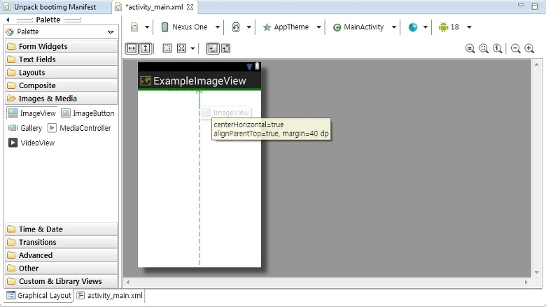

이미지뷰는 Image & Media랑에 있습니다

드래그 하면 아래와 같은 창이 뜹니다

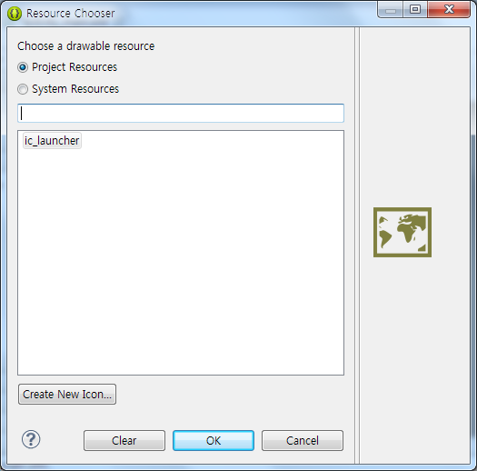

어떤 이미지를 사용할거냐?라는건데요

아직 우리는 이미지를 추가하지 않았습니다

추가해 보겠습니다

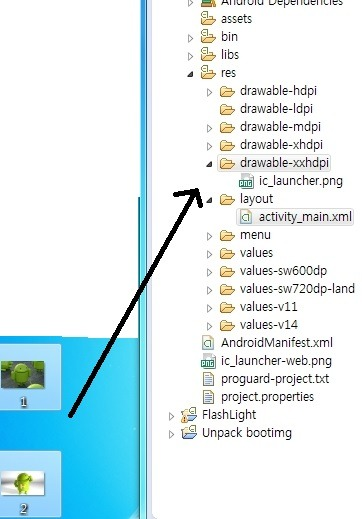

이렇게 드래그를 해주시면 추가가 됩니다

그런대 잠깐 drawable폴더를 보면

drawable-(어쩌구)가 있습니다

전에 언급한적이 있지만 다시 언급하자면 해상도에 맞게 사진 크기를 조절해서 각각 추가할수가 있습니다

만약 모든 해상도에서 지원이 가능하다면??

-이 붙지 않는 그냥 drawable폴더에 넣으면 됩니다

drawable폴더는 기본으로 생성되지 않으므로 직접 만듭시다

New - Folder을 눌러주세요

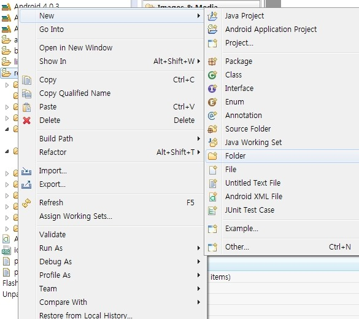

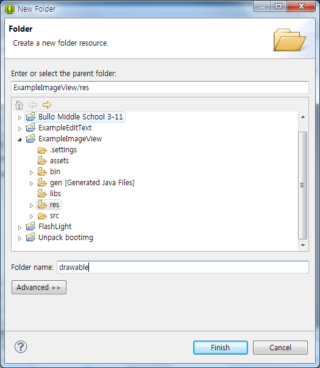

이렇게 생성해 주시면 되겠습니다 ㅎㅎ

이제 drawable폴더에 드래그 해주신다음

Copy Files해주시면 되요

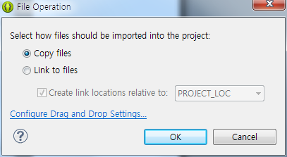

### 8-3 Android Lint 경고 무시해보기

어라?그런대 에러가 발생했어요

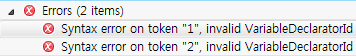

알고보니 리소스파일들의 이름이 잘못되서 그럽니다

R.java파일에 기록되는 변수들은(사실 자바에서의 변수의 이름과 관련이 있습니다)

숫자로 시작해서는 안됩니다

그러므로 F2를 눌러 이름을 바꿔봅시다

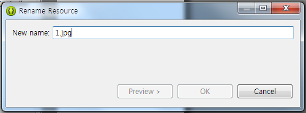

이렇게 이름을 바꾸는 창이 뜨면 바꿔주세요

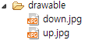

정상적으로 바꿨고, 오류도 사라졌습니다 ㅎㅎ

이제 이미지를 추가했으니 ImageView에서 추가해 봅시다

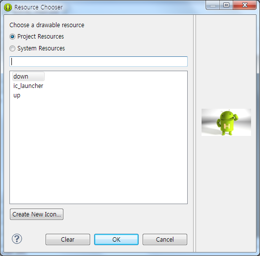

이렇게 이미지 뷰에서 이미지를 선택해 주세요

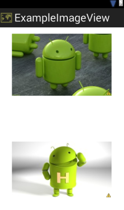

정상적으로 추가되었습니다 ㅎㅎ

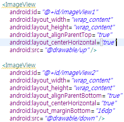

소스를 보면 이렇게 생겼습니다

그런대 ImageView에 노란 밑줄이 있어요

린트 에러 입니다

[Accessibility] Missing contentDescription attribute on image

이런 오류가 뜹니다

해결법은 android:contentDescription="@string/(스트링)"을 추가해주던가 린트에러를 꺼주면 됩니다

그냥 무시해도 되니 ㅎㅎ 아무것도 건들지 말고 넘어가 줍시다

xml의 속성 살펴보겠습니다

src : 이미지를 지정하는 속성

maxWidth, MaxHeight : 최대 크기를 지정하는 속성

tint : 이미지위에 덫붙힐 색을 설정하는 겁니다 #AARRGGBB로 하시면 되고 반투명으로 지정할경우 색다른 느낌이 납니다 ㅎㅎ

이정도면 ImageView는 정복할수 있습니다 ㅎ

### 8-4 버튼을 누르면 위 아래 이미지가 바뀌게 해보기

자 이제 ImageView의 기초는 배웠으니 응용을 해볼까요?

버튼을 누르면 위 아래의 이미지가 바뀌는 어플을 구현해 봅시다

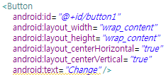

일단 버튼을 만들어 주세요 ㅎㅎ

그다음 java로 넘어가주세요~

public class MainActivity extends Activity {

밑에 아래를 추가해 주세요

```java
ImageView up, down;
Button change;
int count=0;
```

이미지뷰와 버튼을 정의하고 아래 있는 int count와 if를 이용해 버튼을 누를때 마다 바뀌도록 설정할겁니다

마찬가지로 onCreate()안에 추가해 주세요

```java
up = (ImageView) findViewById(R.id.up);
down = (ImageView) findViewById(R.id.down);
change = (Button) findViewById(R.id.button1);
```

id값을 연결해 주는거죠?ㅎㅎ

위 코드를 입력하고 바로 아래에 아래 코드를 복붙하면 됩니다

```java
change.setOnClickListener(new View.OnClickListener() {
      public void onClick(View v) {
      if (count==0){
      up.setImageResource(R.drawable.down);
          down.setImageResource(R.drawable.up);
          up.invalidate();
          down.invalidate();
          count++;
      }else{
      up.setImageResource(R.drawable.up);
          down.setImageResource(R.drawable.down);
          up.invalidate();
          down.invalidate();
          count--;
      }
      }});
```

코드설명을 해보겠습니다

onClickListener는 전에 배웠으므로 Pass

```java
up.setImageResource(R.drawable.down);
down.setImageResource(R.drawable.up);
```

이 코드를 봅시다

이미지 리소스를 찾아 지정해 주는 코드입니다 ㅎㅎ

count가 0일때는 (처음이므로)up은 down이미지로, down은 up이미지로 바꿔줍니다

그다음

```java
up.invalidate();
down.invalidate();
```

을 보면 이미지를 갱신하는, 즉 다시 화면에 뿌려주는 역할을 합니다

아래에 있는 count++;는 count의 값을 하나 늘려서 다음에는 else부분이 실행되도록 하는것 이지요 ㅎㅎ

실행 스샷을 보겠습니다

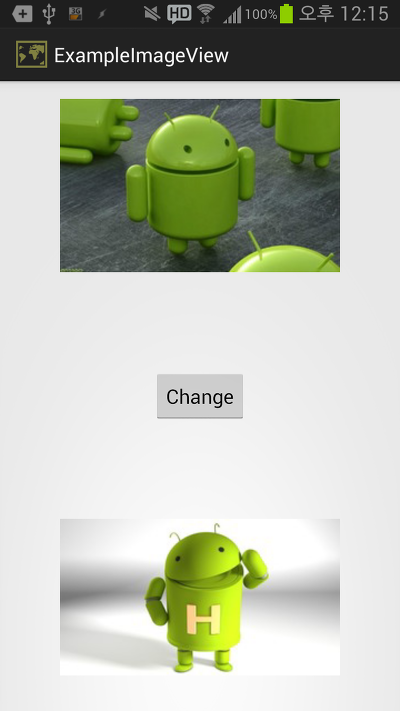

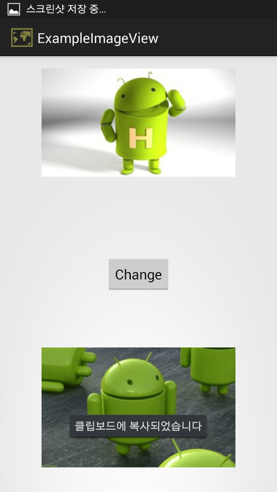

정상 작동하는 모습을 볼수 있습니다 ㅎㅎ

레이아웃의 background속성이라던지로 저는 잘 쓰진 않더군요

하지만 사진이 필요할때는 꼭 필요합니다 ㅎㅎ

한가지 팁을 드리자면

이미지의 크기가 너무 크거나 사진이 너무 많을경우 어플이 틩깁니다

안드로이드 메모리 때문인데요

Heap Size를 늘려주거나 사진의 크기를 줄여야만 합니다

안드로이드의 숙명입니다 ㅠㅠ

그럼 다음강좌에서 봐요~

이글에 사용된 두개의 이미지는 http://cafe.naver.com/ppc1004/22589, http://cafe.naver.com/take22/273567에 있습니다

[ExampleImageView.zip](https://github.com/itmir913/archive/releases/download/itmir-attachments/ExampleImageView.zip)

---

## 첨부파일

- [ExampleImageView.zip](https://github.com/itmir913/archive/releases/download/itmir-attachments/ExampleImageView.zip) `1.2 MB`
