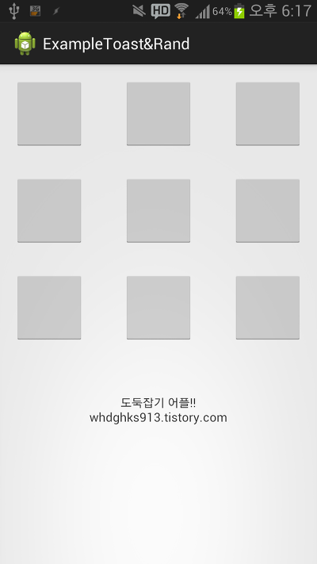
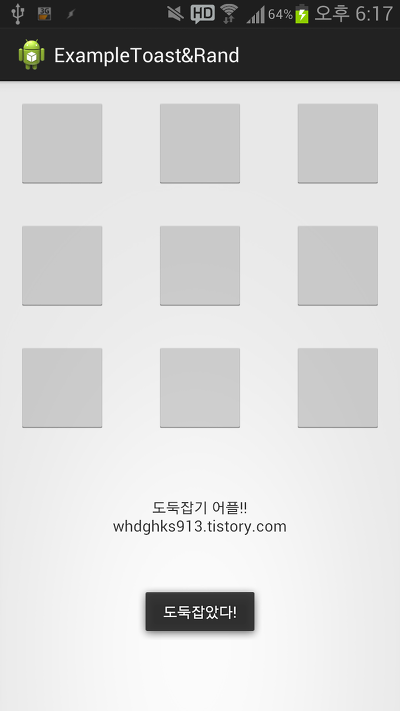

Toast를 배우는 시간입니다~

토스트란 기기 아래 잠깐 표시되는 간단한 메세지 입니다

이번시간에는 토스트를 배울탠대 이것만 배우기에는 너무 강좌가 짧아서

함께 도둑잡기 게임을 만들어 보겠습니다~~~

재미있으니 꼭 따라해보세요!

이번 시간을 위해 자바 책을 뒤져보고 네이버도 찾아봤습니다~

오늘은 rand함수도 같이 배울겁니다

기본지식 : [2013/08/14 - [미르의 개발 이야기/Java 배움터] - 번외 - rand함수를 이해하자](http://itmir.tistory.com/309)

자바 기본 지식을 알고싶다면 여기로~

## 9. Toast와, 도둑잡기 게임을 만들어 봐요! (rand함수 이용)

### 9-1 프로젝트 생성 Pass~

### 9-2 Toast 완전정복

자바 소스로 오신다음 한 줄만 입력하시면 됩니다 ㅎㅎ

Toast.makeText(this,"토스트 메세지 내용",Toast.LENGTH\_SHORT).show();

한줄이면 토스트가 끝나는데요

makeText()를 보면

this가 있습니다, 이것, 즉 이 액티비티를 보낸다 라는것인데요

저도 자세히는 모릅니다

만약 그대로 추가했을때 오류가 뜬다면 일반 Activity를 상속하는 메소드는

(자바파일이름).this해주시면 됩니다

fragment같이 context를 상속하고 있다면 Context같은것을 넣어주시면 됩니다

[미르의 팁]

-상속을 어떻게 알수 있나요?

public class MainActivity extends Activity {

이걸 보면 밑줄이 있죠? extends가 상속한다는 뜻입니다

저건 Activity를 상속하고 있지요

this다음 쉼표(,)뒤에는 토스트 메세지가 들어갑니다

저렇게 큰따음표""로 묶어도 되고 R.string.(스트링 이름)으로 사용해도 됩니다

R.string.(스트링 이름)을 쓸때는

Toast.makeText(this, R.string.toast,Toast.LENGTH\_SHORT).show();

이런식으로 작성해 주시면 됩니다

그 옆에 있는 Toast.LENGTH\_SHORT는 얼마만큼 토스트 메세지를 띄우는 시간입니다

Toast.LENGTH\_LONG과

Toast.LENGTH\_SHORT이 들어갈수 있는데요

long은 약 5초, short는 약 2초라 합니다

안타깝지만 시간을 늘리거나 줄일수는 없다 합니다

자 이렇게 Toast도 끝났습니다

이건 짧아요

그래서 도둑잡기 게임을 만들었는데요

한번 봅시다 ㅎㅎ

### 9-3 도둑잡기 게임을 위한 rand함수 설명

도둑잡기 게임을 위해 우리는 rand라는 함수의 사용법을 알아야 합니다

rand란 랜덤의 약자인데요

자바에서 랜덤 숫자를 구할수 있는 함수 입니다

rand의 자세한 내용은 [2013/08/14 - [미르의 개발 이야기/Java 배움터] - 번외 - rand함수를 이해하자](http://itmir.tistory.com/309)

에서 자세하게 다루고 있습니다

우리는 아래 코드만 알면 됩니다

num = ((int)(Math.random() \* 9));  
num++;

이게 랜덤의 숫자를 구하는 가장 최소한의 두줄입니다 ㅎㅎㅎㅎㅎㅎㅎㅎ 제가 직접 짰어요

곱하는 9는 도둑잡기에 쓰일 버튼이 9개라 1~9의 숫자가 나와야 하므로 9를 곱하는 겁니다

그다음 1을 증가시켜야만 하고요

그럼 rand도 살펴봤으니 직접 만들어 보겠습니다

### 9-4 도둑잡기 게임을 만들어봐요~

먼저 activity\_main.xml의 코드 내용입니다

<Button  
 android:id="@+id/button1"  
 android:layout\_width="80sp"  
 android:layout\_height="80sp"  
 android:layout\_alignParentLeft="true"  
 android:layout\_alignParentTop="true"  
 android:onClick="ClickMethod"  
 />

<Button  
 android:id="@+id/button2"  
 android:layout\_width="80sp"  
 android:layout\_height="80sp"  
 android:layout\_alignBaseline="@+id/button1"  
 android:layout\_alignBottom="@+id/button1"  
 android:layout\_centerHorizontal="true"  
 android:onClick="ClickMethod"  
 />  
   
 <Button  
 android:id="@+id/button3"  
 android:layout\_width="80sp"  
 android:layout\_height="80sp"  
 android:layout\_alignBaseline="@+id/button2"  
 android:layout\_alignBottom="@+id/button2"  
 android:layout\_alignParentRight="true"  
 android:onClick="ClickMethod"  
 />

<Button  
 android:id="@+id/button4"  
 android:layout\_width="80sp"  
 android:layout\_height="80sp"  
 android:layout\_alignLeft="@+id/button1"  
 android:layout\_below="@+id/button1"  
 android:layout\_marginTop="30dp"  
 android:onClick="ClickMethod"  
 />

<Button  
 android:id="@+id/button5"  
 android:layout\_width="80sp"  
 android:layout\_height="80sp"  
 android:layout\_alignBaseline="@+id/button4"  
 android:layout\_alignBottom="@+id/button4"  
 android:layout\_alignLeft="@+id/button2"  
 android:onClick="ClickMethod"  
 />

<Button  
 android:id="@+id/button6"  
 android:layout\_width="80sp"  
 android:layout\_height="80sp"  
 android:layout\_alignBaseline="@+id/button5"  
 android:layout\_alignBottom="@+id/button5"  
 android:layout\_alignLeft="@+id/button3"  
 android:onClick="ClickMethod"  
 />

<Button  
 android:id="@+id/button7"  
 android:layout\_width="80sp"  
 android:layout\_height="80sp"  
 android:layout\_alignLeft="@+id/button4"  
 android:layout\_below="@+id/button4"  
 android:layout\_marginTop="30dp"  
 android:onClick="ClickMethod"  
 />

<Button  
 android:id="@+id/button8"  
 android:layout\_width="80sp"  
 android:layout\_height="80sp"  
 android:layout\_alignBaseline="@+id/button7"  
 android:layout\_alignBottom="@+id/button7"  
 android:layout\_alignLeft="@+id/button5"  
 android:onClick="ClickMethod"  
 />

<Button  
 android:id="@+id/button9"  
 android:layout\_width="80sp"  
 android:layout\_height="80sp"  
 android:layout\_alignBaseline="@+id/button8"  
 android:layout\_alignBottom="@+id/button8"  
 android:layout\_alignLeft="@+id/button6"  
 android:onClick="ClickMethod"  
 />

도둑잡기에 쓰일 9개 버튼을 만들었습니다

이번 어플에서는 listener을 사용하지 않고 한 메소드로만 사용할 예정입니다

왜냐, 메소드를 이용한 방법도 알아야 하고 listener을 사용하면 ID값을 찾고 일일히 listener을 연결해야 합니다

public class MainActivity extends Activity {  
 +int num;

여기서

int num;을 추가해 주세요

그다음 메소드를 하나 추가할건데요 이번 어플에서는 onCreate를 건들지 않습니다

public void ClickMethod(View v){  
 num = ((int)(Math.random() \* 9));  
 num++;  
 switch(v.getId()){  
 case R.id.button1:  
 if (num==1)  
 Toast.makeText(MainActivity.this,"도둑잡았다!",Toast.LENGTH\_SHORT).show();  
 break;  
 case R.id.button2:  
 if (num==2)  
 Toast.makeText(MainActivity.this,"도둑잡았다!",Toast.LENGTH\_SHORT).show();  
 break;  
 case R.id.button3:  
 if (num==3)  
 Toast.makeText(MainActivity.this,"도둑잡았다!",Toast.LENGTH\_SHORT).show();  
 break;  
 case R.id.button4:  
 if (num==4)  
 Toast.makeText(MainActivity.this,"도둑잡았다!",Toast.LENGTH\_SHORT).show();  
 break;  
 case R.id.button5:  
 if (num==5)  
 Toast.makeText(MainActivity.this,"도둑잡았다!",Toast.LENGTH\_SHORT).show();  
 break;  
 case R.id.button6:  
 if (num==6)  
 Toast.makeText(MainActivity.this,"도둑잡았다!",Toast.LENGTH\_SHORT).show();  
 break;  
 case R.id.button7:  
 if (num==7)  
 Toast.makeText(MainActivity.this,"도둑잡았다!",Toast.LENGTH\_SHORT).show();  
 break;  
 case R.id.button8:  
 if (num==8)  
 Toast.makeText(MainActivity.this,"도둑잡았다!",Toast.LENGTH\_SHORT).show();  
 break;  
 case R.id.button9:  
 if (num==9)  
 Toast.makeText(MainActivity.this,"도둑잡았다!",Toast.LENGTH\_SHORT).show();  
 break;  
 }  
 }

이 코드를 통채로 넣어버리면 됩니다

버튼이 클릭할때마다 android:onClick으로 인해 저 메소드가 실행되는데요

그때마다 랜덤값을 다시 구합니다

즉 한번 눌렀던 버튼이 도둑이라면 다시 같은 버튼을 눌렀을때 또 도둑인 문제를 미리 방지하는 겁니다 ㅎㅎ

그다음 id값을 판명하여 버튼1이 눌리면, 버튼 2가 눌리면....버튼 9가 눌리면 에서

if문으로 아까 구했던 랜덤값이 맞아 떨어진다면 도둑 당첨!이 되는겁니다 ㅎㅎ

예제소스에는 listener을 이용한 방법도 주석으로 설명하고 있으니 참고하시길 바랍니다~

버튼을 생성하고 id값을 주고 일일히 listener과 연결해야 해서 소스의 낭비가 심합니다

자 그럼 실행 화면을 볼까요?

히힛 이렇게 랜덤으로 구한 1부터 9까지의 값이랑 여러분이 누른 버튼의 값이랑 맞아 떨어지면 "도둑잡았다!"라는 토스트 메세지를 뛰우게 됩니다 ㅎㅎ

여기서 문제, 도둑이 아닐경우 "아 실패네요"라는 토스트 메세지를 띄워 봅시다

코드는 간단합니다 한두줄만 추가하면 완성됩니다 ㅎㅎ

버튼을 눌렀을때 실행할 코드가 저 토스트 메세지 하나라면 몰라도 버튼도 많고 실행 소스도 많은대 각각의 소스가 공통점이 많다면

따로 메소드를 하나 만들고 버튼을 눌렀을때 메소드랑 전달해줄 값을 지정해주면 더욱 효율적인 어플을 만들수 있습니다

그럼 이쯤해서 이번 강좌 마치도록 하겠습니다~

예제소스는 원본글에서..

이글은 [
] 에서 다시 보실수 있으며 원본 글의 저작권은 미르에게 있습니다

[ExampleToast&Rand.zip

다운로드](./file/ExampleToast&Rand.zip)

개인 용도로 기능을 조금 추가해서 만든 도둑잡기 어플입니다

도둑이면 진동을 울리도록 했습니다

진동은 언제 한번 언급할겁니다

[ExampleToast&Rand.apk

다운로드](./file/ExampleToast&Rand.apk)

[ExampleToast&Rand.zip

다운로드](./file/ExampleToast&Rand_1.zip)

---

## 첨부파일

- [ExampleToast&Rand.apk](https://github.com/itmir913/archive/releases/download/itmir-attachments/ExampleToastRand.apk) `252 KB`
- [ExampleToast&Rand.zip](https://github.com/itmir913/archive/releases/download/itmir-attachments/ExampleToastRand.zip) `1.3 MB`
- [ExampleToast&Rand_1.zip](https://github.com/itmir913/archive/releases/download/itmir-attachments/ExampleToastRand_1.zip) `1.3 MB`
