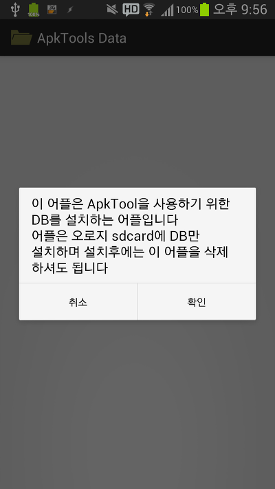

안드로이드 내에서 어플을 디컴파일하고 컴파일 하는것 자체가 사실 불가능 했습니다

그런대 검색해보니 <https://code.google.com/p/apktool> 에 안드로이드 기기를 위한 apktool이 약 6일전(2013-08-16기준)에 업로드 되었습니다!

그래서 이번에는 이 소식을 알려드리려고 합니다

사용방법은 아래와 같습니다

1)apktool4.1\_armhf.zip또는 apktool4.1\_armel.zip을 받아 압축을 푼다음 /sdcard에 저장하세요

2)압축을 푼다음 apktool4.1.apk을 설치하세요

그다음 설치한 어플을 실행하세요

Data를 일일히 압축풀어서 실행하기가 너무 귀찮아서 어플화했습니다

티스토리 첨부파일을 모두받아 지퍼7같은 어플로 압축풀어주세요

또는 마켓에서 다운이 가능합니다

[2013-08-16 PM 11:00 업데이트]

DB설치후 apk를 설치할수 있도록 소스를 추가했습니다

별도로 apktool.apk를 다운받지 마세요!

**모든 저작권은 <https://code.google.com/p/apktool/>에게 있습니다**

안드로이드 어플의 구조적 문제로 어플을 포기하였습니다

다운받으신 분들도 삭제해 주시면 감사드리겠습니다

파일은 <https://code.google.com/p/apktool/> 에서 받아 압축 풀어주시면 됩니다
