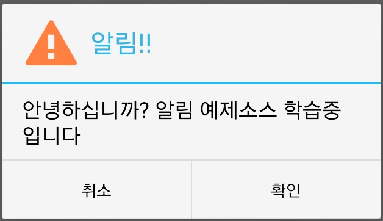

으어ㅠㅠㅠㅠㅠ

내일 개학이네요 ㅠㅠㅠ

어쩔수 없지만 빨리 강좌 하나 쓰고 자렵니다~

이제 밤늦게 폰을 할수 없다니 ㅠㅠㅠ으어ㅠㅠㅠ

방학이 끝나고 2학기가 시작되므로 이 강좌의 업로드 속도가 아주 늦어질수 있습니다

## 11. 알림 메세지 띄우기

### 11-1 알림 메세지란?

안드로이드 폰을 종료할때 나타나는 메세지

"기기를 종료하시겠습니까?"

"아니오"                    "예"

이 문구를 한번쯤은 보신적이 있으실겁니다

이렇게 어플에서 알림메세지를 띄워 사용자의 대답을 입력받을수 있는데요

이번에는 이 코드를 알아보겠습니다

참고로 #11강좌부터는 xml을 건들이는 일이 적고 80%가 java에서 이루어 집니다

### 11-2 코드 미리보기

알림을 띄우는 코드를 확인해 보겠습니다

```java
AlertDialog.Builder alert = new AlertDialog.Builder(this);
alert.setTitle("경고");
alert.setPositiveButton("확인", new DialogInterface.OnClickListener() {
    @Override
    public void onClick(DialogInterface dialog, int which) {
dialog.dismiss();
    }
});
alert.setMessage("내용");
alert.show();
```

위부터 setTitle은 알림의 제목을 지정하는 부분이죠?

setPositiveButton는 오른쪽에 위치하는 버튼을 설정하는 건대, 설정과 동시에 OnClickListener가 자리잡고 있습니다

즉 이 오른쪽 버튼을 누르면 어떤작업을 할꺼냐를 지정해 주는겁니다

아무 작업도 안시킬꺼라면 null을 주면 되는데요

```java
alert.setNegativeButton("취소", null);
```

이런식으로 해주시면 됩니다

onClick메소드안에 있는 dialog.dismiss();는 알림을 닫아주는 코드입니다

setMessage는 짐작하신바와 같이 알림안에 들어갈 내용을 지정해 주는 코드입니다

위에서는 큰따음표 "로 설정했지만 R.string으로도 가능하다는점 잊지마세요~

alert에서 설정할수 있는것은 다양합니다

setIcon

setNegativeButton

setNeutralButton

등등

컨드롤 + 스페이스로 뭐가 들어갈수 있는지 꼭 봐보세요

그럼 예제로 버튼을 클릭하면 알림이 뜨는 어플을 만들어 봅시다

activity\_main.xml

```xml
<Button
        android:id="@+id/button1"
        android:layout_width="wrap_content"
        android:layout_height="wrap_content"
        android:layout_centerHorizontal="true"
        android:layout_centerVertical="true"
        android:onClick="alert"
        android:text="알림표시" />
```

버튼 하나만 지정하고 onClick줍시다

MainActivity.java

```java
public void alert(View v){
AlertDialog.Builder alert = new AlertDialog.Builder(this);
alert.setTitle("알림!!");
alert.setPositiveButton("확인", new DialogInterface.OnClickListener() {
   @Override
   public void onClick(DialogInterface dialog, int which) {
    Toast.makeText(MainActivity.this, "확인 버튼이 눌렸습니다",Toast.LENGTH_SHORT).show();
   }
});
alert.setIcon(R.drawable.ic_launcher);
alert.setNegativeButton("취소", new DialogInterface.OnClickListener() {
   @Override
   public void onClick(DialogInterface dialog, int which) {
    Toast.makeText(MainActivity.this, "취소 버튼이 눌렸습니다",Toast.LENGTH_SHORT).show();
   }
});
alert.setMessage("안녕하십니까? 알림 예제소스 학습중 입니다");
alert.show();
}
```

처음에 배운 예제랑 달라진것은 NegativeButton이 추가되었고 setIcon을 지정하였다는 점입니다

여기까지 이해가 안될경우 다시 정독하시길 바랍니다

이해가 안된 상태에서 더이상 진행하지 마세요

그럼 실행 스샷을 확인해 보겠습니다

확인해야할 것은 아이콘지정과, 버튼 클릭시 나오는 토스트 메세지입니다



버튼을 누르면 이렇게 알림이 뜹니다


확인버튼을 누르면 위 메세지가,


취소 버튼을 누르면 위 메세지가 나오게 됩니다

즉 코드가 정상 작동 한다는 뜻입니다 ㅎㅎ

알림도 토스트와 자주 사용하니 꼭 익히시길 바랍니다~
