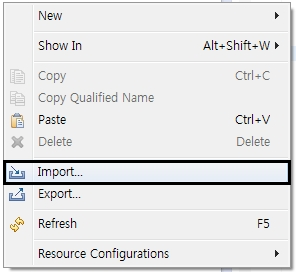
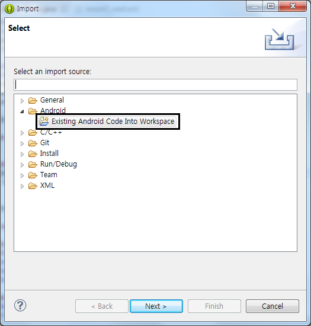
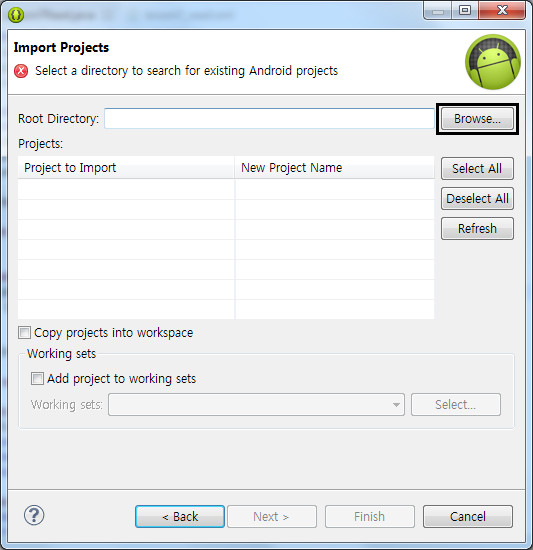
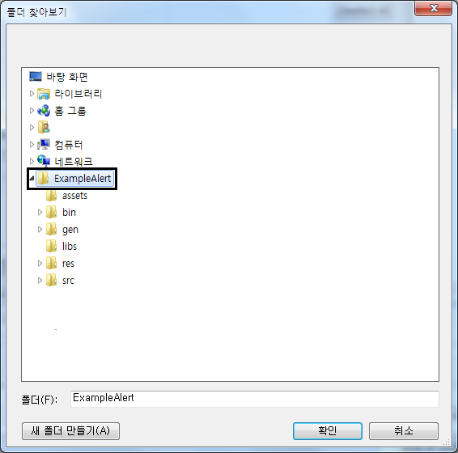
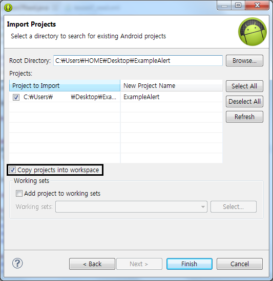
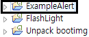

으어 개학이군요 ㅠㅠ

일찍 일어나는거 말곤 재밌습니다 ㅋㅋㅋㅋㅋㅋㅋ

아무튼 각설하고 이번에는 인터넷에 있는 샘플 소스또는 제 강좌의 예제 소스등을 나의 이클립스에 추가해 보는 방법을 알아보겠습니다~

### 12. 예제소스를 내 이클립스에 추가해 보자

다운받으신 소스를 압축풀어주세요

저는 전 강좌였던 </archive/itmir/2013/315>의 예제소스로 해보겠습니다

 이클립스 마우스 오른쪽 - Import를 눌러주세요

 클릭!

 Android탭의 Exsting Android Code Into Worwspace를 선택해주세요

 이화면에서 Root Directory옆에있는 Browse를 눌러주시고

 압축푼 소스를 선택

 자, 이렇게 뜨는데요

이때 꼭 Copy project into workspace를 선택해 주세요

이건 소스를 Workspace로 복사한다는 뜻인데요 이걸 선택하는 이유는

정상소스인데, 이클립스에서 import오류등이 발생하는것을 예방해줍니다

Finish를 누르면 끝!

정상적으로 추가된 것을 볼수 있습니다

예제소스등을 시험해볼때 이 방법으로 이클립스에 추가하세요~