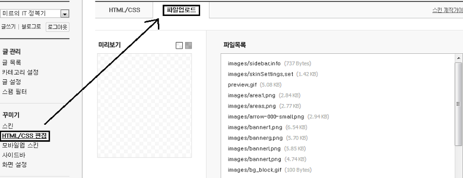

---
title: "티스토리 좋은 소스코드 표현방법"
date: "2013-08-28T21:15:57+09:00"
category: "Tistory"
tags: []
description: "전부터 시도했지만 안됬던게 하나 있었습니다."
draft: false
original_url: "https://itmir.tistory.com/324"
---

안녕하세요~

티스토리 강좌는 오랜만이군요.

전부터 시도했지만 안됬던게 하나 있었습니다.

바로 Syntax Highlighter...

이게 뭐냐면... 티스토리 블로그를 보면 코드소스가 깔끔하게 정리된 블로그가 있습니다.

이게 부러워서 게속 시도했지만 fail...

그런대 오늘 성공했습니다!

그래서 그 방법을 오늘 소개하도록 할까 합니다. ㅎㅎ

먼저 Syntax Highlighter을 다운받아야 합니다.

공식 홈페이지 <http://alexgorbatchev.com/SyntaxHighlighter>에서 받아도 되고, 아래 첨부파일을 받아도 됩니다.

[syntaxhighlighter\_3.0.83.zip](https://github.com/itmir913/archive/releases/download/itmir-attachments/syntaxhighlighter_3.0.83.zip)

첨부하였습니다. 바로 받아주세요~ 2013-08-28 기준 최신 파일입니다.

다운받은 다음, 압축을 풀어주세요.

압축 풀면 나오는 폴더의 갯수는 5개정도 되지만, 지금 필요한건 몇 개 안됩니다.

scripts와 styles가 필요한 폴더입니다.

티스토리 관리자 페이지로 가서 Html을 수정해 봅시다.



사진처럼 들어가 주세요.

그 다음 아래에 있는 [+추가] 버튼을 눌러 필요한 파일을 추가해 봅시다.

scripts폴더안에 있는 js파일중 원하는 파일을 업로드 해주세요.

만약 너무 많다... 그렇다면 필요한 파일만 업로드 해도 됩니다.

shBrush\*\*.js파일은 나중에 지정할 소스 언어의 종류 입니다.

shBrushCpp는 C, shBrushJava는 자바, shBrushDiff는 diff죠.

이렇게 shBrush\*\*.js중에서 자신이 필요한 파일만 업로드해도 됩니다.

shCore.js같은 파일(shBrush가 없는파일들)은 모두 업로드 해주세요.

scripts폴더에서는 shCore.js와 shLegacy.js는 필수 파일 입니다.

  

styles폴더에서는 shCore.css파일과 shThemeDefault.css(또는 shTheme~.css)파일도 무조건 넣어주셔야 합니다.

그다음 위에 있는 HTML/CSS를 눌러서 html을 수정해 봅시다.

`<html>`이라는 코드 아래에 어디든지 아래 코드를 복사해서 추가해 주세요.

```html
<script type="text/javascript" src="./images/shCore.js"></script>
<script type="text/javascript" src="./images/shLegacy.js"></script>
<script type="text/javascript" src="./images/shBrushAppleScript.js"></script>
<script type="text/javascript" src="./images/shBrushAS3.js"></script>
<script type="text/javascript" src="./images/shBrushBash.js"></script>
<script type="text/javascript" src="./images/shBrushColdFusion.js"></script>
<script type="text/javascript" src="./images/shBrushCpp.js"></script>
<script type="text/javascript" src="./images/shBrushCSharp.js"></script>
<script type="text/javascript" src="./images/shBrushCss.js"></script>
<script type="text/javascript" src="./images/shBrushDelphi.js"></script>
<script type="text/javascript" src="./images/shBrushDiff.js"></script>
<script type="text/javascript" src="./images/shBrushErlang.js"></script>
<script type="text/javascript" src="./images/shBrushGroovy.js"></script>
<script type="text/javascript" src="./images/shBrushJava.js"></script>
<script type="text/javascript" src="./images/shBrushJavaFx.js"></script>
<script type="text/javascript" src="./images/shBrushJScript.js"></script>
<script type="text/javascript" src="./images/shBrushPerl.js"></script>
<script type="text/javascript" src="./images/shBrushPhp.js"></script>
<script type="text/javascript" src="./images/shBrushPlain.js"></script>
<script type="text/javascript" src="./images/shBrushPowerShell.js"></script>
<script type="text/javascript" src="./images/shBrushPython.js"></script>
<script type="text/javascript" src="./images/shBrushRuby.js"></script>
<script type="text/javascript" src="./images/shBrushSass.js"></script>
<script type="text/javascript" src="./images/shBrushScala.js"></script>
<script type="text/javascript" src="./images/shBrushSql.js"></script>
<script type="text/javascript" src="./images/shBrushVb.js"></script>
<script type="text/javascript" src="./images/shBrushXml.js"></script>
<link type="text/css" rel="stylesheet" href="./images/shCore.css">
<link type="text/css" rel="stylesheet" href="./images/shThemeDefault.css">
```

그다음 skin.html의 마지막 부분인  `</body></html>`위에 아래 코드를 또 넣어주세요.

```html
<pre class="brush: javascript">
<script type="text/javascript">
SyntaxHighlighter.defaults['toolbar'] = false;
SyntaxHighlighter.all();
</script>
```

자 그럼 이제 작업은 끝났습니다.

이제 게시글을 작성할때 코드를 아래 html 소스 안에 넣어주시면 됩니다.

```html
<pre class="brush: 언어종류">

// 코드내용을 이곳에 적습니다

</pre>
```

이때 언어종류에는 javascript, c, java등등이 들어갈수 있습니다.

자세한건 <http://alexgorbatchev.com/SyntaxHighlighter/manual/brushes/>에서 참조해 주세요.^^

+ 모바일 환경에서 코드가 안보일경우 또는 하이라이딩(강조표시)가 안될경우.

SyntaxHighlighter의 치명적인 단점이랄까요?

코드에 < 나 >가있으면 작동을 하지 않습니다...;

<는 <으로, >는 >으로 치환해 줘야 하는데요.

간단한 프로그램을 찾았습니다.

<http://emflant.tistory.com/42>

여기서 프로그램의 설명과 방법을 확인하실수 있습니다.

`<pre>`를 사용하지 않고 `<script>`를 사용하면 해결할수 있다고 합니다.

그러나 특정환경(모바일등등)에서는 아에 표시되지 않을 수 있고, 검색봇에게 `<script>`는 검색하지 않는다는 점이 단점이 되겠습니다.

아래는 `<script>`로 사용한 코드의 예입니다. (모바일에서는 안보일겁니다, 또는 자바스크립트 사용여부를 확인하세요)

```html
<script type="syntaxhighlighter" class="brush: js">

// 코드를 입력하시면 됩니다

</script>
```

이런식으로 작성해 주시면 됩니다.

예제는 <http://alexgorbatchev.com/SyntaxHighlighter/manual/installation.html>에서 주워왔습니다.

이글은 [] 에서 다시 보실수 있으며 원본 글의 저작권은 미르에게 있습니다.

+추가

<http://prev.kr/app/ColorScripter/>

ColorScripter라는것도 있습니다.

이것은 html 자바스크립트를 사용할수 없는 환경, 즉 Syntax Highlighter을 못쓰는 환경에서 사용가능한 방법입니다.

---

## 첨부파일

- [syntaxhighlighter_3.0.83.zip](https://github.com/itmir913/archive/releases/download/itmir-attachments/syntaxhighlighter_3.0.83.zip) `174 KB`
