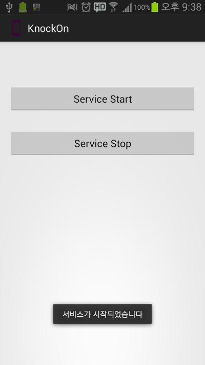
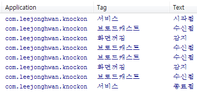

어쩌다가 만들게 되었네요...

지금까지 구현한건 아래와 같습니다

서비스 시작버튼

서비스 종료버튼

이렇게 로그켓을 보면 화면꺼짐을 잡아내는 것을 확인할수 있습니다

이제 화면 꺼진상태에서 두번 터치를 잡아내야 하고

두번 터치하면 화면이 켜지게 해야 하는대....

화면이 켜지게 하는것은 소스가 있더군요 ㅎㅎ.. 그래서 관리자 권한이 필요하다기에 일단 어찌해서 만들어 뒀습니다

그런대 화면 꺼진상태에서 두번 터치하는것을 어찌 잡아낸단 말이냐...ㅠ

브로드 캐스트로는 안된다고 나왔습니다

음.... 뭔 방법 없을까요??
