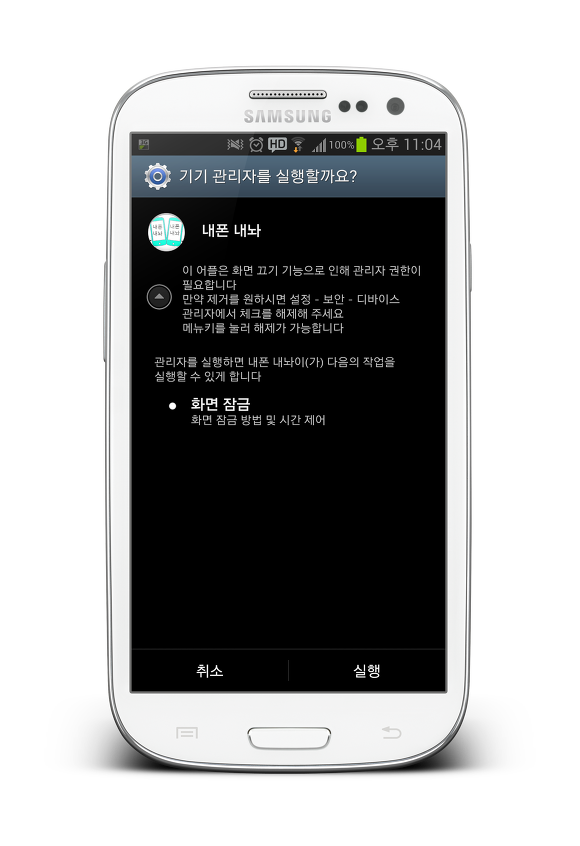
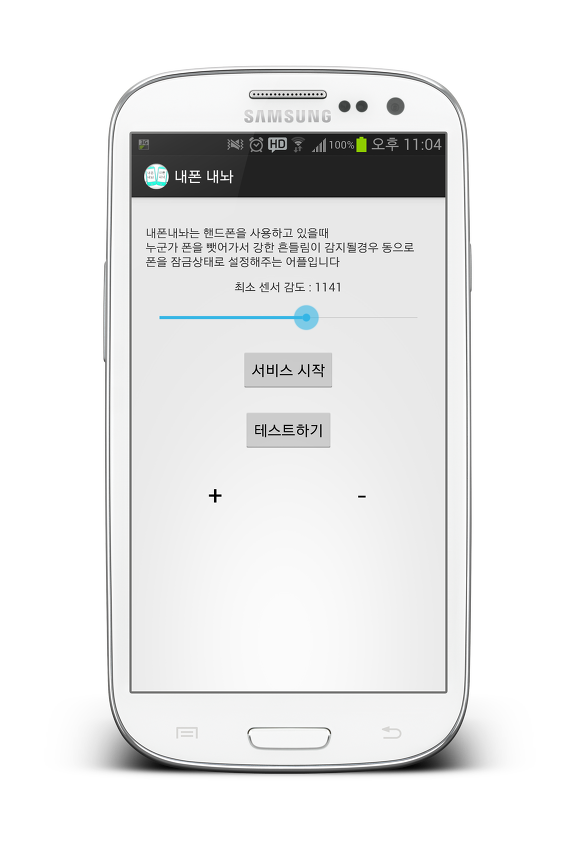
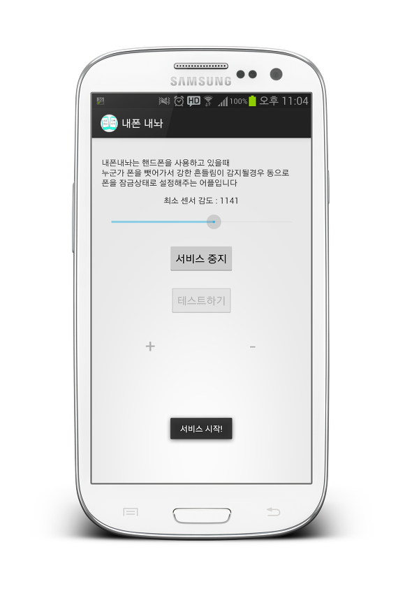
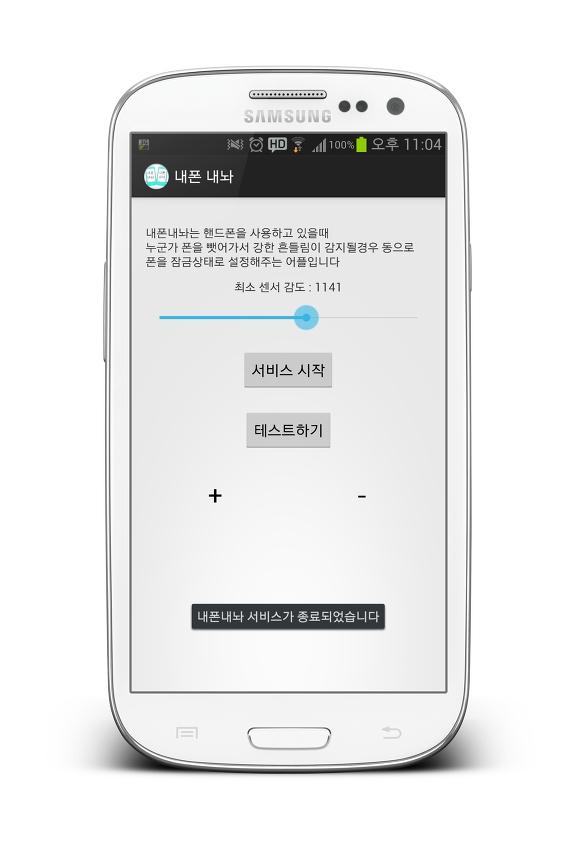

내폰내놔 라는 어플이 마켓에 게시되었습니다!

이런 아이콘을 가지고 있습니다 ㅋㅋㅋ

내폰내놔란? 마켓 어플 소개 글을 따오겠습니다 ㅎ

스마트폰을 사용하고 있는대 가족 또는 친구들이 폰을 갑자기 뺏어간적 다들 있으시죠??

어어어어...이미 패턴이 풀린 상태라 스마트폰을 지켜줄 방패가 없어졌습니다;;

이렇게 어떤 비밀 들통한적 한번쯤은 있으시죠?ㅋ

이 어플은 가속도 센서를 이용해서 설정한 값 이상으로 센서가 반응할경우

화면을 종료해 줍니다

자, 이런어플입니다 ㅋㅋㅋㅋㅋㅋㅋㅋㅋㅋㅋㅋㅋ

전에 누군가 이런 발상을 하신거 같은대요

이걸 어플화로 구현했습니다 ㅋㅋ

스크린샷 한번 구경해보세요~

ㅋㅋㅋㅋㅋㅋㅋ

내폰내놔 라는 이름 어떤가요?ㅋㅋ

지금 마켓에 올렸으니 약 3시간뒤인 2013-08-31 AM 1:30분 전후로 나타날겁니다 ㅋㅋㅋ

응용하면 흔들어서 화면 종료어플로도 사용이 가능하지요 ㅋㅋ

그럼 저는 이만 빨리 자렵니다~

다들 안녕히 계세요~

ps. 서비스를 시작하면 엄청나게 센서가 사용되서 배터리가 많이 달겁니다 아마..

그래서 thread.sleep을 이용하려 했는대 이게 서비스를 시작하자마자 바로 굳어버리네요 메인 액티비티가...;

혹시 자세하게 아신다면 알려주신다면 감사드리겠습니다~
