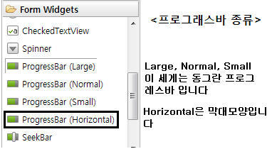
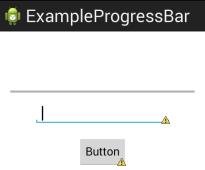
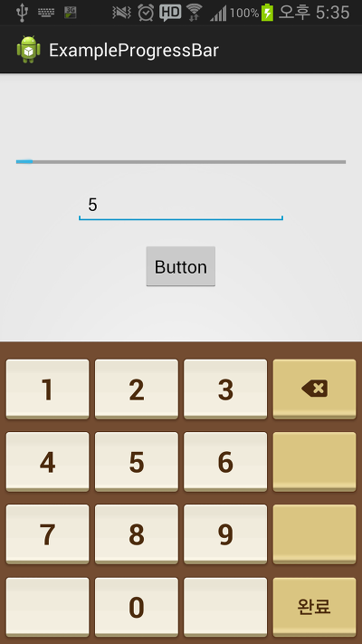
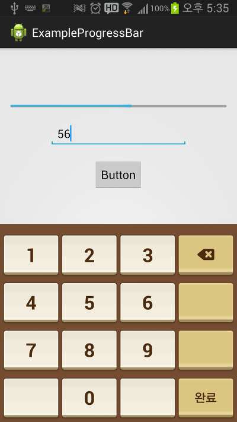

오랜만의 강좌네요 ㅎㅎ

이번 강좌에서는 EditText의 진화형과 쓰레드에 대해서도 약간 다루고 있으나 꼭 아실필요는 없습니다

으어어어어 소스 이해가 안되요 라고 안하셔도 되요 ㅎㅎ

## 14. 프로그레스바 사용법을 알아보자

### 14-1 미션1 정답 소스 제공

다들 저번 미션 완료하셨나요?

미션1의 예제소스를 올려드립니다

주석이 달려있고, 이미 배웠던것이므로 따로 소스 설명은 하지 않을려고 합니다ㅎㅎ

[MissionApp1\_Example.zip](https://github.com/itmir913/archive/releases/download/itmir-attachments/MissionApp1_Example.zip)

### 14-2 프로그레스바

프로그레스바(ProgressBar)에 대해 아시나요?

잘 모르신다면, 인터넷 어플에서 위에 로딩시 꽉차는 막대기를 상상하세요

이번에는 이 프로그레스 바를 이용해 보겠습니다

이클립스 실행한다음 새로운 프로젝트 하나 만들어 주세요~

ProgressBar는 아래 사진처럼 추가해 주시면 됩니다

Form Widgets의 아래부분에 있습니다

우린 동그라미 모양 프로그레스바를 사용하지 않고 막대모양 프로그레스바를 사용할 예정입니다

동그라미형 : 주로 작업의 진행중을 표시할때 쓰입니다

막대형 : 작업의 진행상황을 표시할때 쓰입니다

[미르의 팁]

여기서 잠깐, SeekBar는 뭘까요?

이건 아마 다음시간에 배울거 같습니다

이건 볼륨 조절할때 동그란 버튼 움직여서 이동하는 거 아시죠?

그겁니다ㅋㅋ

자, 막대형 프로그레스바를 추가하면 xml에 아래 코드(style)가 있습니다

style="?android:attr/progressBarStyleHorizontal"

막대형으로 사용할것이다! 라는 것으로, 지우면 동그라미형으로 변하니 절대 지우시면 안됩니다

음... 넓이가 너무 작네요??

늘려줍시다

android:layout\_width="wrap\_content"

을

android:layout\_width="match\_parent"

으로

프로그레스바(막대형)은 몇가지 추가된 xml속성이 있습니다

한번 살펴보겠습니다

android:max : 최대값을 지정해 주는 속성  
android:progress : 현재 위치를 지정해 주는 속성

이정도 추가되었으니 한번 숙지하고 갈까요?

추가한 프로그레스바에 android:max="100"속성을 지정해 줍시다

그럼 추가한 프로그레스바 아래에 차례대로 EditText와 버튼을 추가해 주세요

EditText의 inPutType는 number으로 지정해 주세요

android:inputType="number"

또한, 일일히 OnClickListener을 지정하기 귀찮으니 버튼에는 onClick속성을 넣어줍시다 ㅎ

android:onClick="Start"

완성된 xml의 코드는 다음과 같습니

<ProgressBar  
        android:id="@+id/progressBar1"  
        style="?android:attr/progressBarStyleHorizontal"  
        android:layout\_width="match\_parent"  
        android:layout\_height="wrap\_content"  
        android:layout\_alignParentTop="true"  
        android:layout\_centerHorizontal="true"  
        android:max="1000"  
        android:layout\_marginTop="64dp" />

    <EditText  
        android:id="@+id/editText1"  
        android:layout\_width="wrap\_content"  
        android:layout\_height="wrap\_content"  
        android:layout\_below="@+id/progressBar1"  
        android:layout\_centerHorizontal="true"  
        android:layout\_marginTop="14dp"  
        android:inputType="number"  
        android:ems="10" >

        <requestFocus />  
    </EditText>

    <Button  
        android:id="@+id/button1"  
        android:layout\_width="wrap\_content"  
        android:layout\_height="wrap\_content"  
        android:layout\_below="@+id/editText1"  
        android:layout\_centerHorizontal="true"  
        android:layout\_marginTop="18dp"  
        android:onClick="Start"  
        android:text="Button" />

자, 그럼 여기서 각 역할을 설명해 보겠습니다

먼저, EditText에 숫자를 입력하면 입력즉시 프로그레스바를 진행하도록 설정할겁니다

그다음, 버튼을 누르면 1초마다 프로그레스바가 움직이도록 설정할겁니다

이제 xml코드상에서의 작업은 끝났습니다 ㅎㅎ

자바로 넘어와 주세요!

쓰레드를 사용할것이기 때문에 implements Runnable이라는것을 추가해 줘야 합니다

아래 초록 박스의 굵은 글씨가 추가된 부분입니다

public class MainActivity extends Activity **implements Runnable** {  
**ProgressBar progressBar1;  
 EditText editText1;  
 int progress=0;  
 Thread thread;**

... 중략

이 예제에서는 Thread에 대해 설명하진 않으니 일단 넘어가 주세요~

그다음 onCreate안에

progressBar1 = (ProgressBar) findViewById(R.id.progressBar1);

editText1 = (EditText) findViewById(R.id.editText1);

을 추가해 줍시다

그다음 그 아래에 editText의 값이 변하는 즉시 적용되게 해야 합니다

똑똑한 EditText를 만들어 봅시다

editText1.**addTextChangedListener**(new TextWatcher() {  
    
   @Override  
   public void afterTextChanged(Editable arg0) {  
      
   }

   @Override  
   public void beforeTextChanged(CharSequence arg0, int arg1, int arg2, int arg3) {  
      
   }

   @Override  
   public void onTextChanged(CharSequence arg0, int arg1, int arg2,  
     int arg3) {  
    // TODO Auto-generated method stub  
    /\*\*  
     \* 만약 입력한 값이 공백(없음, "")이라면 강제종료 오류가 뜨므로 이 전체를 try문으로 감싸 오류를 막습니다  
     \*/  
    try {  
      // Integer.parseInt()는 String을 Int로 바꿔줍니다  
     progress = Integer.parseInt(editText1.getText().toString());  
     progressBar1.setProgress(progress);

     //setProgress는 프로그레스바의 진행정도를 지정해 줍니다, ()안에는 int형 숫자가 들어갈수 있습니다  
    } catch (Exception e) {  
       
    }  
   }  
  });

addTextChangedListener라는 것을 이용하여 구현되었는데요

이것은 EditText의 내용물이 바뀔때마다 호출됩니다

예를들자면 카카오톡의 비밀번호기능인데요

확인버튼이 없고 바로 입력하면 잠금이 풀리니 말이죠 ㅎㅎ

afterTextChanged메소드는 글자가 바뀐후에, beforeTextChanged는 글자가 바뀌기 전에, onTextChanged는 글자가 바뀌고 실행되는 메소드들 입니다

자세한 지식은 <http://themangs.tistory.com/531>으로

이번에는 EditText의 값을 수정하는 동시에 프로그레스바를 설정하려고 위와같은 코드를 작성하였습니다

그럼 위에서 말했던 기능 하나는 구현이 완료되었네요 ㅎㅎㅎ

이제 나머지 한 기능도 구현해 봅시다

두개의 메소드를 추가해 줘야 합니다

public void Start(View v){  
    thread = new Thread(this);  
    thread.start();  
 }

하나는 버튼xml에서 지정한 onClick에 필요한 메소드입니다

thread라는것을 시작해 주는 소스가 보이시나요?

thread.start();라는것은 아~ 드쓰레라는걸 시작하는거구나 라는것을 아실수 있으실겁니다

이제 드쓰레가 시작되면 뭘 할건지를 지정해 줘야 합니다

그건 run이라는 이름을 가진 메소드에서 지정해 줄수 있습니다

@Override  
public void run(){  
    progress=0;  
    while(progress<100){  
        ++progress;  
        progressBar1.setProgress(progress);  
    try {  
        thread.sleep(1000);  
    } catch (InterruptedException e) {  
        // TODO Auto-generated catch block  
        e.printStackTrace();  
    }  
    }  
}

음... 지금쯤이면 이 코드를 보면 대충은 아실수 있지 않나요?

드쓰레를 시작하면 처음에는 progress의 값을 0으로 만듭니다

그다음 while반복문이 시작되는데요

while(progress<100)인것으로 보아 progress가 100이면 false를 만들어 반복이 종료되는것을 확인할 수 있습니다 ㅎㅎ

++progress;는 값을 하나 늘려주는코드이고..

progressBar1.setProgress(progress);는 프로그레스바를 설정하는 코드이군요 ㅎㅎ

그 아래에 있는

try {  
thread.sleep(1000);  
} catch (InterruptedException e) {  
// TODO Auto-generated catch block  
e.printStackTrace();  
}

는 이 통채가 한 세트입니다

thread가 이 문구를 만나면 ()안 시간만큼 잠을 잠니다

1000은 1초가 되겠죠??ㅎㅎ

이렇게 해서 프로그레스바를 알아보는 코드를 짜봤습니다

동작 확인해 봐야겠죠??

EditText를 수정하자마자 프로그레스바가 움직이고, 버튼을 누르면 1초마다 조금씩 값이 증가하는 모습을 관찰할수 있습니다!!

이번 강좌는 약간 말이 오락가락하는 거 같습니다 ㅎㅎ;;

그래서 이번에만 예제소스에 주석으로 친절하고 아주 자세히 표시해 둘태니 이해가 안되는 부분이 있다면

예제소스로 공부해 주시면 감사드리겠습니다~

예제소스는 원본 게시글에서만 다운로드 할 수 있습니다

---

## 첨부파일

- [MissionApp1_Example.zip](https://github.com/itmir913/archive/releases/download/itmir-attachments/MissionApp1_Example.zip) `511 KB`
