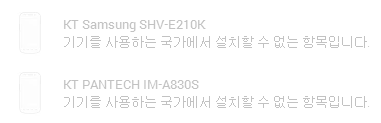
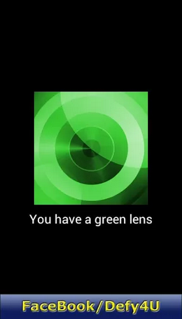
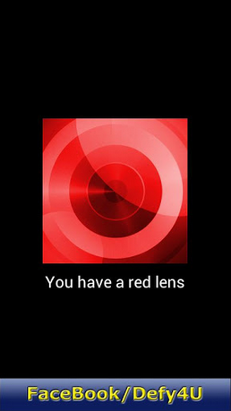

모로로라 디파이(Defy)를 사용하고 계십니까?

디파이는 보드마다 카메라 랜즈가 두가지 있다고 합니다

그린랜즈와 레드랜드 인대요

카메라 부분을 형광등에 대면 무슨 색이 보인다고도 하는대 저는 모르겠습니다 ㄷ

이런 랜즈 종류에 따라 성능이라던지 올릴수 있는 롬의 차이가 있습니다

요즘은 렌즈에 상관없이 모두 올릴수 있는 롬이 많습니다, 아니 거희 모두입니다 ㅎㅎ

듣기론 그린랜즈<레드랜즈라고 하더군요

그래서 어플을 찾아봤습니다

DefyLens라는 어플이 있는대 이는 en지역, 즉 미국에서만 다운이 가능하더군요

https://play.google.com/store/apps/details?id=com.jovasoft.defylens

미국이 아니면 아래와 같이 뜹니다

그래서 구글링을 통해 apk를 찾아냈습니다

아주 힘들게 찾은 만큼 공유 안하려고 했었는대 혹시 필요하신 분들이 계실까 해서 지금이라도 올립니다 ㅎㅎ

스크린샷

   

참고로 저는 레드랜즈더군요 ㅎㅎ