어제.. 제가 그래픽 드라이버 업데이트를 잘못 하는바람에...  
(사실 장치관리자에서 드라이버 업데이트메뉴만 누른 죄말곤 없다죠 ㅠㅠ)

아래 사진과 같이 해상도가 엄청나게 낮아졌습니다. ㅠㅠ

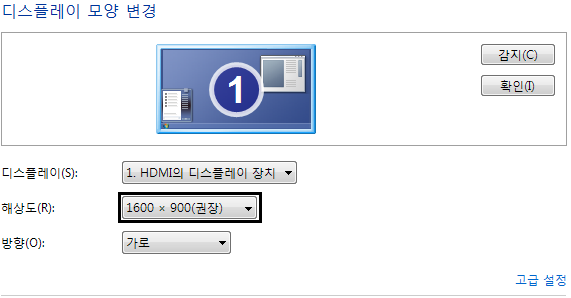

원래는 위 사진과 같이 1600 x 900 이었지만

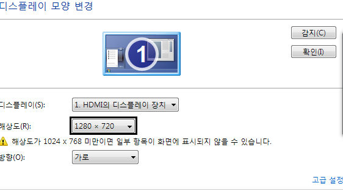

요렇게 1280 x 720(아마 더 낮았을겁니다)으로 낮아졋습니다. ㅠㅠ

(이 사진은 복구후 챕쳐한 스샷입니다.)

그..래..서.. ㅎㅎㅎㅎㅎ 윈도우를 새로 깔았지요 ㅎㅎ

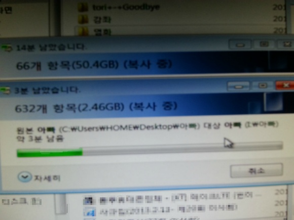

엄청나게 많은 자료를 백업하고...

Hp컴퓨터이니 내장되어 있는 복구 프로그램을 이용하여

**그래픽 드라이버, cpu드라이버, 랜, 사운드 등등 별도로 깔을 필요 없이**

자동으로 깔아준답니다~

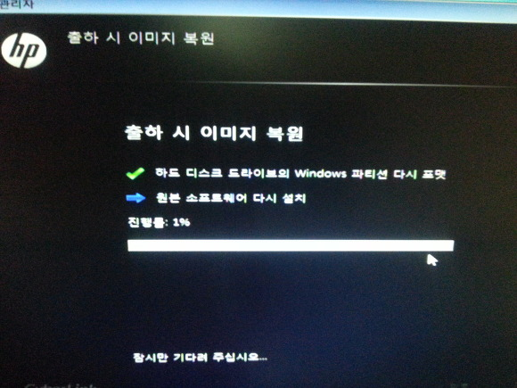

진행 1%...

이 사진을 찍은 시간이 154549, 즉 어제(2013-09-08) 15시(3시) 45분 이었습니다.

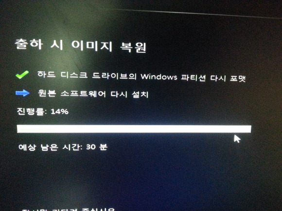

14%

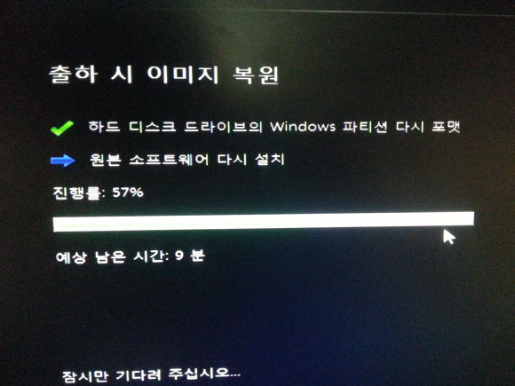

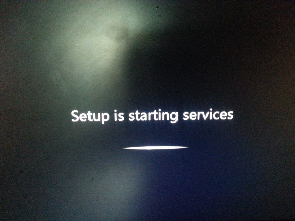

Setup is starting services...

이 사진이 찍힌 시간은 160544입니다

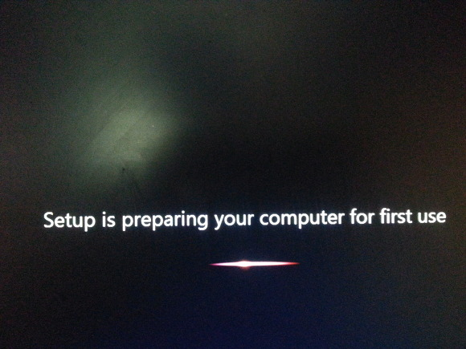

으어어어어 빨리되라 제발

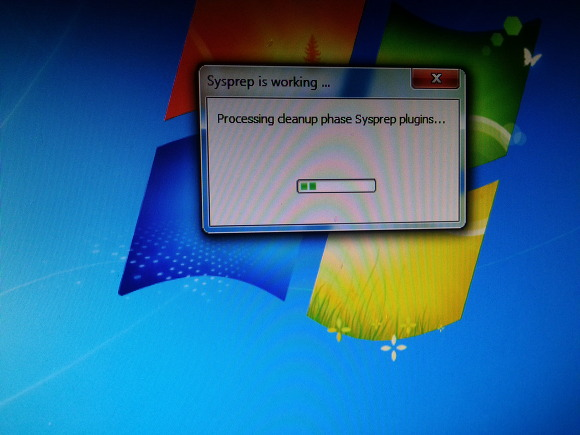

일반 윈도우는 지금쯤 설치가 끝났겠지만

이 컴퓨터는 자동으로 드라이버를 깔아주므로...

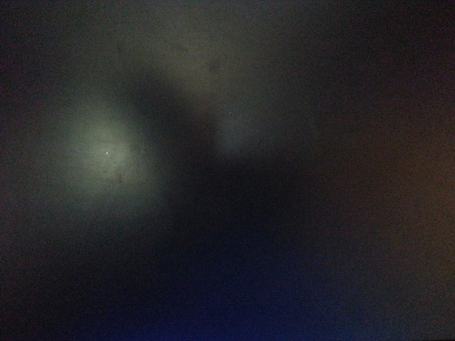

으어어어어어

빨리 끝났으면...

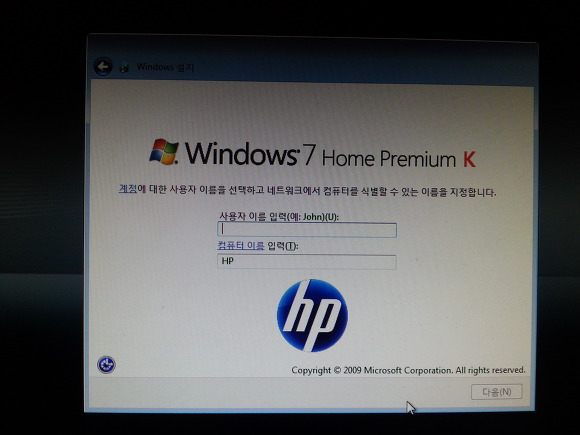

옷! 작년 1월에 새 컴퓨터가 온 다음 처음 켯을때 나온 화면이었습니다. ㅎㅎ

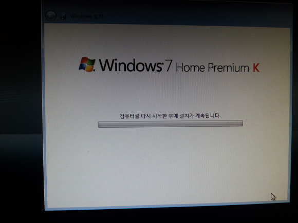

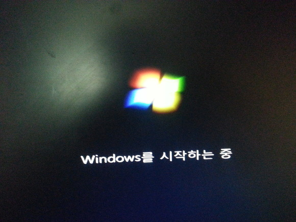

K..Korean...!

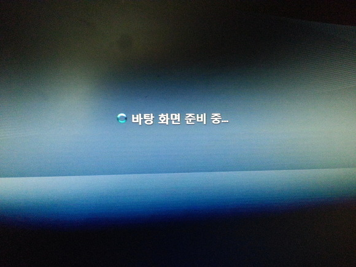

!!

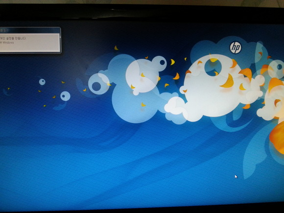

으어ㅓ어어 바탕화면이 왜 저따구ㅡㅡ;;

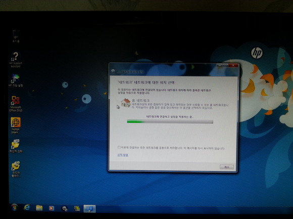

네트워크 설정하고~

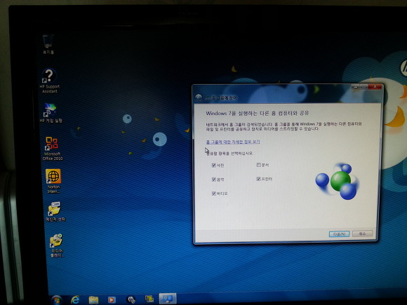

마지막!!!

이 사진이 찍힌 시간은 161631입니다

그럼 얼마나 걸렸는지 확인해 볼까요??

154549 : 3시 45분.

161631 : 4시 16분.

약 30분만에 윈도우 재설치가 완료되었습니다. ㅋㅋㅋㅋ

빠르군요...!

오늘 이 포스팅을 쓰는 시점에는 모든 프로그램 설치와 자료복구가 끝나 아주 평화롭답니다~

앞으로 그래픽 드라이버는 절대 안 건들려고 합니다. ㅎㅎ...
