제목 : [텐센트(Tencent) 10TB 대용량 무료클라우드 서비스 알아보기 / 한글화 작업](http://spapa1004.tistory.com/49)

출처 : <http://spapa1004.tistory.com/49>

**안녕하세요. SPAPA 입니다.**

**최근 중국의 텐센트라는 게임업체에서 선보인**

**10TB 대용량 무료클라우드 서비스에 대해 알려드리도록 하겠습니다.**

**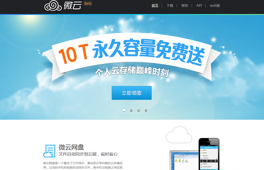**

사실 이 경쟁의 시작은 대륙의 "네이버"라고 할수있는 중국의 검색엔진 업체 "바이두"가 시작했습니다.

지난달 29일 1TB에 대용량 클라우드 서비스를 제공하겠다고 밝혔습니다. 국내에서 서비스되고 있는

클라우드 서비스들과 교해보면.. 실로 엄청난 용량이 아닐수없습니다.

650만화소의 사진을 대략 53만장이상 저장할수 있는 용량입니다... 대략 짐작이 되실런지?? ㅡㅡ;;

그리고 동시에 중국의 보안 전문업체인 "퀴우360"에서 바이두와 마찬가지로 기존의 무료클라우드 서비스를

1TB까지 용량을 확대한다고 발표했습니다. 중국은 땅도 넓고, 인구도 많고, 클라우드 용량도 역시;;;;ㅋ

**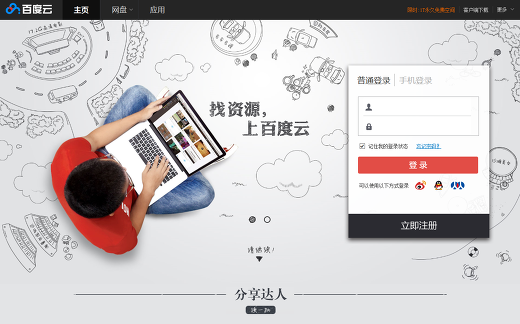**

하지만 여기까지는 시작에 불구했습니다. 중국의 게임/메신져 업체인 텐센트가 대용량

클라우드 경쟁에 가세하며, 무려 10TB의 무료 클라우드 서비스를 시작했습니다. 대박!!!!

650만화소의 사진을 537만장 이상 저장할수 있는 용량, 1.3GB기준 영화 7600편 이상 저장할수 있는 용량입니다.

예로 매일 100장의 사진을 찍어 업로드했을때 140년이상을, 매일 영화 한편씩을 업로드해도 21년간 업로드가능!!

어떤가요? 국내 여러업체에서 제공하는 클라우드 서비스들과 비교해보면 대륙답게 정말 통이 크네요ㅋㅋ

[임베드 콘텐츠: http://api.v.daum.net/widget3?nid=49786231](http://api.v.daum.net/widget3?nid=49786231)

**이쯤에서 추천 한번씩 눌러주시면 큰 힘이 될거같습니다^^**

사실 텐센트는 중국에서 게임/메신져/소셜 시장에서 절대 강자로 군림하고 있는 회사입니다.

등록 회원수 전세계 10억명 이상의 QQ메신져 유저를 바탕으로 국내게임 "크로스파이어",던전앤파이터"로

대박을 터뜨린 후 2억5천만명의 회원을 거느린 "웨이보", 최근 4억6천만 회원을 끌어모은 중국판 카톡 "위챗"까지

줄줄이 대성공을 이루면서 중국내에서는 왕좌의 자리를 지키고 있습니다. 이러한 텐센트가 요즘 중국에서 벌어진

대용량 클라우드 경쟁에 가세했습니다.  여러업체가 대용량의 클라우드 서비스를 잇따라 공개하자,

텐센트는 마치 "니들은 그거밖에 안되냐" 비꼬듯이 10TB의 용량을 들고나온것입니다;;;;

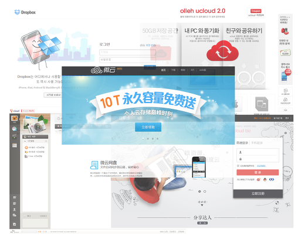

자 그럼 일단, 텐센트 10TB 클라우드 서비스의 장점을 살펴보면

뭐니뭐니해도 10TB라는 엄청난 용량을 무료로 제공한다는 점이겠죠. 이건 뭐 누가봐도 부정할수없는 장점이죠...

그리고 PC용 에이전트 프로그램, 깔끔한 UI의 Android와 iOS까지 지원하는 모바일 앱, 파일관리가 가능한 웹페이지!

4GB이상의 고용량 파일의 업로드가 가능하고, 다른 해외의 무료클라우드에 비해 상당히 안정적이라는 점까지..

장점이 상당히 많고 큰 매력을 가지고 있는 서비스라고 생각이 됩니다. 제 개인적으론 드롭박스보다 맘에 듭니다;;

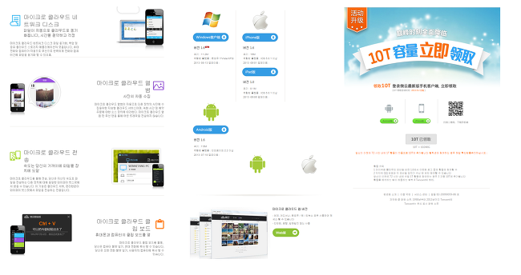

하지만 장점이 많다고해서 단점이 없을수는 없겠죠. 국내 클라우드 서비스에 비해 다소 느린 다운/업로드 속도입니다.

제가 테스트해본바로는 1.4기가 파일을 업로드하는데 대략 8~10분정도 걸리더군요.

확실히 국내 클라우드서비스와 비교하면 느리긴 하지만 반대로 여타 다른 해외 클라우드 서비스와 비교해보면

상당히 빠른 속도라고 볼수있습니다. Dev-host나 Mediafirer들과 비교해보면 상당히 만족할만한 수준입니다.

속도는 그렇다치고 결정적으로 텐센트는 멀티랭귀지를 지원하지않습니다ㅡㅡ;

홈페이지, 모바일 앱, PC용 에이전트프로그램 모두가 중국어로만 되어있습니다;;;;

영어도 아니고, 중국어라니.. "이걸 어떻게 쓰냐" 하시는분들이 계실텐데...사실 이것도 크게 문제되진 않습니다.

일단 웹페이지는 일반적인 다른 클라우드 서비스와 마찬가지로 굉장히 단순하고 직관적인 UI를 가지고 있기때문에

크롬처럼 번역기능이 있는 브라우저로 접속하시면 얼마든지 불편함없이 사용가능합니다.

**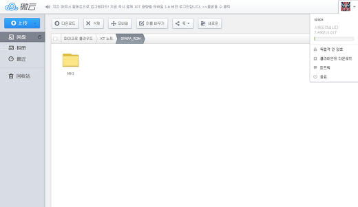**

보다시피 누가봐도 단순하고 깔끔한 UI로 실질적으로 사용하는데 크게 문제가 되지않습니다.

그 다음으로 모바일앱인데... 이건 문제가 좀 심각합니다. 아래 스샷을 보시면 아시겠지만...

제대로 표시되지도 않을뿐더러 무슨말인지 하나도 알아볼수가 없습니다. 메일하고 닉네임만 알아보겠네요;;

이정도면 중국어를 모르는사람은 쓰기 힘들겠죠;;;?? 하지만 실망하지 마세요..

**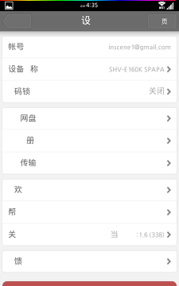 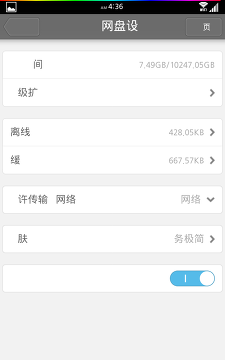 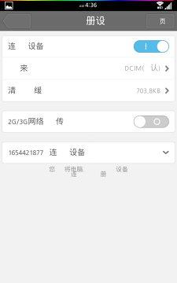**

저는 어떻게든 엄청난 고용량의 무료 클라우드 서비스를 쓰고야 말겠단 의지 하나로 정말 어렵게 한글화했습니다ㅡㅡ;

한글화뿐만 아니라 모바일 앱에선 원래 있던 회원등록이 휴대번호 오류로 진행되지않아 메뉴들을 수정하여

가입 페이지와 10TB로 업그레이드하기까지 메뉴를 넣어봤습니다. 요거 하나면 가입부터 용량업글까지 간단합니다**^^**

**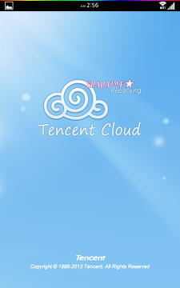 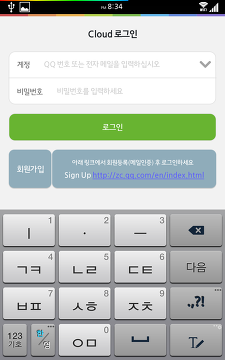 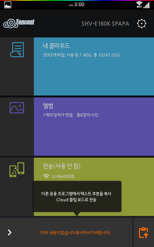**

**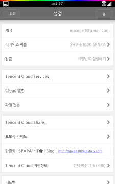 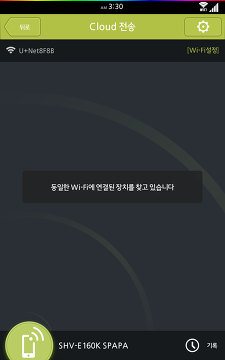 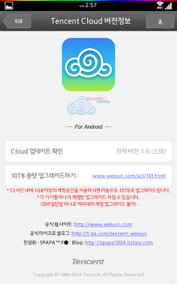**

**깔끔하고 간편한 웹페이지와 한글화된 모바일앱만 있으면 PC나 모바일에서도 쓰는데 문제가 없겠죠??**

**제 개인적으로 봤을땐 상당히 매력적이고 만족하고 사용할수 있는 서비스가 아닌가 싶습니다.**

**그렇지않았으면.. 이틀에 걸쳐 이렇게 고생고생하며 앱 수정하고 있지않았을텐데;;;ㅋㅋ**

**10TB의 대용량 클라우드와 사용하기 간편한 모바일앱과 웹페이지,**

**여러분들도 한번 사용해보시라고 권유드리고 싶네요.**

**일단 이 포스팅에서는 텐센트의 10TB 클라우드 서비스에 대해 살짝 알아보기만 했습니다.**

**다음 포스팅에서는 모바일앱을 통해 가입부터 10TB로 용량 업그레이드 가이드와**

**한글화된 모바일앱을 배포하도록 하겠습니다.**

제목 : [텐센트 10TB 무료 대용량 클라우드 서비스 모바일 APP/PC 클라이언트 한글화 배포(PC버전 추가)](http://spapa1004.tistory.com/50)

출처 : <http://spapa1004.tistory.com/50>

안녕하세요. SPAPA입니다.

오늘은 어제 소개해드린 텐센트 10TB 무료 대용량 클라우드 서비스 모바일 앱과 PC 클라이언트 프로그램의

한글화 파일을 공유해드릴까합니다.

**텐센트 10TB 무료 대용량 클라우드 서비스?  :  <http://spapa1004.tistory.com/49>**

이틀의 걸쳐 머리 싸매가며, 한글화 해봤는데...

몇몇 도저히 해석이 안되는 부분은 그냥 번역기의 힘을 빌려 발번역해서 넣었습니다;;

쓰시는데는 전혀 지장 없을정도로 심혈을 기울여 최대한 수정했습니다.

그리고 앱을 통해 간편하게 회원가입과 용량 업그레이드를 진행할수 있도록 메뉴도 수정하였습니다.

 

 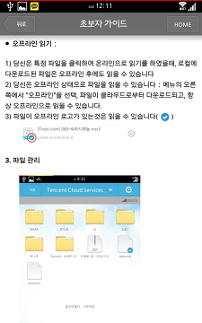

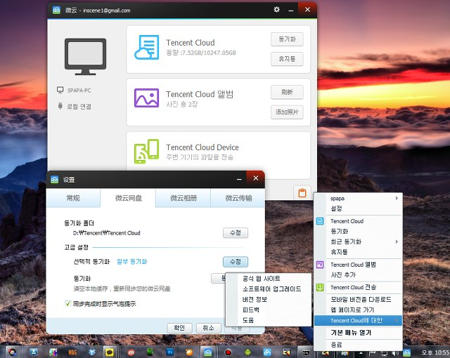

**한글화 모바일 앱 다운로드 :   [TencentCloud\_fix2(SPAPA).apk](http://spapa1004.tistory.com/attachment/cfile23.uf@240DF14F522DF5CD11CCA2.apk)**

미르의 미러 첨부파일

[TencentCloud\_fix2(SPAPA).apk](./file/TencentCloud_fix2(SPAPA).apk)

한글화 앱 추가수정 (초보자 가이드 한글화, 몇몇 부분 수정)

 미르의 미러 첨부파일

[PC용 한글화.zip](./file/PC용 한글화.zip)

**PC 클라이언트 설치파일 :**<http://dldir1.qq.com/weiyun/weiyun_windows_1.6.0.514.exe>

**PC용은 한글화 되지않는 부분들이 좀 있네요;; 그래도 쓸만은 합니다.ㅋㅋ**

**모바일앱은 그냥 설치하시면되고, PC용 클라이언트 한글화파일은**

**압축을 풀어 나온 파일들을 Tencent\weiyun\I18N\2052\ 폴더안에  덮어주시면됩니다.**

**이쯤에서 추천 한번씩 눌러주시면 큰 힘이 될거같습니다^^**

**이 자료는 다른곳에서의 직접적인 공유를 절대 금지합니다.**

**혹시나 공유하실분들은 블로그 링크로만 허용합니다.**

이상으로 텐센트 10TB 클라우드 서비스의 포스팅은 마치도록 하겠습니다.

다음엔 바이두(Baidu)의 클라우드 서비스 소개글과 모바일 앱 한글화 버전을 올려드리겠습니다^^

현재 90%정도 완성된거같네요....

제목 : 텐센트 클라우드 서비스 모바일 앱 업데이트버전(1.6.0.360) 한글화파일 배포

출처 : <http://spapa1004.tistory.com/87>

**텐센트 클라우드 서비스 모바일 앱 업데이트버전(1.6.0.360) 한글화 배포**

**안녕하세요. SPAPA입니다.**

**텐센트 클라우드 모바일앱이 업데이트되었더군요.**

**크게 어떤점이 바뀌었는지는 모르겠지만... 업데이트 버전으로 다시 한글화파일을 배포합니다.**

 

 

**업데이트버전(1.6.0.360) 한글화 앱 :   [TencentCloud\_1.6.0.360(SPAPA).apk](http://spapa1004.tistory.com/attachment/cfile3.uf@236BAA345245B17E185402.apk)**

[Tencent\_Cloud\_1.6.0.360(SPAPA).apk](./file/Tencent_Cloud_1.6.0.360(SPAPA).apk)

**\* 대용량 클라우드 서비스**

**바이두 무료 대용량 클라우드 서비소개 :  <http://spapa1004.tistory.com/51>**

**퀴우360 무료 대용량 클라우드 서비스소개 :  <http://spapa1004.tistory.com/83>**

**텐센트 무료 대용량 클라우드 서비스소개 :  <http://spapa1004.tistory.com/49>**

**이자료는 다른곳에 직접적으로 공유하시지 마세요.**

**링크를 통해서만 공유 부탁드립니다.**

[텐센트.hwp](./file/텐센트.hwp)

## [텐센트 클라우드 서비스 모바일 앱 업데이트버전(1.6.0.360) 한글화파일 배포](http://spapa1004.tistory.com/87)

[일반 자료](http://spapa1004.tistory.com/category/%EC%9D%BC%EB%B0%98%20%EC%9E%90%EB%A3%8C) 2013/09/28 01:27 Posted by Spapa™

**텐센트 클라우드 서비스 모바일 앱 업데이트버전(1.6.0.360) 한글화 배포**

**안녕하세요. SPAPA입니다.**

**텐센트 클라우드 모바일앱이 업데이트되었더군요.**

**크게 어떤점이 바뀌었는지는 모르겠지만... 업데이트 버전으로 다시 한글화파일을 배포합니다.**

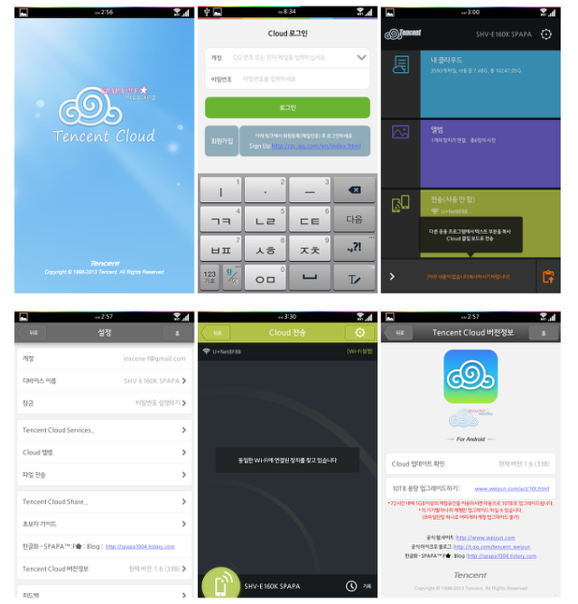

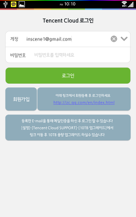 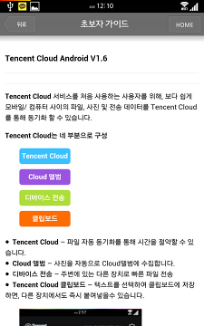

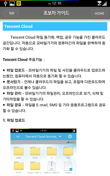 

**업데이트버전(1.6.0.360) 한글화 앱 :   [TencentCloud\_1.6.0.360(SPAPA).apk](http://spapa1004.tistory.com/attachment/cfile3.uf@236BAA345245B17E185402.apk)**

[Tencent\_Cloud\_1.6.0.360(SPAPA).apk](./file/Tencent_Cloud_1_1.6)

**\* 대용량 클라우드 서비스**

**바이두 무료 대용량 클라우드 서비소개 :  <http://spapa1004.tistory.com/51>**

**퀴우360 무료 대용량 클라우드 서비스소개 :  <http://spapa1004.tistory.com/83>**

**텐센트 무료 대용량 클라우드 서비스소개 :  <http://spapa1004.tistory.com/49>**

**이자료는 다른곳에 직접적으로 공유하시지 마세요.**

**링크를 통해서만 공유 부탁드립니다.**

---

## 첨부파일

- [PC용 한글화.zip](https://github.com/itmir913/archive/releases/download/itmir-attachments/338-PC-korean.zip) `98 KB`
- [텐센트.hwp](https://github.com/itmir913/archive/releases/download/itmir-attachments/338-tencent.hwp) `1.9 MB`