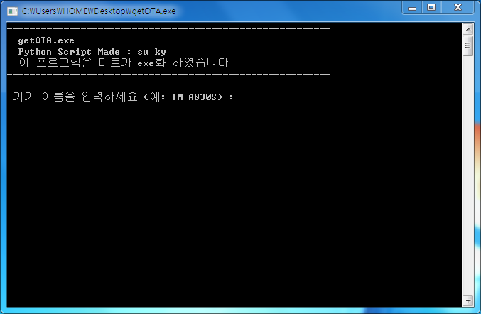
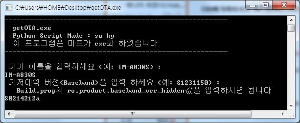
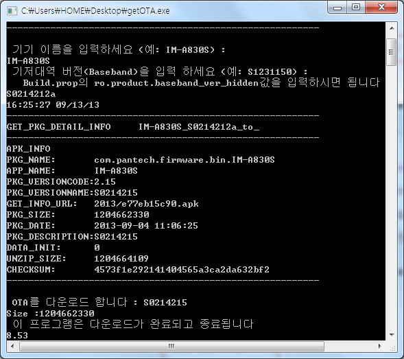
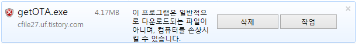

팬택 스카이, 아니 이제는 베가 스테이션에서는 펌웨어 업데이트 일명 업뎃집(Update.zip)을 다운로드 하여 설치할수 있습니다

그런대 팬택의 코드가 종료할경우 다운받은 펌웨어를 지워버려 추출이 쉽지는 않습니다

그러나 전부터 중국포럼에서 활동하시고 계시는 su_ky이라는 분께서 getOTA.py라는 파일을 이용하여

Update.zip을 PC에서 다운받는 방법을 연구하셨습니다

이에 저는 py확장자파일을 실행하기 위해서는 python(파이썬)이라는 프로그램을 설치해야 하는 불편함을 덜기 위해

익숙한 exe확장자로 변환하게 되었습니다

python의 설치없이 getOTA를 사용할수 있습니다

 exe로 변환되어서 번거롭게 cmd창에서 실행할 필요가 없습니다

 한글화도 함께 하였고, 기저대역 버전 힌트도 담겨있습니다

Build.prop의 ro.product.baseband_ver_hidden값을 입력해 주시면 됩니다

또는 원하는 펌웨어 버전을 입력해 주시면 됩니다

입력이 완료되고 서버에 파일이 존재할경우 다운로드가 진행됩니다

맨아래 8.53부분은 다운로드 진행 %입니다

스크립트 저작자 : su_ky

exe변환/한글화 : 미르

윈도우7 32bit, 64bit에서 작동을 확인했습니다

일부 브라우저는 악성코드로 검사하는대 악성코드 아닙니다

시험삼아 받아보니 이런게 뜨네요;
