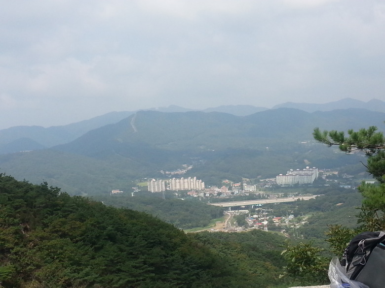
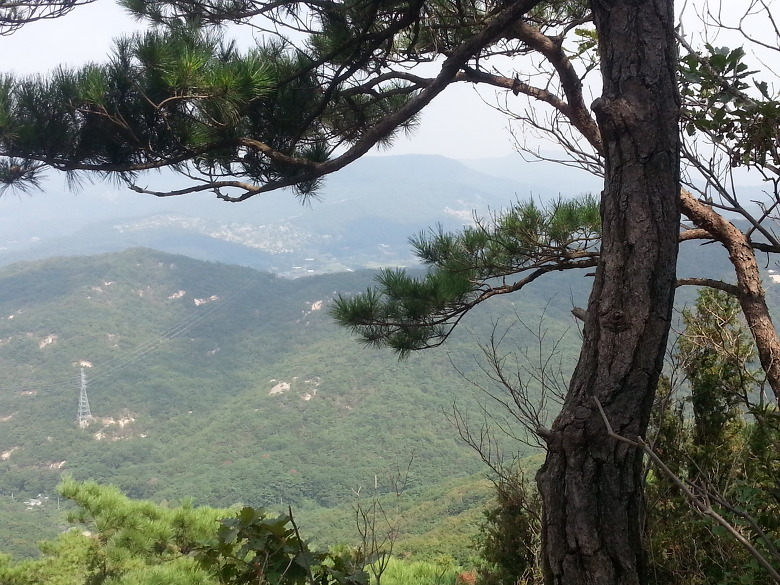
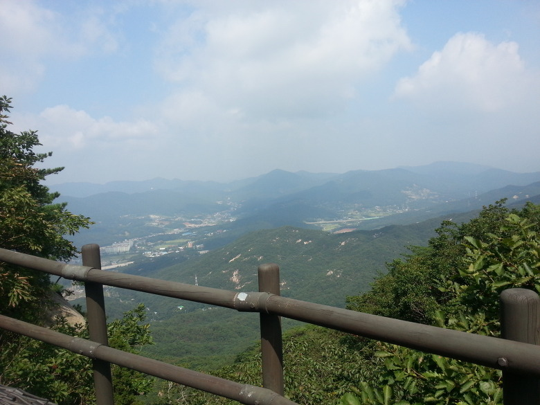
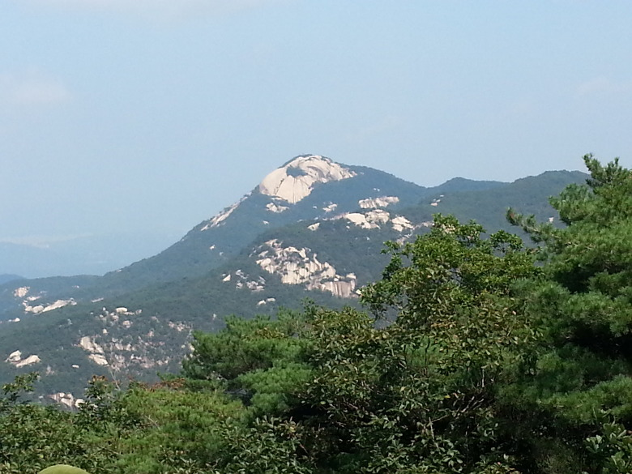
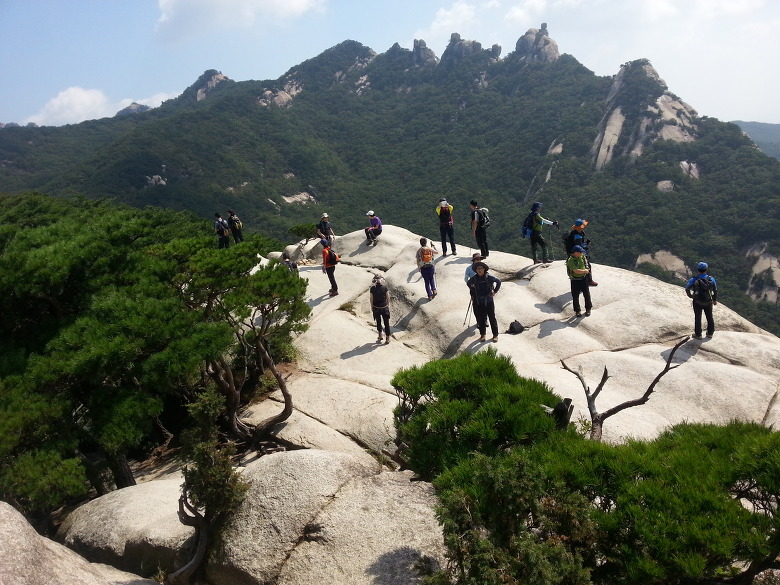
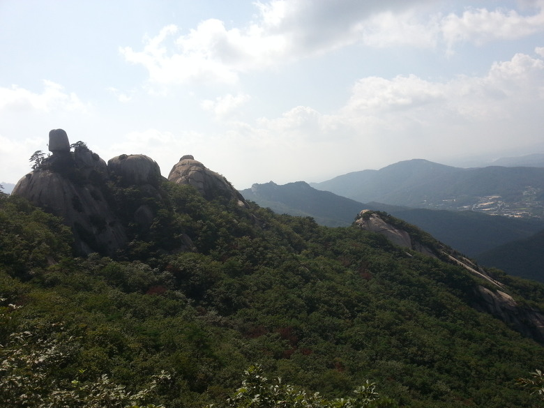
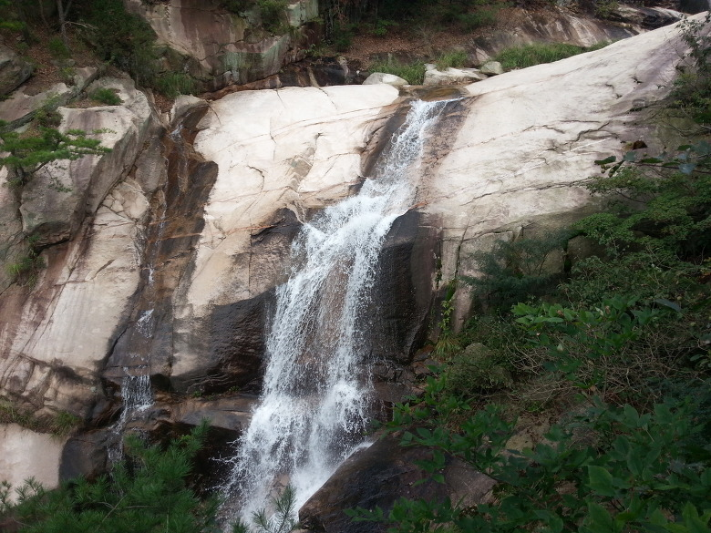
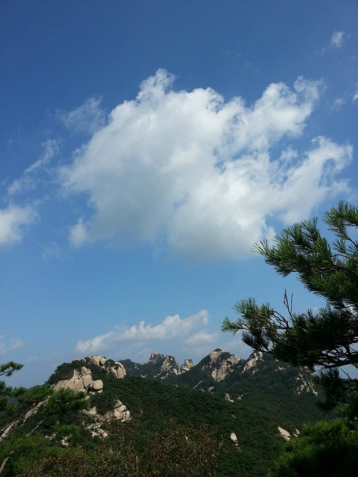

어제, 우리가족을 포함한 총 5가족이 모여 다함게 북한산으로 갔습니다. +\_+

으어; 죽을 뻔 했지만, 와... 정말 멋졌습니다!!!!

틈틈히 기압도 측정했는데, 역시 고도가 올라갈수록 기압이 내려가더군요.

관련 사진은 좀있다(나중에)올리도록 하겠습니다.

절경 감상 하시죠. ㅎㅎ

전체 206개사진(총 1기가, 해상도:S3에서 최대해상도,3264x2448)중 잘찍힌 사진 8개를 모았습니다.

위 사진은 한.. 한시간?정도 올라가서 찍은 사진입니다. ㅎㅎ

첫번째 사진 찍고 거의 직후에 찍은사진..

절경이죠??

다리랑 구름이랑 마을풍경이랑 잘어울리는거 같지 않나요?

좀 많이 올라가서 찍은 사진.. 다른 산의 꼭대기 입니다 ㅋ

위 사진은 북한산의 여성봉에서 가장 위에 있는 돌에 올라가서 찍은 사진입니다.

와...

와......

와............!

정말 멋지지 않나요???

산 잘 탔습니다. ㅎㅎ

ps. 다섯 집 또래 애들중 제가 가장 체력이 좋았고, 산을 잘탔다는건 함정(?)

이글은 [] 에서 다시 보실수 있으며 원본 글의 저작권은 미르에게 있습니다
