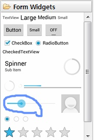
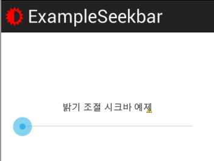
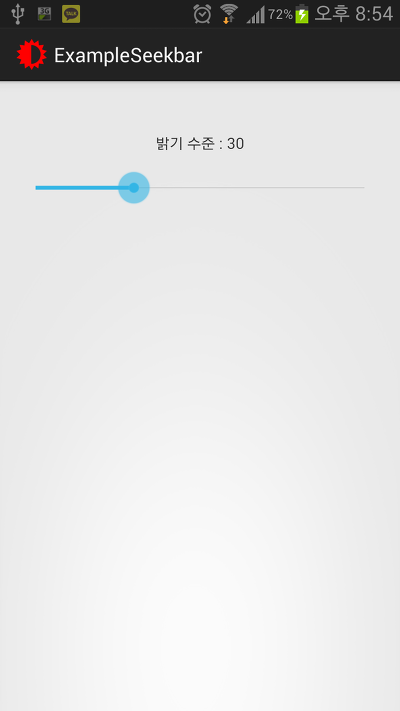
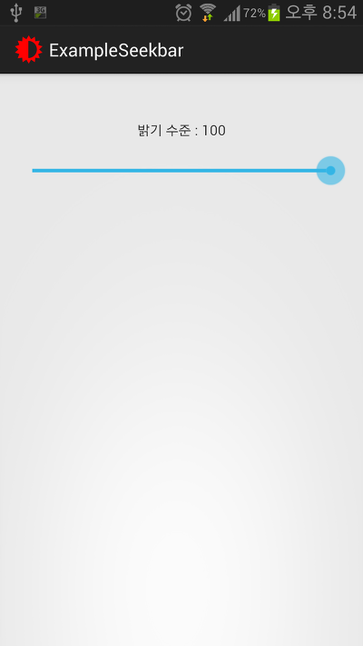

안녕하세요~ 추석전이네요~

저번 프로그레스바를 공부한다음 너무 어려워 하시는 분들이 많아서 (정말 쉽게 서술했는데...)

이제부터는 예제소스를 한턴씩 띄어서 올려드릴까 합니다

즉 이번 강좌부터 예제소스는 다음 강좌가 올라올때 이 게시글에서 다운받을수 있습니다

15번(이글)강좌 업로드(예제소스 없음) → 16번 강좌 업로드됨 → 15번 강좌 예제소스가 15번 강좌 글에 표시됨

이런 방식입니다

예제소스를 아에 제공하지 않을까 하다가...혹시 힘들어 하시는 분이 계실까봐 아에 안올리지는 않고 한턴씩 건너서 올리겠습니다

그럼 시작합니다~

## 15. SeekBar로 화면 밝기 조절해 보자

### 15-1 시크바란?

프로그레스바는 이름도 익숙한데 시크바(Seekbar)는 무엇일까요?

이름이 조금 어색하게 들릴수도 있습니다

Seekbar란 프로그레스바를 상속하여 만들어진 바인데요

프로그레스바는 직접 이동이 불가능했던것에 반에 시크바는 마치 볼륨조절처럼 동그라미를 터치해서 이동이 가능합니다

예를들면 설정의 볼륨이나, 볼륨키를 누르면 나오는 막대기와 동그라미가 시크바의 대표적인 예시 입니다

### 15-2 우리는 뭘 만들건가

저번에 프로그레스바를 구현할때 쓰래드를 사용했는데요

쓰래드가 뭔지 모르는 상태에서 막 나가니 이해가 안된다는 분들이 너무 많기에...

이제부터는 안배운 개념은 안하겠습니다

그래서 생각한게

화면 밝기를 조절해 보겠습니다

즉 SeekBar를 움직이면 화면 밝기가 바뀌는 거죠~

### 15-3 레이아웃 구성하기



SeekBar는 ProgressBar밑에 있습니다

저거 많이 본 막대기죠?ㅋㅋ

알아서 추가해 주시고...



저는 이렇게 TextView와 SeekBar을 두었습니다

밝기는 100%가 끝이기 때문에 최대값을 100으로 둡시다

android:max="100"

SeekBar라는건 ProgressBar를 상속하고 있다고 했는데요

포함한다는 의미로 받아드리면 되는대 그래서 같은 속성을 사용할수 있습니다

그리고 이 예제소스에 나오는 소스는 어플의 화면 밝기만 변경, 즉 시스탬의 화면 밝기를 변경하지 않는 어플입니다

이때 값이 10이하로 떨어지면 화면이 꺼져버리는데요

그래서 이를 방지하기 위한 코드를 삽입할 겁니다

android:progress="10"

### 15-4 Java 구성하기

이제 MainActivity.java로 넘어오셔서...

SeekBar와 TextView를 사용할수 있도록 소스 최상단에 추가해 봅시다

(이제 부터는 이런 언급이 없어도 알아서 넣으셔야 합니다)

SeekBar seekbar;

TextView status;

ID값을 연결해 볼까요?

seekbar = (SeekBar) findViewById(R.id.seekbar);

status = (TextView) findViewById(R.id.status);

xml할때 언급은 안했지만 바로 위 파란상자를 보면 id값을 수정했구나 라는걸 아셔야 합니다

지금쯤 되서 모른다면 다시 처음부터 읽으셔야 합니다

그다음 시크바가 변경될때마다 호출될 리스너를 연결해야 합니다

seekbar.setOnSeekBarChangeListener(new SeekBar_Listener());

위처럼 class를 새로 만들어서 리스너를 만들수 있습니다

```java
class SeekBar_Listener implements OnSeekBarChangeListener {

        public void onProgressChanged(SeekBar seekBar, int progress, boolean fromUser) {

        }

        public void onStartTrackingTouch(SeekBar seekBar) {

        }

        public void onStopTrackingTouch(SeekBar seekBar) {

        }

    }
```

그러나 우리는 이렇게 class라는걸 따로 안만들고 setOnSeekBarChangeListener에 바로 리스너 메소드를 연결해 보겠습니다

(위 하얀박스 코드를 그대로 복사하는 멍청이는 없길 설명을 똑바로 안들었단 소리입니다)

```java
seekbar.setOnSeekBarChangeListener(new SeekBar.OnSeekBarChangeListener() {

@Override

public void onStartTrackingTouch(SeekBar seekBar) {

// 메소드 이름대로 사용자가 SeekBar를 터치했을때 실행됩니다

// TODO Auto-generated method stub

}

@Override

public void onStopTrackingTouch(SeekBar seekBar) {

// 메소드 이름대로 사용자가 SeekBar를 손에서 땠을때 실행됩니다

// TODO Auto-generated method stub

}

@Override

public void onProgressChanged(SeekBar seekBar, int progress,

boolean fromUser) {

// 메소드 이름대로 사용자가 SeekBar를 움직일때 실행됩니다

// 주로 사용되는 메소드 입니다

// TODO Auto-generated method stub

}

});
```

기본적인 리스너의 형태입니다

setOnSeekBarChangeListener을 연결하며 바로 작업할 내용을 지정해 주고있는데요

하얀박스와 차이점은 하얀박스는 아래에서 또는 딴곳에서 리스너를 생성하고, 방금 본 소스는 리스너를 지정하며 바로 할 작업을 명시해 주는겁니다

위치의 차이만 있을뿐 같답니다~

주로 사용하는 메소드인 onProgressChanged에다가 화면 밝기를 바꾸는 소스를 넣어보겠습니다

onProgressChanged()안에 있는 int progress를 보시면 굵은글씨로 해뒀는데요

현재 SeekBar의 진행 정도를 표시하는 값입니다

max를 100으로 지정했으니 최대로 올리면 저 값은 100이 되고 가장 아래로 바꾸면 0이 됩니다

저 메소드 안에 아래 코드를 넣어보겠습니다

if(progress<10){

progress=10;

seekbar.setProgress(progress);

}

status.setText("밝기 수준 : " + progress);

WindowManager.LayoutParams params = getWindow().getAttributes();

params.screenBrightness = (float) progress / 100;

getWindow().setAttributes(params);

간단한 코드입니다

중간 Enter위까지는 모두 아는 코드죠?

progress값이 10아래로 떨어지면 움직이지 못하게 설정했습니다

즉 10아래로는 설정할수가 없습니다

그다음 setText로 텍스트를 설정하고

그 아래부분은 어플 밝기를 조절하는 코드입니다

저런 코드가 있구나~하고 넘어가 주시면 됩니다

이 강좌의 목표는 SeekBar사용법을 익히는 것이니까요 ㅎㅎ

이제, 작동해 봅시다





자, 정상적으로 SeekBar를 움직일때마다 밝기와 글자가 변하는것을 볼수 있습니다!!

정리한번 해볼까요?

1. SeekBar는 ProgressBar에서 사용한 코드를 그대로 사용해도 된다

2. seekbar.setOnSeekBarChangeListener를 이용해 시크바의 값이 변할때마다 어떤 작업을 할건지를 결정할수 있다

3. onStartTrackingTouch는 터치해서 끌기 시작할때 호출되는 메소드다

4. onStopTrackingTouch는 onStartTrackingTouch와 정반대 메소드이다

5. onProgressChanged는 값이 변할때마다 실행되는 메소드이고, 가장 자주 쓰이는 메소드이다

WindowManager.LayoutParams params = getWindow().getAttributes();

params.screenBrightness = (float) progress / 100;

getWindow().setAttributes(params);

위 세게의 코드는 어플의 밝기를 조절하는 코드이다(만 어플을 종료하면 원래 밝기로 돌아온다)

어떠나요?

간단한 SeekBar라고 해도 배울께 많습니다

전 최선을 다해 쉽게 풀어쓰려고 하는대....잘 이해가 되는지 모르겠네요

이해 안되는 부분 질문해 주시면 감사드리겠습니다~(정리 6번은 이해 안되도 정상입니다)

예제소스는 강좌16편이 나올때 이 부분에 업로드 됩니다

즉 이 Text아래에 첨부되어 집니다

[ExampleSeekbar.zip](https://github.com/itmir913/archive/releases/download/itmir-attachments/ExampleSeekbar.zip)

[참고] - 시스탬 화면 밝기를 조절하는 방법은 무엇일까요?

안드로이드의 화면 밝기 값은 실제로는 두가지가 있습니다

이 강좌에서 배운 윈도우 매니저를 이용한 방법과 실제 화면 밝기 설정 값입니다

실제 화면 밝기를 조절하는 방법은 아래와 같습니다

<uses-permission android:name="android.permission.WRITE_SETTINGS" />

import android.provider.Settings;

Settings.System.putInt(getContentResolver(), "screen_brightness", 0~255);

화면 밝기 설정값은 0~255로 설정할수 있습니다

그러나 윈도우 매니저의 밝기 값은 0~100(%)이며, 0을 입력할경우 화면이 꺼져버립니다

참고로 자동 밝기 상태인지 확인후, 자동밝기가 아닐경우 설정하는 코드는 아래와 같습니다

if(Settings.System.getInt(getContentResolver(), Settings.System.SCREEN_BRIGHTNESS_MODE) != 1)

    Settings.System.putInt(getContentResolver(), Settings.System.SCREEN_BRIGHTNESS_MODE, 1);

---

## 첨부파일

- [ExampleSeekbar.zip](https://github.com/itmir913/archive/releases/download/itmir-attachments/ExampleSeekbar.zip) `1.6 MB`
