출처 : <http://spapa1004.tistory.com/83>

**퀴우360 (36TB) 무료 대용량 클라우드 서비스 소개**

**안녕하세요. SPAPA입니다.**

**오늘은 텐센트 / 바이두 클라우드에 이어서**

**무료 대용량 클라우드 서비스의 끝판왕!! "****퀴우360"에 대해 소개해드릴께요.**

**퀴우360 클라우드 서비스는 36TB의 무료 용량을 제공하고 있습니다ㅎㄷㄷ**

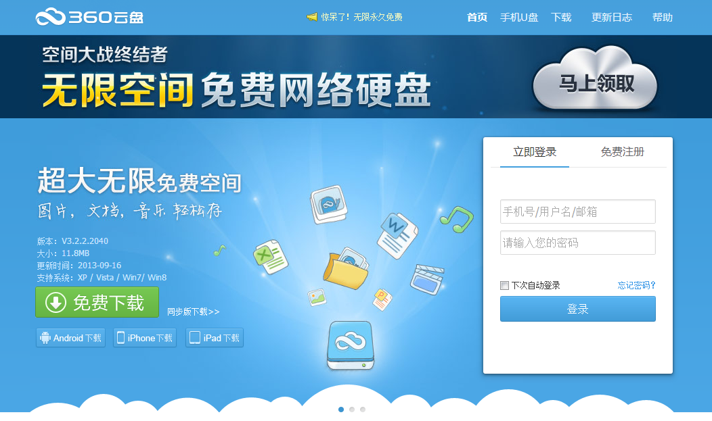

**대륙의 대용량 클라우드 서비스의 시작을 바이두와 퀴우360이 시작했다는 기사를 접했을때**

**처음 바이두는 1테라, 퀴우360도 1테라로 서비스한다고 봤었는데....**

**그 후 텐센트가 10테라의 초대용량의 서비스를 시작해서인지...**

**현재는 바이두가 2테라, 퀴우360은 36테라의 무료 용량을 제공하고 있더군요.**

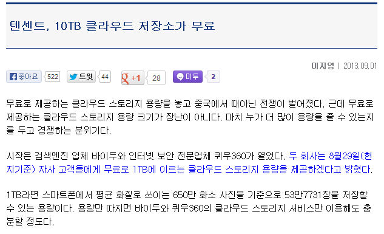

**뭐 기존의 바이두나 텐센트의 2테라,10테라만 해도 충분하긴한데...**

**혹시나해서... 추가로 소개해드립니다^^;;**

**일단 퀴우360 클라우드 서비스를 이용하시려면 회원등록부터 하셔야겠죠.**

**회원가입은 정말 간단합니다.****메일주소와 비밀번호만 입력하면 끝입니다.**

**퀴우360 홈페이지 :    <http://yunpan.360.cn/>**

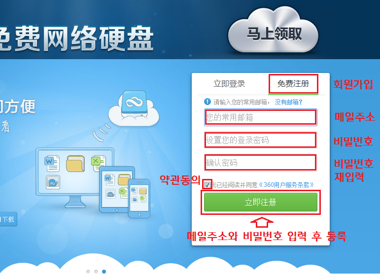

**위처럼 메일주소와 비번 입력하시고 등록버튼 누르시면 바로 가입됩니다. 그 흔한 메일인증도 없습니다;;**

**등록이 완료되면 바로 아래처럼 웹 클라우드 페이지로 이동됩니다.**

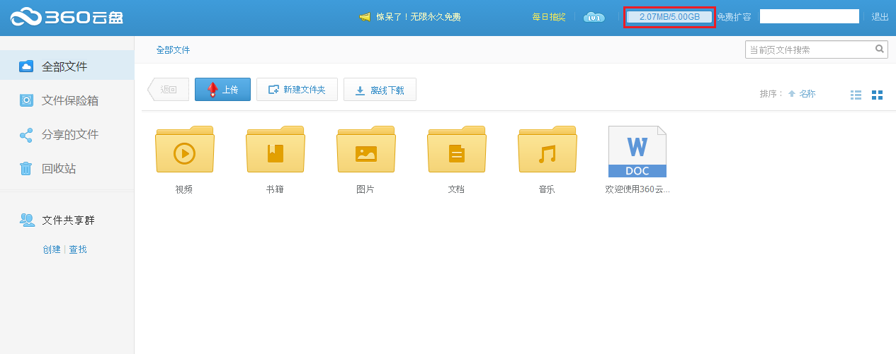

**하지만....상단의 정보를 보시면 36테라는 커녕.... 용량이 5GB밖에 안됩니다.**

**이제 36테라의 용량을 얻기위해 하셔야 거쳐야할 과정이 있습니다. 아래처럼 가운데 링크를 클릭해주세요**

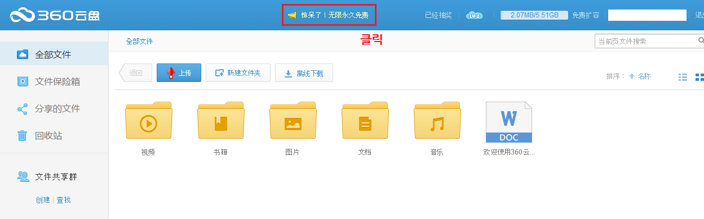

**링크를 클릭하시면 아래와 같이 다른 창이 하나 뜨실텐데...**

**두가지의 조건을 충족시키면 총 36테라의 추가용량을 지급해줍니다.**

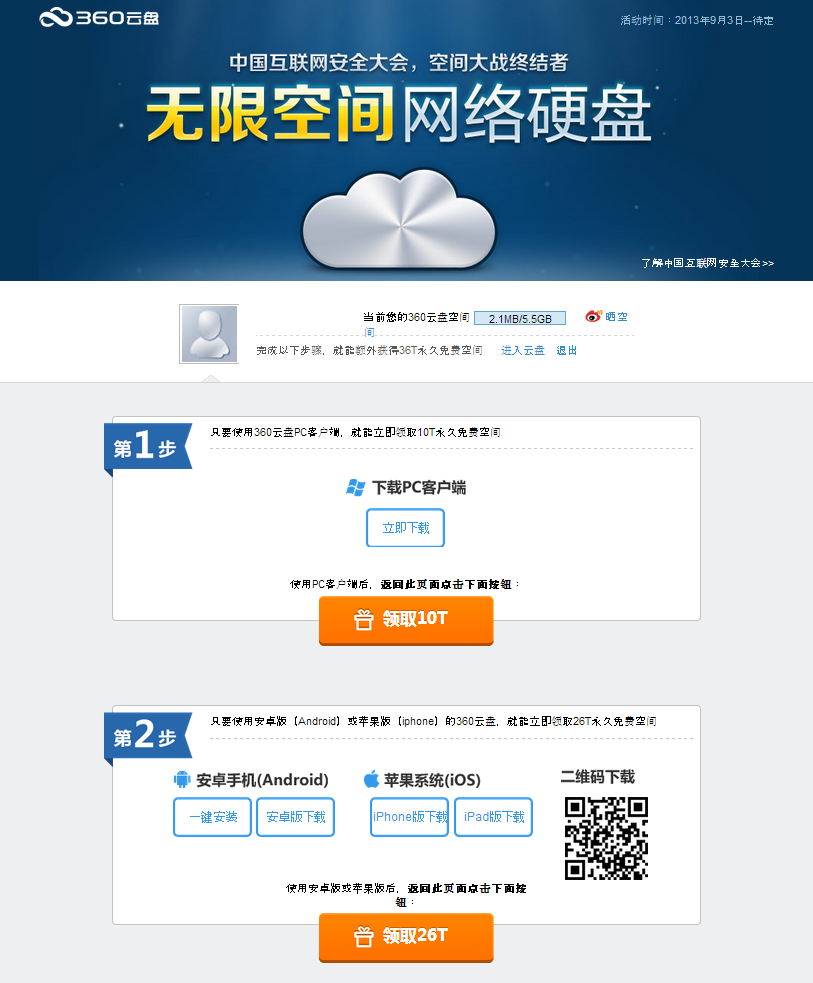

**이제 아래의 스샷들 보시면서 차근차근 하나씩 따라하시면 됩니다.**

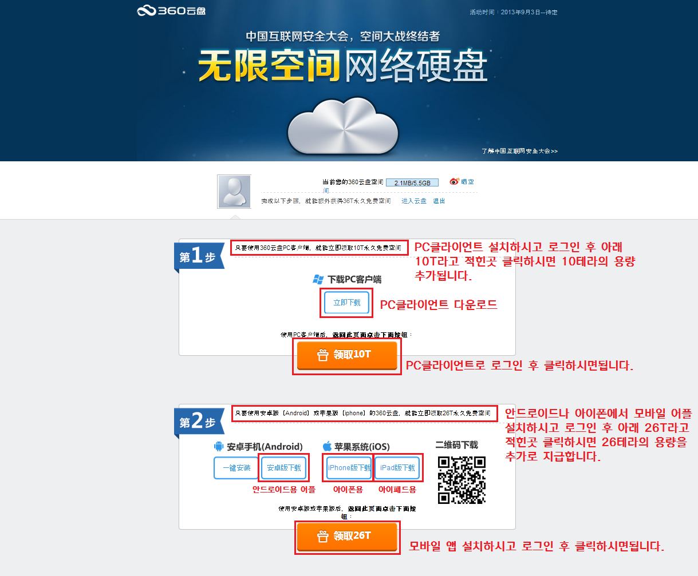

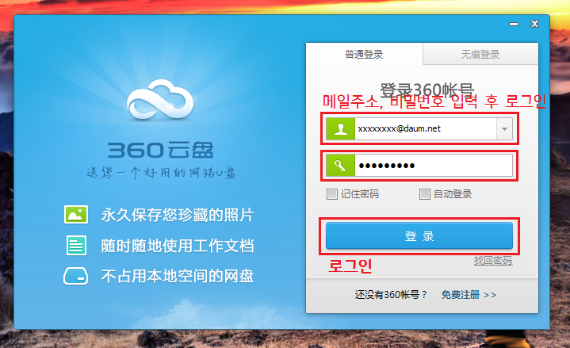

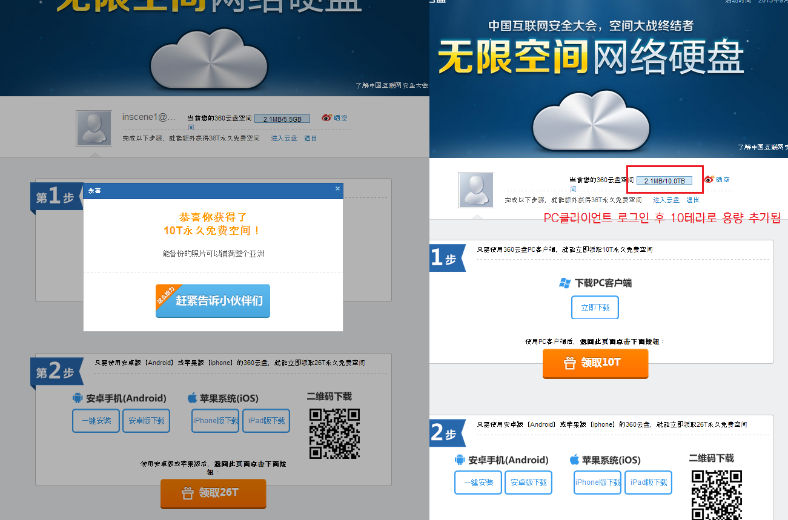

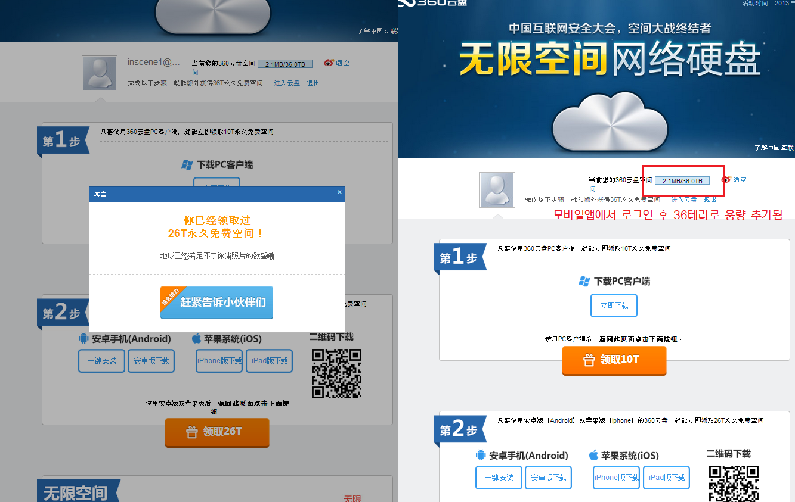

**이제 다들 36테라 받으셨죠??^^ 텐센트와 바이두와 달리 하나의 모바일기기로**

**여러개의 계정도 업그레이드가 가능한거 같습니다. 두개의 이메일로 가입해서 확인해봤는데...**

**둘다 36테라로 업그레이드 되었네요^^ 추가로 모바일앱과 PC클라이언트도 한글화를 해봤는데..**

**PC클라이언트는 한글화가 부분적으로밖에 안되네요;;;**

   

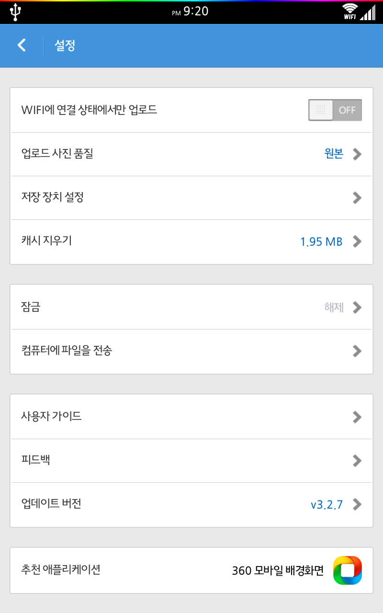   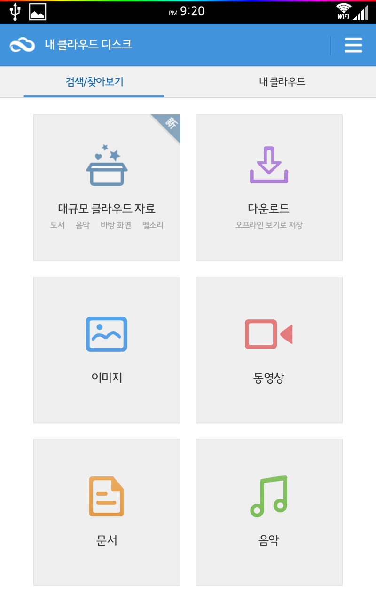

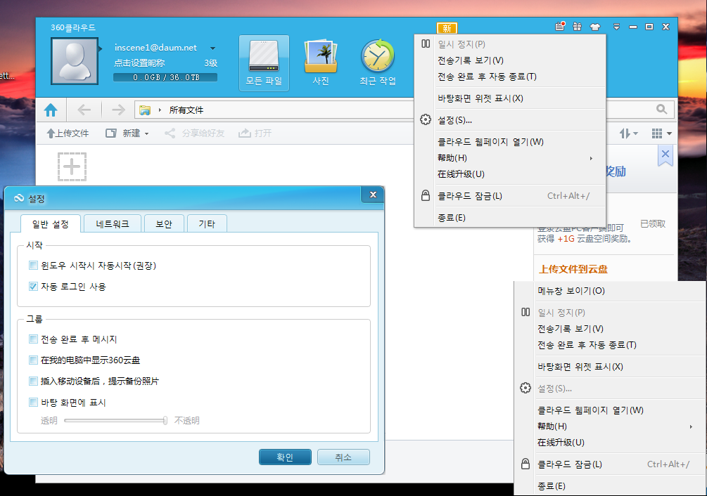

\* 참고로 이런 대용량의 클라우드 서비스가 가능한건 아마도 업로드하는 파일의 해시값을 분석하여

서버에 있는 DB와 자동으로 비교해서 해시값이 같은 파일은 하나의 파일로 공유되는 시스템인듯하네요.

**한글화 모바일앱과 PC클라이언트 한글화 파일은 내일이나 모레쯤 배포하도록 하겠습니다.**

**그럼 이상으로 퀴우360 클라우드 서비스에 대한 포스팅을 마치도록 할께요^^**

**모두들 즐거운 추석 보내세요~~**

**어떤분이 댓글로 아래와 같은 글을 남기셧는데.... 무슨근거로 이런 말씀을 하시는지;;;;**

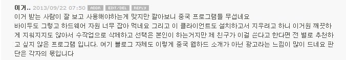

**제가 블로그에서 소개해드린 중국의 클라우드 서비스 3개와 드롭박스와 비교해봤을때...**

**드롭박스가 거의 3배 가량 메모리 점유율이 높습니다. 그리고 프로그램 삭제시 해당 설치 폴더만 남고**

**폴더안에 파일들은 모두 삭제되었습니다. 플러그인은 클라이언트 프로그램에 귀속된게 아닌**

**말그대로 웹에서****별도로****사용되는 플러그인이기 때문에 별도로 삭제해야하는게 맞습니다.**

**근데 왜 저런 악의적인 댓글을 남기시는지 모르겠군요;;; 기껏 없는 시간 쪼개서**

**유용하게 쓰시라고 배포한 글에 저런 근거없는 댓글로 블로그를 비하하려는 의도가 뭔지 궁금하군요;;**

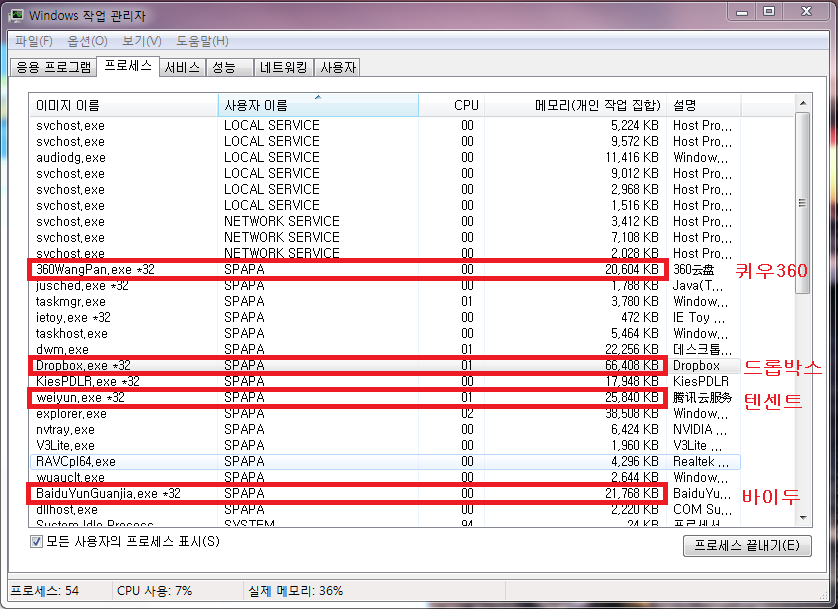

**뭐...제가 굳이 중국 클라우드 프로그램을 두둔하려는것도 아니고 그럴 이유도 없습니다만...**

**사실과는 다르게 왜곡시켜 문제를 제기하시니..... 반박할 필요는 있다 생각되서 좀 적어봅니다.**

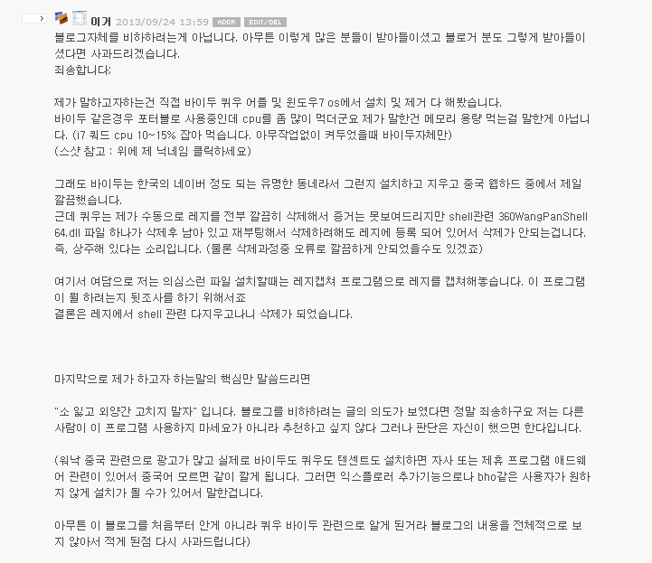

**어떤 기준을 두고 말씀하시는지는 모르겟지만..****단순히 CPU점유율을 보고 말씀하시는거라면...**

**위의 첨부한 제 스샷상으론 CPU점유율 0입니다.**

**반대로 아래 추가로 첨부한 스샷을 보시면 드롭박스의 점유율이 11%입니다.**

**메모리 점유율은 9만까지 올라가있네요;;**

**물론 아무 작업없이 그냥 실행만 시켜둔 상태입니다. 얘는 왜 이러죠??**

**지 혼자 계속 점유율이 왔다갔다하네요? 드롭박스가 백그라운드에서 뭔짓을 하고있는지...**

**이제 드롭박스도 믿을수가 없으니 쓰지말아야겠군요ㅡㅡ;;**

**앞으로 아무작업없이 CPU점유율 차지하는 프로그램들은 모두 조심해야겠습니다.**

**그리고 말씀하신  " 360WangPanShell64.dll "   파일...**

**아래 첨부한 동영상 보시면 아시겠지만 제가 삭제했을땐 이상없이 남지않고 모두 삭제되었습니다.**

**그리고 애드웨어나 제휴프로그램들을 지적하셨는데..**

**국내에서 일반적으로 가장 많이 쓰이는 프로그램들은 한번 비교해보도록 하겠습니다.**

**곰플레이어,알집,네이버,다음 등등.... 수많은 프로그램들이 자사의 애드웨어와 프로그램 끼어넣기를 하고 있습니다.**

**대부분이 그냥 다음다음 눌러서 다 같이 깔려버리죠.. 저거 일일이 확인하는 사람들 별로 없죠**

**이문제로 따지면 우리나라가 더하면 더했지 들하지는 않습니다.**

**앞으로 네이버 다음 등등... 국내 포털 등 다른 유명한 프로그램들도 절대 추천해선 안되겠군요..**

**중국어로 되어있어 모르면 같이 깔리게된다??****물론 그럴순 있습니다.**

**하지만 말 그대로 이건 설치하는 사람이 주의해야할 문제죠.**

**서비스 자체의 좋고나쁨을 판가름할 수 있는 부분은 아니죠.**

**국내의 프로그램들도 마찬가지구요.**

**이렇게 따지면 이건 중국프로그램에만 국한되는 문제가 아니지 않나요?? 영어모르는 사람은 어쩌죠??**

**영문 윈도우마저도 쓰면안되겠군요.. 그냥 오로지 한글 프로그램만 주구장창 써야하나요??**

**앞서 남기신 댓글을 보면 블로그 자체가 광고라느니... 중국프로그램들 무섭다.**

**바이두도 그렇고 하드웨어 자원을 너무 잡아먹는다. 설치후 지우려고하니 깨끗하게 지워지지도 않는다..**

**하셨는데.. 정확한 근거제시도 없이 저런 글을 남기시면 블로그 자체를 비하하는게 아니면 뭔가요;;**

**오늘 남기신 댓글에도**

**"실제로 바이두도 퀴우도 텐센트도 설치하면 자사 또는 제휴 프로그램 애드웨어 관련이 있어**

**서 중국어 모르면 같이 깔게 됩니다."****라고 하셧는데...**

**전 세가지 다 설치해봤지만 설치할때 같이 설치되는 프로그램이 있었나요???**

**약관 동의 외에는 아무것도 못 봤는데.... 저만 못본건가요??**

**주관적인 생각으로 자꾸 문제 제기하지마시고,****좀 더 신빙성있고, 많은분들이 수긍할 수 있는**

**근거를 토대로 말씀해주세요.**

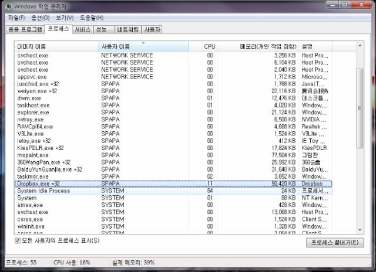

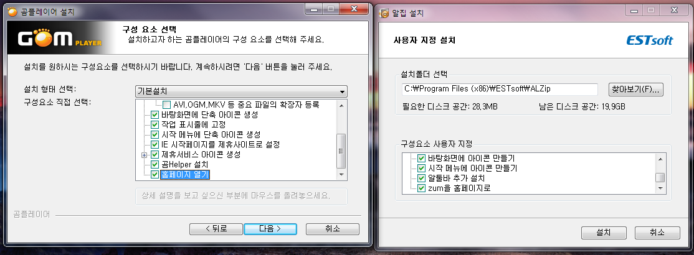

[임베드 콘텐츠: http://videofarm.daum.net/controller/video/viewer/Video.html?vid=v33a4nmWyWMnyuuekkxehMW&play_loc=daum_tistory](http://videofarm.daum.net/controller/video/viewer/Video.html?vid=v33a4nmWyWMnyuuekkxehMW&play_loc=daum_tistory)

출처 : <http://spapa1004.tistory.com/84>

**퀴우360(36TB) 무료 대용량 클라우드 서비스 모바일앱 및 PC버전 한글화.**

**엊그제 소개해드린 퀴우360 클라우드의 한글화 모바일앱과 PC클라이언트 일부 한글화 파일입니다.**

**▶ 퀴우360 클라우드 서비스 회원가입 및 서비스 소개 :****<http://spapa1004.tistory.com/83>**

**모바일앱은 어플에서 한글화 할 수 있는 부분은 모두 한글화 하였습니다.**

**PC클라이언트는 일부분만 한글화되어있습니다.**

**모바일앱은 그냥 설치하시면 되시고, PC한글화 파일은**

**C:\Program Files\360\360WangPan\ 폴더안에 덮어쒸우시면 됩니다.**

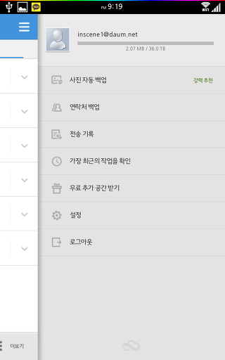

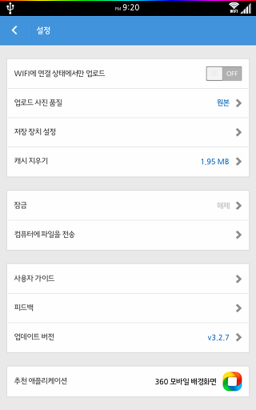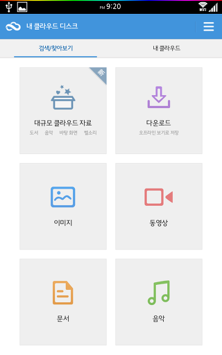

******PC클라이언트 한글화파일 다운로드 :**

[language.ini](./files/language.ini)

**한글화 모바일 앱 다운로드 :**

**이 자료는 다른곳에서의 직접적인 공유를 절대 금지합니다.**

**혹시나 공유하실분들은 블로그 링크로만 허용합니다.**

\* 기타 대용량 클라우드 서비스

**▶ 텐센트(10TB) 클라우드 서비스 소개 :**[**http://spapa1004.tistory.com/49**](http://spapa1004.tistory.com/49)

**▶ 텐센트(10TB) 클라우드 서비스 모바일앱/PC클라이언트 한글화 :****<http://spapa1004.tistory.com/50>**

**▶ 바이두(2TB) 클라우드 서비스 소개 :**[**http://spapa1004.tistory.com/51**](http://spapa1004.tistory.com/51)

**▶ 바이두(2TB) 클라우드 서비스 모바일 앱 한글화 :**[**http://spapa1004.tistory.com/53**](http://spapa1004.tistory.com/53)****

[퀴우360.hwp](https://github.com/itmir913/archive/releases/download/itmir-attachments/352-qhoo360.hwp)

## [퀴우 360 클라우드 모바일앱 3.3.2버전 한글화(업데이트)](http://spapa1004.tistory.com/95)

[일반 자료](http://spapa1004.tistory.com/category/%EC%9D%BC%EB%B0%98%20%EC%9E%90%EB%A3%8C) 2013/10/27 01:02 Posted by Spapa™

**퀴우 360 클라우드 모바일앱 3.3.2버전 한글화(업데이트)**

**퀴우360 클라우드도 모바일앱이**

**3.3.2 버전으로 업데이트되어 다시 작업하여 올려드립니다.**

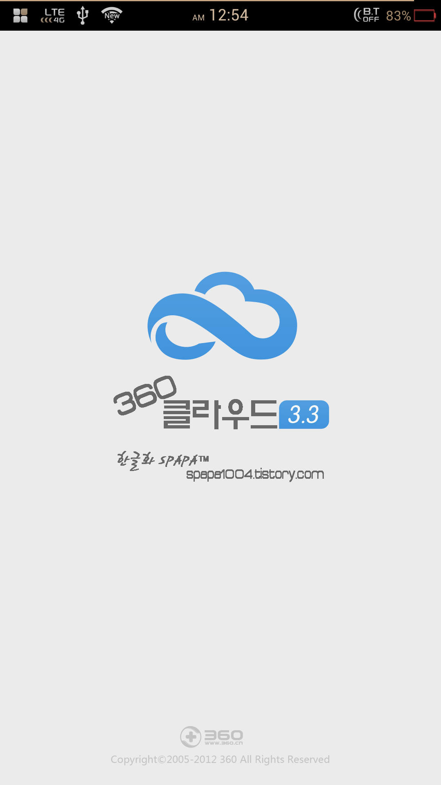 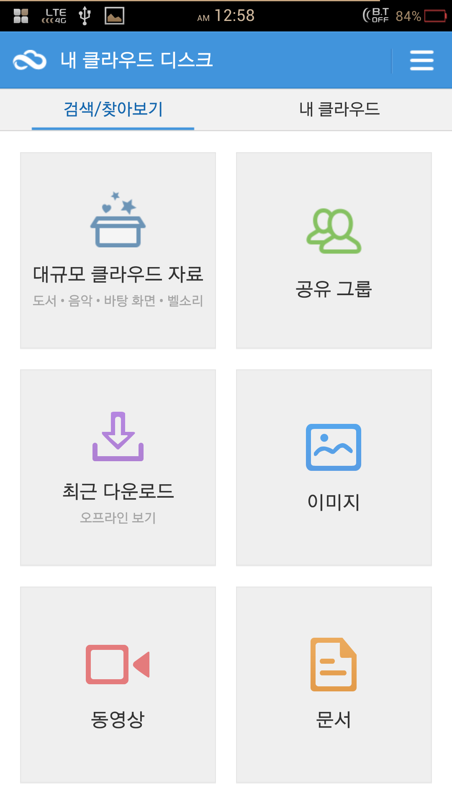 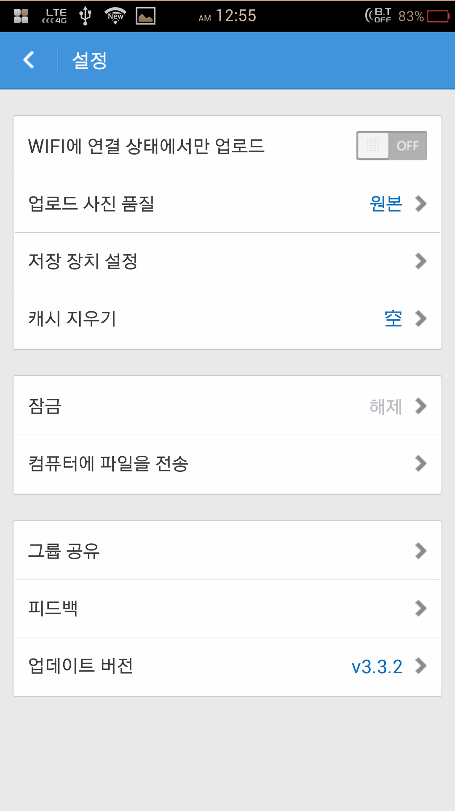

**업데이트버전(3.3.2) 한글화 앱 :   [com.qihoo.yunpan-update(3.3.2).apk](http://spapa1004.tistory.com/attachment/cfile27.uf@23541F4B526BE6AA395BF2.apk)**

*** 대용량 클라우드 서비스**

**바이두 무료 대용량 클라우드 서비소개 :  <http://spapa1004.tistory.com/51>**

**퀴우360 무료 대용량 클라우드 서비스소개 :  <http://spapa1004.tistory.com/83>**

**텐센트 무료 대용량 클라우드 서비스소개 :  <http://spapa1004.tistory.com/49>**

---

## 첨부파일

- [language.ini](./files/language.ini)
- [퀴우360.hwp](https://github.com/itmir913/archive/releases/download/itmir-attachments/352-qhoo360.hwp) `2.4 MB`
