**제목 : 바이두(baidu) 2TB 무료 대용량 클라우드 서비스 시작하기**

**출처 : <http://spapa1004.tistory.com/51>**

**안녕하세요. SPAPA입니다.**

**텐센트 클라우드에 이어 오늘은 "바이두(baidu) 클라우드"에 대해 소개해드리겠습니다.**

간단하게 "바이두(baidu) 클라우드"에 대해 소개해드리자면..

텐센트 클라우드와 마찬가지로 대용량의 무료 클라우드서비스를 제공하는 서비스입니다.

1TB의 공간을 무료로 제공하고 추가로 1달러를 결제하면 2TB를 제공한다고 하더니,

어제 뜬금없이 무료로 2테라로 공간이 늘어났더군요;; 텐센트를 의식한건가....;;

아직 많이 사용해보지 않아 잘 모르겠지만 텐센트와 비교해보면 기능적인 부분에선 텐센트보다 우위인것같고,

개인적으로 모바일앱이나 PC클라이언트의 UI가 좀 촌스럽다고 느껴지네요 ㅋㅋ

하지만 대부분의 리뷰들은 보면 바이두가 텐센트보다 속도면에선 훨씬 안정적이라고들 하는거같습니다.

하지만 직접 이거저거 써보시고 비교들 해보시고 본인에게 맞는걸 쓰시면 될거같네요.

▶ 텐센트 10TB 클라우드서비스 : <http://spapa1004.tistory.com/49>

▶ 텐센트 10TB 클라우드서비스  한글화 : <http://spapa1004.tistory.com/50>

[임베드 콘텐츠: http://api.v.daum.net/widget3?nid=49817092](http://api.v.daum.net/widget3?nid=49817092)

**이쯤에서 추천 한번씩 눌러주시면 큰 힘이 될거같습니다^^**

일단 회원가입부터 무료로 2TB의 용량을 받는 방법을 알려드리겠습니다.

<https://passport.baidu.com/v2/?reg&u=http%3A%2F%2Fpan.baidu.com&regType=1#mail>

위의 링크로 들어가서 회원 등록을 하시면 됩니다.

홈페이지가 중국어로 되어있어서, 크롬으로 접속하시면 아래처럼 한글로 볼수있습니다.

E-mail과 비밀번호 인증코드만 입력하시고 "등록"을 클릭을 바로 회원 등록이 됩니다.

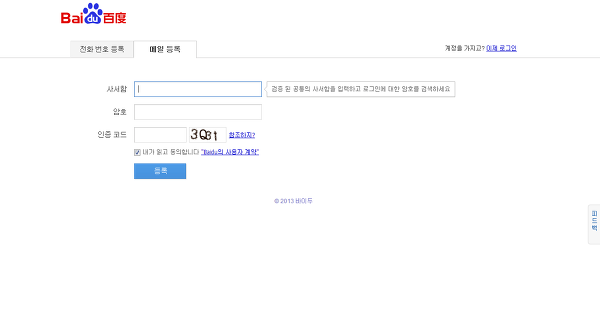

회원등록을 하셨다고 바로 로그인 할 수 있는건 아닙니다. 가입하신 이메일 주소로 인증메일이 날라옵니다.

메일 본문의 중간에 있는 링크를 클릭하시면 인증이 이루어지고 그때부터 정상적으로 로그인이 가능합니다.

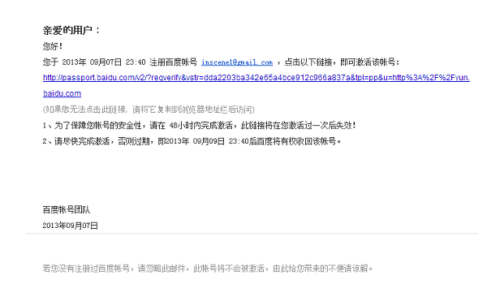

<http://pan.baidu.com/>  이제 바이두의 클라우드 웹페이지로 이동하여 로그인하시면됩니다.

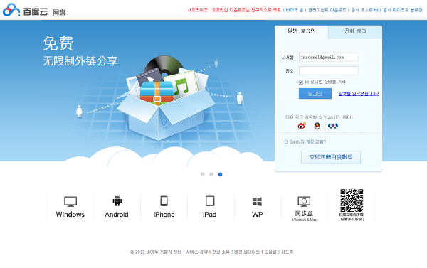

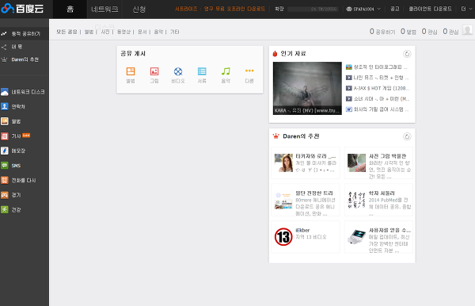

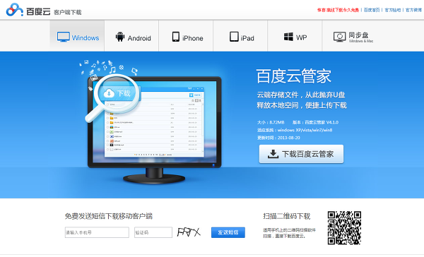

PC용 클라이언트 프로그램 : <http://bcscdn.baidu.com/netdisk/BaiduYunGuanjia_4.1.0.exe>

이제 2TB의 무료 공간을 받기 위해선 먼저 모바일기기에서 바이두클라우드 앱을 설치하셔야합니다.

아래의 링크에서 받으시거나 모바일기기에서 QR코드를 스캔해서 받으시면 됩니다.

모바일 앱 다운 : <http://bs.baidu.com/netdisk/BaiduYunSetup_web_2T.apk>

QR코드 :       

모바일 앱을 기기에 설치하신 후에 위에서 등록한 계정으로 똑같이 로그인하시면되구요.

이제 마지막으로 <http://yun.baidu.com/1t> 링크로 이동하여 무료수신 버튼을 누르시면 2TB의 무료 공간을 받을수 있습니다!

모두들 성공적으로 2TB 받으셨나요? ^^ ㅋㅋ


이상으로 "바이두(baidu) 클라우드"에 대한 간단한 포스팅을 마치도록 하겠습니다.

다음엔 바이두(Baidu)의 모바일 앱 한글화 버전을 올려드리겠습니다^^

현재 90%정도 완성된거같네요...

**제목 : 바이두(baidu) 2TB 무료 대용량 클라우드 서비스 모바일 앱 한글화.**

**출처 : <http://spapa1004.tistory.com/53>**

**바이두(baidu) 2TB 무료 대용량 클라우드 서비스 모바일 앱 한글화.**

**안녕하세요. SPAPA입니다.**

**바이두 클라우드의 모바일 앱 한글화 버전을 배포합니다.**

\* 클라우드 서비스 관련포스트

텐센트 10TB 무료 대용량 클라우드 서비스  :  <http://spapa1004.tistory.com/49>

텐센트 10TB 무료 대용량 클라우드 한글화 앱  :  <http://spapa1004.tistory.com/50>

**텐센트 클라우드에 이어 바이두 클라우드의 모바일앱까지 한글화 해봤습니다.**

**기능적인면에서는 바이두 클라우드가 텐센트클라우드보다 좀 더 다양한 기능들을 제공하는거같습니다.**

**UI는 개인적으로 봤을때 좀 촌스럽다고 느껴지네요 ㅋㅋ**

**대부분의 평을 보면 바이두가 텐센트보다 속도면에서 더 좋다고들 하시는데... 직접 둘다 써보시고 판단을....**

바이두(baidu) 클라우드 소개 및 가입하기 : <http://spapa1004.tistory.com/51>

**2TB가 아니고 7GB밖에 용량안된다는 분들이 꽤 계신거같은데;;;**

**무조건 가입하고 앱 설치한다고 2TB의 용량을 주는거 아닙니다.**

**위 링크 보시고 본문 제대로 보시면 답이있습니다.**

**추천 한번씩 눌러주시면 큰 힘이 될거같습니다^^**

 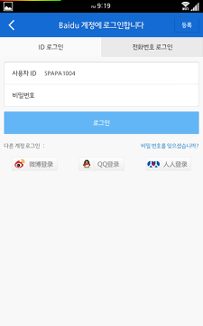 

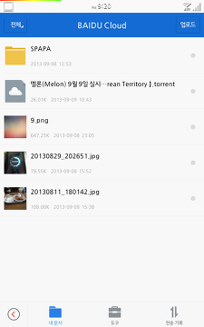 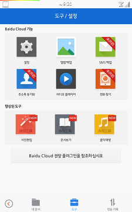 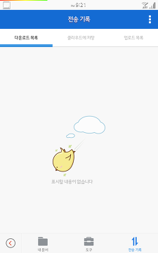

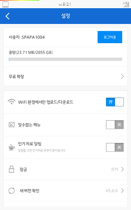 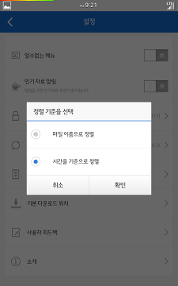 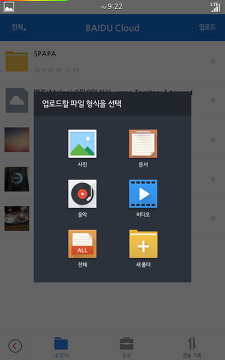

**바이두 클라우드 한글화 앱 다운로드 :   [BaiduCloud(SPAPA).apk](http://spapa1004.tistory.com/attachment/cfile5.uf@2453A247522E884834A3E7.apk)**

[BaiduCloud\_fix(SPAPA).apk](./file/BaiduCloud_fix(SPAPA).apk)

**PC클라이언트 프로그램을 한글화하신분이 계셔서 링크 같이 남겨드립니다.**

**<http://w3tech.tistory.com/187>**

**한글화앱과 한글화된 PC프로그램이면 쓰기 참 편하겠네요^^**

**이 자료는 다른곳에서의 직접적인 공유를 절대 금지합니다.**

**제목 : 바이두 클라우드 한글화 + 추가 내용**

**출처 : <http://w3tech.tistory.com/187>**

바이두 클라우드 한글화 작업했습니다.

(+ 하는김에 AHK로 패치 프로그램을 만들었습니다.<http://w3tech.tistory.com/189> )

<http://w3tech.tistory.com/189>  ← 이 포스트에 최근 번역 수정한 파일이 있습니다. ( 공유관련 미번역된것 번역 )

본인은 중국어를 하나도 모르며 오로지 구글 번역 사이트를 이용해서 작업했습니다.

또한 한글패치 이런것도 처음해보고 어떻게 하는지 지금도 모릅니다.

그냥 파일들 다 열어보다 문자열 있는 파일을 열어서 바이트 갯수 어긋나지 않게 수정했습니다.

조금이라도 틀리면 프로그램 실행이 안 되더군요.

에디터 프로그램 중 HexCmp가 열어놓고 프로그램 실행하면 안되는거였...

검색하면 이런 파일체크 루틴을 우회하는 방법도 있고 다양한 패치법이 있지만 불민한지라...

HEX에디터와 파일비교등등으로 겨우 이정도까지 했습니다.

아직 더 번역해야될 부분은 많습니다만 일단 사용하는데 답답증은 덜할정도만 하고 멈췄습니다.

너무 힘드네요.

특히 조금이라도 비트가 틀리면 실행조차 안 되는게 정말 스트레스였습니다.

한창 많은 분량을 고치고 보니 실행이 안되고.. 어디서 틀렸는지 찾기도 힘들고 아주 미칩니다.

아무튼 바이두 클라우드 프로그램이 두 종류입니다.

하나는 웹하드 형식이고 하나는 동기화형식입니다.

둘 다 사용해보니 동기화보단 웹하드형식이 더 편하고 사용할 일이 많은것 같아서 웹하드 형식을 번역했습니다.

번역은 비트수를 맞추느라 말을 늘리고 줄이고 해서 어색합니다만 답답할정도는 아니라고 봅니다.

여기서 더 수정하실분들은 더 수정하시기바랍니다..

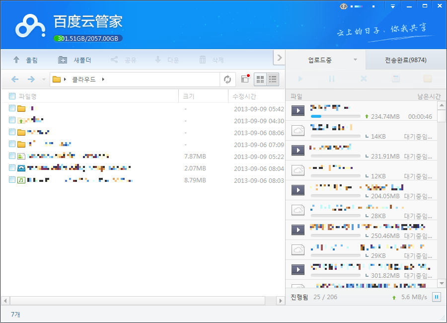

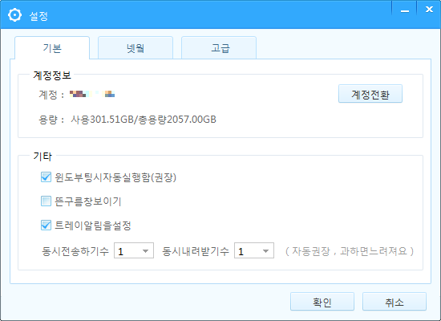

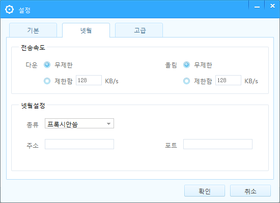

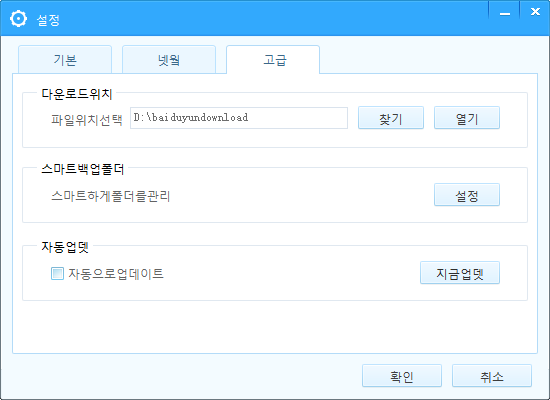

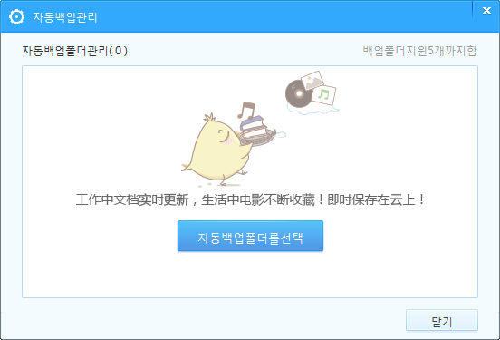

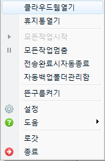

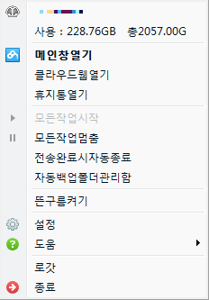

압축파일 안에 TXT문서를 읽으시기바랍니다.

접기

[ 바이두클라우드한글패치.zip](http://w3tech.tistory.com/attachment/cfile22.uf@2764C04C522D04200C359C.zip)

[바이두클라우드한글패치.zip](./file/바이두클라우드한글패치.zip)

접기

바이두 클라우드 윈도우용 프로그램 링크입니다.

<http://bcscdn.baidu.com/netdisk/BaiduYun_3.8.0.exe>

(동기화 프로그램)

접기

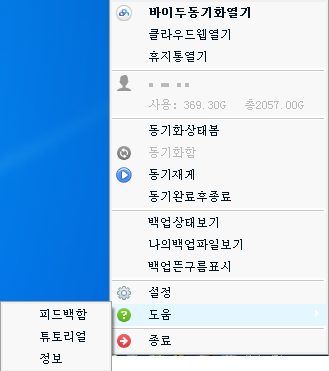

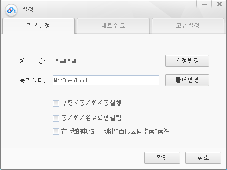

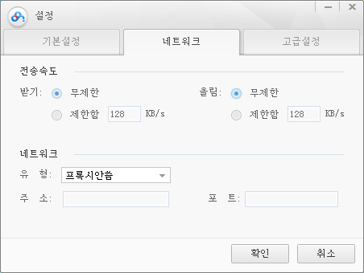

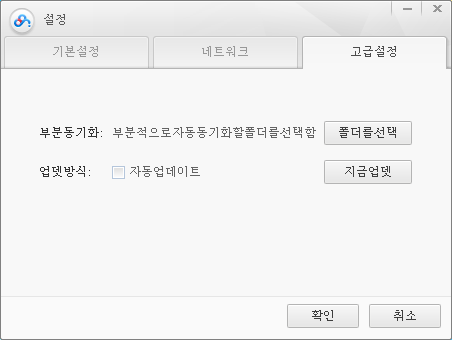

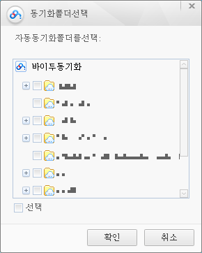

바이두 동기화 프로그램 찾으셔서 이것도 작업해봤습니다.

폰트가 희한하게 나오네요.

이래저래 쓰기엔 그냥 웹하드방식이 나은것 같습니다.

파일은 아래

[ 바이두동기화한글패치.zip](http://w3tech.tistory.com/attachment/cfile3.uf@2617814C523AAB8817C9A7.zip)

[바이두동기화한글패치.zip](./file/바이두동기화한글패치.zip)

경로

win7

```
C:\Users\사용자이름\AppData\Roaming\Baidu\BaiduYun
```

winXP

```
C:\Program Files\baidu\BaiduYun
```

접기

<http://bcscdn.baidu.com/netdisk/BaiduYunGuanjia_4.1.0.exe>

(웹하드 방식 프로그램) ← 한글화한 프로그램

설치 후 한글화한 db파일을 덮어씌우면 됩니다.

경로

win7

```
C:\Users\사용자이름\AppData\Roaming\Baidu\BaiduYunGuanjia
```

winXP

```
C:\Program Files\baidu\BaiduYunGuanjia
```

블로그에서 클라이언트 다운로드

[BaiduYun\_3.8.0.exe](./file/BaiduYun_3.8.0.exe)

[BaiduYunGuanjia\_4.1.0.exe](./file/BaiduYunGuanjia_4.1.0.exe)

**패쳐 다운로드 ↓↓↓↓**

[ BaiduCloud\_Korean\_130928.zip](http://w3tech.tistory.com/attachment/cfile4.uf@2427D43852469E13083E64.zip)

[BaiduCloud\_Korean\_130928.zip](./file/BaiduCloud_Korean_130928.zip)

**제목 : 바이두 클라우드 한국어 패치 프로그램 AHK로 만들기**

**출처 : <http://w3tech.tistory.com/189>**

안녕하세요.

이번엔 AHK로 바이두 클라우드의 간단한 한국어 패치 작업을 해주는 프로그램을 만들어봤습니다.

요약해서 말하자면 단순한 파일 복사 프로그램입니다.

한줄로 요약이 가능하네요.

하지만 여기서 해당 파일이 있는지 체크와 없으면 직접선택하게 하고,

운영체제에 따라 설치 경로가 다르니 운영체제도 확인해주고,

원본 파일을 백업해주고 하는 동작이 포함됩니다.

그래도 간단한 작업이니 AHK 배우는데 도움이 되었으면 합니다.

아래는 AHK 코드입니다.

|  |  |
| --- | --- |
| 1  2  3  4  5  6  7  8  9  10  11  12  13  14  15  16  17  18  19  20  21  22  23  24  25  26  27  28  29  30  31  32  33  34  35  36  37  38  39  40  41  42  43  44  45  46  47  48  49  50  51  52  53  54  55  56  57  58  59  60  61  62  63  64  65  66  67  68  69  70  71  72  73  74  75  76  77  78  79  80  81  82  83  84  85  86  87  88  89  90 | `#``NoTrayIcon`  `#``NoEnv` `; 변수를 해석할때 환경변수를 무시, 효율(속도) 상승`  `#``SingleInstance` `force` `; 해당 스키립트 중복실행 방지`  `SetBatchLines``,-1` `; 배치라인 속도 지정, -1은 최소값`  `FileCreateDir``,` `%A_Temp%``\img` `; 임시폴더에 img폴더 생성`  `; 컴파일시 exe파일에 그림파일 내장시키고 실행시 임시폴더에 복사`  `FileInstall``, img\title.png,` `%A_Temp%``\img\title.png, 1`  `FileInstall``, img\baiduyunguanjia.png,` `%A_Temp%``\img\baiduyunguanjia.png, 1`  `FileInstall``, img\baiduyun.png,` `%A_Temp%``\img\baiduyun.png, 1`  `Gui``,` `Color``, FFFFFF` `; GUI배경색 지정`  `; GUI에 그림파일 출력`  `Gui``,` `Add``,` `Picture``, x22 y70 w128 h128 ,` `%A_Temp%``\img\baiduyunguanjia.png`  `Gui``,` `Add``,` `Picture``, x172 y70 w128 h128 ,` `%A_Temp%``\img\baiduyun.png`  `Gui``,` `Add``,` `Picture``, x3 y10 w320 h50 ,` `%A_Temp%``\img\title.png`  `Gui``,` `Add``,` `Button``, x22 y210 w130 h50 , 웹하드방식` `; 버튼 생성`  `Gui``,` `Add``,` `Button``, x172 y210 w130 h50 , 동기화방식`  `Gui``,` `Font``, s8` `; 폰트 크기 지정, 8포인트`  `; 하이퍼링크`  `Gui``,` `Add``, Link, x55 y265 w245 h20 +``Right``, 번역＆제작 : <a href=``"http://w3tech.tistory.com/187"``>http://w3tech.tistory.com/187</a>`  `Gui``,` `Show``, h280 w326, 바이두 클라우드 한국어 패치` `; GUI생성`  `Return`    `pastePath=` `; 변수를 빈값으로 미리 지정`    `;버튼을 눌렀을때 실행하는 라벨, Button버튼이름`  `Button웹하드방식:`  `client=BaiduYunGuanjia`  `gosub``,Patch`  `return`    `Button동기화방식:`  `client=BaiduYun`  `gosub``,Patch`  `return`    `; 주 동작을 하는 라벨`  `Patch:`  `IfnotExist``,` `%A_ScriptDir%``\``%client%``\resource.db` `; 해당 파일이 없으면`  `{`  `MsgBox``, 패치파일이 없습니다.`  `Exit`  `}`  `Process``,` `Close``,` `%client%``.exe` `; 프로세스에서 지정된 파일이 있으면 종료`  `Sleep``,500`  `if` `A_OSVersion` `in` `WIN_XP,WIN_2000,WIN_98,WIN_ME` `; 사용중인 OS에 따른 분기`  `{`  `pastePath=``%A_ProgramFiles%``\Baidu\``%client%``\resource.db`  `}``else` `if` `A_OSVersion` `in` `WIN_7,WIN_8,WIN_VISTA,WIN_2003`  `{`  `pastePath=``%A_AppData%``\Baidu\``%client%``\resource.db`  `}`  `Loop`  `{`  `IfNotExist``, % pastePath` `; 기본 지정된 경로에 파일이 없는 경우`  `{`  `MsgBox``, 패치 대상 파일을 찾지 못 했습니다. 파일 경로를 선택하세요.`  `FileSelectFile``, pastePath, 1, resource, , *.db` `; 파일 선택창을 띄워 경로를 변수에 저장`  `if` `ErrorLevel` `= 1`  `{`  `MsgBox``, 취소되었습니다.`  `Exit`  `}`  `}`  `IfNotInString``, pastePath, resource.db` `; 경로 변수 안에 해당파일이름이 없다면`  `{`  `MsgBox``, 패치할 파일을 정확히 고르세요.`  `}``else``{`  `break`  `}`  `}`  `FileMove``,` `%pastePath%``,` `%A_ScriptDir%``\``%client%``\resource_``%A_Now%``.db, 1` `; 원본 파일 이동(백업)`  `if` `ErrorLevel` `= 1`  `{`  `MsgBox``, 파일백업 실패!`  `Exit`  `}`  `FileCopy``,` `%A_ScriptDir%``\``%client%``\resource.db,` `%pastePath%``, 1` `; 패치파일을 복사`  `if` `ErrorLevel` `= 1`  `{`  `MsgBox``, 파일복사 실패!`  `Exit`  `}`  `MsgBox``, 패치 완료!`  `return`    `Exit:`  `GuiClose:`  `FileRemoveDir``,` `%A_Temp%``\img, 1` `; 종료될때 임시폴더에 생성한 파일과 폴더 삭제`  `ExitApp`  `return` |

100줄도 안 되는 짧은 소스입니다.

실행시 당연히 해당 경로에 그림과 파일이 있어야 합니다.

아래는 실행파일과 패치파일이 포함된 압축 파일입니다.

[BaiduCloud\_Korean\_130928.zip](./file/BaiduCloud_Korean_130928_1.zip)

실행한 화면입니다.


[바이두.hwp](./file/바이두.hwp)

## [바이두 클라우드 서비스 모바일 앱 업데이트버전(5.1.1) 한글화](http://spapa1004.tistory.com/96)

[일반 자료](http://spapa1004.tistory.com/category/%EC%9D%BC%EB%B0%98%20%EC%9E%90%EB%A3%8C) 2013/10/28 09:42 Posted by Spapa™

**바이두 클라우드 서비스 모바일 앱 업데이트버전(5.1.1) 한글화**

**안녕하세요. SPAPA입니다.**

**바이두 클라우드 모바일앱이 5.1.1 버전으로 업데이트되었습니다.**

**업데이트 버전으로 다시 한글화파일을 배포합니다.**

 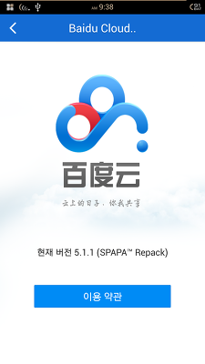 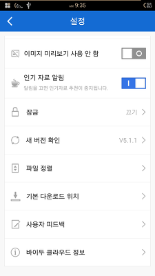

\* 업데이트 로그는 다음과 같습니다. 이번 업데이트에서 기능상의 별다른 변화는 없는듯하고,

그냥 다운로드 관련하여 안정화만 있는듯 하네요..

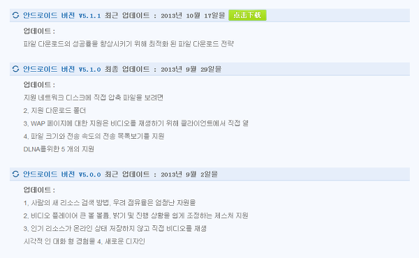

**업데이트버전(5.1.1) 한글화 앱 :**

**[BaiduCloud\_5.1.1(SPAPA).apk](./file/BaiduCloud_5.1.1(SPAPA).apk)**

**\* 대용량 클라우드 서비스**

**바이두 무료 대용량 클라우드 서비소개 :  <http://spapa1004.tistory.com/51>**

**퀴우360 무료 대용량 클라우드 서비스소개 :  <http://spapa1004.tistory.com/83>**

**텐센트 무료 대용량 클라우드 서비스소개 :  <http://spapa1004.tistory.com/49>**

**이자료는 다른곳에서의 직접적인 공유를 금지합니다.**

**링크를 통해서만 공유 부탁드립니다.**

---

## 첨부파일

- [바이두.hwp](https://github.com/itmir913/archive/releases/download/itmir-attachments/353-baidu.hwp) `1.0 MB`

