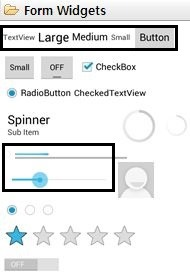
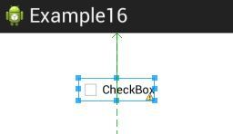
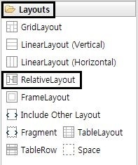
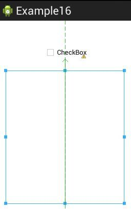
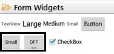
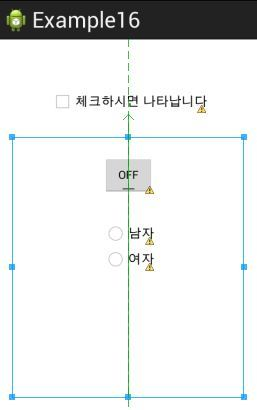
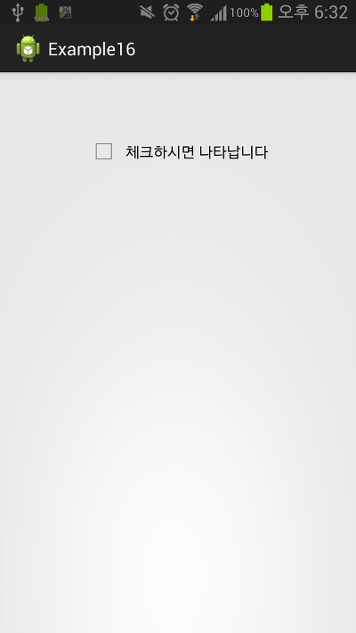
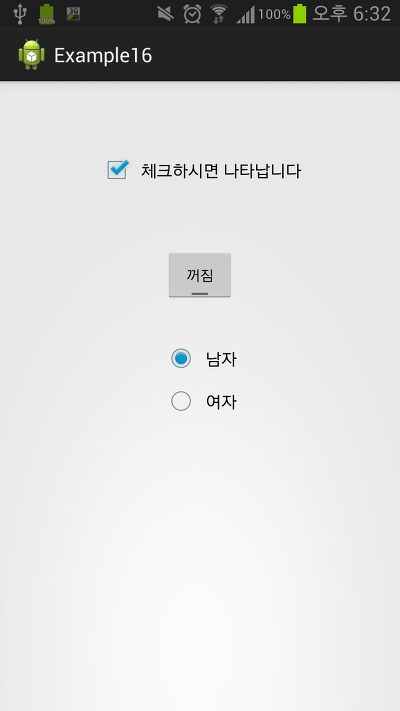

안녕하세요 ㅎ

엄청~ 오래간만이네요..

시험기간때문에........

아무튼 빨리 시작합니다!!

참고로 15번 seekbar예제소스는 이 글이 올라가는 즉시 첨부되어 집니다

이글이 올라와 있다면 [#15 SeekBar로 화면 밝기 조절해 보자](http://itmir.tistory.com/347) 강좌의 아랫부분에 예제소스가 첨부되어 있는겁니다 ㅎㅎ

16번째 이 강좌의 예제소스도 17번째 강좌가 올라오면 첨부되어 집니다

## 토글버튼,체크박스,라디오버튼

### 16-1 뭐지 한번에 3개는?

자, 아래 사진을 봅시다

[그림 1] 배운 위젯 사용법을 체크해 두었다

우리는 실력을 쌓기 위해 여러가지 기본 위젯을 배웠습니다

TextView, Button, ProgressBar, SeekBar...

그런대도 엄청나게 많이 남아 있습니ㅏㄷ...

토글버튼, 체크박스, 스위치, 스피너, 별, 라디오버튼....

이중에서 오늘은 한 강좌에 3개 위젯을 모두 설명하겠습니다

그리고... 이제부터 조금 꼬와서 어플을 만들어 보겠습니다

### 16-2 어떻게 만들어 볼까?

이 질문의 답은 추후에 여러분이 스스로 답해서 만들어 보세요

저는 이렇게 답하겠습니다

"먼저 체크박스에 선택을 하면 나머지 토글버튼, 라디오 버튼이 아래에 나타나고

각각 선택할때마다 토스트 알림이 나오도록 만들어 보겠습니다"

### 16-3 이론적 배경은?

없어도 됩니다 ㅎㅎㅎㅎㅎㅎㅎㅎㅎㅎㅎ

설명 주의깊게 읽고 따라와 주셔야만 성공할수 있는 부분입니다

### 16-4 만들어 볼까요?

일단 체크박스를 배치해 봅시다

체크박스 추가했습니다 ㅎㅎ

바로 체크박스 아래에 레이아웃을 하나 만들어 줘야 합니다

Layouts이라는 폴더를 열어 RelativeLayout을 바로 체크박스 아래로 드래그 해주세요

추가하자 마자 코드를 보면 다음과 같습니다

<RelativeLayout

    android:layout\_width="wrap\_content"

    android:layout\_height="wrap\_content"

    android:layout\_below="@+id/checkBox1"

    android:layout\_centerHorizontal="true"

    android:layout\_marginTop="28dp" >

</RelativeLayout>

잘 추가되었습니다. ㅎㅎ

몇가지 수정해봅시다

일단 크기를 모두 match\_parent으로 바꿔줄까요?

작으면 추가하기도 힘드니까요ㅋ

그다음에 id값도 줍시다

android:id="@+id/Layout"

이거면 되겠죠??

만들어진 코드는 아래와 같습니다

<CheckBox

    android:id="@+id/checkBox1"

    android:layout\_width="wrap\_content"

    android:layout\_height="wrap\_content"

    android:layout\_alignParentTop="true"

    android:layout\_centerHorizontal="true"

    android:layout\_marginTop="45dp"

    android:text="체크하시면 나타납니다" />

<RelativeLayout

    android:id="@+id/Layout"

    android:layout\_width="match\_parent"

    android:layout\_height="match\_parent"

    android:layout\_below="@+id/checkBox1"

    android:layout\_centerHorizontal="true"

    android:layout\_marginTop="28dp" >

</RelativeLayout>

호호 잘되어 가고 있군요

이제 우리는 저 파란상자, 즉 아까 추가한 레이아웃에 필요한 것을 넣을겁니다

필요한건 3가지

ToggleButton, RadioGroup, RadioButton입니다

[미르의 팁]

Q. 라디오 버튼과 체크박스는 뭐가 다를까요?

A. 체크박스는 여러개를 선택할수 있습니다

그러나 라디오 버튼은 여러개중 딱 한개만 선택이 가능합니다

오지선다형 시험문제에서 5개의 보기중 딱 한개만 선택할수 있다 라고 이해해 주세요 ㅎㅎ

먼저 토글부터 추가해 보겠습니다

토글을 추가해 주세요

물론 아까 만든 레이아웃에 넣어야만 합니다!!

그다음은.. 라디오 그룹이랑 라디오 버튼인데요

라디오 버튼은 Form Widgets아래에 있습니다

라디오 그룹은 어디 있는지 모르겠네요;;

그러나 꼭 필요합니다

그래서 이번에는 드래그 추가 말고 코드 입력 방식으로 해볼까 합니다

...물론 그냥 코드를 던져주진 않을겁니다

처음 라디오 그룹을 지정할때의 코드입니다

<RadioGroup

    android:id="@+id/Radiogroup"

    android:layout\_width="wrap\_content"

    android:layout\_height="wrap\_content"

    android:layout\_below="@+id/toggleButton1"

    android:layout\_centerHorizontal="true"

**android:orientation="vertical"**

**android:padding="5dp"**>

id값 주고있고... 특별한건 일단 두개 말곤 눈에 안틔죠?

android:orientation은 정렬 방향입니다

두개가 들어갈수 있는데요 horizontal는 수평(왼쪽에서 오른쪽으로 배열),

verticall은 수직(위에서 아래로)배열 방법입니다

우리는 위에서 아래로 배열이 필요하니 verticall을 쓰죠

android:padding은 여백입니다

라디오 버튼 사이의 여백을 결정해 줍니다

그다음!!

<RadioButton

        android:id="@+id/radioButton1"

        android:layout\_width="wrap\_content"

        android:layout\_height="wrap\_content"

        android:layout\_marginTop="27dp"

        android:text="남자" />

    <RadioButton

        android:id="@+id/radioButton2"

        android:layout\_width="wrap\_content"

        android:layout\_height="wrap\_content"

        android:layout\_alignLeft="@+id/radioButton1"

        android:layout\_below="@+id/radioButton1"

        android:text="여자" />

요놈들은 뭐...

설명할게 없네요

<RadioButton>인것 말고는 모두 <Button>과 같으니 말이죠 ㅋㅋ

마지막으로 라디오 그룹을 닫아줘야 하므로

</RadioGroup>

을 입력해 주세요!!!!

이제 레이아웃은 다 짠거 같네요

올ㅋ

모두 완성됬습니다

이제 java로 넘어와 주세요

먼저 맨날 하던거 먼저 하겠습니다 ㅎㅎ

뭘 사용할건지 정의를 해야죠~

CheckBox checkBox1;

RelativeLayout Layout;

ToggleButton toggleButton1;

RadioGroup Radiogroup;

뭔지 대충 아시죠??ㅋㅋ

평소처럼 추가해 주시면 됩니다

그다음에 id값을 연결해 봅시다

checkBox1 = (CheckBox) findViewById(R.id.checkBox1);

Layout = (RelativeLayout) findViewById(R.id.Layout);

toggleButton1 = (ToggleButton) findViewById(R.id.toggleButton1);

Radiogroup = (RadioGroup) findViewById(R.id.Radiogroup);

음음 여기까진 모두 따라 오시고 계시죠?

익숙한거니 ㅎ

그다음 Layout을 일단 안보이게 해야 합니다

Layout.setVisibility(View.GONE);

쉬운거 끝~!

이제부턴 천천히 따라와 주세요

먼저 체크박스 부터 해볼까요?

체크가 변경될때마다 리스너를 이용하여 레이아웃을 안보이게/보이게 만들어 봅시다

checkBox1.**setOnCheckedChangeListener**(new CompoundButton.OnCheckedChangeListener() {

@Override

public void **onCheckedChanged**(CompoundButton buttonView, boolean isChecked) {

// TODO Auto-generated method stub

**if(isChecked****)**

**Layout.setVisibility(View.VISIBLE);**

**else**

**Layout.setVisibility(View.GONE);**

}

});

(색 바꿔봤어요 ㅎㅎ, 그리고 **PC버전**으로 봐주세요 되도록)

처음보는 것들이 많이 있습니다

먼저 첫번째줄부터

setOnCheckedChangeListener

뜻 그대로 체크가 변경될때마다 확인할 리스너를 결정하는 일입니다

버튼만들때 많이 만져봤죠?

체크박스를 해제/선택할때마다 리스너 안에있는 onCheckedChanged 메소드가 실행됩니다

체크박스가 선택되어 있다면 isChecked의 값은 true가 됩니다

즉 체크되어 있다면!!!! if구문에 의해 레이아웃이 화면에 보여지게 됩니다 (setVisibility)

반대로 체크 해제를 한다면 isChecked의 값이 false가 되므로

레이아웃이 화면에 안보이게 되죠

[미르의 팁]

Q. 리스너말고 다른 곳에서는 체크 여부를 확인할수 없는데요?

A. 우리는 리스너로 바로 연결해서 onCheckedChanged가 호출될때 boolean isChecked으로 인해 체크한 값이 넘어옵니다

그러나 checkBox1.isChecked()으로도 체크 여부 확인이 가능하다는점 기억해 두세요!!

그다음 토글버튼 해봅시다

toggleButton1.setOnClickListener(new OnClickListener() {

@Override

public void onClick(View v) {

// TODO Auto-generated method stub

if(toggleButton1.isChecked())

Toast.makeText(MainActivity.this, "토글버튼 체크됨", Toast.LENGTH\_SHORT).show();

else

Toast.makeText(MainActivity.this, "토글버튼 체크 해제", Toast.LENGTH\_SHORT).show();

}

});

이건 뭐...

설명 안해도 되지 않을까요..?ㅎㅎ

토글을 클릭하면 onClick메소드가 실행되는데요

위와 마찬가지로 체크되어 있다면 true, 체크 해제되어 있다면 false를 반환합니다

토글버튼은 체크박스+일반버튼 이라 생각하시면 됩니다

마지막 라디오 버튼관련 소스입니다

Radiogroup.**setOnCheckedChangeListener**(new OnCheckedChangeListener() {

@Override

public void **onCheckedChanged**(RadioGroup group, **int checkedId**) {

// TODO Auto-generated method stub

switch (checkedId){

case R.id.radioButton1:

Toast.makeText(MainActivity.this, "당신은 남자군요", Toast.LENGTH\_SHORT).show();

break;

case R.id.radioButton2:

Toast.makeText(MainActivity.this, "당신은 여자군요", Toast.LENGTH\_SHORT).show();

break;

}

}

});

라디오 버튼을 감싸고 있던 라디오 그룹 기억 나시나 모르겠네요 ㅎ

이놈은 특이하게도 그룹을 사용해서 알아냅니다

위에서 설명을 안한거 같습니다만... 라디오 버튼은 여러개중 **한개**만 선택가능합니다

체크박스는 여러개를 동시에 선택이 가능하지만 라디오 버튼은 단 한개!!!

코드는 체크박스와 비슷하나.. int checkedId를 주목해 주세요

이 리스너의 onCheckedChanged메소드는 체크한 라디오 버튼의 id값을 넘겨주는군요

switch문으로 id값을 확인하여 토스트 메세지를 띄워주고 있습니다 ㅎㅎ

자, 끝났습니다 코드도!!

설명이 부족하거나 어려운건 알려주세요~

마지막으로 작동 확인해 보겠습니다

체크하면 정상적으로 나머지 것들이 표시됩니다 ㅎㅎ

  

  

테스트 결과, 정상적으로 동작하는것을 확인할수 있습니다!!

이렇게 한시간 반에 걸쳐 강좌가 끝났습니다 ㅎ..

강좌 하나 쓰는건 한시간 반에서 두시간.. 덧글은 1초!!

정성을 생각해서라도 따뜻한 덧글 달아주세요~

그리고 이번 강좌는 설명이 뭔가 자신이 없네요;

설명이 오락가락 한거 같은데 이해 안된거 있으시면 꼭!! 알려주세요!!

[Example16.zip](./file/Example16.zip)

---

## 첨부파일

- [Example16.zip](https://github.com/itmir913/archive/releases/download/itmir-attachments/Example16.zip) `1.3 MB`
