역전재판

스마트폰이 나오기전, 닌텐도가 엄청 유행했을때 했던 게임이니

플레이 한지 약 4년? 5년 된 게임이군요..;

좀 오래된 게임인가 봅니다

처음 역전재판 시리즈인 역전재판1은 10년이 넘었다네요 ㄷ

얼덜결에 이번 추석때 역전재판이 끌려 하게 되었습니다

뭐 시간때우기 용이었죠 ㅋㅋ

저는 특이하게도 1부터 시작하지 않고 4부터 시작하게 되었습니다

위에서 말한대도 플레이 한지 4년정도 된 시리즈가 바로 "역전재판 4"입니다

4는 여러번 클리어를 했지만 3아래로는 거의 기억이 없었네요..

(3은 에피소드 2까지는 간것 같습니다 거기까진 기억이 있었고.. 그리고 1도 클리어 한적이 있었던거 같군요 ㅎㅎ)

아무튼 모든 시리즈를 클리어 하면서 재미있었던 대사부분 모두 모와봤습니다 ^^

일단 엔딩부터!!

먼저 역전재판 4!!

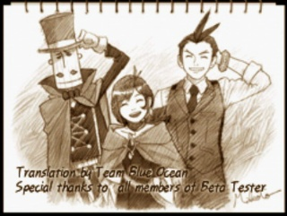

 아쉽게도 엔딩만 찍어뒀네요..;

역전재판 3의 엔딩은 아래와 같습니다

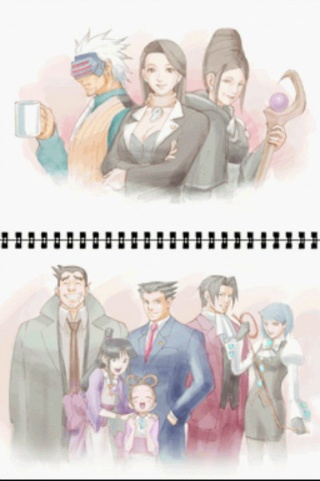

ㅋㅋㅋㅋ

1이랑 2 엔딩과 대사는 아래에서 봅시다 ㅋㅋㅋㅋ

1. 미츠루기의 검사 때려친다 발언

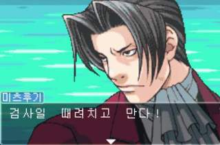

 ㅋㅋㅋㅋㅋㅋㅋㅋㅋㅋㅋㅋㅋㅋㅋㅋㅋㅋㅋㅋㅋㅋㅋㅋㅋㅋㅋㅋㅋㅋㅋㅋㅋㅋㅋㅋㅋㅋㅋㅋㅋㅋㅋ

2. 나루호도의 마요이 일편단심(?)

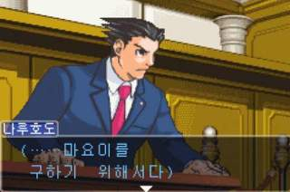

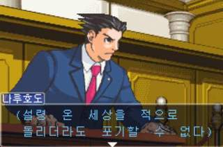

일단 인질을 구하고 나서!!

3. 삐질삐질

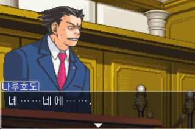

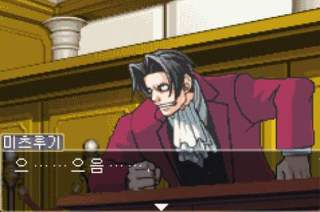

개인적으로 저 미츠루기의 표정 뭔가 친숙한(?)ㅋㅋㅋㅋㅋㅋㅋㅋㅋㅋㅋㅋㅋㅋㅋ

4. 킬러에게 굴복하는 재판장

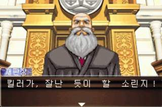

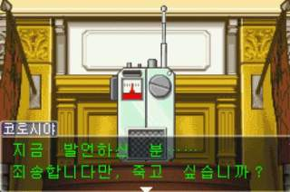

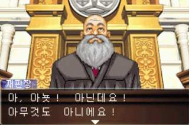

ㅋㅋㅋㅋㅋㅋㅋㅋㅋㅋㅋㅋㅋㅋㅋㅋㅋㅋㅋㅋㅋㅋㅋㅋㅋㅋㅋㅋㅋㅋㅋㅋㅋㅋㅋㅋㅋㅋㅋㅋㅋㅋㅋㅋ

5. 카루마 메이의 활약

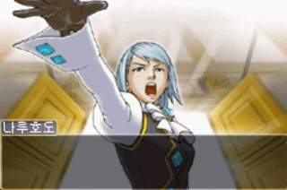

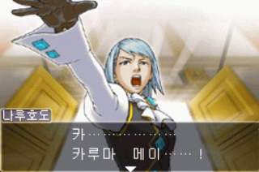

6. 미츠루기 > 재판장

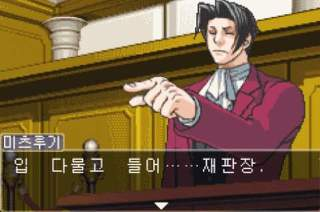

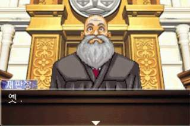

7. 가까운 미래에 킬러가....!

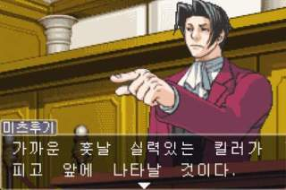

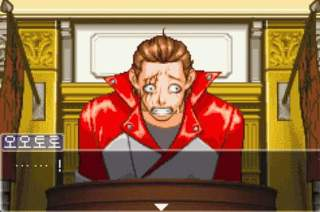

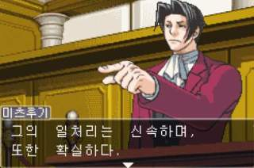

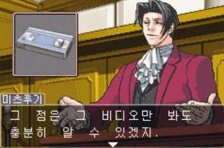

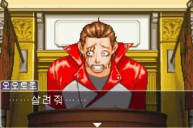

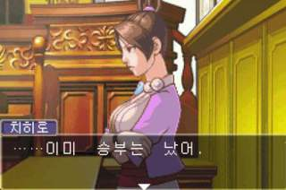

유죄면 감옥에 가고, 무죄면 킬러에게...;;

8. 미츠루기와 나루호도

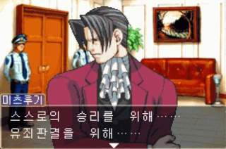

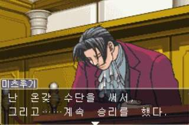

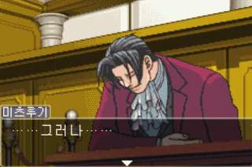

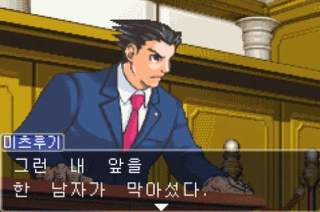

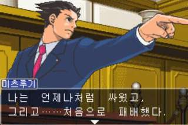

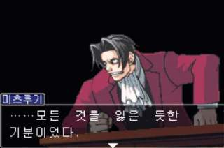

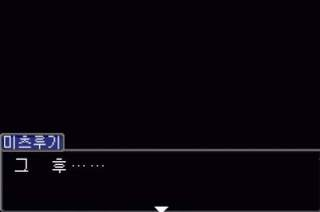

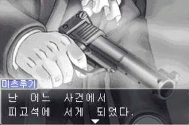

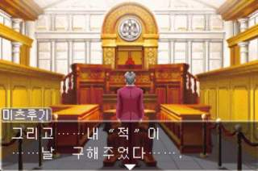

--- 이 부분은 역전재판 2인대요 1과 이어지는 이야기 입니다 ---

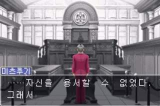

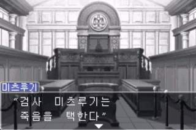

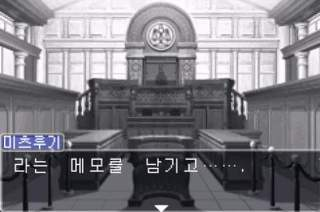

8. 유괴당하고 다시만난 마요이

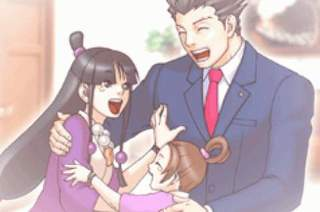

9. 이의있소!!

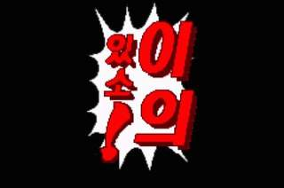

10. 역전재판 2 엔딩

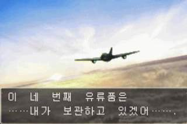

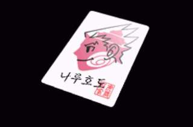

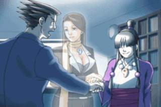

여기까지 역전재판 2에 관한 스샷들입니다~

아래부터는 역전재판 1에 관한 대사들 ㅋㅋ

1. 한국 번역팀의 고의 ㅋㅋㅋㅋㅋㅋㅋㅋㅋㅋ

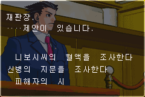

원래는 "신"이 ">"이어야 되는대 저거 ㅋㅋㅋㅋㅋㅋㅋㅋㅋㅋㅋㅋㅋㅋㅋㅋ

2. 경비원 아주머니

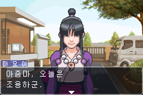

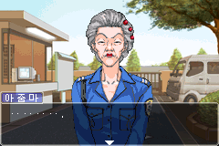

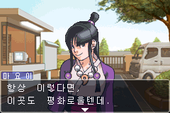

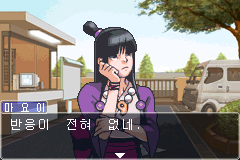

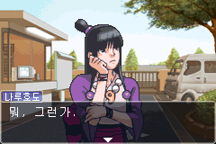

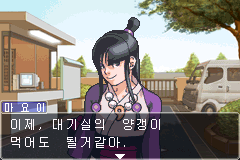

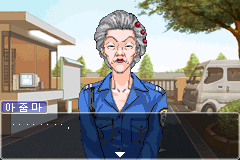

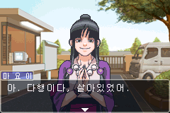

다행이다 ㅋㅋㅋㅋㅋㅋㅋㅋㅋㅋㅋㅋㅋㅋㅋㅋ

3. 이토노코 형사의 소중함(?)

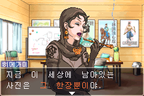

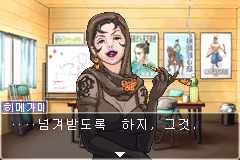

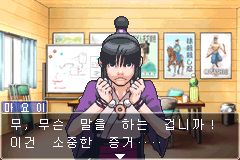

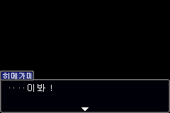

이토노코 형사님은 항상 이런일이 있을때마다 도와주는 분 ㅎㅎ

4. 빠른 인정

5. 카루마 고 검사와 재판장

알지마!ㅋㅋㅋㅋㅋㅋ

6. 권총에 지문이

7. 재판장의 현명한 선택

8. 이번엔 무슨짓 했니?ㅋㅋㅋㅋㅋ

이번엔 무슨짓 했니?래 ㅋㅋㅋㅋㅋㅋㅋㅋㅋㅋㅋㅋㅋㅋ

9. 3분

10. 유죄 판결

이때 야하리가 증언하죠

11. 학급 재판

12. 마요이의 자책

ㅠㅠㅠㅠㅠㅠ

13. 결백

14. ㅋㅋㅋㅋㅋㅋㅋㅋㅋㅋㅋㅋㅋㅋㅋ

15. 마요이와의 이별

엔딩에서 이별하지만 역전재판 2 첫부분 부터 등장합니다 ㅎㅎ

16. 역전재판 1 엔딩

에이....

끄읕~~~~
