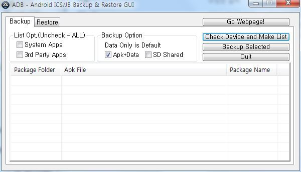
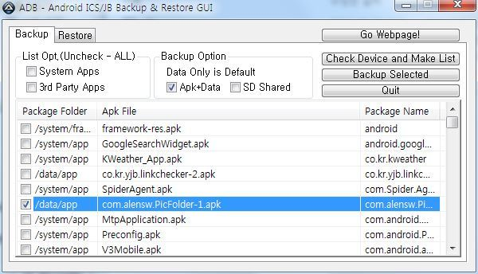
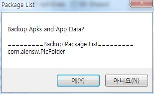
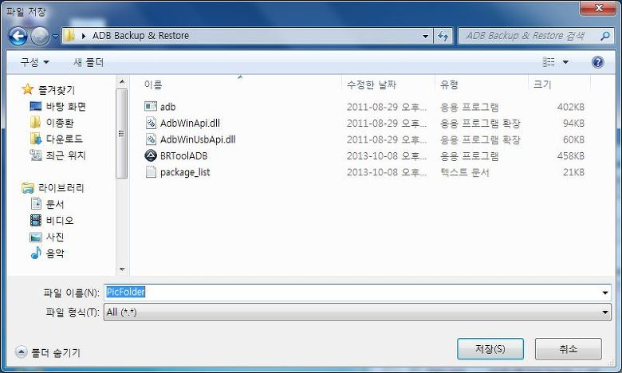
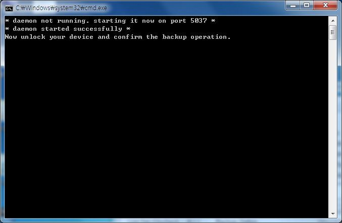
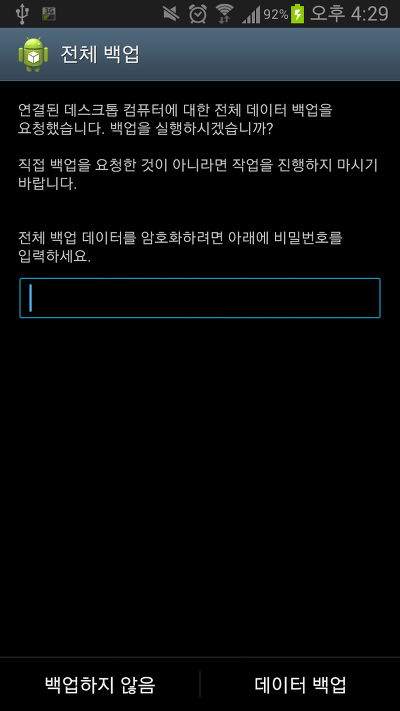
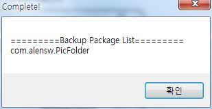

안녕하세요~

이번에는 정말 좋은 정보를 찾았습니다

바로 adb를 이용한 백업과 복원인대요

참고로 전에 adb를 이용한 "ICS모든 기종 루팅방법"과 같은 방법입니다

이방법은 ICS과 JB모두 사용가능한 방법입니다

아쉽게도 GB는 안되는것으로 알고있습니다

아래에 있는 첨부파일을 받아 주신후, 프로그램을 실행해 주세요

되도록 C드라이브 최상단에 풀어주세요!!

폴더 이름(경로)에 특수문자가 포함되어 있으면 진행이 안됩니다 (공백은 모르겠습니다)

한글은 되더군요 ㅎㅎ

먼저 기기를 연결합니다

꼭 **USB 디버깅 허용**을 체크해 두세요!!

설정 - 개발자 옵션 - USB 디버깅

(4.2.2이상부터는 개발자 옵션이라는 메뉴가 없습니다

이럴경우 설정 - 기기정보(디바이스 정보)에 들어가서 [빌드 번호]를 연타해 주시면 됩니다)

그다음 Check Device and Make List라는 버튼을 눌러주세요

모든 어플이 나타났습니다 이제 백업하고자 하는 어플을 체크한다음

Data까지 백업해야 하므로 Backup Option에 Apk+Data를 체크해 줍니다

이제 Backup Selected버튼을 눌러주세요

확인!

폴더와 파일 이름 지정하시고(아무렇게나 해주세요) ㅎㅎ

참고로 경로안에 **특수문자가 포함**되어 있으면 안됩니다 (공백은 되는것 같긴 합니다)

C:\에다가 풀고 하라는 이유가 이것입니다

자 저런 문구가 나타나면 폰을 봐주세요

창이 하나 떴을겁니다

만약 이 검은 도스창이 바로 닫힌경우 폴더 경로를 확인해 주세요

이때 비밀번호 설정하실분은 입력하시고 데이터 백업 버튼을 눌러주시면 됩니다 ㅎㅎ

이 창이 나타나면 과정은 끝났습니다

백업된 파일의 크기를 확인해 주세요~

0kb면 잘못된 백업입니다

루팅하는 이유가 티타늄 백업으로 어플 백업하기 위함인대

이런 유틸이 있으니 루팅하는 이유가 사라졌네요 ㅎ..

출처 : <http://leelavadee.tistory.com/1>

이글의 프로그램 저작권은 [출처]에게 모두 있습니다

2013-11-02 업데이트

adb restore이 지원되는 adb로 변경

[ADB Backup & Restore.zip](https://github.com/itmir913/archive/releases/download/itmir-attachments/ADB-Backup-Restore.zip)

---

## 첨부파일

- [ADB Backup & Restore.zip](https://github.com/itmir913/archive/releases/download/itmir-attachments/ADB-Backup-Restore.zip) `911 KB`
