안녕하세요~

이번강좌는 조금 복잡한 내용을 다루고 있습니다

알림을 띄우는것은 전에 모두 했었던 내용입니다

[**[Development/App] - #11 알림 메세지 띄우기**](http://itmir.tistory.com/315)

그러나 이것만으로는 할수 없는것들이 있기 때문에 이번에는 그것을 배워보도록 하겠습니다

이처럼 점점 이미 배웠던것을 심화시켜서 강좌를 쓰도록 하겠습니다

아마도 이번 강좌부터 난이도가 조금씩 생기지 않을까 생각됩니다

## 17. 커스텀 알림(Alert) 띄우기

### 17-1 이번시간에 배울 내용은?

이번시간에는 알림을 이용한 방법 모두!! 마스터 해보겠습니다

알림은 오로지 자바에서만 다루므로 레이아웃은 각자 짜셔야 합니다

버튼 4개만 있으면 됩니다

그리고 각각 onClick메소드를 이용하셔서 버튼을 누를때마다 다른 메소드가 실행되게 작성하시면 됩니다

(정 안되겠다 하시면 저번 강좌를 보시길)

### 17-2 배울내용 스크린샷 미리보기

이 강좌를 마치면 아래와 같은 알림을 사용할수 있습니다

꼭 해봅시다 ㅎㅎ

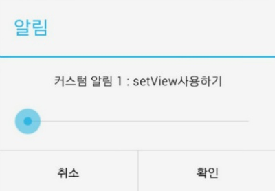

[그림 2-1] setMessage로는 넣을수 없는 SeekBar를 사용하고 있다

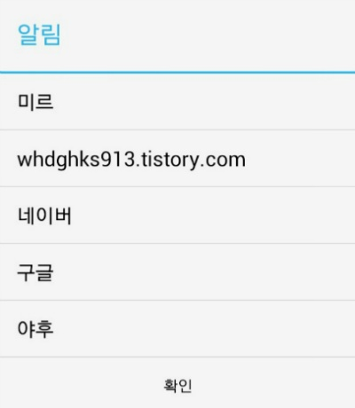

[그림 2-2] 여러개 목록중 하나를 터치하는 동시에 알림이 닫히는 종류이다

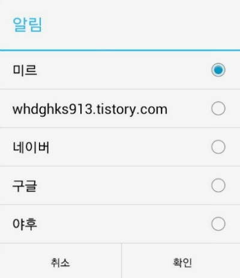

[그림 2-3] 하나를 선택하는 것은 [그림 2-2]와 같으나 선택해도 창이 닫히지 않아 확인/취소 버튼이 따로 필요하다

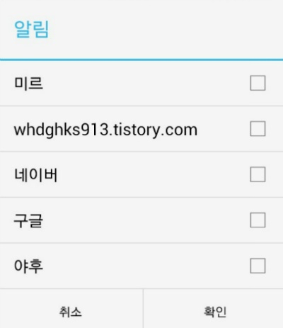

[그림 2-4] 여러개를 선택할수 있는 알림으로, 가장 구현하기 어렵고, 이해하기 약간 복잡한 알림 형태이다

### 17-3 커스텀 알림에 커스텀 레이아웃 추가하기

첫번째 [그림 2-1]을 구현하는 부분입니다

먼저 첫번째 메소드의 맨 위에 아래 소스가 필요합니다

LayoutInflater inflater = (LayoutInflater)getSystemService(this.LAYOUT\_INFLATER\_SERVICE);

View view = inflater.inflate(**R.layout.activity\_alert1**, null);

[소스 3-1] LayoutInflater를 이용한 코드

여기서 레이아웃 인플레이터이란? 20번대 강좌에서 살펴볼 예정이지만 한번 그림으로  보겠습니다

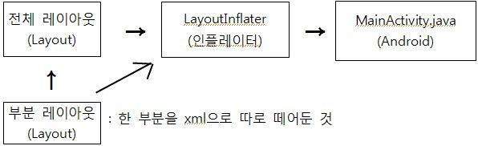

[그림 3-1] LayoutInflater에 관한 설명, 이 사진은 나중에 재활용 될 예정(왜냐면 만들기 힘들어요 ㅠㅠ)

정리하자면 한 부분을 따로 떼어 레이아웃 파일(xml)으로 따로 작성한 것 입니다

여기서 **R.layout.activity\_alert1**을 주목해 주세요

이것은 자주 보면 형식인대 우리는 아직 activity\_alert1이라는 xml파일을 안만들었습니다

그래서 한번 만들어 봤습니다 여러분도 따로 만들어 보세요~

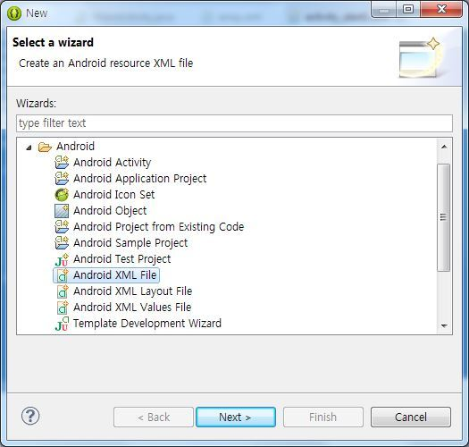

[그림 3-2] xml파일 만드는법

컨트롤+N키를 눌러 창을 띄운다음 Android XML File, XML Layout File 등등 선택하셔서 만드시면 됩니다

내용은 아무렇게나~

그다음 소스는 아래와 같습니다

AlertDialog.Builder alert = new AlertDialog.Builder(this);

alert.setTitle("알림");  
alert.setPositiveButton("확인", new DialogInterface.OnClickListener() {  
    @Override  
    public void onClick(DialogInterface dialog, int which) {  
        dialog.dismiss();  
    }  
});  
alert.setNegativeButton("취소", null);  
alert.**setView(view);**  
alert.show();

[소스 3-2] setView를 사용한 알림 소스

이미 배운 내용이라 익숙하실탠대 한가지 중요한 코드가 있습니다

setView라는 부분인데요

이 부분은 아까 배운 인플레이터를 적용한 부분입니다

View를 적용할수 있는 setView()메소드 잘 기억해 두세요!

완성 코드

LayoutInflater inflater = (LayoutInflater)getSystemService(this.LAYOUT\_INFLATER\_SERVICE);  
  View view = inflater.inflate(R.layout.activity\_alert1, null);  
    
  AlertDialog.Builder alert = new AlertDialog.Builder(this);  
  alert.setTitle("알림");  
  alert.setPositiveButton("확인", new DialogInterface.OnClickListener() {  
      @Override  
      public void onClick(DialogInterface dialog, int which) {  
      dialog.dismiss();  
      }  
  });  
  alert.setNegativeButton("취소", null);  
  alert.setView(view);  
  alert.show();

### 17-4 커스텀 알림에 리스트 추가하기 - 1

이번에는 [그림 2-2]를 구현해 보겠습니다

그리고 이번에는 알림 코드의 단축형(?)을 사용해 보겠습니다

new AlertDialog.Builder(this)  
.setTitle("알림")  
**.setItems(R.array.Like,  
    new DialogInterface.OnClickListener(){  
    public void onClick(DialogInterface dialog, int which){  
        String[] Like = getResources().getStringArray(R.array.Like);  
        Toast.makeText(MainActivity.this, "가장 좋아하는것은: " + Like[which], Toast.LENGTH\_SHORT).show();**

**dialog.dismiss();  
    }  
})**

.setPositiveButton("확인", new DialogInterface.OnClickListener(){  
    @Override  
    public void onClick(DialogInterface dialog, int which) {  
        dialog.dismiss();  
    }  
})  
.show();

[소스 4-1] 터치하면 창이 닫히는 리스트 알림 소스

개발자분들이 자주 사용하는 알림 소스의 형태입니다

쭉 보시면 위와는 뭔가 다른것을 알수있는데요

맨 마지막 show()에만 ;가 있는것을 확인할수 있습니다

아무튼 이런 소스가 있다~ 해주시고 ㅎ

소스 분석해 보겠습니다

R.array.Like라는게 걸리지만 잠시 넘어가고 String[] Like = getResources().getStringArray(R.array.Like);부터 봅시다

String[]란? 자바 상식이 필요한데요 문자 배열을 저장하는 변수입니다

아무튼 여기서는 array.xml의 값을 가져온다 라고 생각해 주세요 ㅎㅎ(아래에서 언급)

그 아래에 있는 Like[which]는 배열중에서 몇번째 값을 표시할지를 정해주는 역할을 합니다

이제 R.array.Like를 설명해 볼까요?

이것은 배열을 미리저장하는 xml을 작성하고, 그 값을 읽어 올수 있도록 해줍니다

저장위치는 values/array.xml입니다

만들어 볼까요?

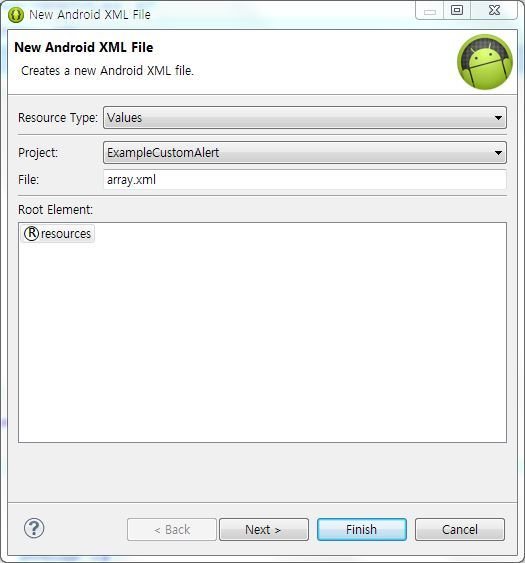

 New XML File을 만들어 주시고 위치는 res/values, 이름은 array.xml으로 해주세요

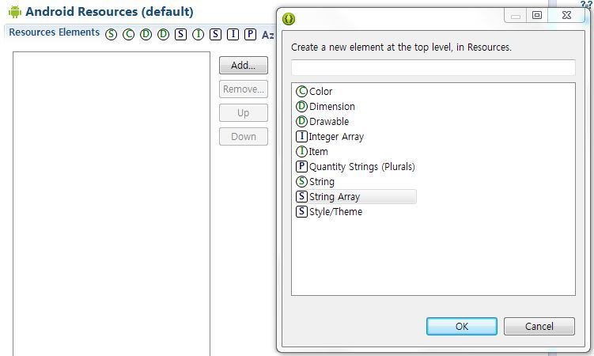

완성되면 Add..버튼을 누른다음 String Array를 선택해주시길 바랍니다

그다음 옆에 뜨는 Name란에 알맞게 써주시면 됩니다

저는 Like로 하겠습니다

(R.array.Like에서 Like가 String Array의 이름입니다)

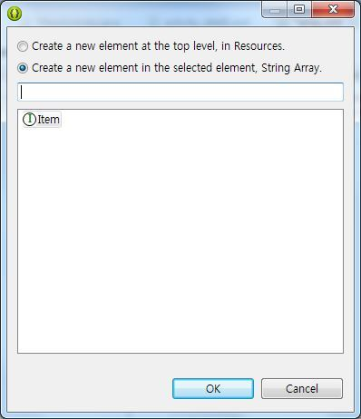

이제 String Array에서 Add..를 눌러 Item을 추가해 주세요

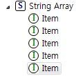

 아이탬을 여러개 추가해 주시면 됩니다

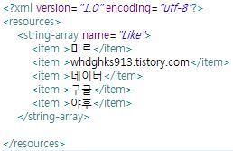

완성된 코드는 위 사진과 같습니다

아이탬을 모두 입력하셨으면 다시 자바로 넘어와 주세요 ^^

[그림 4-1 ~ 4-5] values/array.xml만들기, 이부분은 꼭 해야 다른 알림도 띄울수 있습니다

이제 작동시켜 보시면 재대로 작동하는 모습을 확인할수 있습니다

작동 코드

new AlertDialog.Builder(this)  
  .setTitle("알림")  
  .setItems(R.array.Like,  
   new DialogInterface.OnClickListener(){  
   public void onClick(DialogInterface dialog, int which){  
    String[] Like = getResources().getStringArray(R.array.Like);  
    Toast.makeText(MainActivity.this, "가장 좋아하는것은: " + Like[which], Toast.LENGTH\_SHORT).show();  
    dialog.dismiss();  
   }  
  })  
  .setPositiveButton("확인", new DialogInterface.OnClickListener(){  
   @Override  
   public void onClick(DialogInterface dialog, int which) {  
    dialog.dismiss();  
   }  
  })  
  .show();

### 17-5 커스텀 알림에 리스트 추가하기 - 2

으어 강좌가 너무 길어지는데요;;

아무튼 이번에는 [그림 2-3]을 구현해 보겠습니다

**int Choose = 0;**

...

new AlertDialog.Builder(this)  
.setTitle("알림")  
**.setSingleChoiceItems(R.array.Like, Choose,  
 new DialogInterface.OnClickListener(){  
 public void onClick(DialogInterface dialog, int which){**     **Choose=which;  
 }  
})**  
.setPositiveButton("확인",new DialogInterface.OnClickListener(){  
 public void onClick(DialogInterface dialog, int whichButton){  
     **String[] Like = getResources().getStringArray(R.array.Like);**  
     Toast.makeText(MainActivity.this, "가장 좋아하는것은: "+**Like[Choose]**, Toast.LENGTH\_SHORT).show();  
     dialog.dismiss();  
 }  
})  
.setNegativeButton("취소",null)  
.show();

[소스 5-1] 라디오 버튼이 있는 리스트 알림 띄우기

이 예제는 위와 비슷해서 많은 설명은 필요 없습니다

먼저 onClick()메소드의 int which를 보시면 선택할때마다 onClick메소드가 실행되는데요

선택한 배열의 번호수가 넘어오게 됩니다

우리는 이것을 저장해 줘야 하는데요

그래서 Choose라는 int형 변수를 사용하여 값을 저장해 줍니다

그다음은 모두 같으므로 더이상의 설명은 필요 없을듯 합니다

### 17-6 커스텀 알림에 리스트 추가하기 - 3

ㅁ..마지막 입니다!!

이것은 위에서 설명했드시 이해하기 좀 어렵습니다

그러므로 지금 이해가 안된다면 꼭 이해하려 하지 마세요

**boolean[]** MultChoose = {false, false, false, false, false}

...

new AlertDialog.Builder(this)  
  .setTitle("알림")  
  .setMultiChoiceItems(R.array.Like, MultChoose,  
   new DialogInterface.OnMultiChoiceClickListener() {  
   public void onClick(DialogInterface dialog, **int which**, **boolean isChecked**) {  
    MultChoose[which]=**isChecked**;  
    }  
   })  
  .setPositiveButton("확인",new DialogInterface.OnClickListener() {  
   public void onClick(DialogInterface dialog, int whichButton) {  
    **String[]** foods = getResources().getStringArray(R.array.Like);  
    String string= "가장 좋아하는것은: ";  
    for(int i=0; i<MultChoose.length;i++){  
     **if(MultChoose[i]){  
      string += foods[i] + ", ";  
     }**    }  
    Toast.makeText(MainActivity.this, string, Toast.LENGTH\_SHORT).show();  
   }  
  })  
  .setNegativeButton("취소",null)  
  .show();

[소스 6-1] 체크 박스가 있는 리스트 알림 띄우기

이 예제에도 역시 배열이 등장하는데요

약간 어렵습니다...

맨 위에서 모두 false로 주어 체크된것이 하나도 없도록 지정합니다

중간쯤에 onClick메소드가 실행될때 넘어오는 값이 뭔가 잘 확인해 보세요

배열의 순서와 체크 여부가 넘어오게 됩니다

이때 boolean배열의 \*번째 값을 isChecked의 값으로 변경하게 됩니다

즉 which가 2고 isChecked가 true가 되면

boolean[] MultChoose = {false, **true**, false, false, false};

로 변하게 됩니다

마지막으로 확인버튼을 누르게 되면 배열의 수를 확인해서 for문을 돌립니다

일일히 boolean[] MultChoose의 값을 확인해서

true일경우 내용을 더하는 방식으로 이루어 집니다

### 17-7 완성!!

엄청나게 고생해서 이번 코드가 만들어 졌습니다!

동작 확인 해볼까요?

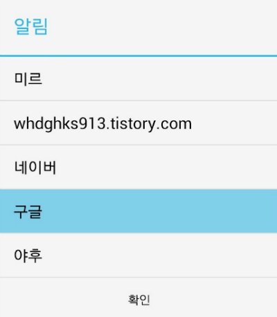

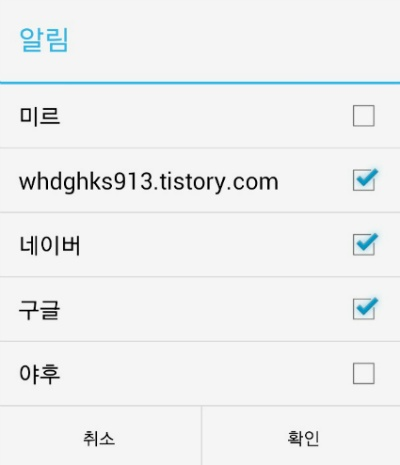

마지막 구글 ","이 걸리긴 하지만 모든 소스가 잘 작동하는 것을 확인할수 있습니다^^

이번에는 조금 정신없이 배워봤는데요

정리하자면

setView를 이용하여 다양하게 알림을 추가할수 있다

리스트, 라디오버튼, 체크박스를 이용한 알림을 띄울수 있다

라는 두문장으로 정리됩니다^^

이번 내용은 좀 어렵기도 하고 강좌 시간도 두시간에서 세시간이 넘어가는듯 합니다

어려운거 있으시면 알려주세요~

[ExampleCustomAlert.zip

다운로드](./file/ExampleCustomAlert.zip)

---

## 첨부파일

- [ExampleCustomAlert.zip](https://github.com/itmir913/archive/releases/download/itmir-attachments/ExampleCustomAlert.zip) `1.3 MB`
