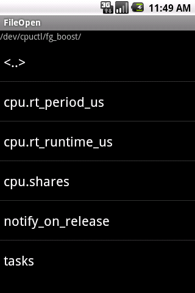

간단하게 파일과 폴더를 읽고, 경로를 확인할수 있는 탐색기 예제를 찾았습니다

저 나름대로 약간 수정을 해서 기초를 다졌기에 포스팅 해봅니다

출처 : <http://ryulib.tistory.com/90>

처음버전

[FileExplorer.zip](./file/FileExplorer.zip)

새폴더 생성 추가

[FileExplorer\_AddFolder.zip](./file/FileExplorer_AddFolder.zip)

원본글

## [파일 탐색기 클래스 - FileList](http://ryulib.tistory.com/90)

안드로이드에서는 기본으로 제공하는 Delphi의 TOpenDialog 라이브러리가 없습니다.  따라서, 스스로 만들어서 해결해야 하는데, 검색된 소스나 방법들이 제 마음에 들지 않아 아래와 같이 만들어 봤습니다.  (급조한 것이기 때문에 아직 부족한 점이 많습니다.)

일단 지정된 Path 안에 있는 폴더와 파일의 목록을 보여주는 FileList 클래스를 만들어 봤습니다.  그리고, 사용법은 [소스 1]과 같습니다.  

[소스 1]

`01.``package` `app.main;`

`02.`

`03.``import` `android.app.Activity;`

`04.``import` `android.os.Bundle;`

`05.``import` `android.widget.LinearLayout;`

`06.``import` `android.widget.TextView;`

`07.`

`08.``public` `class` `Main` `extends` `Activity {`

`09.``/** Called when the activity is first created. */`

`10.``@Override`

`11.``public` `void` `onCreate(Bundle savedInstanceState) {`

`12.``super``.onCreate(savedInstanceState);`

`13.``setContentView(R.layout.main);`

`14.`

`15.``FileList _FileList =` `new` `FileList(``this``);`

`16.``_FileList.setOnPathChangedListener(_OnPathChanged);`

`17.``_FileList.setOnFileSelected(_OnFileSelected);`

`18.`

`19.``LinearLayout layout = (LinearLayout) findViewById(R.id.LinearLayout01);`

`20.``layout.addView(_FileList);`

`21.`

`22.``_FileList.setPath(``"/"``);`

`23.``_FileList.setFocusable(``true``);`

`24.``_FileList.setFocusableInTouchMode(``true``);`

`25.`

`26.``}`

`27.`

`28.``private` `OnPathChangedListener _OnPathChanged =` `new` `OnPathChangedListener() {`

`29.``@Override`

`30.``public` `void` `onChanged(String path) {`

`31.``((TextView) findViewById(R.id.TextView01)).setText(path);`

`32.``}`

`33.``};`

`34.`

`35.``private` `OnFileSelectedListener _OnFileSelected =` `new` `OnFileSelectedListener() {`

`36.``@Override`

`37.``public` `void` `onSelected(String path, String fileName) {`

`38.``// TODO`

`39.``}`

`40.``};`

`41.`

`42.``}`

15: FileList 클래스는 ListView를 상속받아서 확장하였습니다.  layout.xml을 통해서 사용 할 수도 있지만, 쉽게 코드를 읽을 수 있도록 동적 생성하였습니다.

FileList는 두 종류의 이벤트를 지원하고 있습니다.

OnPathChangedListener는 표시하고 있는 폴더가 변경되면 해당 폴더의 전체 Path를 알려줍니다.  28-33: 라인은 OnPathChangedListener 인터페이스의 멤버 메소드를 구현 한 것 입니다.

OnFileSelected는 파일을 선택 했을 경우, 선택된 파일과 파일이 속해있는 폴더의 전체 Path를 알려줍니다.  35-40: 라인은 OnFileSelected 인터페이스의 멤버 메소드를 구현 한 것 입니다.

22: FileList의 setPath(String path) 메소드는 지정된 경로(path) 안에 있는 폴더와 파일 목록을 표시 합니다.

32: TextView를 통해서 경로(path)명이 변경 될 때마다 표시하고 있습니다.

38: 라인에는 파일이 선택되었을 경우 실행하고자 하는 코드를 작성하시면 됩니다.

아래의 FileList 클래스의 소스는 [소스 2]와 같습니다.

[소스 2]

`001.``package` `app.main;`

`002.`

`003.``import` `java.io.File;`

`004.``import` `java.io.IOException;`

`005.``import` `java.util.ArrayList;`

`006.``import` `java.util.Collections;`

`007.`

`008.``import` `android.content.Context;`

`009.``import` `android.util.AttributeSet;`

`010.``import` `android.view.View;`

`011.``import` `android.widget.AdapterView;`

`012.``import` `android.widget.ArrayAdapter;`

`013.``import` `android.widget.ListView;`

`014.`

`015.``public` `class` `FileList` `extends` `ListView {`

`016.`

`017.``public` `FileList(Context context, AttributeSet attrs,` `int` `defStyle) {`

`018.``super``(context, attrs, defStyle);`

`019.`

`020.``init(context);`

`021.``}`

`022.`

`023.``public` `FileList(Context context, AttributeSet attrs) {`

`024.``super``(context, attrs);`

`025.`

`026.``init(context);`

`027.``}`

`028.`

`029.``public` `FileList(Context context) {`

`030.``super``(context);`

`031.`

`032.``init(context);`

`033.``}`

`034.`

`035.``private` `void` `init(Context context) {`

`036.``_Context = context;`

`037.``setOnItemClickListener(_OnItemClick);`

`038.``}`

`039.`

`040.``private` `Context _Context =` `null``;`

`041.``private` `ArrayList<String> _List =` `new` `ArrayList<String>();`

`042.``private` `ArrayList<String> _FolderList =` `new` `ArrayList<String>();`

`043.``private` `ArrayList<String> _FileList =` `new` `ArrayList<String>();`

`044.``private` `ArrayAdapter<String> _Adapter =` `null``;`

`045.`

`046.``// Property`

`047.``private` `String _Path =` `""``;`

`048.`

`049.``// Event`

`050.``private` `OnPathChangedListener _OnPathChangedListener =` `null``;`

`051.``private` `OnFileSelectedListener _OnFileSelectedListener =` `null``;`

`052.`

`053.``private` `boolean` `openPath(String path) {`

`054.``_FolderList.clear();`

`055.``_FileList.clear();`

`056.`

`057.``File file =` `new` `File(path);`

`058.``File[] files = file.listFiles();`

`059.``if` `(files ==` `null``)` `return` `false``;`

`060.`

`061.``for` `(``int` `i=``0``; i<files.length; i++) {`

`062.``if` `(files[i].isDirectory()) {`

`063.``_FolderList.add(``"<"` `+ files[i].getName() +` `">"``);`

`064.``}` `else` `{`

`065.``_FileList.add(files[i].getName());`

`066.``}`

`067.``}`

`068.`

`069.``Collections.sort(_FolderList);`

`070.``Collections.sort(_FileList);`

`071.`

`072.``_FolderList.add(``0``,` `"<..>"``);`

`073.`

`074.``return` `true``;`

`075.``}`

`076.`

`077.``private` `void` `updateAdapter() {`

`078.``_List.clear();`

`079.``_List.addAll(_FolderList);`

`080.``_List.addAll(_FileList);`

`081.`

`082.``_Adapter =` `new` `ArrayAdapter<String>(_Context, android.R.layout.simple_list_item_1, _List);`

`083.``setAdapter(_Adapter);`

`084.``}`

`085.`

`086.``public` `void` `setPath(String value) {`

`087.``if` `(value.length() ==` `0``) {`

`088.``value =` `"/"``;`

`089.``}` `else` `{`

`090.``String lastChar = value.substring(value.length()-``1``, value.length());`

`091.``if` `(lastChar.matches(``"/"``) ==` `false``) value = value +` `"/"``;`

`092.``}`

`093.`

`094.``if` `(openPath(value)) {`

`095.``_Path = value;`

`096.``updateAdapter();`

`097.``if` `(_OnPathChangedListener !=` `null``) _OnPathChangedListener.onChanged(value);`

`098.``}`

`099.``}`

`100.`

`101.``public` `String getPath() {`

`102.``return` `_Path;`

`103.``}`

`104.`

`105.``public` `void` `setOnPathChangedListener(OnPathChangedListener value) {`

`106.``_OnPathChangedListener = value;`

`107.``}`

`108.`

`109.``public` `OnPathChangedListener getOnPathChangedListener() {`

`110.``return` `_OnPathChangedListener;`

`111.``}`

`112.`

`113.``public` `void` `setOnFileSelected(OnFileSelectedListener value) {`

`114.``_OnFileSelectedListener = value;`

`115.``}`

`116.`

`117.``public` `OnFileSelectedListener getOnFileSelected() {`

`118.``return` `_OnFileSelectedListener;`

`119.``}`

`120.`

`121.``public` `String DelteRight(String value, String border) {`

`122.``String list[] = value.split(border);`

`123.`

`124.``String result =` `""``;`

`125.`

`126.``for` `(``int` `i=``0``; i<list.length; i++) {`

`127.``result = result + list[i] + border;`

`128.``}`

`129.`

`130.``return` `result;`

`131.``}`

`132.`

`133.``private` `String delteLastFolder(String value) {`

`134.``String list[] = value.split(``"/"``);`

`135.`

`136.``String result =` `""``;`

`137.`

`138.``for` `(``int` `i=``0``; i<list.length-``1``; i++) {`

`139.``result = result + list[i] +` `"/"``;`

`140.``}`

`141.`

`142.``return` `result;`

`143.``}`

`144.`

`145.``private` `String getRealPathName(String newPath) {`

`146.``String path = newPath.substring(``1``, newPath.length()-``1``);`

`147.`

`148.``if` `(path.matches(``".."``)) {`

`149.``return` `delteLastFolder(_Path);`

`150.``}` `else` `{`

`151.``return` `_Path + path +` `"/"``;`

`152.``}`

`153.``}`

`154.`

`155.``private` `AdapterView.OnItemClickListener _OnItemClick =` `new` `AdapterView.OnItemClickListener() {`

`156.``@Override`

`157.``public` `void` `onItemClick(AdapterView<?> arg0, View arg1,` `int` `position,`

`158.``long` `id) {`

`159.``String fileName = getItemAtPosition(position).toString();`

`160.``if` `(fileName.matches(``"<.*>"``)) {`

`161.``setPath(getRealPathName(fileName));`

`162.``}` `else` `{`

`163.``if` `(_OnFileSelectedListener !=` `null``) _OnFileSelectedListener.onSelected(_Path, fileName);`

`164.``}`

`165.``}`

`166.``};`

`167.`

`168.``}`

제가 지금 작성하는 어플리케이션의 경우에는 파일을 선택하는 것은 중요한 요소는 아니기 때문에 위에 있는 정도면 충분하여 우선은 여기까지만 작성 해 봅니다.  추후, 다른 용도가 생기면 개선하여 다시 올리도록 하겠습니다.

마지막으로 위의 예제에서 사용된 layout/main.xml은 아래와 같습니다.

[소스 3]

`01.``<?xml version=``"1.0"` `encoding=``"utf-8"``?>`

`02.``<LinearLayout xmlns:android=``"http://schemas.android.com/apk/res/android"`

`03.``android:id=``"@+id/LinearLayout01"`

`04.``android:orientation=``"vertical"`

`05.``android:layout_width=``"fill_parent"`

`06.``android:layout_height=``"fill_parent"`

`07.``>`

`08.`

`09.``<TextView`

`10.``android:text=``"@+id/TextView01"`

`11.``android:id=``"@+id/TextView01"`

`12.``android:layout_width=``"wrap_content"`

`13.``android:layout_height=``"wrap_content"`

`14.``>`

`15.``</TextView>`

`16.`

`17.``</LinearLayout>`

첨부파일에 전체 소스가 있습니다.  위에서 설명하지 않은 인터페이스의 경우에는 첨부파일을 참고하시기 바랍니다.

[FileOpen.zip](./file/FileOpen.zip)

---

## 첨부파일

- [FileExplorer.zip](https://github.com/itmir913/archive/releases/download/itmir-attachments/FileExplorer.zip) `1.1 MB`
- [FileExplorer_AddFolder.zip](https://github.com/itmir913/archive/releases/download/itmir-attachments/FileExplorer_AddFolder.zip) `1.1 MB`
- [FileOpen.zip](https://github.com/itmir913/archive/releases/download/itmir-attachments/FileOpen.zip) `12 KB`
