드디어 ㅎㅎ

Unpack Repack img어플이 완성되었습니다 ㅎㅎ

이번 업데이트는 엄청나게 많은 업데이트가 이루어 졌습니다

일단 가장 큰 업데이트는 바로 리팩 기능 추가인대요

이를 위해 UI를 뜯어 고쳤습니다

Tab을 만들어서 깔끔함을 해치지 않고 바로 이동이 쉽도록 구현하였습니다 ㅎㅎ

스크린샷 보겠습니다

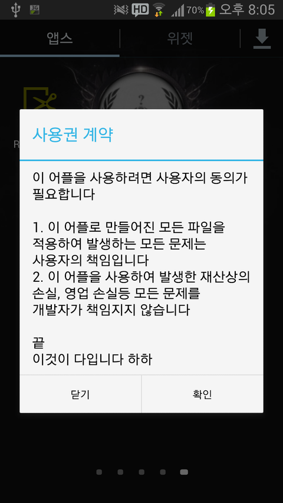

사용권 계약이라고 이름을 거창하게 했지만

아무튼 동의가 있어야 합니다

왜냐면 리팩이라는게 잘못되면 벽돌의 위험이 있기에

**"이 어플이 만들어낸 img파일을 사용할경우 모든 책임은 사용자에게 있고, fastboot boot를 이용하여 테스트 해보세요"**

라는것을 각인시켜야 합니다

물론 동의 안하면 못넘어 가고요 ㅎㅎㅎㅎㅎ  
  

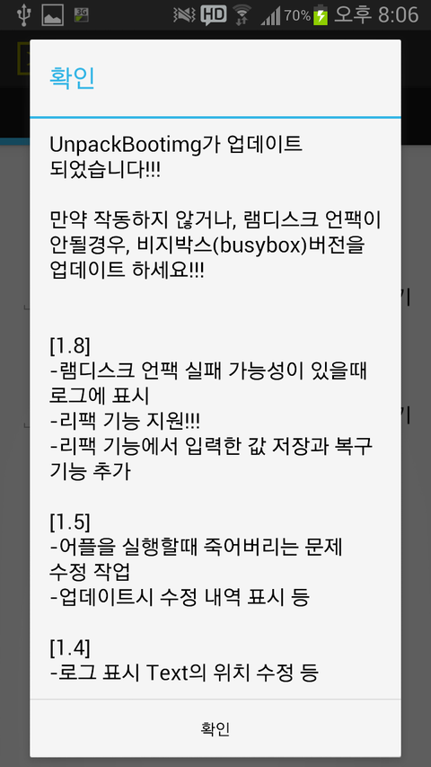

업데이트시 표시됩니다

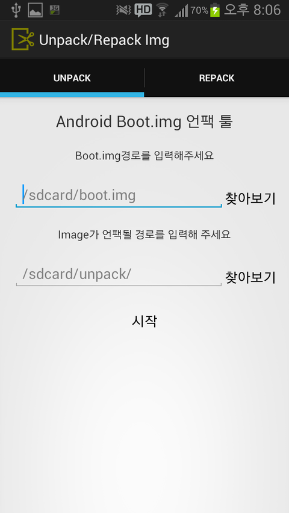

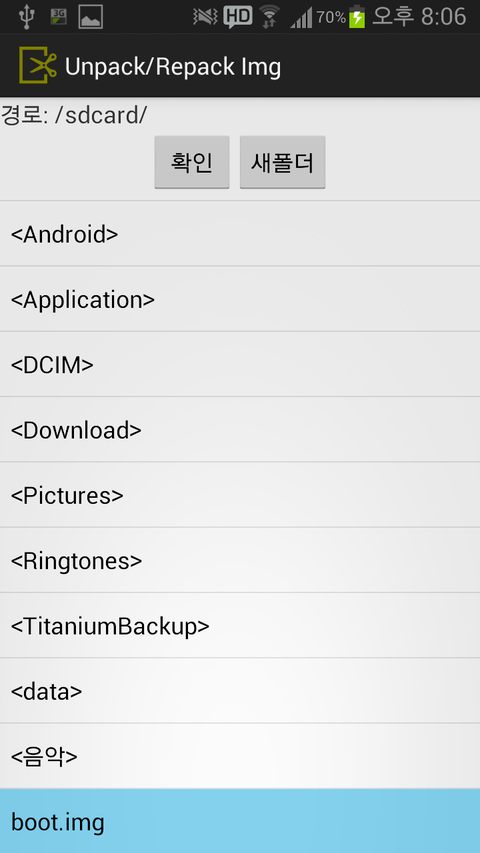

전버전 부터 추가된 부분

파일 탐색기를 추가하여 쉽게 경로를 찾을수 있습니다  
  

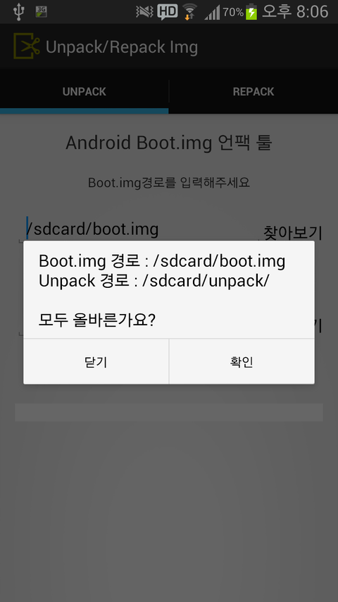

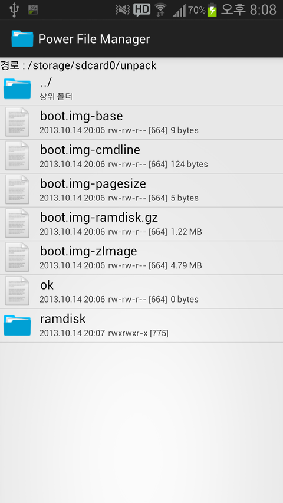

간접광고(?)랄까나...

아무튼 잘 풀립니다 ㅎㅎ

저기 있는 ok파일은 램디스크폴더안에도 있습니다

저건 어플이 "잘됬나?"를 테스트 하기 위한 파일입니다 ㅎㅎ  
  

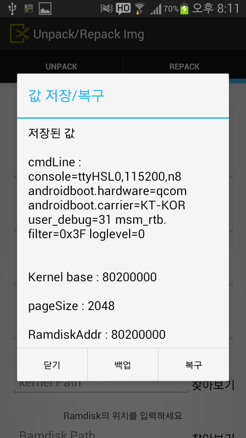

  
  
토요일(?), 어제(?) 말씀드린것 대로 백업과 복구가 가능합니다

cmdline같은거 외우고 다니는 분 없으므로(!)

일일히 치기 귀찮으실까봐 백업기능도 만들어 뒀습니다  
  

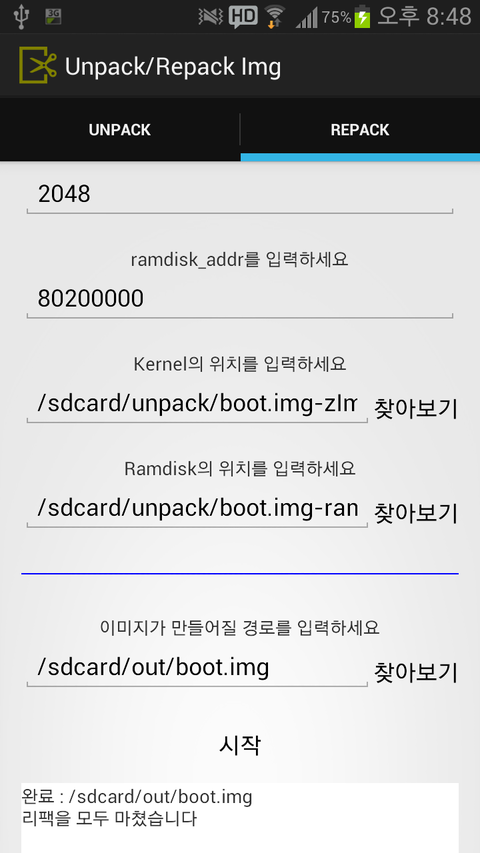

  
  
참고로 ramdisk\_addr 값을 입력하기 위해서는 메뉴키를 눌러 활성화가 필요합니다

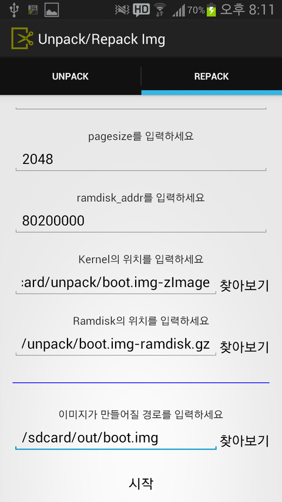

확인 작업

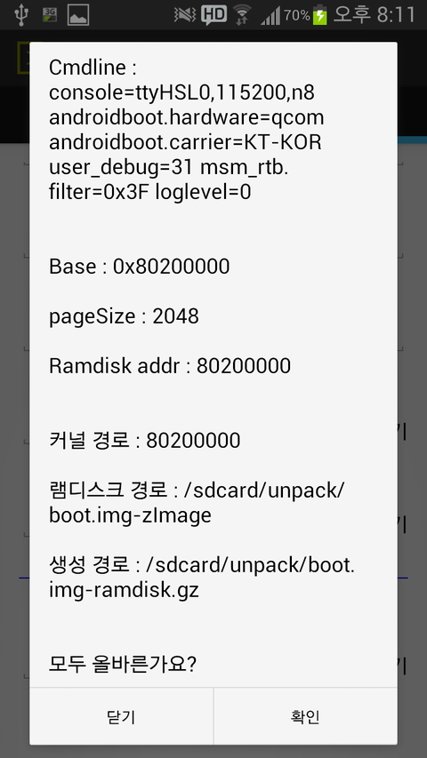

/sdcard/out/boot.img가 생겼다면 저런 문구가 나오고요

안생겼다면 다시한번 루트권한을 사용하여 시도합니다

즉 루트권한을 요구한다면, 두번째 시도인거죠

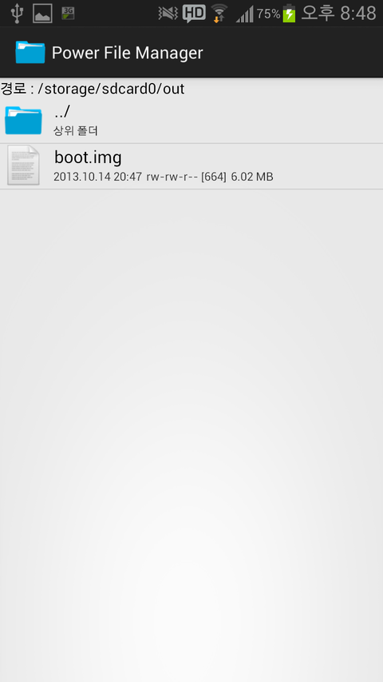

이렇게 파일이 생성되었습니다

아무튼 힘드네요 ㅎㅎ...

그럼 저는 이만 가봅니다

그리고 지금 업데이트 했으니 약 **3시간 뒤**에 **1.8 업데이트**가 나타납니다

지금은 다운받으셔도 소용이....

<https://play.google.com/store/apps/details?id=com.leejonghwan.unpackbootimg>
