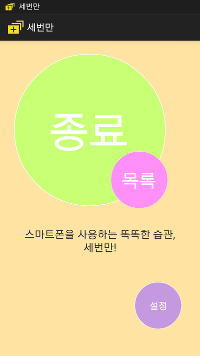
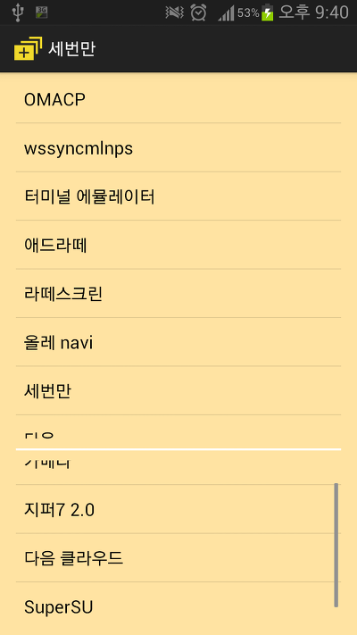
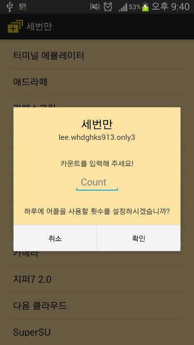
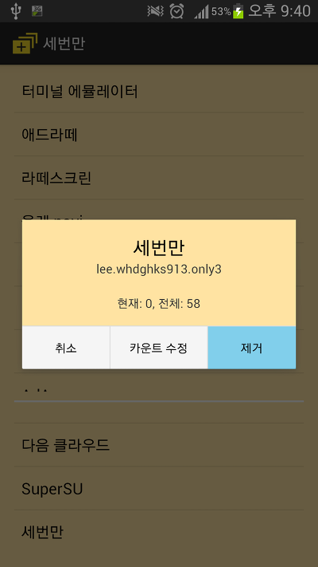
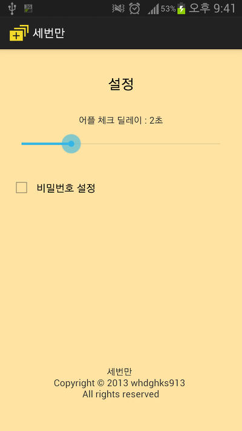
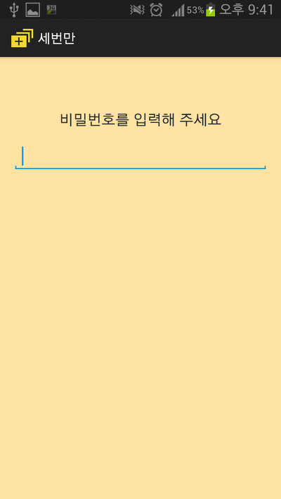
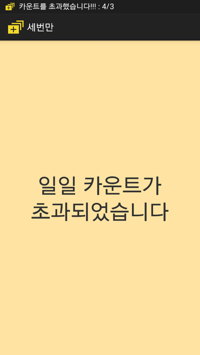
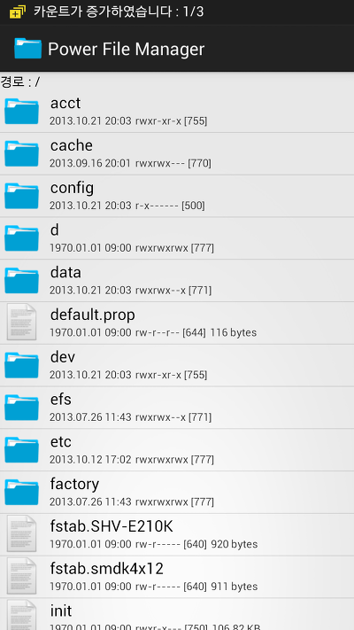

저번주 수요일부터 비밀스럽게(?) 만들고 있던 어플이 오늘에서야 드디어 완성되었습니다 ㅎㅎㅠㅠ

주말동안 시골에 가있어서 작업을 못했으므로 총 5일정도의 재작기간이 소요되었네요 ㅎ...

이번에 제가 만든 어플은 세번만 이라는 어플입니다!!

일종의 "스마트폰 중독방지" 어플입니다

기존 스마트폰 중독방지어플의 경우

일정시간동안 모든 어플의 사용을 제한하는 어플이었습니다

(또는 특정 시간 제한등)

이 세번만 어플은 하루에 어플을 총 몇번만 실행할수 있도록 설계되었습니다

만약 제가 "설정" 어플을 하루에 10번만 실행하고 싶으시다면

카운트를 10으로 설정하고 서비스를 시작하면 됩니다 ㅎ

설정어플을 실행할때마다 카운트가 증가하며, 전체 카운트 10이 넘어가면 그날은 더이상 실행을 할수 없도록 막아버립니다

이렇게 무조건 어플 실행을 막지 않고 몇번만 실행이 가능하도록 제한이 가능한 점이 가장큰 특징입니다!!

또한 비밀번호 설정과, 부팅시 자동적용, 설정한 시간(예를들어 5분)마다 알려주는 기능까지

똑똑한 기능을 많이 가지고 있습니다 ㅎㅎ

이제부터는 세번만 어플을 통해 어플실행 횟수와 중독을 효과적으로 관리해 보세요!!

<https://play.google.com/store/apps/details?id=lee.whdghks913.only3>

현재 마켓에 올라와 있는 상태이며, 약 3시간 뒤에 나타나는 1.1 업데이트를 꼭 해주시면 감사드리겠습니다!!!
