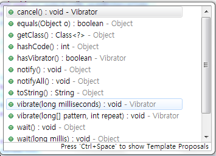
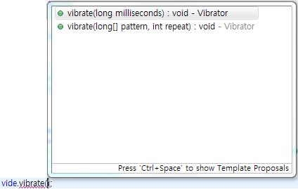
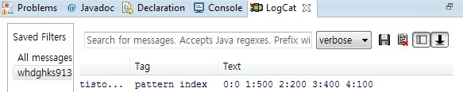

안녕하세요

19번대 강좌네요 ㅎ...

허... 벌서 19번이라니; 20번대 강좌부터는 조금 복잡한 쓰래드랑 핸들러같은 "소스"위주로 배울 예정입니다

아무튼 이번 강좌는 쉽습니다 ㅎㅎ

## 19. 어플에서 진동을 사용하는 2가지 방법

### 19-1 강좌를 시작하기 전에..

이 강좌를 통해 알수 있는점은 다음과 같습니다

- 진동을 울리는 방법

- 패턴을 넣은 진동

매우 심플한 소스(약 4줄)이므로 강좌만 보면 바로 짤수 있습니다

그리고 당부의 말씀 드립니다

절대로 예제소스 따라하지 마세요

예제는 어려움에 처했을때만 아 이렇게 해야 하구나~ 하는겁니다

예제 따라하면 무엇보다 실력이 안늘어요

그리고 모바일말고 PC로(또는 PC버전)으로 감상 부탁드립니다~

### 19-2 2가지 방법? 왜 2가지이죠?

제목에서 진동을 사용하는대는 방법에는 2가지가 있다고 했습니다

왜 2가지 일까요?

대부분의 강좌에서는 진동을 사용하는 방법을 1가지만 알려줍니다

그러나 API를 보면 크게 2가지로 알수 있습니다

진동은 다음과 같은 코드를 사용할수 있습니다

vibrate는 두가지 소스가 있죠

대부분의 강좌에서 나왔듯이 먼저는 그냥 진동만 울리는 방법입니다

또하나는 진동에 패턴을 주는 방법입니다

예를들면 윙~ ..... 위이이이잉~ .... 윙~

이런씩으로 말이죠

### 19-3 레아아웃편

이번 레이아웃도 저번 강좌와 마찬가지로 심플합니다

버튼 2개만 만들어 주시고 각각 버튼에 다른 onClick속성을 주시길 바랍니다

<Button

    android:id="@+id/button1"

    android:layout\_width="wrap\_content"

    android:layout\_height="wrap\_content"

    android:layout\_alignParentTop="true"

    android:layout\_centerHorizontal="true"

    android:layout\_marginTop="50dp"

    android:onClick="Vibrator\_basic"

    android:text="일반 진동" />

<Button

    android:id="@+id/button2"

    android:layout\_width="wrap\_content"

    android:layout\_height="wrap\_content"

    android:layout\_alignLeft="@+id/button1"

    android:layout\_below="@+id/button1"

    android:layout\_marginTop="20dp"

    android:onClick="Vibrator\_pattern"

    android:text="패턴 진동" />

(그대로 따라하지 말라고 빨간색으로 했습니다 직접 짜는 연습을 하세요)

레이아웃 끝~

### 19-4 자바 소스편

이번에는 소스가 매우 심플합니다

처음에 정의할 소스는 한줄입니다

Vibrator vide;

Vibrator는 안드로이드에서 진동을 담당하는 객체입니다 (객체라 하는게 맞나요?)

onCreate() 메소드 안에는 다음 한줄을 추가해 주세요

vide = (Vibrator) getSystemService(Context.VIBRATOR\_SERVICE);

진동은 시스탬 서비스의 한 종류 이므로 이렇게 바로 불러오는 것만으로도 바로 사용이 가능합니다

사전 작업은 모두 마쳤습니다

이제 Vibrator의 사용법을 알아볼까 합니다

첫번째 일반 진동버튼에 정의된 onClick은 Vibrator\_basic이므로 메소드 이름을 Vibrator\_basic으로 만들어 봅시다

public void Vibrator\_basic(View v){

}

10번 초반강좌에서 배웠던 방법, Button의 onClick사용은 너무 자주 쓰이니 꼭 숙지해 주세요

물론 리스너도 많이 쓰입니다

저 메소드 안에다가 "한줄만" 추가해 봅시다

vide.vibrate(1000);

자, 일반 진동버튼 구현이 끝났습니다 ?!?!?!?!?!?!

위에서 말한대로 진동은 너무나도 쉽습니다 (20번 강좌부터 Thread등 어려우니 그전에 쉬운거 하나 하는거예요 ㅎㅎ)

vide.vibrate(1000);가 실행되면 진동을 울려줍니다

그안에 있는 숫자 1000이 궁금하시죠?

이렇게 괄호 ()안에 커서를 올리고 컨트롤+스페이스를 누르면 뭐가 들어갈수 있는지 나옵니다

저기 보시면 millisecond라고 되어 있네요

그림처럼 밀리세컨드 초(millisecond)로 사용해 주시면 되는대...

밀리세컨드 초란? 시간의 단위인데요 1초가 1000밀리세컨드초 입니다

즉 1000=1초, 2000=2초 이렇게 외우시면 됩니다

**안드로이드에서 정밀한 숫자를 위해 자주 쓰이는 숫자 단위이니 꼭 숙지해 두세요**

[미르의 팁] (요즘 너무 팁이 안나오긴 한대...)

Q. 밀리 세컨드가 언제 나오나요?

A. 20번대나 30번대 강좌에서 배울예정인 알람(일정 시간후에 실행하기)과, Thread.sleep등 자주 쓰입니다

꼭 숙지하세요

그다음 두번째 버튼의 onClick은 Vibrator\_pattern입니다 그러므로 이름이 Vibrator\_pattern인 메소드를 만들어 봅시다

public void Vibrator\_pattern(View v){

}

이 메소드에는 두줄만 들어가면 끝입니다

long[] pattern = { 0, 500, 200, 400, 100 };

vide.vibrate(pattern, -1);

엌ㅋㅋㅋㅋㅋㅋㅋㅋㅋㅋㅋㅋㅋㅋㅋㅋㅋㅋ 너무 간단하죠?

그런데 이것은 설명이 조금 복잡합니다

먼저 윗줄부터 설명해 보겠습니다

이것은 long형 배열입니다

이렇게 진동에 패턴을 넣을수 있는데요

각 숫자의 의미에 대해 알아봅시다

첫번째 0은 **시작시간**입니다 지연된 시작을 하려면 0이 아니라 다른 값을 넣으십시오 0은 즉시 시작 입니다

두번째 값은 **진동이 울릴 시간**입니다 500은 0.5초(1000=1초)이므로 0.5초간 진동이 울립니다

세번째 값은 **진동을 쉴 시간**입니다 200은 0.2초이므로 0.2초간 진동이 울리지 않습니다

네번째 값은 두번째 값과 같습니다

다섯번째 값은 세번째 값과 같습니다

이렇게 게속 패턴을 만들수 있습니다

예를 들어 지연된 시작(1초), 진동(2초), 쉼(5초), 진동(1초), 쉼(1초), 진동(5초), 쉼(1초)......

는 long[] pattern = { 1000, 2000, 5000, 1000, 1000, 5000, 1000 }; 입니다

배열은 원하시는 대로 많이 만드시면 됩니다

두번째줄을 알아보겠습니다

vide.vibrate(pattern, -1);은 원리가 간단한대 이해를 위해서는 선행 지식이 필요합니다

저 괄호에 첫번째로 들어가는 pattern은 아까 위에서 설명한 long형 배열입니다

배열을 집어넣는거죠

두번째 숫자 -1은 반복에 관련된 숫자인데요

이부분에서 선행지식이 필요합니다

-1(음수)은 1번 반복 하겠다는 뜻입니다

구글 개발자 사이트 원문 : the index into pattern at which to repeat, or -1 if you don't want to repeat.

즉 0과 양수를 넣으면 long[]에서 index부터 시작하겠다는 뜻이 됩니다

예를 들면 vide.vibrate(pattern, 2); 로 하게 되면

56줄(long[])에서 index 2번값은 "200"입니다

그러므로 200, 400, 100만 무한 반복이 됩니다

또 예를 들면 vide.vibrate(pattern, 3); 로 하게 되면

56줄(long[])에서 index 3번값은 "400"입니다

그러므로 400, 100만 무한 반복이 됩니다

무한 반복을 종료하려면 vide.cancel();을 사용하면 됩니다

이 상자를 이해하기 위해서는 index값이라는 선행지식이 필요합니다

index값이란? 배열에서 쓰이는 값인데요

아까 배운 long[] pattern = { 0, 500, 200, 400, 100 };과 관련이 있습니다

|  |  |  |  |  |  |  |
| --- | --- | --- | --- | --- | --- | --- |
| index값 | 0 | 1 | 2 | 3 | 4 |  |
| long[] pattern = { | 0, | 500, | 200, | 400, | 100, | }; |

위 표를 보시면 이해가 쉬우실듯 합니다

index값을 가져오는 방법은 []안에 가져올 값을 넣으면 됩니다

예를들면 pattern[3]이렇게요

로그로 확인해 볼까요?

Log.d("pattern index", "0:"+pattern[0]+" 1:"+pattern[1]+" 2:"+pattern[2]+" 3:"+pattern[3]+" 4:"+pattern[4]);

이렇게 index값이 이해가 잘 되셨을듯 합니다

이해가 되셨으면 위의 회색박스를 다시 읽어주세요

그럼 뭔말인지 아실겁니다

마지막으로 Androidmanifest.xml에 아래 권한을 추가해 주세요

<uses-permission android:name="android.permission.VIBRATE" />

자! 이제 끝났습니다~

정작 배운코드는 3~4줄이 안되지만 설명은 좀 길었습니다

아무튼 이렇게 진동을 마스터 하셨음이라 믿고 저는 이만 가봅니다~

이 강좌의 예제소스는 20번 강좌가 나오는 즉시 업로드 됩니다

카페에서는 원본글에서만 다운로드가 가능합니다

예제소스 다운로드 :

[ExampleVibration.zip](./file/ExampleVibration.zip)

---

## 첨부파일

- [ExampleVibration.zip](https://github.com/itmir913/archive/releases/download/itmir-attachments/ExampleVibration.zip) `1.2 MB`
