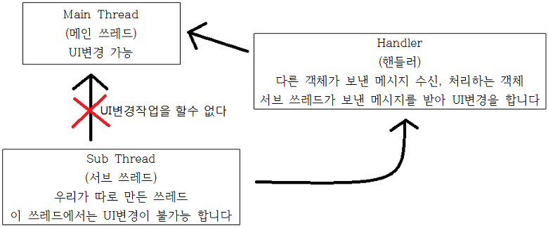
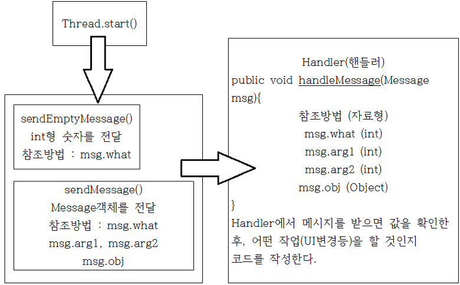
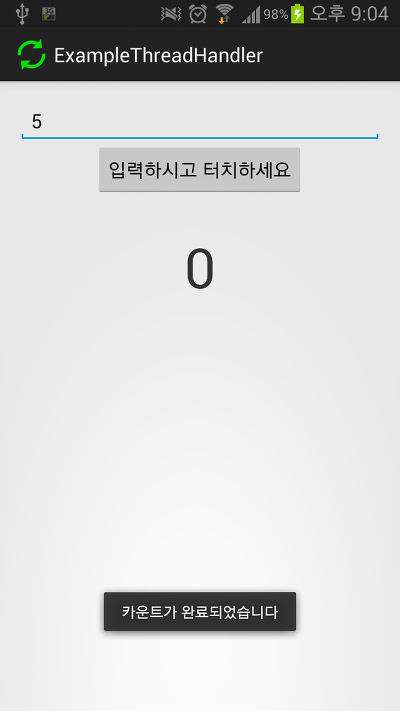

> 쓰레드와 핸들러를 이용하여 구현하는 것보다 AsyncTask를 사용하는것이 더 효율적입니다.
>
> AsyncTask에 관한 예제를 포스팅 했으므로, 이 글을 읽고 Thread와 Handler를 이용해서 작업하시기보다
>
> 안드로이드에서 제공하는 AsyncTask를 이용해서 구현하시길 바랍니다.
>
> AsyncTask에 관한 글 바로가기 : [[Development/App] - #34 AsyncTask를 사용해보자](http://itmir.tistory.com/624)

20번대 강좌입니다 ㅎㅎ

이번강좌부터는 대부분 소스위주로 볼 예정입니다

UI구성, 즉 xml은 언급없이 지나갈수 있습니다

**꼭 PC버전, 그리고 원본글(티스토리)에서 봐주세요 (각주: 글양식과 지원기능 차이로 가독성이 매우 떨어집니다) ㅠㅠ**

## 20. 쓰레드(Thread)와 핸들러(Handler)

### 20-1 쓰레드와 핸들러란?

네이버 지식백과에서는 쓰레드를 아래와 같이 정의하고 있습니다

> 컴퓨터 프로그램 수행 시 프로세스 내부에 존재하는 수행 경로, 즉 일련의 실행 코드. 프로세스는 단순한 껍데기일 뿐, 실제 작업은 스레드가 담당한다. 프로세스 생성 시 하나의 주 스레드가 생성되어 대부분의 작업을 처리하고 주 스레드가 종료되면 프로세스도 종료된다. 하나의 운영 체계에서 여러 개의 프로세스가 동시에 실행되는 환경이 멀티태스킹이고, 하나의 프로세스 내에서 다수의 스레드가 동시에 수행되는 것이 멀티스레딩이다.

위 말을 풀어서 제 나름대로 해석하면 아래와 같습니다

> 프로그램을 실행할때, 프로그램안에 존재하는 실행 코드들이다

그런데 우리는 쓰레드를 처음 접하는것이 아닙니다

전에 프로그레스바 예제등을 통해 한 두번 접해보았습니다

그리고 우리는 쓰레드를 처음 사용하는것도 아닙니다

왜냐? 어플을 실행하면 처음에 메인 쓰레드라는것이 생기기 때문입니다

이 메인 쓰레드는 안드로이드에서 우리가 함부로 접근이 불가능 하게 막아뒀습니다

또한 메인 쓰레드에서만 UI를 변경할수 있습니다

안정성을 위함이라 하는데... 아무튼 쓰레드에 대한 기본 지식은 여기까지 알아두셔도 됩니다

쓰레드는 반복작업같은 것을 주로 하는데요

위에서 메인 쓰레드만 UI변경이 가능하다고 했습니다

우리가 만든 쓰레드에서는 UI변경이 불가능, 즉 **화면을 바꾸는 어떠한 일도 할수 없****습니다 (각주: setText같이 화면을 표시하는 UI를 변경하는 것이 서브 쓰레드로는 불가능 합니다)**

그래서 등장한것이 핸들러 입니다

이런 관계를 가진다고나 할까요?

이번 예제에서는 이 쓰레드와 핸들러 사용법에 관해 아주 기초적인 지식만 알고 넘어가도록 하겠습니다

(더 자세한 지식은 저도 더 배워야 하고 좀 지난뒤에 심화로 나가면 되죠 ㅎ)

### 20-2 이번에 만들 예제는 어떤 예제 인가요?

저는 이 강좌를 구상할때 카운트 다운을 한번 해볼까 했습니다

그래서 이번에는 숫자를 입력하고, 버튼을 누르면 위에있는 TextView에 카운트 다운이 되도록 해볼까 (각주: 이번에 만들 예제에는 초기 버전이므로 버그가 많습니다
그러나 이 강좌의 목적을 설명하기에는 충분하므로 따로 언급이나 수정을 하지 않을 생각입니다
예:int변수가 나타낼수 있는 값보다 큰 숫자를 입력하면 강제종료 된다
어플을 껐다 키면 초기화 된다 등) 합니다

이 강좌를 잘 보면 당신도 멀쩡한 카운트 다운 어플을 만들어 배포할수 있을겁니다 ^^

### 20-3 레이아웃은 어떻게 구성할까요?

저만 그런진 몰라도 저는 일단 어떻게 어플을 만들까 라는 아이디어가 생각나면 직관적으로 레이아웃이 떠오르더라고요 +\_+

레이아웃은 아무렇게나 짜도 되지만 꼭 EditText, Button, TextView로 짜주시고, TextView의 글자를 없애주세요

(사실 매번 강좌쓸때마다 예제를 어떻게 만들까를 강좌 쓰면서 생각하지요 -\_-)

<EditText

    android:id="@+id/EditText"

    android:layout\_width="match\_parent"

    android:layout\_height="wrap\_content"

    android:layout\_alignParentTop="true"

    android:layout\_centerHorizontal="true"

    android:inputType="number" >

    <requestFocus />

</EditText>

<Button

    android:id="@+id/Button"

    android:layout\_width="wrap\_content"

    android:layout\_height="wrap\_content"

    android:layout\_below="@+id/EditText"

    android:layout\_centerHorizontal="true"

    android:onClick="Button\_Click"

    android:text="입력하시고 터치하세요" />

<TextView

    android:id="@+id/Count\_TextView"

    android:layout\_width="wrap\_content"

    android:layout\_height="wrap\_content"

    android:layout\_below="@+id/Button"

    android:layout\_centerHorizontal="true"

    android:layout\_marginTop="30dp"

    android:textSize="50dp" />

저는 이렇게 짰습니다 ㅎㅎ

### 20-4 자바소스로 넘어와 주세요

먼저 맨날 하던거 해봅시다

EditText EditText;

TextView Count\_TextView;

Button Button;

int inputNumber;

마지막 int inputNumber은 입력한 숫자를 저장할 변수를 설정하는 것입니다 입력한 값을 저장하기 위한 코드입니다

프로그래머는 변수를 최소한으로 사용해서 메모리 공간을 절약해야 할것입니다

예를 들면 String같은건 엄청나게 많은 메모리를 잡아먹습니다 ㅎ...

프로그래밍 하면서 가장 중요한것은

가장 적게 메모리를 먹고, 가장 빠르게 작동하고, 불필요한 소스가 없는 상태로 만드는것임을 꼭 기억해 주세요!!!

적은 메모리 점유율도 중요하지만 목적에 따라 적합한 방법을 사용해야 합니다

예를들면 int형 변수의 최대 표현 범위를 벗어나는 숫자는 long을 이용한다든지 말이죠 (Thanks for showcan2000)

--참조--

[2013/02/20 - [Development/Java] - 자료형을 기반으로 메모리 공간에 저장되는 상수!](http://itmir.tistory.com/153)

[2013/02/20 - [Development/Java] - 변수와 자료형이란?!](http://itmir.tistory.com/151)

자 이제 id값을 연결해 봅시다

EditText = (EditText) findViewById(R.id.EditText);

Count\_TextView = (TextView) findViewById(R.id.Count\_TextView);

Button = (Button) findViewById(R.id.Button);

마지막으로 버튼을 눌렀을때 어떤 작업을 할지 메소드를 만들어 줘야합니다

전에 많이 만든것처럼 이름이 Button\_Click인 메소드를 만들어 주세요

(사실 이부분까지 쓰고 혼자서 예제를 만들어 봤는데요 꽤 길더라고요 ㅎㅎ;;)

자잘한 부분으로 쪼개서 봅시다

**Part 1**

String input = EditText.getText().toString();

Count\_TextView.setText(input);

메소드의 처음은 EditText에 입력한 값을 가져오고 TextView에 적용하는 코드를 구현했습니다

이해다들 되시죠???

**Part 2**

if(input.equals("")){

Toast.makeText(this, "공백입니다", Toast.LENGTH\_SHORT).show();

}else{

}

equals를 이용해 만약, 입력한것이 공백("")일경우 토스트 알림을 띄우도록 했습니다

Part 3부터는 저부분의 else{}안에 들어가는 코드들 입니다

**Part 3**

inputNumber = Integer.parseInt(input);

if(inputNumber==0){

Toast.makeText(this, "0은 입력할수 없습니다", Toast.LENGTH\_SHORT).show();

return;

}

Button.setEnabled(false);

공백이 아닐경우(뭐라도 입력한경우) String값을 int로 변환합니다

즉 숫자로 처리할수 있게 합니다

0을 입력할경우에는 진행할수 없도록 return;을 이용해 메소드를 끝냅니다

그아래는 공백도 아니고, 0도 아닐때 버튼을 비활성화 하도록 처리했습니다

**★★Part 4 매우매우 중요 (핵심 내용)★★**

이부분은 매우 중요하지만 일일히 설명하기 어려우므로 상자 안에서 설명하겠습니다

아래에서 위로 훓터봐 주세요

final Handler handler = new Handler(){

@Override

public void handleMessage(Message msg){

if(**msg.what (각주: 전달받은 Message를 통해 what, arg1등의 값을 얻을수 있습니다)**==1){

Log.d("What Number : ", "What is 1");

}else if(msg.what==2){

Log.d("What Number : ", "What is 2");

}

Count\_TextView.setText(""+inputNumber);

if(inputNumber==0){

Toast.makeText(MainActivity.this, "카운트가 완료되었습니다", Toast.LENGTH\_SHORT).show();

Button.setEnabled(true);

}

}

}; (각주: 메모리 릭을 발생시킬수 있는 코드로 이 방법을 추천하지 않는다고 합니다
나중에 코드를 새로 만들어서 예제를 고치고 수정할 예정입니다)

메모리 릭 발생 오류 수정

final Handler handler = new MyHandler(this);

private static class MyHandler extends Handler {

private final WeakReference<MainActivity> mActivity;

public MyHandler(MainActivity activity) {

 mActivity = new WeakReference<MainActivity>(activity);

}

@Override

public void handleMessage(Message msg) {

MainActivity activity = mActivity.get();

   if (activity != null) {

/\*\*

\* 넘겨받은 what값을 이용해 실행할 작업을 분류합니다

\*/

if(msg.what==1){

Log.d("What Number : ", "What is 1");

}else if(msg.what==2){

Log.d("What Number : ", "What is 2");

}

activity.Count\_TextView.setText(""+activity.inputNumber);

if(activity.inputNumber==0){

Toast.makeText(activity, "카운트가 완료되었습니다", Toast.LENGTH\_SHORT).show();

activity.Button.setEnabled(true);

}

}

}

}

메모리 릭 발생 오류를 수정한 코드

이부분은 핸들러를 만드는 부분입니다

아래에 있는 sendEmptyMessage과 sendMessage로 이 핸들러에 메세지를 보낼수 있는데요

저기 보이는 what이라는것은 메세지를 구분할때 쓰입니다

sendEmptyMessage의 경우에는 sendEmptyMessage(int what)으로, ()안에 what의 값을 넣어 핸들러에게 전달하고요

sendMessage같은것은 message를 보냅니다

전달된 message객체에는 what값외 arg1, arg2, obj등을 보낼수 있습니다

what의 값에 따라 어떤 행동을 할것인지 정해주면 됩니다

지금은 예제이므로 로그를 띄워 확인해 보는 작업을 해보았습니다

Runnable task = new Runnable(){

public void run(){

while(inputNumber > 0){

try {

Thread.sleep(1000);

} catch (InterruptedException e) {}

--inputNumber;

**handler.sendEmptyMessage(1);**

**Message message= Message.obtain();**

**message.what = 2;**

**handler.sendMessage(message);**

}

}

};

이 부분은 Runnable을 정의하는 부분입니다

Runnable에 관해서는 나중에 더 자세히 다룰예정입니다

일단 Thread가 시작되면 저 run()메소드가 실행되게 됩니다

이때 while문으로 입력한 숫자가 0보다 크면 실행되게 만듭니다(0이거나 0보다 작으면 실행이 안됩니다)

Thread.sleep(1000);부분은 try-catch로 묶여 있습니다

예외처리인데요 이것도 나중에 더 배워보도록 합시다

그아래 handler가 중요합니다

위에서 설명한것처럼 sendEmptyMessage()는 int형 숫자를 전달합니다

이는 핸들러에서 msg.what으로 참조가 가능합니다 (위 참조)

sendEmptyMessage()아래에는 Message객체를 이용한 핸들러 메세지 전달법도 설명하고 있습니다

Thread thread = new Thread(task);

thread.start();

위 예제는 메모리 릭을 발생시킬수 있습니다

<http://regularmotion.kr/android-how-to-leak-a-context-handlers-inner-classes/>

위 방법으로 시도해 주세요 (Thanks for 엘(akthfdyd))

만약 글이 삭제되었을 경우 클릭하세요.

[ANDROID] HOW TO LEAK A CONTEXT: HANDLERS & INNER CLASSES

이 글은 www.androiddesignpatterns.com에 소개된 글을 저자의 동의를 얻고 번역한 것임을 알려드립니다.

원문 : http://www.androiddesignpatterns.com/2013/01/inner-class-handler-memory-leak.html

아래의 코드를 생각해보자

public class SampleActivity extends Activity {

  private final Handler mLeakyHandler = new Handler() {

    @Override

    public void handleMessage(Message msg) {

      // ...

    }

  }

}

위의 코드는 괜찮아 보일지 몰라도 상당한 양의 메모리 릭을 발생시킬 수 있다.

그리고 Android Lint는 “In Android, Handler classes should be static or leaks might occur.”라는 Warning을 보여줄 것이다. 그럼 어디서 메모리 릭이 발생할 수 있는지 알아보자.

1. Android Application이 실행될 때, Framework에서는 Application의 메인 쓰레드를 위한 Looper Object를 생성한다. Looper는 단순한 메시지 큐를 생성하여 Message들을 처리하고, Application의 Lifecycle과 동일한 Lifecycle을 갖는다.

2. 메인 쓰레드에서 생성된 Handler는 Looper의 메시지 큐에 속하게 된다.  메시지 큐로 전달 된 Message들은Handler에 대한 reference를 갖고 있어야만, Looper가 해당 메시지를 처리할 수 있다.   Looper가 메시지를 처리할 때 Handler#handleMessage(Message)를 호출해야 하기 때문.

3. Java에서는 non-static inner class와 anonymous class는 outer class에 대한 implicit reference를 갖고, static inner class의 경우에는 갖지 않는다.

그래서 메모리 릭은 어디서 발생하는가?

public class SampleActivity extends Activity {

  private final Handler mLeakyHandler = new Handler() {

    @Override

    public void handleMessage(Message msg) {

      // ...

    }

  }

  @Override

  protected void onCreate(Bundle savedInstanceState) {

    super.onCreate(savedInstanceState);

    // Post a message and delay its execution for 10 minutes.

    mLeakyHandler.postDelayed(new Runnable() {

      @Override

      public void run() { }

    }, 600000);

    // Go back to the previous Activity.

    finish();

  }

}

위의 코드에서는 Activity가 종료되더라도, Delayed Message는 처리되기 전까지 메인 쓰레드의 메시지 큐에 10분간 남아있을 것이다.

이때 Delayed Message는 Handler에 대한 reference를 갖고 있고, Handler는 outer class에 대한 reference를 갖고 있다. 위의 예에서 outer class는 SampleActivity에 해당한다.

따라서 Message가 처리되기 전까지 SampleActivity에 대한 reference가 남아있기 때문에, Activity가 종료되었다 하더라고 Activity Context는 Garbage Collect될 수 없게 된다.

거의 동일한 이유로 anonymous Runnable class도 Activity Context가 Garbage Collect되는 것을 방해한다.

위 문제를 해결하기 위해서는 Handler를 static inner class로 정의하거나, 새로운 파일에 subclass해야 한다. static inner class는 outer class에 대한 implicit reference를 갖기 않기 때문에 Activity Context가 Garbage Collect되는 것을 방해하지 않을 것이다.

만약 Handler 내부에서 Activity의 method를 호출해야 할 경우 Activity의 WeakReference를 갖도록 한다.

public class SampleActivity extends Activity {

  /\*\*

   \* Instances of static inner classes do not hold an implicit

   \* reference to their outer class.

   \*/

    private static class MyHandler extends Handler {

    private final WeakReference<SampleActivity> mActivity;

    public MyHandler(SampleActivity activity) {

      mActivity = new WeakReference<SampleActivity>(activity);

    }

    @Override

    public void handleMessage(Message msg) {

      SampleActivity activity = mActivity.get();

      if (activity != null) {

        // ...

      }

    }

  }

  private final MyHandler mHandler = new MyHandler(this);

  /\*\*

   \* Instances of anonymous classes do not hold an implicit

   \* reference to their outer class when they are "static".

   \*/

  private static final Runnable sRunnable = new Runnable() {

      @Override

      public void run() { }

  };

  @Override

  protected void onCreate(Bundle savedInstanceState) {

    super.onCreate(savedInstanceState);

    // Post a message and delay its execution for 10 minutes.

    mHandler.postDelayed(sRunnable, 600000);

    // Go back to the previous Activity.

    finish();

  }

}

static inner class와 non-static inner class는 큰 차이가 없는 것 같지만, 실제로는 모든 Android 개발자들이 이해해야 하는 중요한 부분이다.

만약 inner class가 Activity의 Lifecycle에 종속적이지 않다면, non-static inner class로 선언하지 말고, static inner class로 선언한 뒤, weak reference를 갖도록 하자

쓰레드를 실행하고 핸들러에게 메세지를 전달하는 과정을 그림으로 표시하면 다음과 같습니다

(이야 제가봐도 잘만든거 같아요 ㅎㅎ(?))

자, 이렇게 모든 코드를 살펴보았고, 직접 짜봤습니다

결론을 말하자면, 값을 입력하고 버튼을 누르면

쓰레드가 실행되고

이때 UI변경작업(setText)을 할수 없으므로 핸들러에게 "야 니가해"라는 메세지를 보냅니다

그 메세지를 받은 핸들러가 setText작업을 정상적으로 하여, 완성되는 것이지요 ㅎㅎ

끝났습니다~~

항상 하는 완성작을 확인해 보겠습니다

    

이렇게 입력한 값이 정상적으로 카운트 다운 되는것을 확인할수 있습니다 ㅎㅎ

우아 이 강좌 쓰는데만 **구상하는데 2일, 쓰는데 3시간**이 걸린거 같네요 ;;

이번 강좌는 너무 힘들게 작성했습니다 ㅠㅠ

꼭 보신분들 덧글 하나라도 달아주시면 감사드리겠습니다 ㅠㅠ

다음 강좌에 대해서 말씀드리자면..

20번대 강좌에서는 알림(진행중같은거)띄우기, 서비스 사용하기, 부팅시 자동실행, 설정값 저장같은

정말 어플개발에 꼭 필요한 지식을 배울려고 합니다 ㅎㅎ

br />

그리고 문자입력창 옆에 있는 길이 확인란 있죠? 50/140 뭐 이런거..

넘어가면 MMS이고... 이거 한번 구현해 볼까 합니다 ㅎㅎ

이 강좌의 예제소스는 21번 강좌가 나오는 즉시 업로드 됩니다

원본글에서만 다운로드가 가능합니다

예제소스 다운로드 :

[ExampleThreadHandler.zip](./file/ExampleThreadHandler.zip)

메모리 릭 발생 오류 수정 예제

[ExampleThreadHandler-Memoryleaks.zip](./file/ExampleThreadHandler-Memoryleaks.zip)

---

## 첨부파일

- [ExampleThreadHandler-Memoryleaks.zip](https://github.com/itmir913/archive/releases/download/itmir-attachments/ExampleThreadHandler-Memoryleaks.zip) `513 KB`
- [ExampleThreadHandler.zip](https://github.com/itmir913/archive/releases/download/itmir-attachments/ExampleThreadHandler.zip) `1.1 MB`
