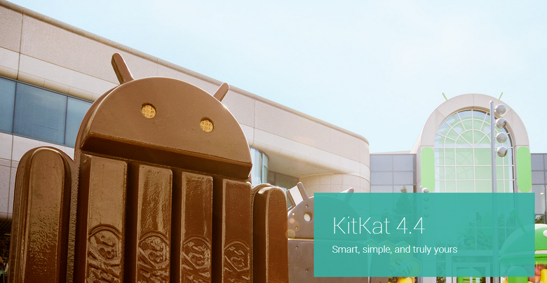
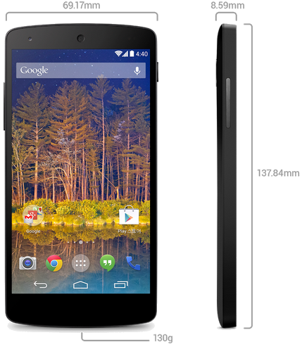
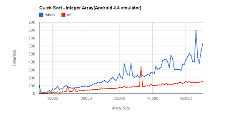
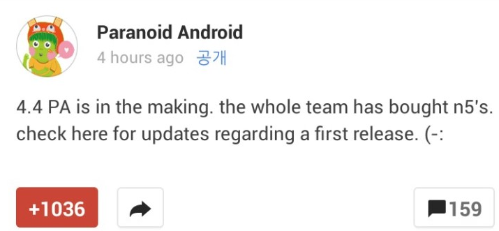

(클릭하시면 고화질로 볼수 있습니다)

구글에서 바로 어제, 11월 1일 예상대로 넥서스5와 키켓(KitKat, 4.4)을 공개했습니다!

이에 따라 지금, 11월 2일까지 알려진 스크린샷과 안드로이드 소개 페이지 (각주: http://www.android.com/versions/kit-kat-4-4/)를 통해 키켓에서는 무엇이 달라졌는가?

또한 신제품 넥서스5는 어떻게 생겼는가?

한번 살펴보도록 하겠습니다

먼저 넥서스5는 아래와 같이 생겼습니다

흡사 G2랑 많이 닮았습니다

저는 개인적으로 뒷면의 넥서스 로고가 마음에 드네요 ㅎ

무게는 130g정도됩니다 또한 두께가 8.59mm로 넥서스 시리즈중 가장 얇은 두께를 자랑하고 있습니다

넥서스5는 1차 판매나라에 우리나라 한국이 있기때문에 구글 플레이 스토어에서 구매가 가능합니다

참고 : <https://play.google.com/store/devices/details/Nexus_5_16GB_검정색?id=nexus_5_black_16gb>

이와 함께 발매된 키켓에 대한 정보도 알아보겠습니다

[이 글자에 링크된 사이트 (각주: http://www.android.com/versions/kit-kat-4-4/)에서 자세한 정보를 더 얻을수 있습니다](http://www.android.com/versions/kit-kat-4-4/)

개발자가 생각하는 키켓의 변경점은 아마도 ART가상머신의 유무일탠대요

Dalvik과 ART의 차이를 테스트한 그래프가 있습니다

 (각주: 출처 : https://plus.google.com/app/basic/stream/z13fc5zo1vqvcveyi04ci3xrymqjvlthmpw0k)

ART를 주 가상머신으로 사용한다면 많은 향상이 있을것으로 짐작합니다

그러나 ART를 사용하면 패키지를 설치하는 과정에서 네이티브 언어로 apk를 바꾸는대,

그에따라 설치 시간이 길어지는 문제도 있고 이미 네이티브 언어로 만들어진 어플에는 효과가 없다는게 단점이 되겠습니다

그리고 파라노이드팀에서 4,4 PA를 위해 넥서스5를 팀원 전원이 구매했다는 소식도 있습니다

.....!

빠른 시일내에 만나볼수 있으면 좋겠습니다 ㅎㅎ

빨리 4.4를 체험한다음에 직접 무엇이 달라졌는가?를 확인해서 다시한번 글을 올려보겠습니다
