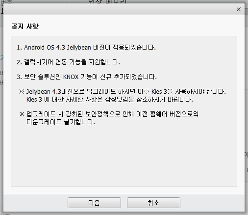

드디어 오랜 기다림 끝에 삼성 갤럭시 S3 국내 모델의 4.3 업데이트가 진행되었습니다

지금가지 알려진 모든 정보를 모아 보도록 하겠습니다

**1. 녹스(Knox)가 적용된 모델은?**

루팅 유저가 가장 궁금한 점은 녹스적용 유무일탠대요

겔럭시 S3 3G모델에는 녹스가 포함되지 않았다고 합니다

LTE모델의 경우 녹스가 포함되어 있습니다

참고 : 녹스란? : <http://azdesigntm.tistory.com/575>

**2. 녹스 우회법은?**

현재 디벨로이드의 iili2000라는 ID를 가진 분께서 테스트 하신 내용입니다

부트로더파일인 sboot.bin파일을 제거한후 오딘으로 설치해주면 된다고 합니다

자세한 설치 방법과 설치 파일의 경우 좀더 확인후 다시 수정하도록 하겠습니다

**3. 다운그레이드의 경우?**

아래는 삼성 키스(Kies)로 4.3업데이트시 나타나는 공지사항을 캡쳐한 내용입니다

이중 3번 내용을 보시면 Knox가 추가된 것을 볼수 있으며 이로 인해 다운그레이드가 불가능 하다고 나와 있습니다

그러므로 현재 정식 펌웨어를 올리신 분들, 즉 삼성 Kies로 올리신 경우 또는 FOTA로 다운받아 설치하신 경우에는

이미 녹스가 포함된 부트로더가 설치되었기 때문에 현재까지는 다운그레이드가 불가능 하다고 합니다

그러나 2번에서 설명한 sboot.bin을 제거한 펌웨어를 설치하여 Knox를 우회한 경우에는 다운그레이드가 가능하다고 합니다

**4. 녹스(knox)를 우회한경우 녹스 기능을 사용할수 있나요?**

sboot.bin을 제거하여 녹스를 우회하여 4.3을 설치한 분들은 녹스기능을 사용할수 없습니다

**5. 우회 펌웨어를 올리기전, 또는 정식버전을 올리기 전에 해야 할일은 무엇이 있나요?**

루팅카운터를 초기화 해야 합니다

즉 디바이스, 시스탬 상태가 모두 Official이여야 합니다

그러지 않으면 업데이트후 WI-FI가 작동하지 않는 오류가 있다고 합니다

그리고 일부 분들은 녹스를 우회한 펌웨어를 올릴경우 루팅 카운터가 1로 증가한다고 합니다

만 다른 분들께서는 올라가지 않는다고 하셔서 뭐가 정답인지 모르겠습니다

**6. 순정 펌웨어는 어디서 다운로드가 가능하나요?**

각 통신사마다 순정 펌웨어가 다르며 한번에 모여있는 서버를 발견하면 수정됩니다

**7. 변경점은?**

-안드로이드 버전이 변경되었습니다 (4.1.2에서 4.3)

-햇빛락이 추가되었습니다

-오로지 Only 잠금화면에서만 상단바 투명화 됩니다

-일부 앱의 UI가 변경되었습니다

-4.3 기본기능으로 대기전력 효율 상승

-그이상은 저도 잘 모르겠습니다 -\_-;;

**잘못된 부분 있다면 지적 부탁드립니다**

**그리고 이글은 언제든지 수정될수 있는 글이므로 절대로 이글을 신용해서 불이익을 받지 않도록 주의해 주세요**

**이글을 신용해서 발생하는 모든 피해는 여러분의 몫입니다**

이글은 [] 에서 다시 보실수 있으며 원본 글의 저작권은 미르에게 있습니다
