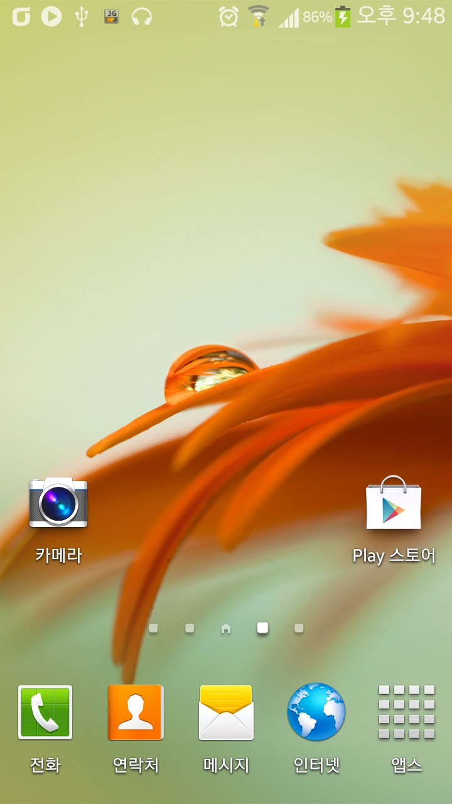
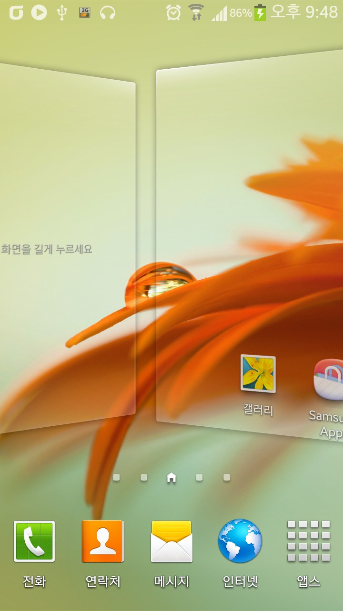
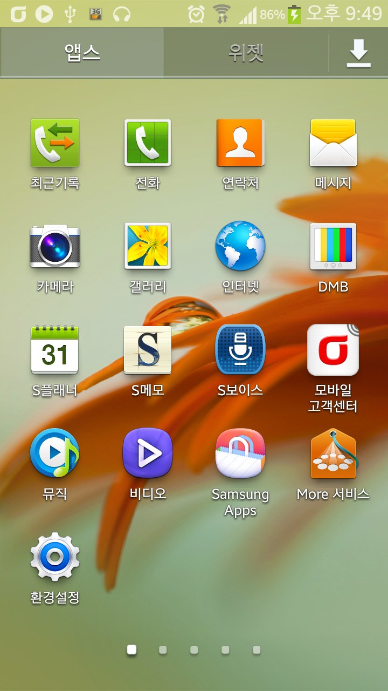
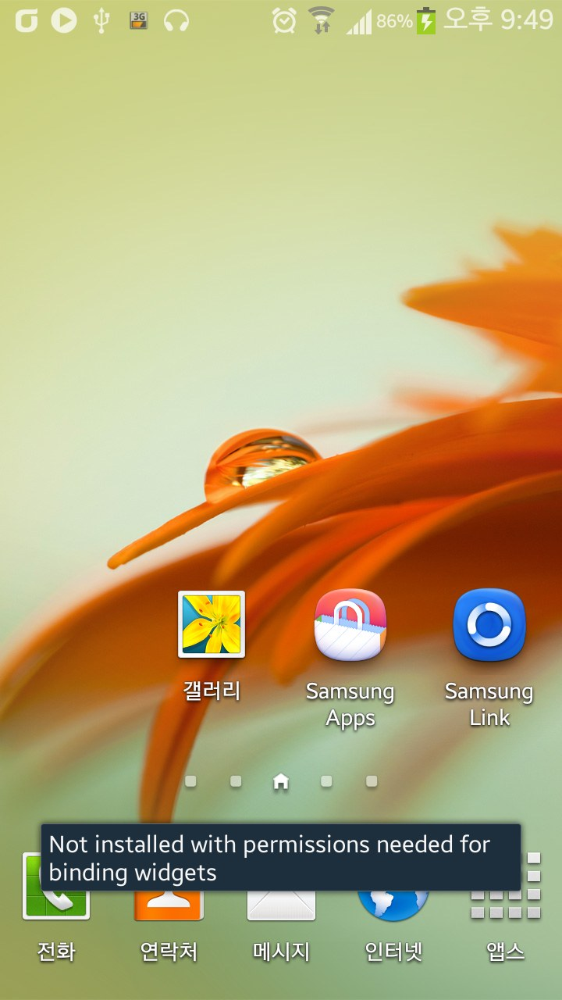
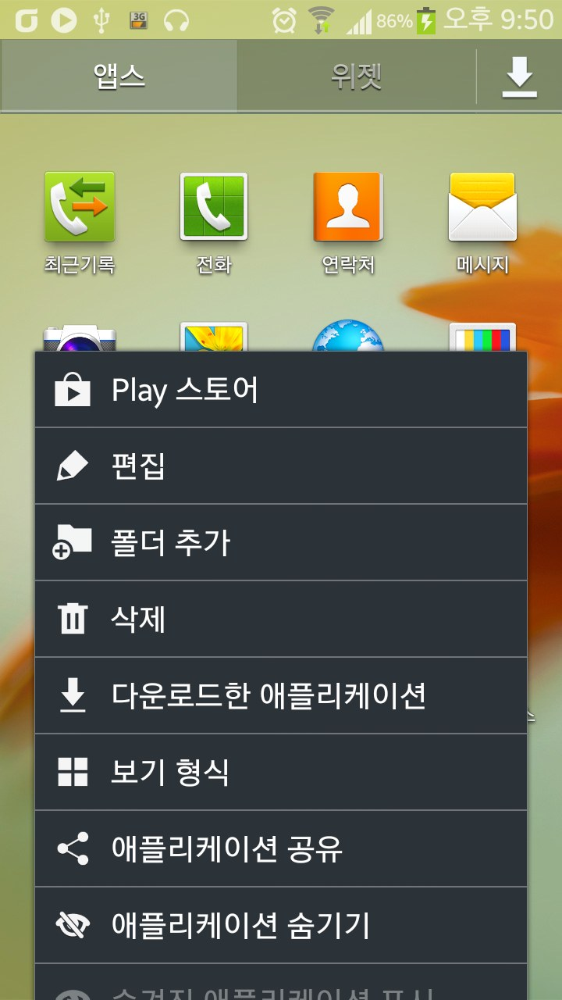
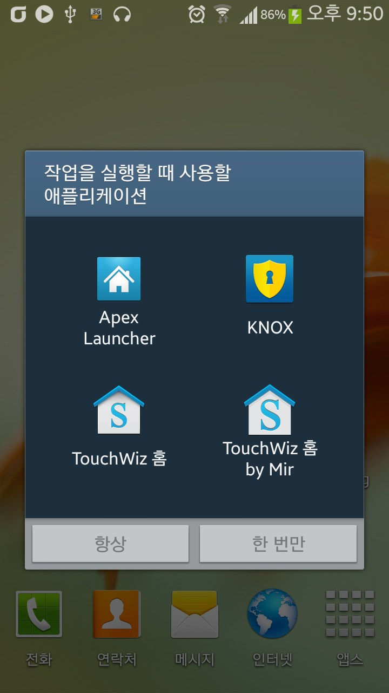

이미 많은 분들이 놋삼 또는 S4의 터치위즈를 사용하시고 계시겠지만

저는 CWM을 사용할수 없는 녹스 포함 펌웨어를 올린 상태라 이를 지켜 볼수밖에 없었습니다

그래서 시험기간에 하라는 공부는 안하고 뻘짓을 좀 해봤습니다

s4런처를 찾는대만 시간이 다갔네요 ..

아무튼 결과는 그럭저럭 입니다

정상 구동되고 대부분의 기능은 작동됩니다ㅎㅎ

역시 상단바 투명은 S4런처에서는 작동되는 것을 살펴볼수 있었습니다

몇가지 버그가 있다면

제가 이번에 수정하면서 날씨위젯을 까먹고 작업을 안했습니다

그래서 처음에 날씨위젯을 불러오는대 실패하여 강종이 일어납니다

강제종료가 일어나기전 홈화면에 있는 날씨위젯을 삭제해 주셔야 강제종료가 안뜹니다

루팅을 안한 유저(such as Me)를 위해 패키지 명을 변경해서 노 루팅도 설치/사용이 가능하겐 만들었는대....

음 이게 시스탬 어플이 아니라서 S메모 위젯같이 타 런처에서 설정이 불가능 하고 기본 런처, 터치위즈에서만 작동하는 위젯이 작동이 안됩니다

밑에서 두번째 스샷을 참조해 주세요

아무튼 이제부턴 빨리 공부해야 겠습니다 30분 초과했네요 ㅎㅎ;;

ps. 다음 업뎃에 삼성의 터치위즈 상단바 투명 센스를 기대하겠습니다

혹시 필요하신 분이 계실지 몰라 첨부해 둡니다

이글은 디벨로이드, 미르의 IT정복기([itmir.tistory.com](http://itmir.tistory.com)), 맛클에 업로드 됩니다

[signedSecLauncher3.z01](https://github.com/itmir913/archive/releases/download/itmir-attachments/signedSecLauncher3.z01)

[signedSecLauncher3.zip](https://github.com/itmir913/archive/releases/download/itmir-attachments/signedSecLauncher3.zip)