안녕하세요

저번 키켓 발표에 이어 이번에는 갤럭시 S3의 4.3이 발표되었는대요

이번에는 한번 달라진 점이 무엇인가를 살펴보겠습니다

---

1. 설치 화면 (공장초기화 후)

아래 스샷은 설치 화면을 찍은 사진 입니다

개인적으로 뭔가 친절해 보이군요 ㅎㅎ

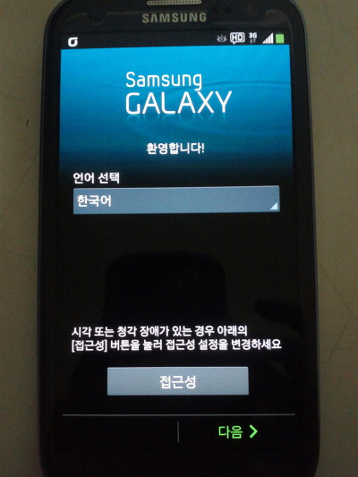
   
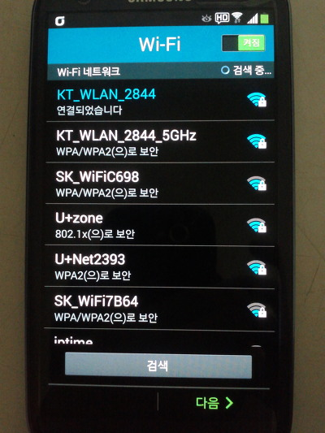

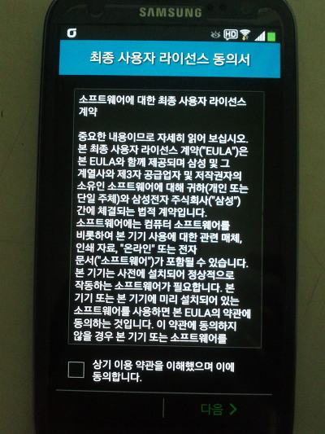
   
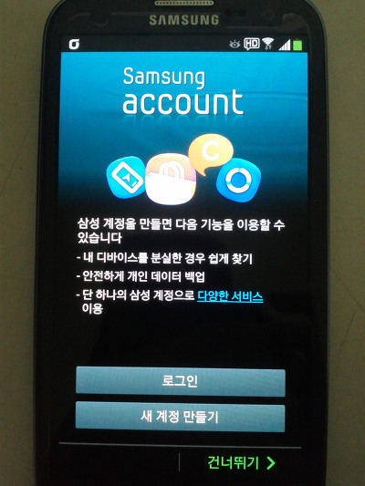

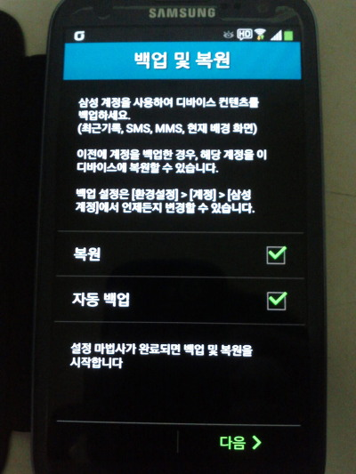
   
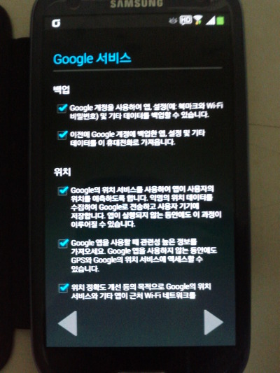

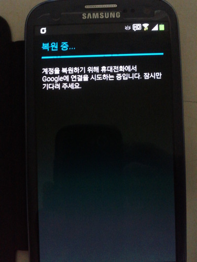
   
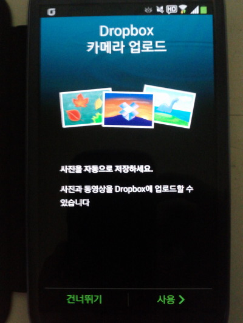

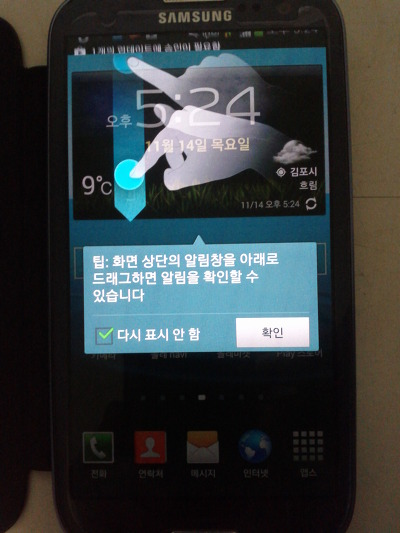

위 스샷에는 없지만 S4처럼 새로운 기능을 소개하는 스크린샷도 있습니다

설치 과정이 모두 S4와 닮아 있군요 ㅎㅎ

4.3올리다가 무한 부팅에 걸려서 어쩔수 없이 공장 초기화를 하게 되었는대

깔았던 어플을 모두 되살려 주어서 너무 편리했습니다 ㅎㅎ

---

2. 터치위즈

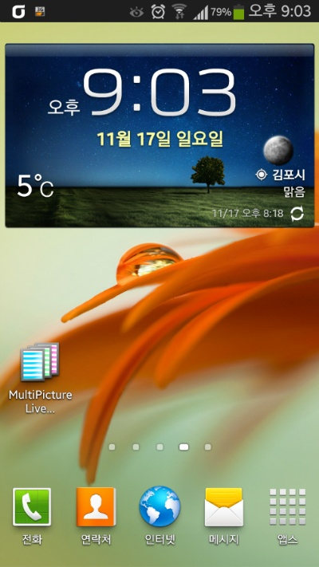

터치위즈 모습입니다

저기 있는 상단바 보이시나요? 아쉽게도 S4처럼 투명이 아닙니다

터치위즈의 모습도 모두 4.1.2와 같은대요

삼성 너무합니다 ㅡㅡ; 좀 상단바 투명 해주면 어디가 덧나나요?

---

3. 상단바

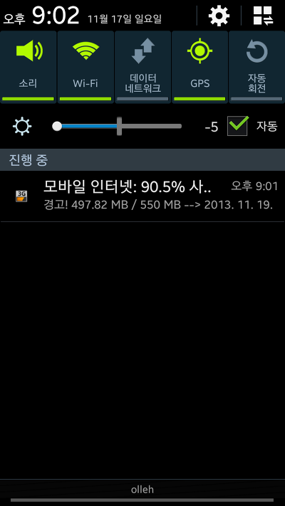
   
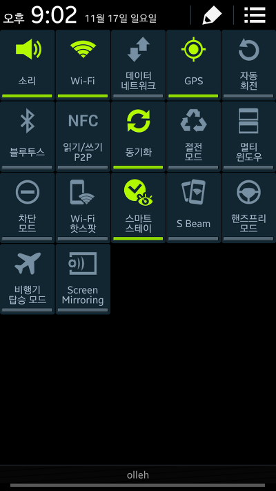

상단바의 모습이 S4처럼 변했습니다

(왼쪽그림)오른쪽 상단에 있는 三자를 누르면 오른쪽 그림처럼 모두 나열됩니다

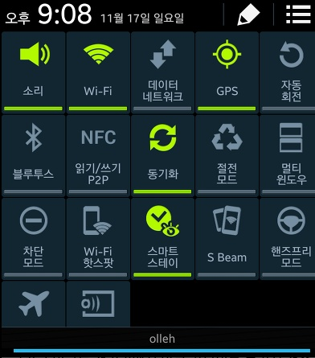
   
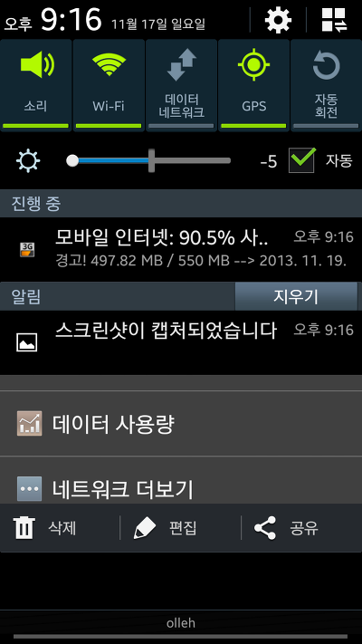

4.3와 마찬가지로 상단바의 아무데나 누르고 위로 스크롤 해도 스크롤이 가능해 졌고요 (왼쪽)

스크린샷을 찍은후 상단바에서 바로 삭제가 가능해 졌습니다 (오른쪽)

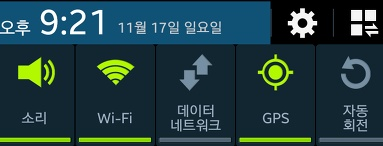

또한 시계부분을 눌러 바로 날짜/시간 설정으로 넘어갈수도 있습니다

원래는 알람 어플로 넘어가야 하는게 정상이 아닌가...???

---

4. 설정어플

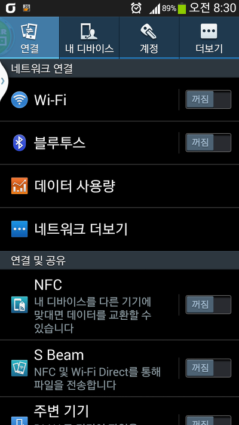
   
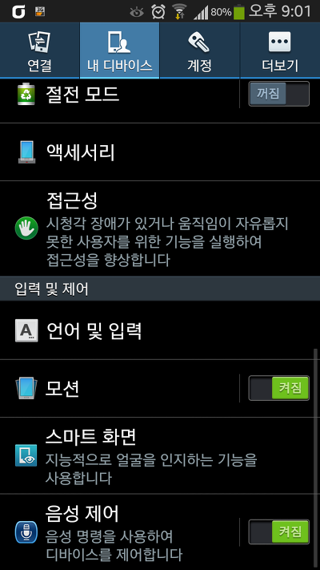

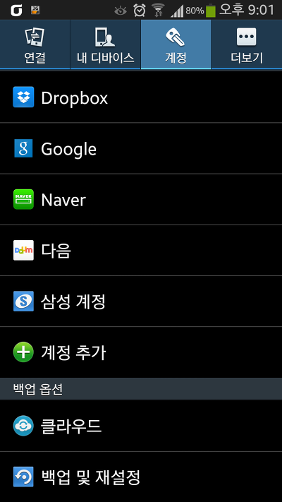
   
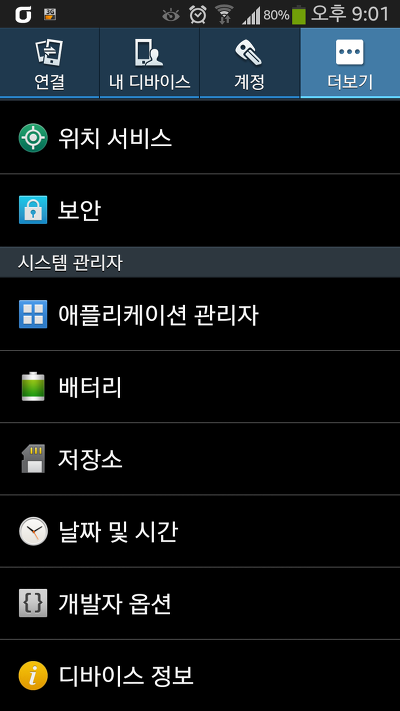

설정 어플이 위 4개 스샷 처럼 탭으로 변했습니다

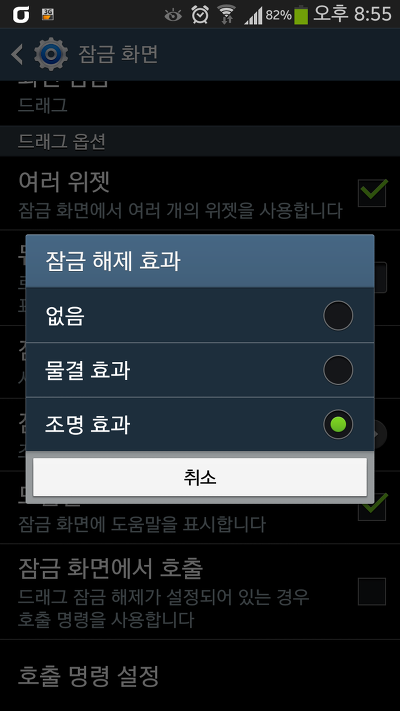
   
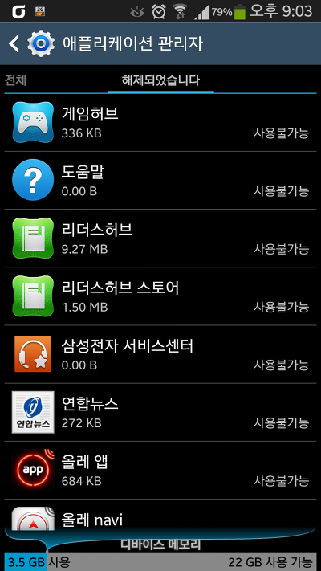

또한 조명 효과 드래그, 일명 햇빛락이 적용되었습니다

만 이상하게도 패턴락과 드래그락을 동시에 적용할수 없는 이상한 쓰래기 같은 경우가 발생했습니다

뭐 이런 경우가 있는지

그리고 비활성화된 어플을 따로 한 탭에 모와 볼수 있게됬습니다

원래는 "전체"탭 맨 아래에 있었습니다

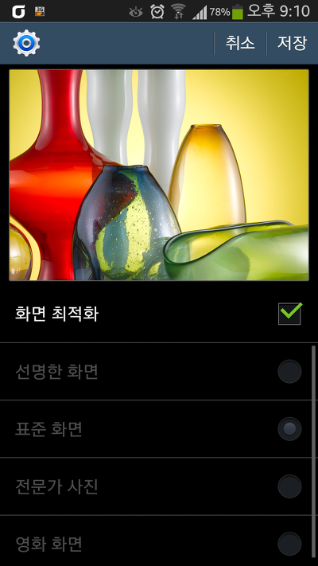

화면 최적화 기능이 추가되었고 전문가, 영화등이 생긴것 같다만 이거 4.1.2의 네츄럴? 네추럴 모드에서 이름만 바꾼거 같은 느낌이 듭니다

---

5. 잠금 화면

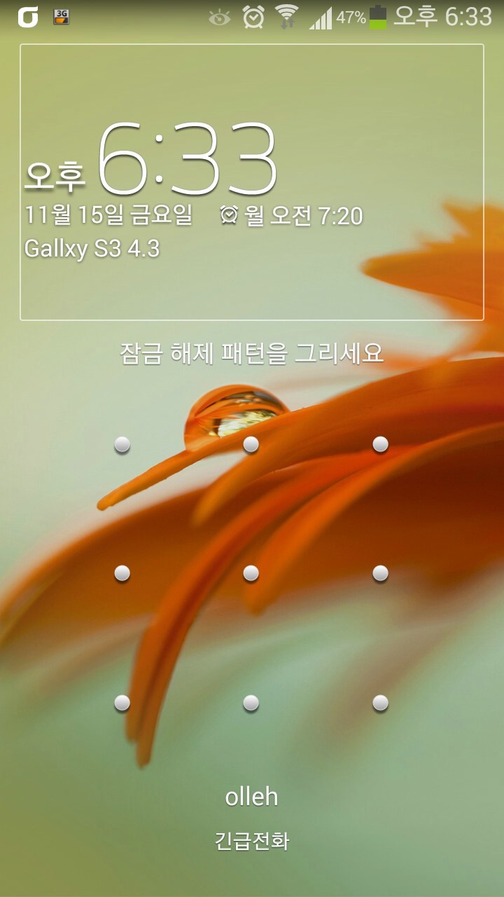
   
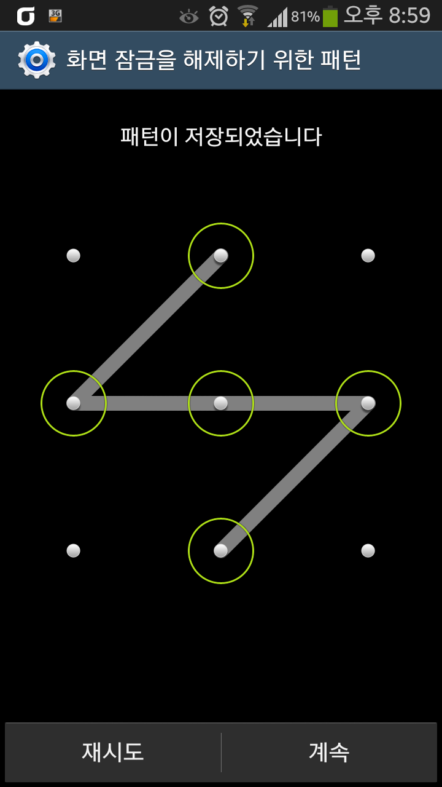

패턴 모양이 변경된것으로 보입니다 (아닐수도 있습니다)

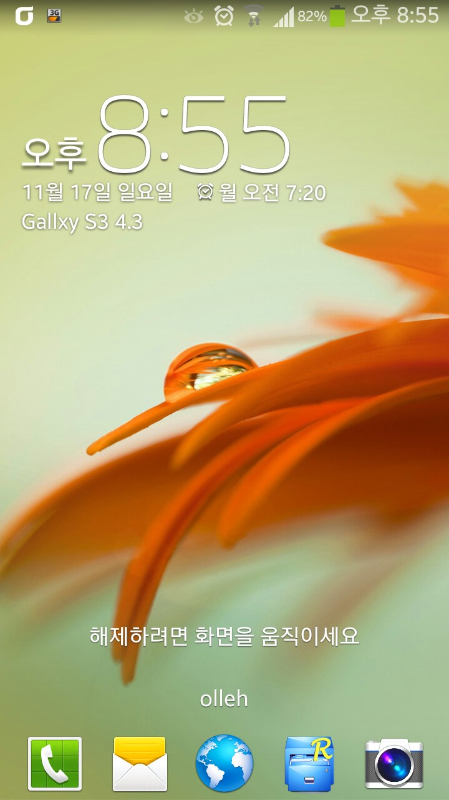
   
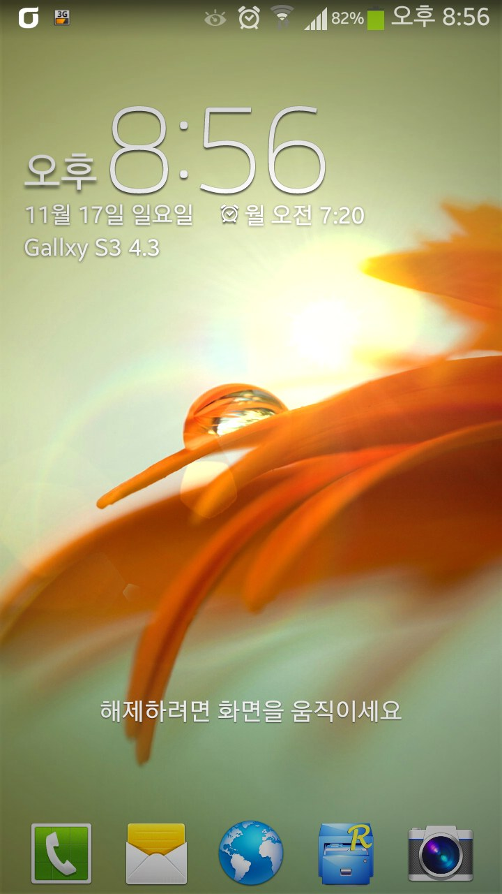

또한 햇빛락이 생겼습니다

드래그를 하면 오른쪽 화면과 같이 나타납니다

**그러나 패턴락과 같이 쓸수 없다는것이 최악 단점이 되겠습니다**

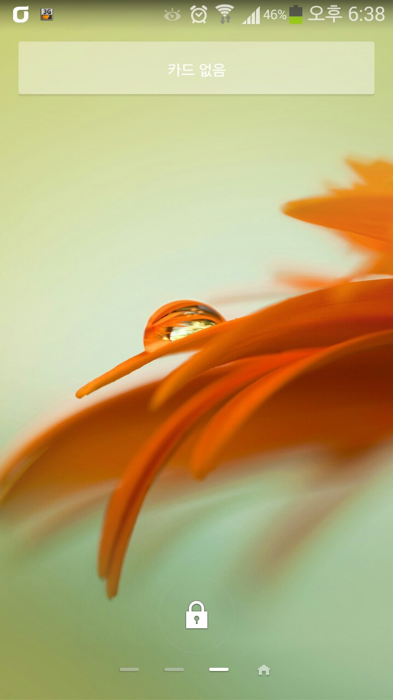

일반 4.3처럼 잠금화면 위젯이 추가되었습니다만

기본으로 들어가 있는 잠금화면 카메라 바로가기도 짤라먹고 이 잠금화면 위젯기능이 AOSP(구글 순정)에서는 패턴을 적용해도

되는 기능인대 삼성 4.3에는 패턴을 적용하면 이 기능도 안됩니다

뭔 생각을 하고 만들었는지 이해가 안됩니다

---

6. 작업관리자, 램

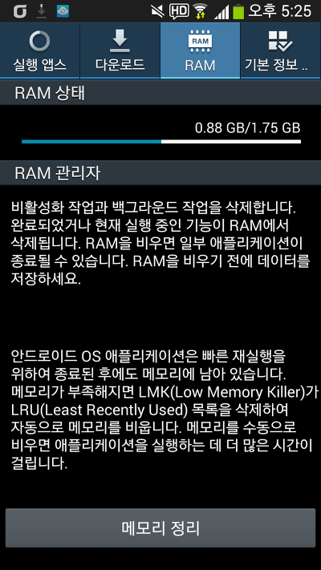
   
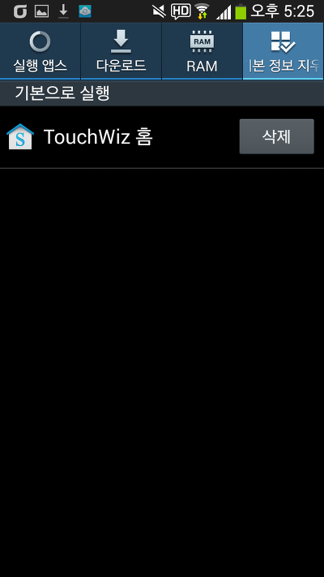

LTE기종을 쓰시는 분들은 램이 2기가 인대요

4.1.2에서는 아무리 해도 램이 1기가를 넘지 않았는대 이번 업뎃 이후로 기본이 800mb를 유지하고 있습니다

제가 일주일 쓰면서 체감상 조금 버벅인다 라는 느낌도 있었으니 차후 업데이트로 사용 메모리가 줄어들었으면 합니다

그리고 작업관리자에 기본 실행 어플을 확인할수 있습니다

원래 팬택의 베가(VEGA)에서는 기본으로 지원하는 기능인대 이 기능 없으면 뭐가 기본으로 되어있는지 하나하나 확인해야 하는 불편함이 있습니다

이런 소소한 기능 마음에 듭니다

---

7. 사운드&샷

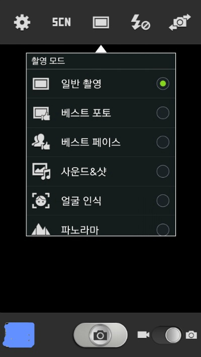

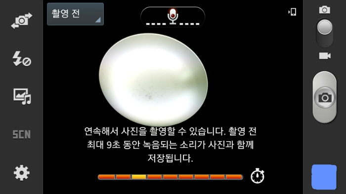

카메라는 사운드&샷 기능 하나만 추가되었고 나머지 기능과 UI는 모두 그대로 입니다

개인적으로 S4 카메라 기능과 UI가 마음에 들던대 업데이트시 반영해 주었다면 더 좋지 않았을까 하는 생각이 듭니다

빠른 업데이트는 너무 좋지만 상위 기종과 차별화가 너무 심하다고 생각됩니다

아무리 못해도 터치위즈 투명화는 되야하지 않을까요? 무슨 잠금화면에서만 투명화 되는것은 또 뭔지...

---

8. 플로팅 키보드 - 삼성 키보드

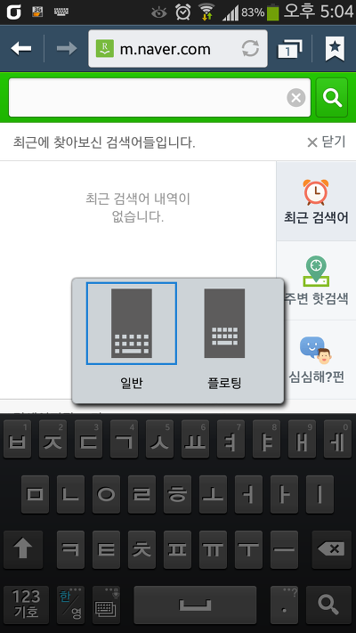
   
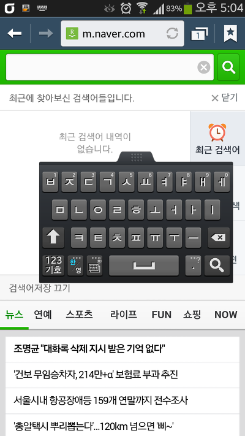

삼성 키보드에서 한/영 옆에 있는 버튼을 꾹 눌러 나오는 목록에서 플로팅 키보드 아이콘을 선택하게 되면 일반모드와 플로팅 모드를 선택할수 있으며

선택할경우 둥둥 떠다닙니다 그리고 키패드도 작아집니다

한손일때는 편하겠지만 다른곳을 터치해 오타날 가능성이 많으므로 그닥 쓰진 않을거 같습니다

---

9. 이미지 온

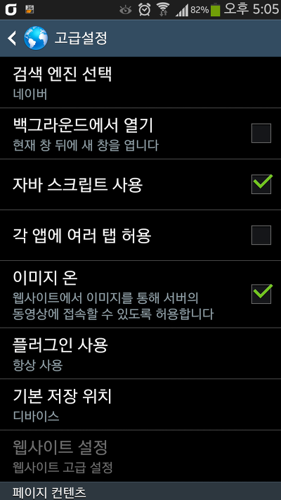
   
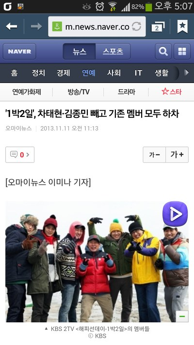

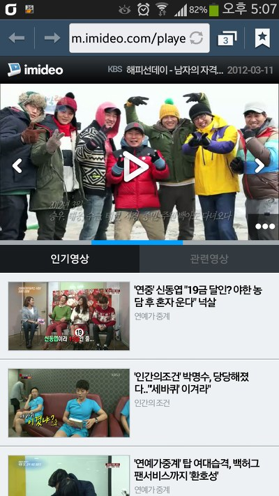
   
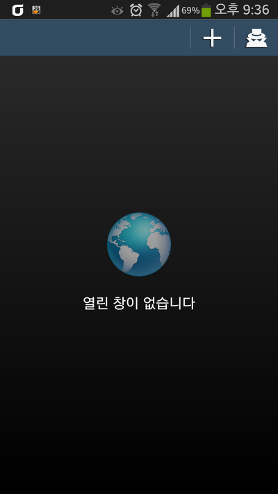

삼성 순정 브라우저에 새로 생긴 이미지 온이라는 기능인대요

화면에 있는 사진을 서버로 보내(확실하지 않습니다) 이것이 캡쳐본일경우 동영상 링크를 띄워주는 기능입니다

갑자기 동영상으로 보고 싶다 할때는 유용하겠지만 이미지온이 사진을 서버로 보낸다면(확실하지 않습니다) 3G가 더 들수 있는 부분이 아닐까요?

그리고 모든 탭을 닫으면 열린 창이 없습니다 라는 메시지가 나오고 뒤로가기 키를 누르면 빠져 나옵니다

!! 이런것을 원했습니다 저번버전은 아무리 닫아도 좀비처럼 게속 시작 페이지가 열리던대 그 오류가 해결된듯 합니다

---

10. 녹스(KNOX)

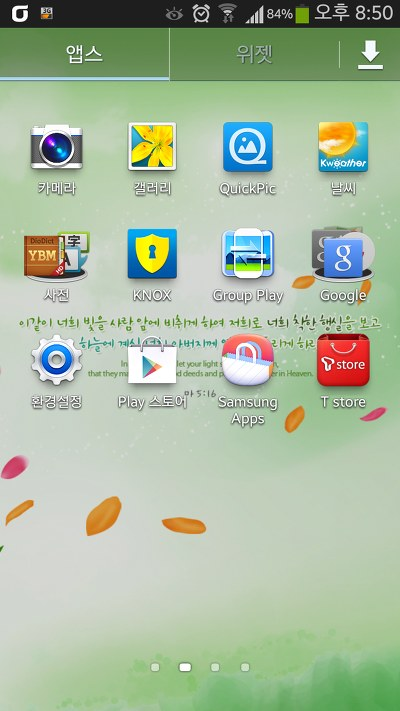
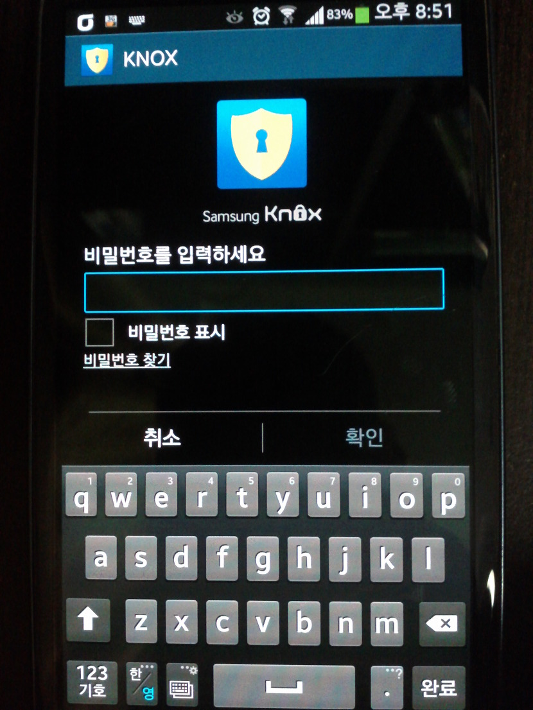

LTE기종하면 Knox, 녹스를 빼놓을수 없죠 ㅎㅎㅎㅎㅎㅎㅎㅎㅎㅎㅎㅎㅎ

계륵같은 존재입니다 솔직히

저는 이미 깔아서 비밀번호를 치라는 화면이 나오는군요

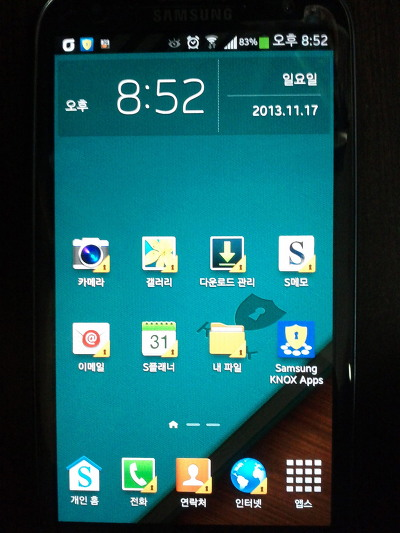
   
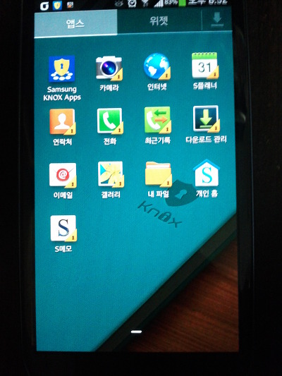

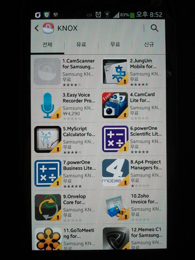
   
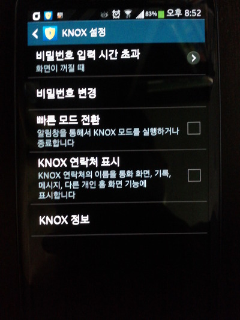

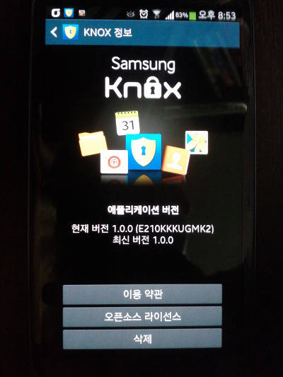

녹스 삭제는 터치위즈 홈에서 녹스 설정, 녹스 정보, 삭제를 누르면 가능합니다

녹스들어간 다음에 친구사진을 찰칵 찍은다음 기본홈(개인홈)으로 빠져나와 안찍었어 하면 재밌겠네요 ㅋㅋㅋㅋㅋㅋㅋㅋㅋㅋ

음.. 잘못하면 범죄에 악용될수 있는게 이걸로 도촬한다음 개인홈으로 빠져나오면 데이터가 암호화 되므로 증거가 없어지는 셈이네요;;

---

11. 포토 노트

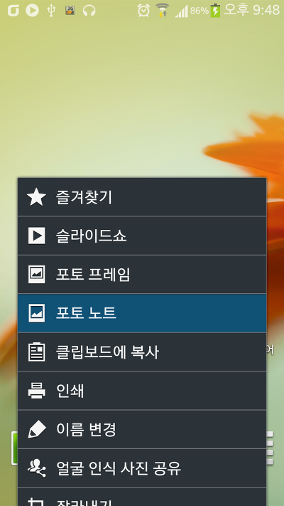
   
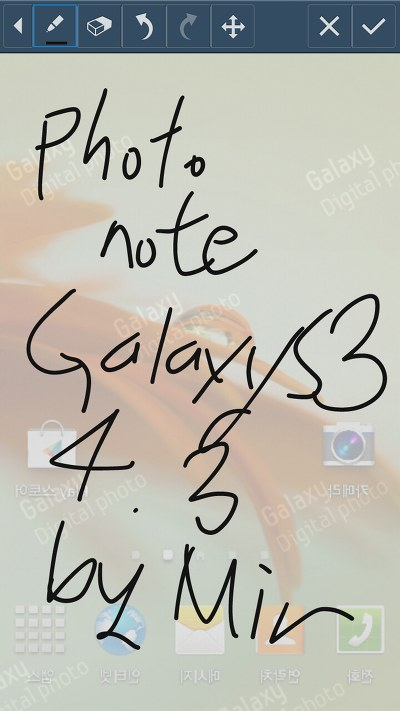

이건 4.3 업데이트 되면서 생긴 기능인지는 확실치 않습니다

만 그래도 첨부합니다

갤러리에서 메뉴 - 포토 노트를 누르면 화면이 뒤집히면서 글씨를 쓸수 있더군요 ㅎㅎ

---

12. 숨겨진 설정 기능들

아래는 설정 에플에서 보이지 않는 히든 메뉴들 입니다

진입하는 방법은 액티비티 호출이 가능한 어플을 사용해 주시면 되는대요

마켓에서 Activity Launcher이라고 치면 나오는 앱을 받으셔도 됩니다

(1) 손전등

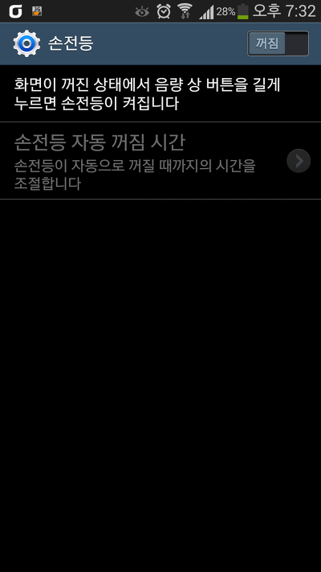

볼륨키를 누르면 손전등 설정이 가능합니다

단점이 있다면 이어폰으로 노래 듣고 있다가 이 기능을 사용하면 손전등이 안켜지고 볼륨이 커지니 꼭 노래를 중지하고 작동하시길..

(2) 알림 확인

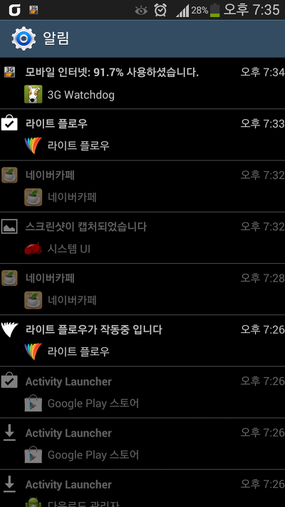

어떤 어플이 알림을 썼는지 기록이 나와 있습니다

(3) 독서 모드

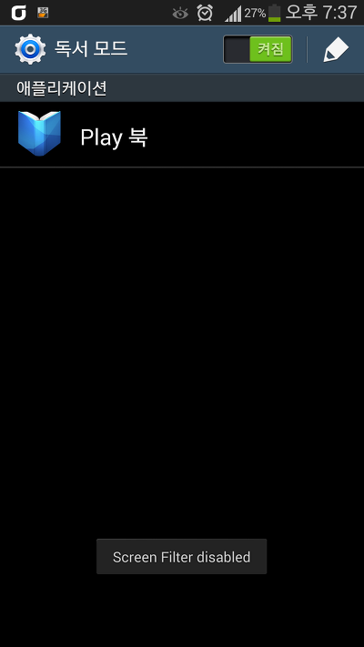

독서모드란? 해당 어플을 사용중일때 가독성과 화면 색감들을 더 좋게 만든다고 합니다

(4) App ops

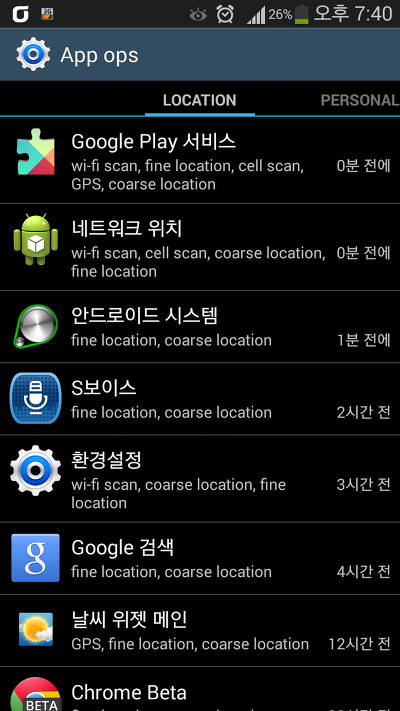
   
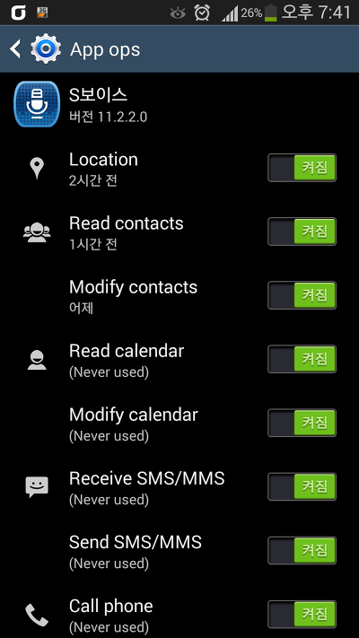

이 기능은 개인적으로 훌륭하다고 생각됩니다

각 어플이 무슨 권한을 쓸수 있고, 언제 그 기능을 사용했고, 권한을 취소할수도 있으니 말이죠

실험삼아 다음앱에 카메라 권한을 끈다음 다음앱에서 코드 검색을 해봤더니 카메라를 작동시키지 못했습니다

(5) 빠른실행

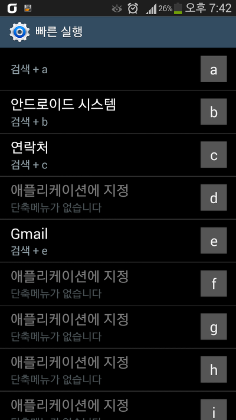

이 기능은 쿼터 키보드를 사용하는 폰만 해당하는 기능이라고 합니다

아니면 블루투스 키보드에서도 될지...?

(6) 잉크락 설정

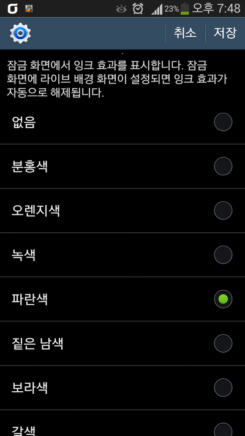

이건 뭐;

잉크락이 있지도 않으면서 왜 이런 액티비티가 있는지 모르겠네요

설정해도 작동하지 않습니다

(7) Sview 설정

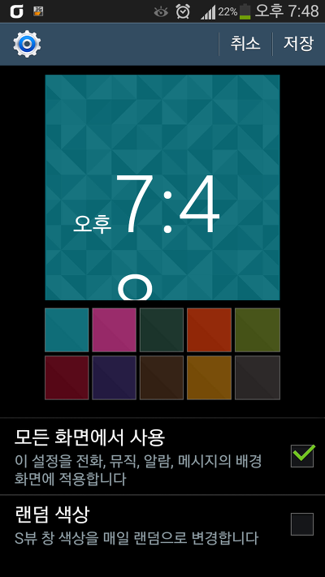

S뷰라고 하는대 이것도 뭐....

(8) 전원 설정

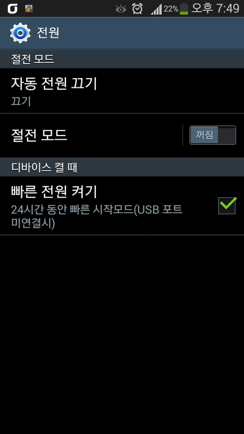

자동 전원 끄기 기능이랑 빠른 전원 켜기 기능이 있네요

자동 전원 끄기 같은건 윈도우의 절전 프로그램 기능같고

빠른 전원 켜기는....?...;;

이렇게 해서 4.3 업데이트후 달라진 점을 크게 살펴 보았습니다

이글은 [] 에서 다시 보실수 있으며 원본 글의 저작권은 미르에게 있습니다
