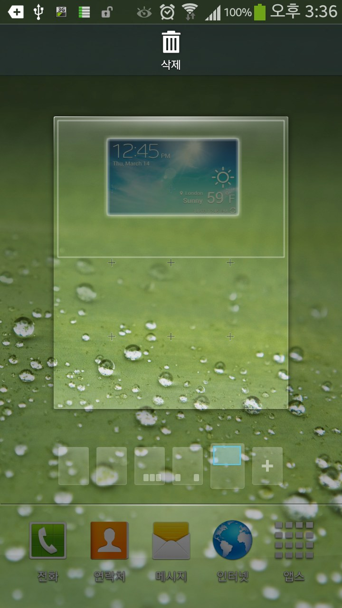
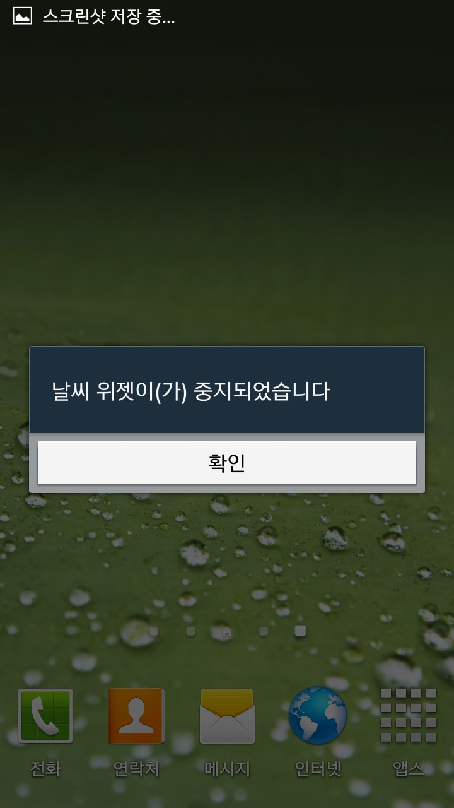
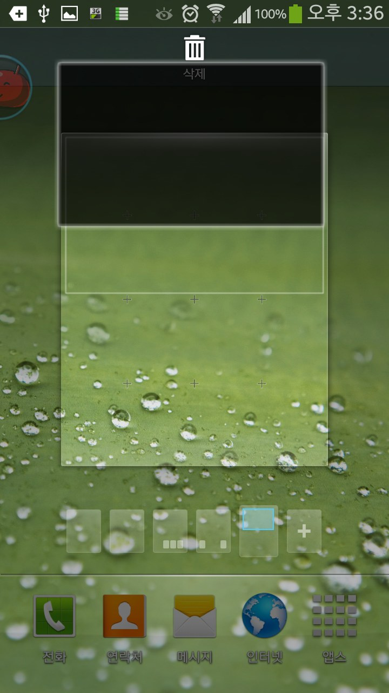
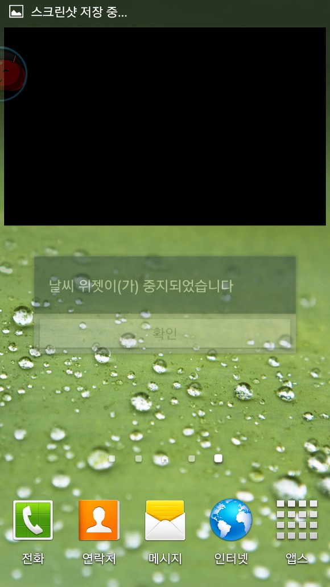

일단 처음에 S4런처에서 날씨위젯을 지우지 않으면 강제종료 되는 오류는 여전하고요.

그냥 S4위젯을 설치하면 터치위즈와 함께 강제종료가 되었는데..

어짜 어짜 해서 터치위즈는 종료되지 않게 되었습니다.

아직도 날씨위젯 강종은 여전하고요.

결론을 말하자면 아마 순정에서 날씨위젯을 쓰는건 힘들듯, 아니 99%로 불가능 할 듯 합니다. ㅠㅠ

이유는 이 날씨위젯이라는 놈이 /system/framework/sws.jar을 사용하더군요. (AndroidManifest.xml과 여러 로그켓을 통해)

XDA에서 배포중인 CWM설치용에도 이 jar파일이 들어있습니다.

순정에서는 이 파일을 교체할 방법이 없으므로 아에 jar을 내장해야 할것 같아 넣어봤지만 안됩니다.

흙...

디컴파일도 쉬원찮게 안되는 마당에 쩝.

jar을 추가하고 import구문을 모든 class에 넣는다면 모를까.. 쩝.

결론 : 힘들다. ㅠㅠ

이글은 [</archive/itmir/2013/381>] 에서 다시 보실 수 있으며 원본 글의 저작권은 미르에게 있습니다.