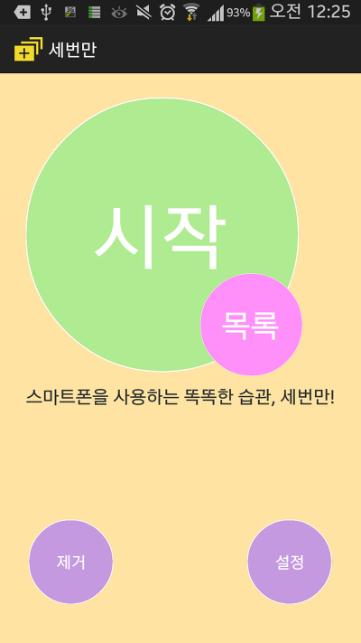
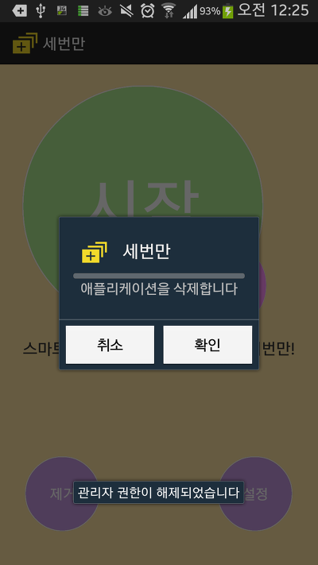
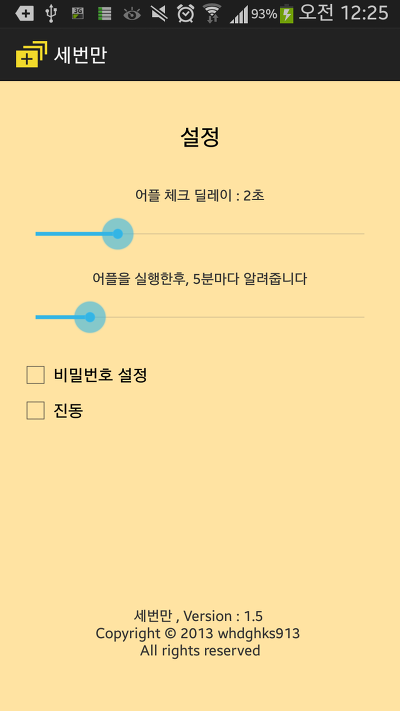
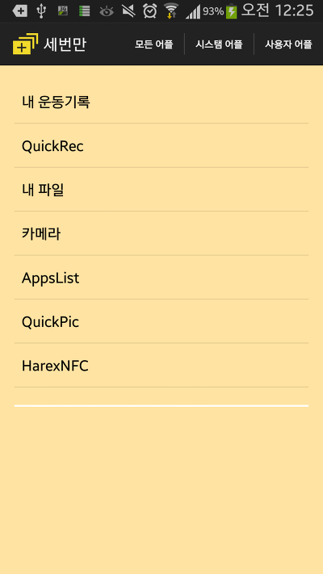
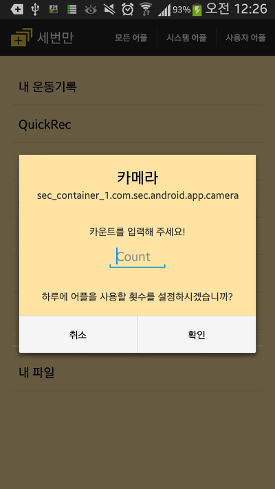
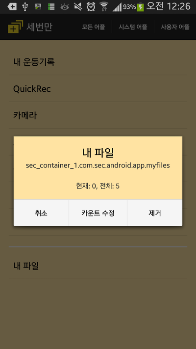
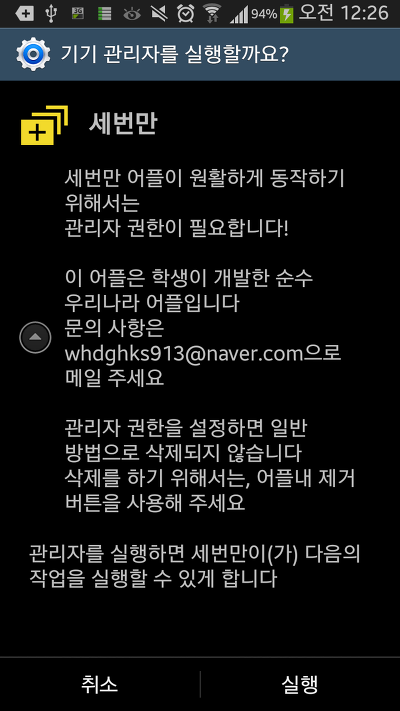
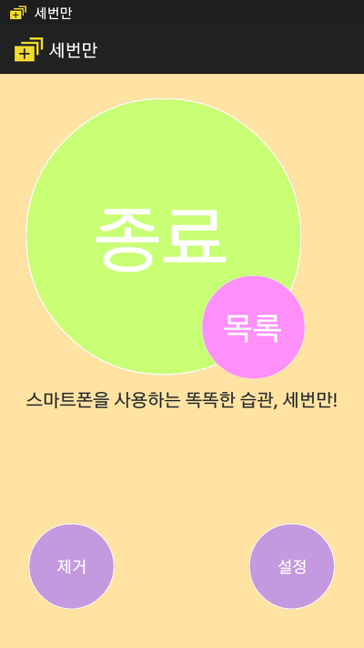

세번만 (BETA) - 스마트폰 어플 중독방지

하루에 어플을 실행할 횟수를 정하여 나 자신을 컨트롤 해보자!

@똑똑합니다! 각 어플의 카운터를 다르게 설정할수 있으며, 언제든지 바꿀수 있습니다

@안전합니다! 비밀번호로 잠금을 걸수 있습니다

@광고가 없습니다! 대한민국 학생이 만든 순수 국내 어플 입니다 어떠한 개인정보도 수집하지 않습니다

  

  

  

  

  

PreView

[임베드 콘텐츠: https://play-tv.kakao.com/embed/player/cliplink/vdfactWZ7IiIl117jtit181?service=daum\_tistory](https://play-tv.kakao.com/embed/player/cliplink/vdfactWZ7IiIl117jtit181?service=daum_tistory)

미르의 소스 최적화 실력으로 메모리 점유율 최적화

알려진 버그 수정

진동 설정 추가

넥서스S와 같은 hdpi기종에서 레이아웃 수정

등 세세하지만 큰 부분이 변경된 세번만 어플이 당신의 다운로드 버튼 클릭을 기다리고 있습니다!!

**[마켓 바로가기](http://play.google.com/store/apps/details?id=lee.whdghks913.only3)**

<http://play.google.com/store/apps/details?id=lee.whdghks913.only3>
