삼성에서 갤럭시 S3의 4.3 업데이트를 잠시 중단했었는데요.

현재 약간의 오류가 패치되어 다시 등장했습니다

그래서 이번에는 어떤점이 달라졌나에 대해 알아보겠습니다.

삼성 키스에 들어가면 최신 펌웨어가 있다는 알림이 나타납니다.

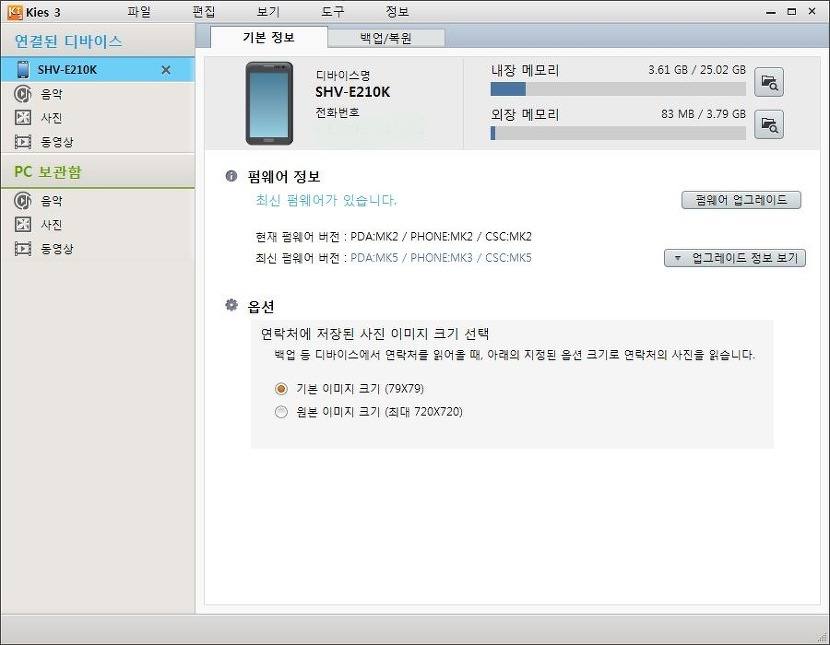

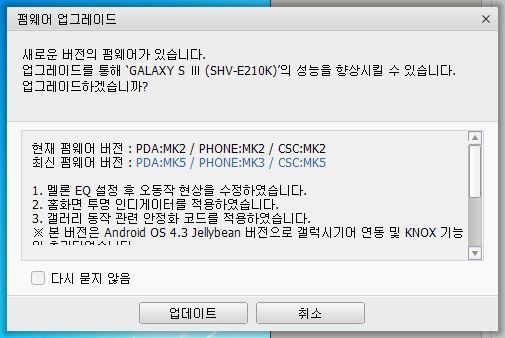

업데이트가 목적이니 업데이트를 해줍시다.

변경점이 멜론 EQ설정후 오동작 수정, 홈화면 투명, 갤러리 동작 안정화 라고 하는데요.

아래에서 보시면 아시다싶이 체감할수 있는건 홈화면에서의 상단바 투명 정도입니다. ㅎㅎ

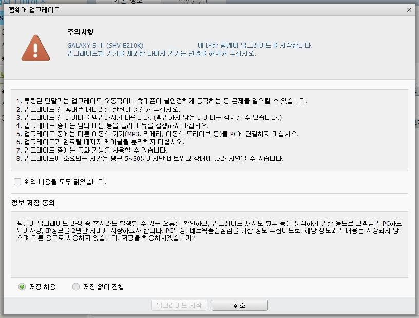

시작

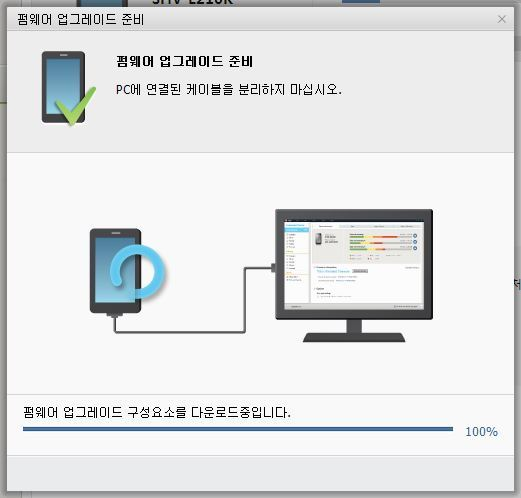

다운로드중...

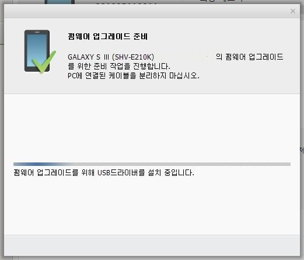

USB드라이버 설치중...

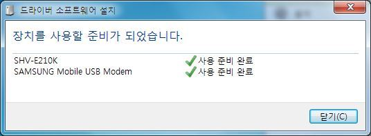

드라이버 설치완료 ㅎ

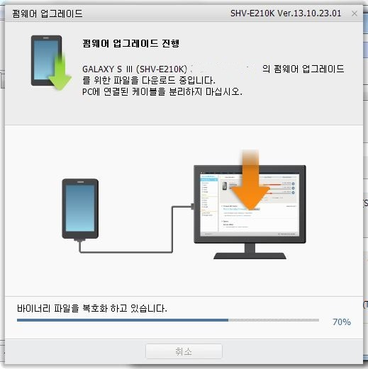

펌웨어 복호화 중

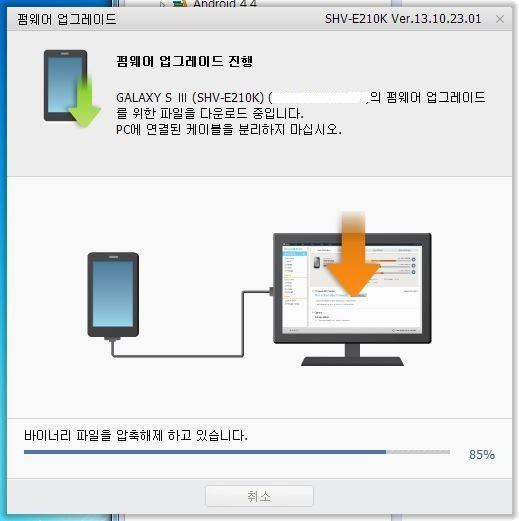

압축 해제 중..

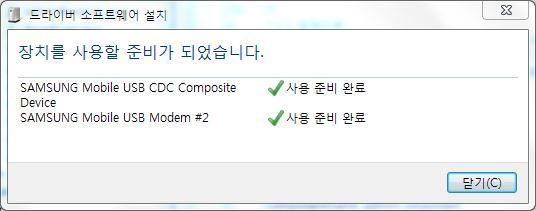

오딘모드로 진입하면 한번 더 드라이버 소프트웨어 설치가 뜹니다.

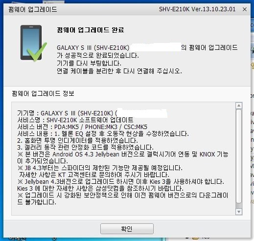

업데이트 완료!!

변경점을 확인해 봅시다.

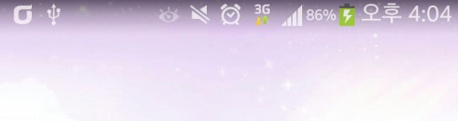

가장 쉽게 볼수 있는 변경점은 바로 이 홈화면에서의 상단바 투명화 입니다.

다른 변경점은 쉽게 눈에 띄지는 않습니다.

그럼 이상으로 글을 마치겠습니다.
