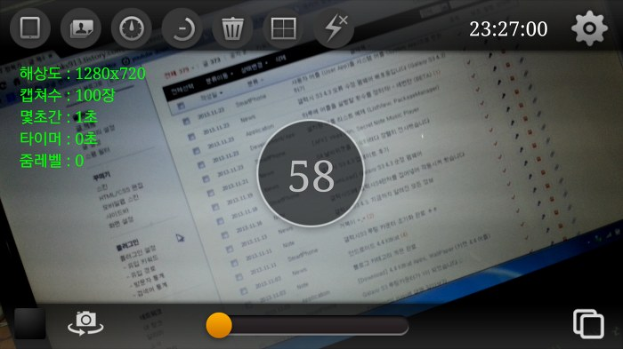

최대 20장까지 찍을수 있는 갤럭시의 순정 카메라 버스트샷과는 달리

메모리만 받쳐준다면 200장까지 찍을수 있습니다 ㅋㅋ

제 S3는 100장까지만 된다고 하더군요 쩝

1초에 20장이상 찍는것 같습니다

[연사카메라 v2.2.apk

다운로드](./file/연사카메라 v2.2.apk)

---

## 첨부파일

- [연사카메라 v2.2.apk](https://github.com/itmir913/archive/releases/download/itmir-attachments/386-burst-camera-v2.2.apk) `276 KB`
