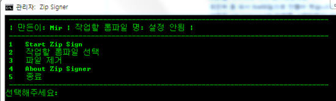
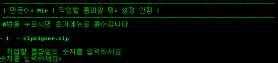
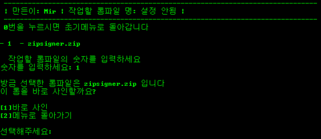
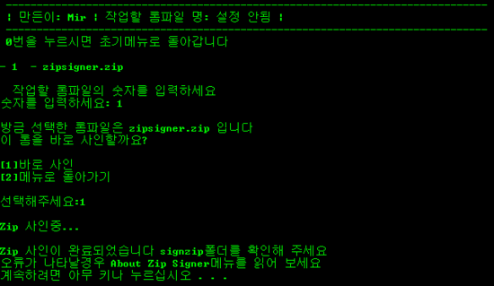
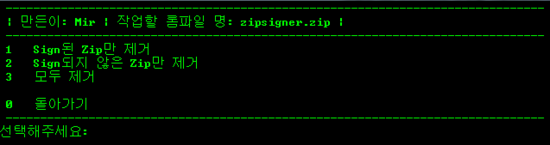
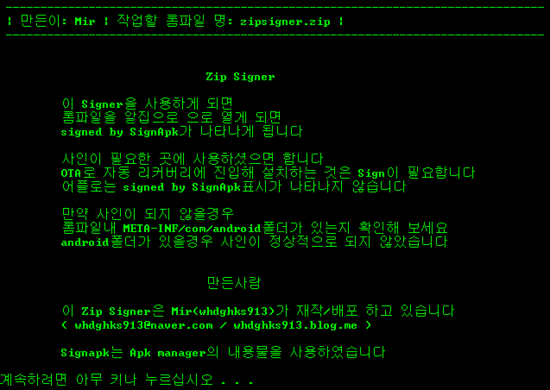
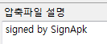

+UPDATE

자바 힙 사이즈를 설정할 수 있는 메뉴를 만들었습니다

Sign을  하기위해 개속 찾아봤는대요 ㅋㅋ

찾은뒤 좀 되서 Bat파일으로 만들어 봤습니다

내용은 apk manager의 일부를 사용하였습니다

압축을 풀으신뒤 Zipsigner.bat를 실행해 주세요

사인할 롬파일을 zip폴더에 넣으시면 됩니다

사인이 완료되면 signzip폴더에 signed[파일명] 이렇게 사인된 롬파일이 생기게 됩니다

나머지는 한글이라 못알아 들으시는 분은 없으실거라 믿습니다

또한 file의 내용물은 apkmanager의 일부를 추출하여 가져온 것 입니다

이 signer은 제가 만든것 이므로 무단 배포/무단 수정등을 금지합니다!

인증샷!

초기 실행화면 입니다

  
  
2번을 누르시면 이렇게 나타나게 됩니다

방식은 Apk manager와 비슷합니다

  
  
저는 친절하기 때문에(?) 방금 선택한 롬파일을 바로 사인할수 있습니다

1번을 누르시면  
  
  
  
바로 사인이 완료 됩니다

초기 메뉴에서 1번을 누르셔도 사인이 이루어 집니다  
  
  
  
3번 메뉴인 파일 제거는 sign된/안된 파일을 제거할수 있습니다  
  
  
  
4번을 누르시면 정보가 나타나게 되며 주의사항도 명시되어 있습니다  
  
  
그럼 Signed by SignAPK를 구경해 볼까요?  

.png)

이렇게 나타나게 됩니다 ㅋㅋ

[zipsign.zip](./file/zipsign.zip)

signapk.jar은 안드로이드 풀 소스에 포함되어 있는 소스로

풀빌드하면 나오는 파일입니다

---

## 첨부파일

- [zipsign.zip](https://github.com/itmir913/archive/releases/download/itmir-attachments/zipsign.zip) `13 KB`
