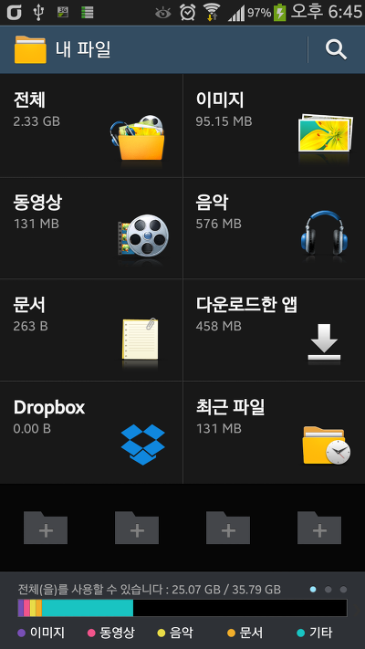
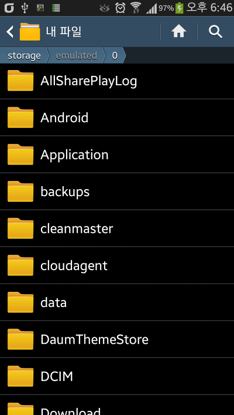

순정에서 루팅 없이 사용할 수 있는 노트 3의 내 파일 어플입니다

   

UI가 S3보다 엄청 보기 편하고

드롭박스 연동도 되는군요

그냥 하면 사인키 오류가 날거 같아서 패키지 명 바꾸는 작업을 거쳤기에

일단 순정 유저도 따로 설치 할수 있습니다 기존 파일 건들지 않고

그럼 강종 뜨는 문제 있다면 알려주세요~

ps. 노트3 내파일 어플은 Sdcard → Knox 가 가능하다고 해서 이식해 본건대 없는....;;

[SecMyFiles2.apk

다운로드](./file/SecMyFiles2.apk)