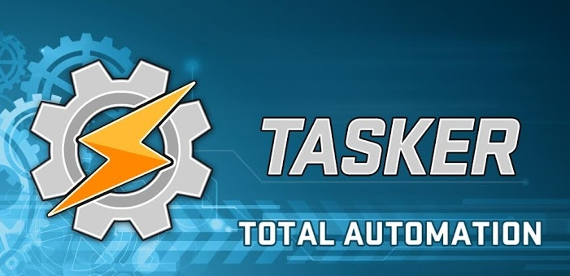
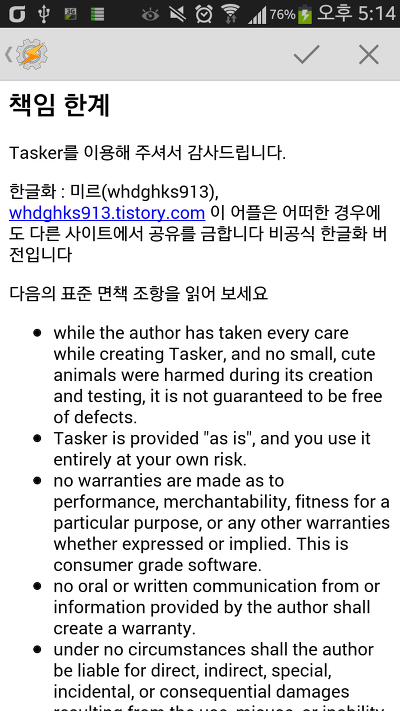
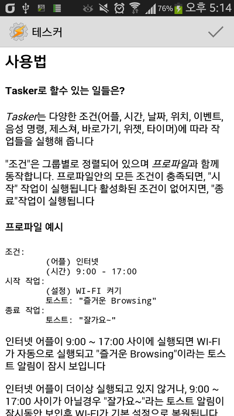
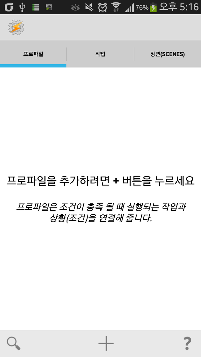
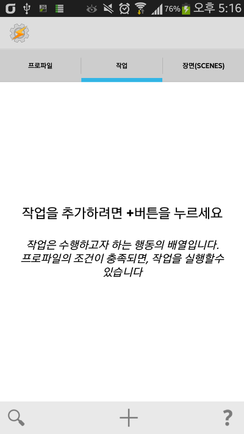
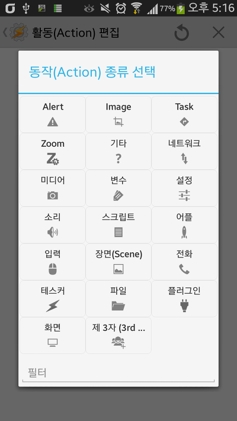
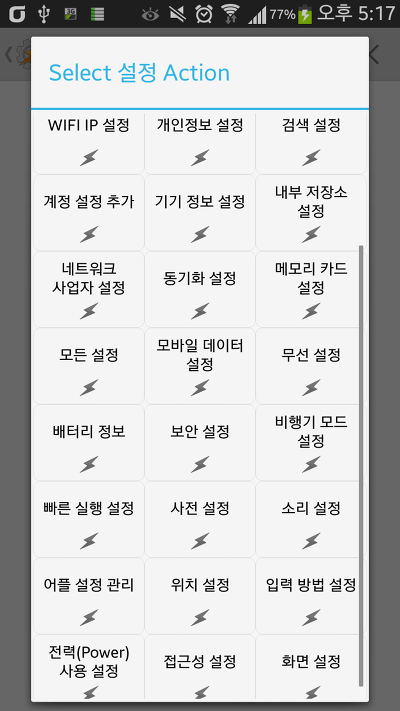
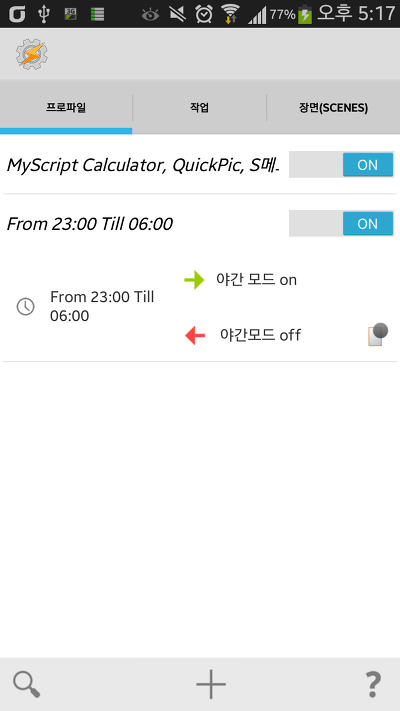
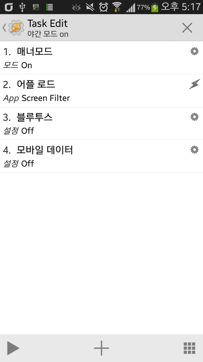

**Tasker - 자동화 어플리케이션**

안녕하세요

이번에는 제가 몇일동안 끙끙 앓다가 머리가 터져버린 어플입니다

대부분의 영어 앱은 구글번역을 쓰더라도 하루면 번역할수 있는대 이건 3일동안 하루종일 번역해도 반절도 못하더라고요;

이 어플은 테스커 라는 어플인대요

테스커에 대해서는 많은 정보가 이미 존재합니다

그런대 존재하지 않는것이 하나 있습니다

바로 최신버전 한글화 어플입니다

이에 불편함을 느낀 필자가 직접 일부 한글화를 하였습니다

아래는 일부 한글화 어플의 스크린샷 입니다

    

    

    

    

아직 오역과 영어가 많습니다

테스커가 2000줄의 영어를 번역해야 하는 바람에 500줄까지 번역하다 머리가 터져서 잠시 그만둔 어플입니다

그래도 최소 작업을 만드는대 까지 번역작업을 마친것으로 판단하고 있습니다

버전은 v4.2.u1 버전입니다

와 한글 번역하는거 정말 힘듭니다

R.string.xx형식이 아니라 assets에 string이 있는 형식이라서 더 복잡하고 어려워요

정말 머리 터져요 ;;

그럼 도움이 되었기를 하면서 마칩니다..

참고로 테스커 한글화 하실분들께 몇마디 드리자면....

정말 많습니다 ㅠㅠ

ps. 배포하지 않습니다

한분도 드리지 않았습니다
