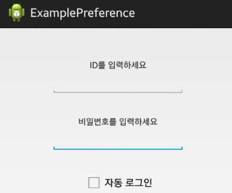
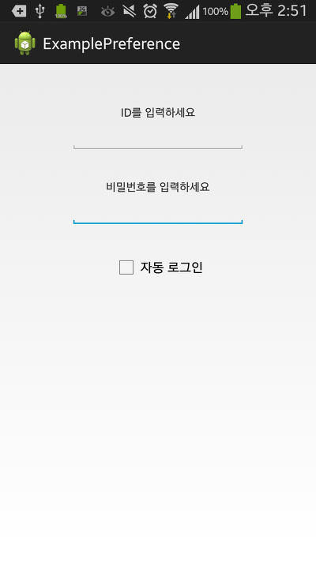
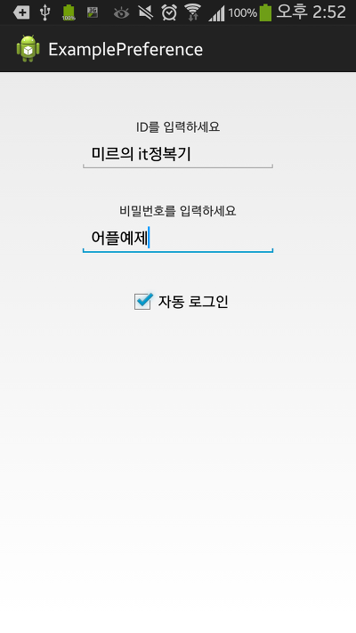

안녕하세요

약 한달만의 강좌인데 이는 시험기간으로 모든 머리를 시험에 쏟아부어서 그럽니다 ㅎㅎ;;

아무튼 이번 강좌부터 심호한 내용을 배울 예정입니다

그럼, 잘 따라와 주세요!!

## 21. Preference(프리퍼런스)

### 21-1 Preference란?

어플에서 사용자가 값을 변경했을때, 그 값을 저장하는 방법에는 무엇이 있을까요?

대표적으로 여기서 소개하는 Preference와 DB로 저장하는 방법을 찾을수 있습니다

DB로 관리하는 방법은 조금더 배운다음에 다룰 예정이고, 여기에서는 Preference에 대해 알아보겠습니다

위에서 말한대로 안드로이드에서는 프리퍼런스라는 것을 제공하고 있습니다

즉 이것을 사용하면 간단한 데이터를 저장하고 읽어올수 있습니다

그리고 이 방법은 xml으로 처리하기 때문에 동작속도가 조금 느린 단점이 있습니다

파일의 위치는 data/data/[패키지 이름]/shared_prefs에 저장되며

저장되는 방식은 키이름(Keyname)-저장된 값(value Pair)의 쌍으로 저장됩니다

### 21-2 동작 예시 화면과 예제

이해를 쉽게 하기 위해 예를 하나 들어보겠습니다

설정 화면 많이들 보셨나요?

Preference를 이용하면 이러한 설정을 구현할 수 있습니다

Preference를 사용하는 방법은 두가지정도 있는데요

(1) PreferenceActivity를 상속받아 사용하는 방법

(2) 상속받지 않고 어디서나 사용할 수 있는 방법

여기서 첫번째 방법은 강좌의 흐름에 따라 다음기회에 배워보도록 하고(사실 제가 완벽하게 몰라서 강좌를 쓸만한 지식이 쿨럭)

이번에는 두번째 방법을 설명할 예정입니다

### 21-3 사용방법 API

21-2에서 언급한 두번째 방법을 사용하는 순서는 아래와 같습니다

**정의하기(SharedPreferences) → 불러오기(getSharedPreferences) → 기록하기(editor)**

[1] Preference 정의

[2] Preference 불러오기

[3] Preference 기록하기

먼저 정의하는 방법입니다

SharedPreferences setting;

그다음 기록할 파일을 불러옵니다

setting = getSharedPreferences("setting", 0);

이때 앞에 있는 setting은 기록할 xml의 이름입니다

위에서 설명한대로 data/data/[패키지 이름]/shared_prefs에 저장되는대 이름이 setting.xml인 파일이 생성됩니다

즉 data/data/[패키지 이름]/shared_prefs/setting.xml이 생성됩니다

뒤에 있는 0은 무슨뜻을 뜻하는지 설명드리자면

0 : 읽기, 쓰기 가능

MODE_WORLD_READABLE : 읽기 공유

MODE_WORLD_WRITEABLE : 쓰기 공유

아직 모르셔도 되는 부분이고 그냥 0이 주로 쓰인다 라고 알아두시면 됩니다

[미르의 팁]

Q. getSharedPreferences이외에 다른 방법도 설명해 드릴께요

A. 주로 사용하는 방식을 굵은 표시 했습니다

(1) getPreferences(int mode) : mode를 설정한다는것은 getSharedPreferences와 같지만 xml파일이름이 현재 액티비티의 이름으로 설정됩니다

즉 액티비티 파일의 이름이 MirExample이라면 xml 파일 이름도 MirExample가 됩니다

**(2) getSharedPreferences("String name", int mode) : xml 파일의 이름과 mode를 모두 지정할 수 있습니다**

(3) PerferenceManager.getDefaultSharedPreferences(Context context) : 환경 설정 액티비티에서 설정한 값이 저장된 SharedPreferences의 데이터에 접근할 때 사용합니다.

마지막으로 설정값을 가져오는 방법입니다

setting.getBoolean(key, defValue);

setting.getFloat(key, defValue);

setting.getInt(key, defValue);

setting.getLong(key, defValue);

setting.getString(key, defValue);

자료의 타입마다 다른 명령으로 가져와야 합니다

(만약 Int로 저장해두고 Boolean으로 가져오면 강제종료 에러가 뜨게 됩니다)

저기서 key라는 것은 저장될 값의 이름인데요

맨 위에서 값이 저장되는 방식이 key-values라고 설명했습니다

이때의 key부분이 저기에 들어가는 key입니다

그다음 defValues는 만약 저장된 값이 없을경우 반환하게 되는 값입니다

그런대 설정값을 가져오는것만으로는 실제 사용이 불가능 합니다

값을 저장도 해야죠?

그래서 저장, 즉 기록을 위해 또 하나 editor라는 것을 정의해야 합니다

SharedPreferences.Editor editor;

이번에는 Editor라는것이 붙었습니다

editor= setting.edit();

이렇게 editor로 사용할때는 이미 정의한 SharedPreferences에 ".edit()"를 붙혀 이Preference의 에디터 역할을 할것이다 라고 해주시면 됩니다

사용방법은 아래와 같습니다

editor.putBoolean(arg0, arg1);

editor.putFloat(key, value);

editor.putInt(key, value);

editor.putLong(key, value);

editor.putString(key, value);

로딩과 마찬가지로 Boolean, Float, Int, Long, String이라는 형을 기록할 수 있습니다

마지막으로 값의 변동을 저장하기 위해서는 꼭!!! 아래와 같은 명령어가 필요합니다

**editor.commit();**

또는 editor.apply();

무조건 이 명령어가 처리되어야 실제로 xml에 값이 기록되게 됩니다

기록된 값을 지우는 방법은 아래와 같습니다

전체 제거 : editor.clear();

부분 제거 : editor.remove(key);

자, 이제 값의 불러오기와 저장까지 모두 할수 있게 되었습니다

그럼 실제 예제를 통해 살펴보겠습니다

### 21-4 이번에 만들 예제는?

혹시 자동로그인에 대해 아시나요?

로그인 하기 귀찮으신분들을 위해 자동 로그인 이라는것이 등장했습니다

실제 어플에서 자동 로그인에 프리퍼런스를 사용하는것은 루팅후, 데이터를 확인할 수 있기때문에

암호화 되어 DB로 보관하리라 생각되지만 이번 예제에서는 자동로그인과, 그에 대해 살펴보겠습니다

체크박스로 자동 로그인을 활성화 하면, 입력한 내용을 바로 저장하도록 하고,

체크를 해제하면 기록된 값을 지워 봅시다

### 21-5 레이아웃(layout)

필요한 레이아웃은 아래와 같습니다

1. TextView 2개 : id입력하세요, 비밀번호 입력하세요

2. EditText 2개 : ID입력하는곳, PW입력하는곳

3. CheckBox 1개 : 자동 로그인 체크

위와 같이 레이아웃을 만들어 주세요

### 21-6 자바소스 (Java)

처음에는 아래와 같은 코드가 필요합니다

EditText input_ID, input_PW;

CheckBox Auto_LogIn;

SharedPreferences setting;

SharedPreferences.Editor editor;

여기까지는 매번 같은 구조입니다

input_ID = (EditText) findViewById(R.id.input_ID);

input_PW = (EditText) findViewById(R.id.input_PW);

Auto_LogIn = (CheckBox) findViewById(R.id.Auto_LogIn);

**setting = getSharedPreferences("setting", 0);**

**editor= setting.edit();**

위 박스안에 있는 저 굵은 글씨를 봐주세요

새로 배운 코드 이므로 꼭 익숙해 지셔야 합니다

그다음에 CheckBox를 선택할때마다 호출할 리스너를 만들어 주세요

Auto_LogIn.setOnCheckedChangeListener(new OnCheckedChangeListener() {

@Override

public void onCheckedChanged(CompoundButton buttonView, boolean isChecked) {

// TODO Auto-generated method stub

if(isChecked){

String ID = input_ID.getText().toString();

String PW = input_PW.getText().toString();

**editor.putString("ID", ID);**

**editor.putString("PW", PW);**

**editor.putBoolean("Auto_Login_enabled", true);**

**editor.commit();**

}else{

*//**editor.remove("ID");*

*// editor.remove("PW");*

*// editor.remove("Auto_Login_enabled");*

**editor.clear();**

**editor.commit();**

}

}

});

항상 만든 리스너이지만 이번에도 새로운 코드가 추가되었습니다

위에서 배운대로 putString, putBoolean등을 사용하여 값을 집어넣고 있는데요

모든 설명은 위에서 마쳤습니다

그 아래 else부분을 봅시다

처음 세줄은 주석처리 되어 있습니다 그 이유는 모든 설정을 파괴할 것이니 일일히 써넣지 말고 한번에 지워버리는것이 코드 절약에도 좋습니다

이 소스에서 가장 중요한 부분은 editor.commit();입니다

위에서도 강조하였는대 저 코드가 없다면 실제로 변경된 내용이 반영되지 않는 경우가 생깁니다

(왜 설정이 변하지 않지? 하다가 저 commit()을 안해줘서 반영이 안된 사례도 많습니다)

이렇게 해서 기본적인 부분은 모두 마쳤는데요

한가지 빼먹은게 있습니다

바로 자동로그인을 설정하면 껐다 켜도 값이 유지되어야죠?

그 부분에 대한 코드를 짜보겠습니다

if(setting.**getBoolean**("Auto_Login_enabled", **false**)){

input_ID.setText(**setting.getString("ID", "")**);

input_PW.setText(**setting.getString("PW", "")**);

Auto_LogIn.setChecked(true);

}

중요한 부분을 강조 표시 하였습니다

첫번째 줄의 getBoolean은 Boolean타입의 데이터를 가져오겠다 라는 표시이고요,

처음에 실행을 하게 되면 설정된 값이 없습니다

그러므로 기본값인 false가 반환되어 처음 실행시에는 저 if문이 작동되지 않게 됩니다

두번째와 세번째 줄을 보면 getString이라고 되어 있는대 이렇게 ID값과 PW값을 불러와서 EditText에 setText로 적용하는 모습입니다

마지막으로 자동로그인이 활성화 되었으므로 CheckBox도 활성화 표시를 해줍니다

끝났습니다~

이제 작동을 확인해 보겠습니다

   

자동 로그인 체크박스를 선택하게 되면 입력한 값이 저장이 되고, 어플을 껐다 켜도 그 값이 유지됩니다 ㅎㅎ

이번시간에는 가장 간단한 프리퍼런스 사용방법을 익혀 봤는데요

조금 시간이 지난후에는 좀더 복잡한 프리퍼런스 사용법과 일명 설정화면?

시스탬의 설정 어플과 비슷한 프리퍼런스에 대해 알아보겠습니다

이 강좌의 예제소스는 22번 강좌가 나오는 즉시 업로드 됩니다

카페에서는 원본글에서만 다운로드가 가능합니다

예제소스 다운로드 :

[ExamplePreference.zip](https://github.com/itmir913/archive/releases/download/itmir-attachments/ExamplePreference.zip)

(ps. 몇일뒤에 20번 강좌 핸들러 메모리 릭을 수정한 강좌를 올릴 계획입니다만 변경될수 있습니다)

(ps2. 정말 힘들게, 유용한 정보만 골라서 몇시간동안 찾아 올리고 있습니다 꼭 덧글한마디씩 해주시면 감사드리겠습니다)

참조 : http://blog.naver.com/liar1938/30173930915

---

## 첨부파일

- [ExamplePreference.zip](https://github.com/itmir913/archive/releases/download/itmir-attachments/ExamplePreference.zip) `636 KB`
