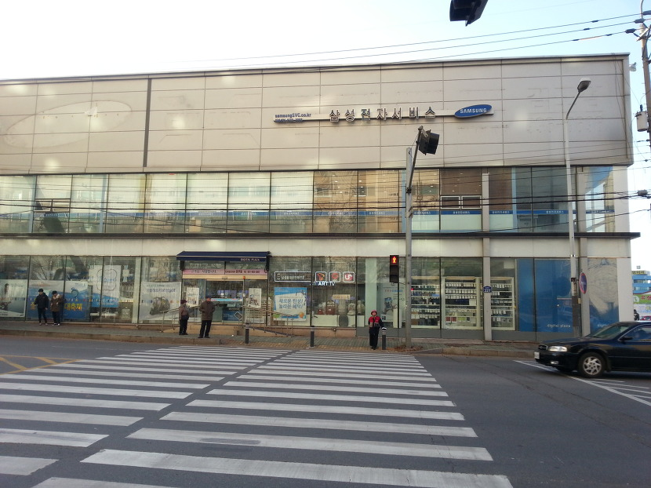
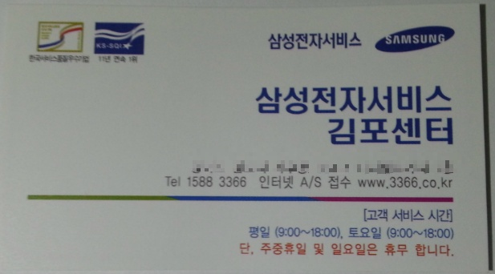
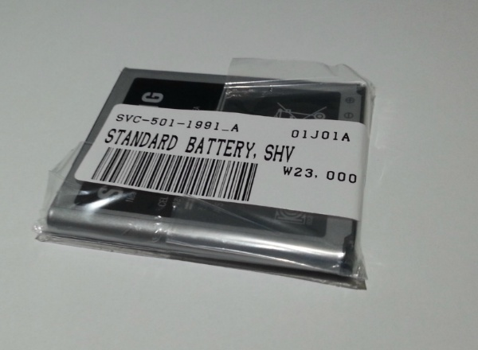
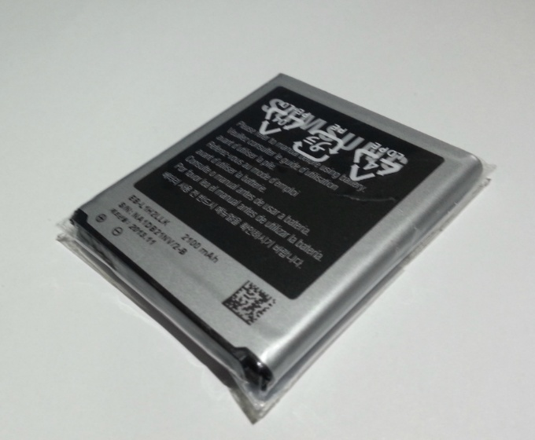
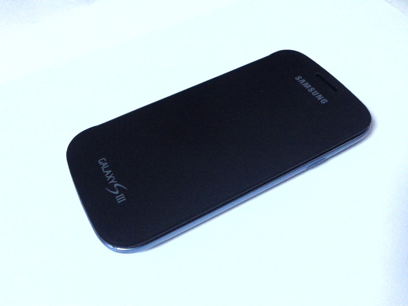
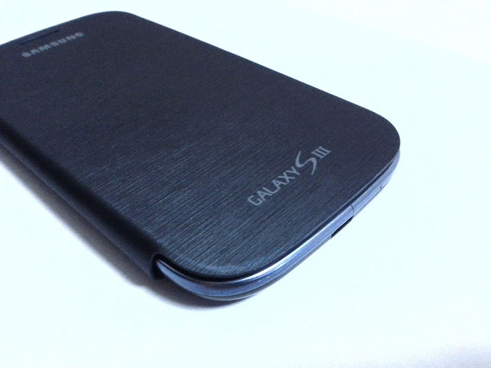

갤럭시s3의 배터리 케이스가 유격이 있는지 부러졌는지 잘 닫히지 않는 현상이랑,

배터리 한 개가 부풀어서 그거 교환하려 갔습니다.

아쉽게도 내부는 못찍었네요;

기다리고 있는 중간에 찍으려고 했는데, 기다리는 시간이 없었어요 ;;

이렇게 생겼습니다ㅎ

명함도 가져왔는데요. 다들 친절하시더군요~

약간 부푼 배터리는 교환해 왔습니다. ㅎㅎ

정가는 \23,000이나 하는데, 너무 비싸네요.

가는 김에 플립커버? 그 케이스 있는 커버도 교환해서 왔습니다.

영수증이 필요할 거 같았는데, 아무튼 무상으로 교환해 주시더군요.

으어~~~~~

마지막 사진 너무 잘찍지 않았나요?ㅋㅋㅋㅋㅋㅋㅋㅋㅋㅋ

블로거들이 리뷰할때 자주 쓴다던 방법을 해봤는데, 나름 괜찮네요. ㅎㅎ

너덜너덜해진 케이스를 새 걸로 바꿨습니다. ㅎㅎ

아무튼 한마디 : 요즘 모든 서비스 센터가 친절해진거 같아요. ㅎㅎ
