안녕하세요

전에 adb를 이용한 백업/복원 방식과, 프로그램을 소개해 드린바 있습니다.

[2013/10/08 - [SmartPhone] - ADB Backup & Restore (adb를 이용한 어플 데이터 백업)](/archive/itmir/2013/356)

이번에는 Helium이라는 어플을 소개하려고 합니다.

이 어플은 ClockWorkMod에서 만든 어플인대요.

일명 CWM으로 불린 커스텀 리커버리를 만든 곳에서 출시한 어플입니다.

일단 이 어플은 **루팅이 필요 없는** 어플입니다.

그래서 티타늄 백업처럼 모든 어플을 백업할수는 없고, 일부 백업이 금지된 어플도 불가능합니다.

처음실행시에 컴퓨터와 USB가 필요합니다.

백업과 복원을 사용하기 위해서는 PC용 프로그램과 어플을 다운받아야 하는대요.

마켓에서 다운로드 하실수 있습니다.

[http](http://play.google.com/store/apps/details?id=com.koushikdutta.backup)[://play.google.com/store/apps/details?id=com.koushikdutta.backup](http://play.google.com/store/apps/details?id=com.koushikdutta.backup)

그다음 PC용 프로그램은 아래 링크에서 다운로드가 가능합니다.

<http://clockworkmod.com/carbon>

이제 모든 준비가 갖춰졌다면 시작해 보겠습니다.

어플을 처음 실행하면 아래와 같은 알림이 나타납니다.

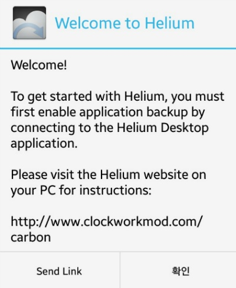

이 알림 이후 루팅 유저라면, 루트 권한을 얻는 창이 나타날것이며, 순정 유저라면 PC와 스마트폰을 USB로 연결해 달라는 문구가 나타납니다.

루팅을 안하고 어플 백업,복원하는 것이 목표이므로 PC와 USB로 연결하는 작업은 꼭 필요합니다.

(애초에 루팅을 했으면 이런거 쓸 필요없이 CWM백업이라는 막강한 백업이..;)

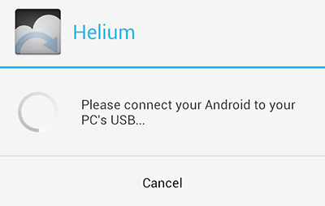

USB로 연결해 주시면 됩니다.

그다음은 PTP모드 활성화 입니다.

MTP로 설정되어 있다면 아래와 같은 알림이 뜨며 PTP설정을 할 수 있는 버튼을 제공하고 있는대요.

한번 살펴 봅시다.

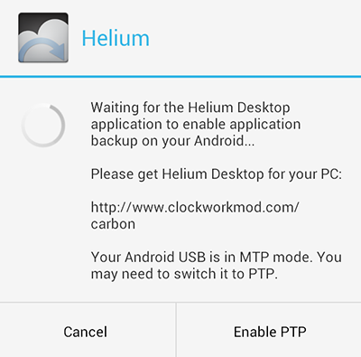

이 알림에서 Enable PTP를 눌러주세요.

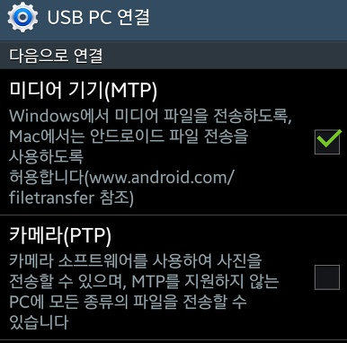
   

미디어 기기(MTP)대신에 카메라(PTP)를 선택해 주세요.

오른쪽 화면처럼 정상적으로 인식되었다면 디지털 카메라 라고 나타납니다.

이제 PC용 프로그램을 다운로드 한다음 설치해 주시면 됩니다.

다운로드 링크가 터질 경우를 대비하여 첨부해 뒀습니다.

(2013-11-29 기준 최신)

[CarbonSetup.zip](./file/CarbonSetup.zip)

어플내에서는 아래와 같은 알림이 뜨며 기다리고 있습니다.

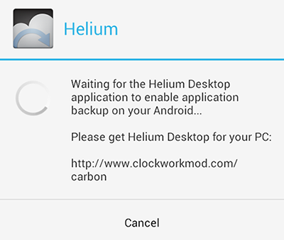

프로그램을 실행해 주시면 연결 확인이 나타납니다.

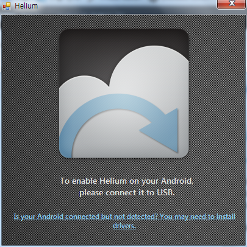

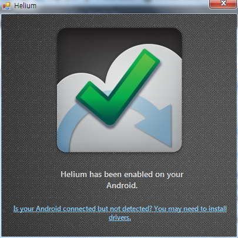

연결을 확인해 주시면 다시 어플로 넘어와 주세요.

활성화 되었다는 알림이 나타납니다.

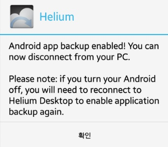

이 알림 이후에는 컴퓨터와의 연결을 중지하셔도 됩니다.

재부팅 전까지 이 어플을 사용하여 백업과 복원 작업을 할수 있으며

재부팅 이후에는 이 작업을 다시 해 주셔야 합니다.

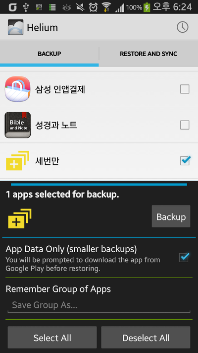
   
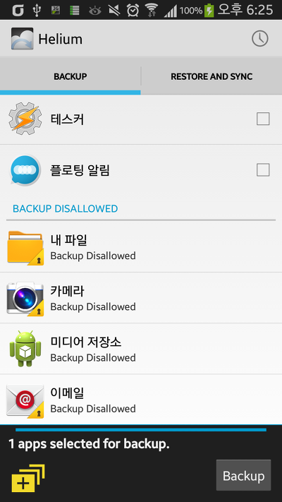

어플을 선택하여 Backup버튼을 누르면 백업이 가능합니다. (왼쪽 사진)

만 위에서 말씀드린대로 일부 어플의 경우는 백업이 불가능 합니다. (오른쪽 사진)

백업이 안되는 이유를 찾아보자면 AndroidMenifest.xml에서 백업 관련 설정을 false로 했을경우에 안될수 있다고 합니다.

그리고 유료 어플 추출방지도 이런 원리가 아닐까 생각합니다.

출처 : <http://thdev.net/485>

그 다음으로 복원도 가능합니다.

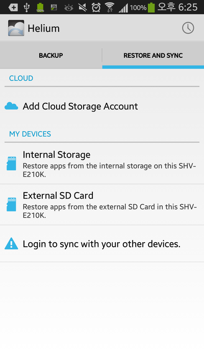

Cloud 백업같은 경우나 내폰끼리 백업같은 경우는 유료버전에서 지원하고 있습니다.