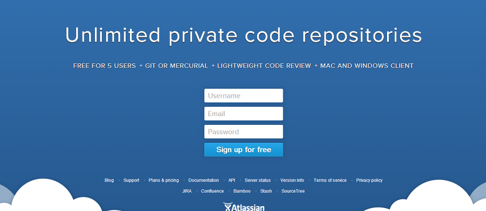
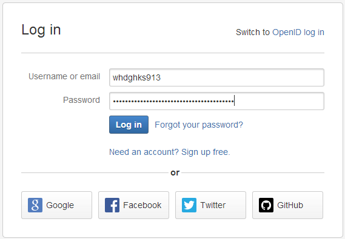
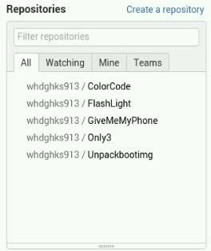
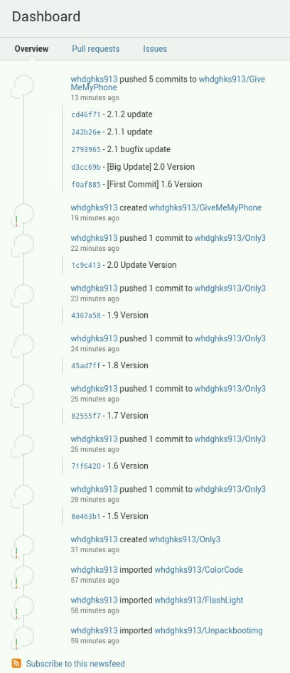
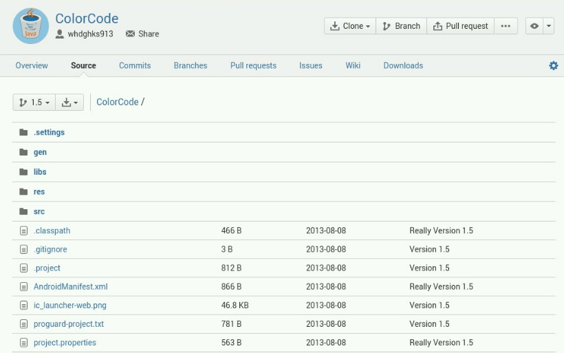
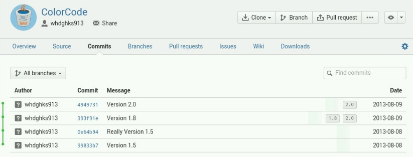

아주 전에 github사용법에 대해 포스팅한 글이 있습니다.

[Git 사용 방법](http://itmir.tistory.com/192)

[github에 branch를 새로 생성하여 소스를 올려보자](http://itmir.tistory.com/193)

[Github 사용방법](http://itmir.tistory.com/38)

그런대, github의 최대 단점은 비공개 프로젝트를 만들수 없다라는 점입니다.

제가 만든 어플의 소스를 업로드할 곳이 필요했으나, 클로우즈 소스로 만든 어플 소스를 github에 올릴수도 없는 노릇이었습니다.

그래서 무료 git사이트를 찾아본 결과 Bitbucket이라는 사이트를 찾아냈습니다.

사이트 주소 : <https://bitbucket.org/>

**완전 무료 비공개 프로젝트**와 github와 비슷한 UI로 제 맘에 쏙들었습니다.

한번 들여다 보겠습니다.

심플한 UI, 직관적으로 나와 있습니다.

로그인 해주시고..

저렇게 Repo를 만들수 있습니다.

저 사진에는 안보이지만 Only3와 GiveMeMyPhone은 private repo입니다.

구글 대쉬보드처럼 활동 내역을 한번에 확인이 가능하고...

한눈에 소스도 확인이 가능합니다.

github와 비슷해요. UI도.

commit도 정리가 잘 되어 있습니다.

이렇게 Bitbucket에 대해 알아봤습니다.

저는 이제 github에서 갈아 타렵니다. ㅎㅎ

+추가.

이제 github도 비공개 프로젝트를 무료로 만들 수 있습니다!

그래서 저는 다시 github로 돌아왔네요...
