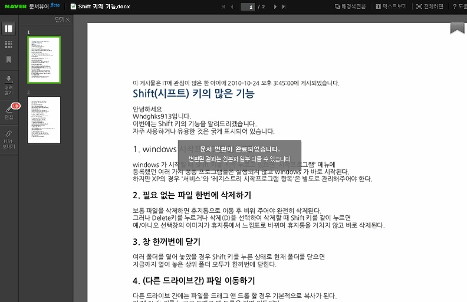
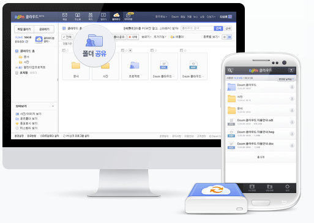
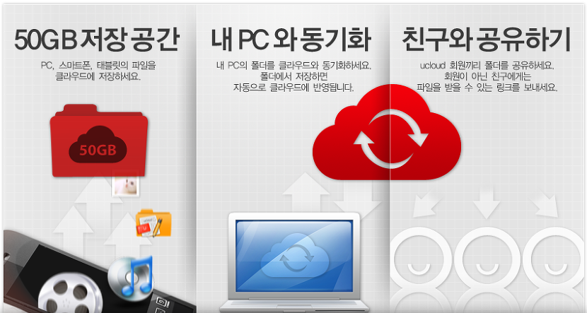
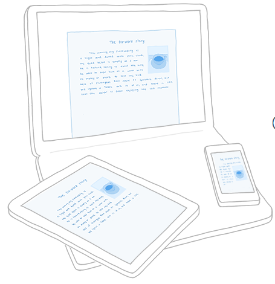

우리가 사용할 수 있는 클라우드 저장소 서비스는 엄청 많습니다

이번에는 이 클라우드 서비스에 대해 장단점과 활용 방법을 알아보겠습니다

**1. 네이버 N드라이브**

N드라이브는 네이버 사용자라면 바로 사용할 수 있는 클라우드 저장소 입니다

홈페이지 주소는 <http://ndive.naver.com/> 이며 현재 30GB의 용량을 제공하고 있습니다

또한 유료로 돈을 내면 공간을 더 추가할 수 있습니다

\*장점

빠른 속도(국내 서버라 속도가 월등히 빠릅니다)

네이버와의 연개성(네이버의 다른 서비스와 엄청나게 많이 연동이 가능합니다)

네이버 오피스로 PC에서 바로 문서 확인이 가능하다

N드라이브 탐색기로 하드디스크 용량 차지가 없다

*동영상이나 다른것들 인코딩이 필요 없다* (앱 업데이트 이후 미디어 플레이어 라는 또다른 앱을 받아야만 스트리밍이 됩니다 ;;)

\*단점

가끔식 탐색기 프로그램이 뻑간다

온라인이 아니면 아에 무용지물이 된다 (모든 클라우드가 마찬가지지만)

저장공간이 다음 클라우드에 비해 작다

공유 인원(30명)과 일부 파일의 공유가 제한된다

N드라이브는 네이버 오피스로 바로 문서 확인이 가능합니다

이렇게 바로 띄울수 있어요

**2. 다음 클라우드**

다음 클라우드는 네이버 N드라이브와 다른게 있다면 용량입니다

50GB의 용량을 무료로 제공합니다

<http://cloud.daum.net/>

이 클라우드에서 내세우고 있는것은 "어디서나 바로 열어볼수 있는 내 폴더" 입니다

이에 맞게 싱크 프로그램을 이용하면 [다음 클라우드 = PC1의 폴더 = PC2의 폴더]와 같이 만들수 있습니다

\*장점

일단 용량이 큽니다

빠른 속도(국내 서버라 속도가 월등히 빠릅니다)

PC 싱크 프로그램을 이용하며 클라우드와 한 폴더의 상태를 같게 유지할수 있다

웹에서 로딩속도가 상당히 빠릅니다

\*단점

하드 디스크 용량을 클라우드에 저장된 파일의 용량대로 잡아먹습니다

음원(mp3)파일을 다운로드 할수도, 재생할수도 없다고 합니다 출처 : [클릭](http://kin.naver.com/qna/detail.nhn?d1id=1&dirId=1060108&docId=183032845&qb=7YG065287Jqw65OcIOyepeygkA==&enc=utf8&section=kin&rank=1&search_sort=0&spq=0&pid=Rprptc5Y7v4ssvNo7e8sssssssh-314821&sid=UprmfnJvLCoAACHkFZk)

처음에는 동기화 시간이 오래걸릴수 있습니다

어플에서, 동시에 두가지 이상의 파일 업로드가 불가능 합니다

**3. U클라우드**

유클라우드는 kt인터넷, 집전화, 스마트폰을 사용하고 있는 조건에 충족되면 50GB를, 기본으로는 2GB를 사용이 가능합니다

스마트폰용 어플과 PC프로그램 모두 지원하고 있지만 스마트폰 어플의 UI는 정말 구려서 쓸게 못됩니다 가장 쓰래기예요 이건 뭐...

<http://ucloud.com/>

개인적으로 U클라우드는 그냥 큰 자료 저장창고 외엔 주로 안씁니다

그래도 PC싱크 프로그램이 잘 되어 있다는 소문도 있습니다

\*장점

KT사용자라면 50GB가 무료이다

ucloud에 올린 동영상을 올레TV에서 시청이 가능하다 (만 해본결과 안씁니다 성능도 않좋고)

매직폴더와 싱크, 모바일 사진등 다양하게 동기화 할수 있다

\*단점

정말 구린 어플 UI - 와... 이따구로 디자인을 하다니 전 정말 맘에 안듭니다

올레 TV로 하루에 볼수 있는 영상수 제한, 인코딩 대기시간 (3개였나 그럴겁니다)

**4. DropBox**

드롭박스는 루익, 아스트로, es파일탐색기등의 클라우드 지원 탐색기와 구글, OTA등등 엄청나게 많은 서비스에서 드롭박스 API를 통해 다양한 활용이 가능합니다

또한 apk, mp3등의 모든 파일 공유가 가능합니다

단점이 있다면 정말 적은 용량과 정말 느린 속도....

<https://www.dropbox.com/>

\*장점

직관적이고 빠른 UI

동기화 프로그램 (양방향, 업로드만, 다운로드만, 복제 등등) - dropsync라는 어플로 양방향 파일 관리가 가능합니다

정말 많은 OS에서 지원되는 어플과 프로그램

\*단점

정말 작은 용량 (기본 2GB에다가 추가가 가능 하지만 힘듬)

정말 느린 속도 (해외 서버라 정말 느립니다)

505, 404오류 (사용자가 많으면 링크가 터집니다;;;)

여기까지 제가 주로 사용하는 클라우드였습니다

아래는 기타 클라우드 서비스와 용량, 사이트에 대해 알아보겠습니다

Google Drive - 15GB - <http://drive.google.com>

VEGA CloudLive - 16GB - <https://cloudlive.co.kr>

Box - 15GB - <https://www.box.com>

퀴우 360 - 36TB - <http://c9.yunpan.360.cn/my/index/>

텐센트 - 10TB - <http://www.weiyun.com/disk/index.html?WYTAG=weiyun.portal.index>

바이두 - 2TB - <http://pan.baidu.com/disk/home>

아래에 있는 세게의 클라우드는 중국의 클라우드 서비스 입니다

이 서비스는 TB로 째째하게 2GB만 주는 드롭박스와 달리 최대 36TB나 줍니다 ;;

저는 중국 클라우드까지 합쳐서 86278.26 GB (84.256113 TB)나 쓰고 있고

중국 클라우드 제외하면 262.26 GB (0.256113 TB)나 쓰고 있네요ㅎ

특히 바이두 클라우드는 오프라인 다운로드가 가능해서 속도가 느린 해외 롬 다운로드 링크를 입력하면 자동으로 다운로드를 마쳐줍니다

sdcard를 통채로 백업하기도 하고, 파일 링크생성 기능을 통해 빠른 파일 공유도 가능합니다

또한 하드 디스크를 통채로 업로드 할수도 있고, 용량이 큰 펌웨어 저장창고, 스마트폰 삼성 kies백업본을 전체 업로드 할 수도 있습니다

스마트폰이 등장한지 4년이 지났습니다

이제 클라우드 서비스도 엄청나게 발전했는대요

클라우드 서비스를 지혜롭게 사용해봐야 겠습니다
