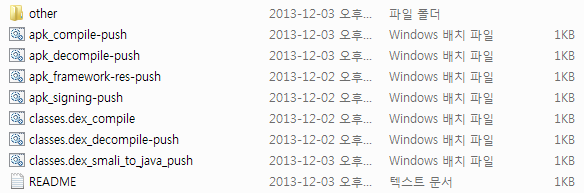

GUI 프로그램을 포스팅했습니다 : [[SmartPhone/Android] - Apk Easy Tool - Apk GUI 디컴파일 도구](https://itmir.tistory.com/672)

apk dex Tool

apk와 classes.dex를 저 Windows 배치파일(bat)에 투척하여 사용할수 있는 툴입니다

복잡한 ApkManager보다 간단하며, 빠르게 작업이 가능합니다

기능 설명

\*공통 : 이름에 push가 있어야 투척(드래그&드롭)을 할 수 있습니다

또한 작업파일(apk, classes.dex)은 같은 폴더에 있어야 합니다

apk\_compile-push : 컴파일을 하는 파일이며, 디컴파일후 컴파일할 apk파일을 드래그&드롭 하면 됩니다

apk\_decompile-push : 디컴파일을 하는 파일이며, 디컴할 apk를 드래그&드롭 하면 됩니다

디컴파일된 파일은 project/(어플 이름) 폴더에 생성됩니다

apk\_framework-res-push : ApkManager의 10번 디컴파일과 같은 옵션으로 시스탬 어플의 경우 framework-res.apk가 필요한 어플에 한하여

framework-res.apk를 드래그&드롭 하면 됩니다

apk\_signing-push : 사인할 어플을 드래그&드롭 하면 됩니다

classes.dex\_compile : classes.dex를 컴파일하는 파일이며 먼저 디컴파일후 실행하세요, smali폴더를 classed.dex로 변환합니다

완성된 파일은 compile\_classes.dex 입니다

classes.dex\_decompile-push : 디컴파일할 classes.dex를 투척해 주세요

classes.dex\_smali\_to\_java\_push : classes.dex를 jar파일으로 변환한다음 원본 java코드를 볼때 사용합니다 classes.dex를 투척해 주세요

[apk\_dex\_tools\_whdghks913.zip

다운로드](./file/apk_dex_tools_whdghks913.zip)

[apk\_intstall-push.bat

다운로드](./file/apk_intstall-push.bat)

---

## 첨부파일

- [apk_dex_tools_whdghks913.zip](https://github.com/itmir913/archive/releases/download/itmir-attachments/apk_dex_tools_whdghks913.zip) `6.9 MB`
- [apk_intstall-push.bat](./files/apk_intstall-push.bat)
