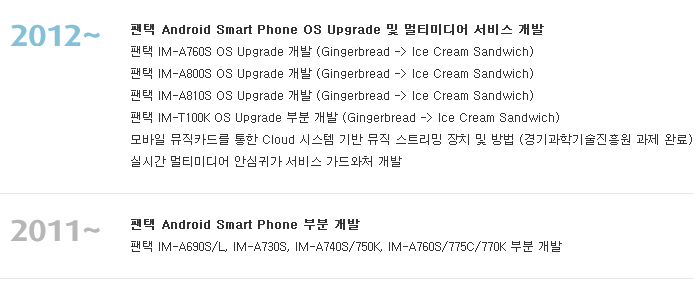
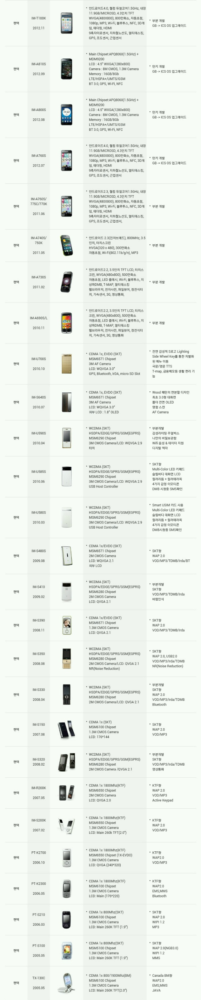

이 내용은 SDA 카페에서 언급되었던 내용입니다.

안드로이드 기기가 돌아가기 위해 필수적인 요소중 하나가 커널입니다.

이 커널이라는것은 만들때, 커널 버전에 커널을 빌드한 사용자 이름이 들어가게 됩니다.

그런대 팬택에서 담당했다면 pantech이나 p로 시작하는것이 맞을탠데,

@novapex-desktop

@seoultek-build

이렇게 다른 회사의 이름같은 문구가 적혀 있습니다.

위 두곳의 회사 이름을 추적하여 두 곳의 사이트를 발견할수 있습니다.

[http://www.novapexmobile.com](http://www.novapexmobile.com/)

<http://seoultek.com/>

이중 위에 있는 novapex사이트의 연혁을 보면 아래와 같은 내용을 발견할 수 있습니다.

확인을 위해 두 곳 모두 전화를 해서 진실 여부를 따져봤습니다.

novapex에서는 ICS는 담당하였지만, 계약 기간이 끝나서 더이상 담당하고 있지는 않아 JellyBean은 담당하고 있지 않다고 합니다.

seoultek에선 ICS과 JB모두 담당하지 않았다고 하였는데, ICS을 하였는지는 말이 모호해 정확하게 담당하였는지는 모르겠습니다.

또한 novapex의 연구 개발 실적란을 확인해도 아래와 같은 정보를 확인할 수 있습니다.

[

http://www.novapexmobile.com/about\_us/rnd.html](http://www.novapexmobile.com/about_us/rnd.html)

즉 업데이트 일부(또는 전체)를 맡아서 진행한건 외주 업체가 됩니다.

다른 업체에게 부탁하는것은 잘못된 건 아니라 생각되지만, 마무리로 최적화 하는건 본사가 하는게 아닐까 생각합니다.

ps. 다른 회사에게 부탁했다고 팬택 까는 사람분들은 이해가 안됩니다 ;
