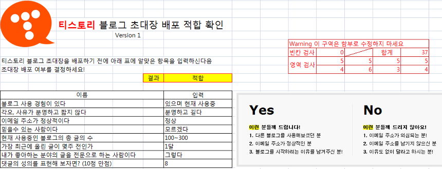
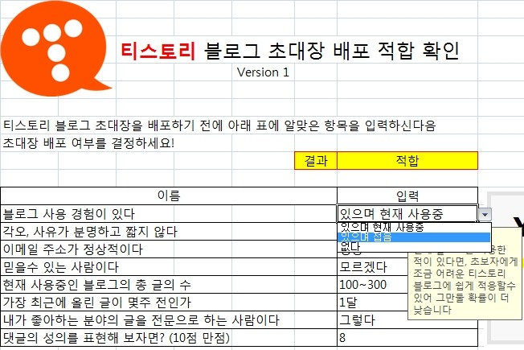
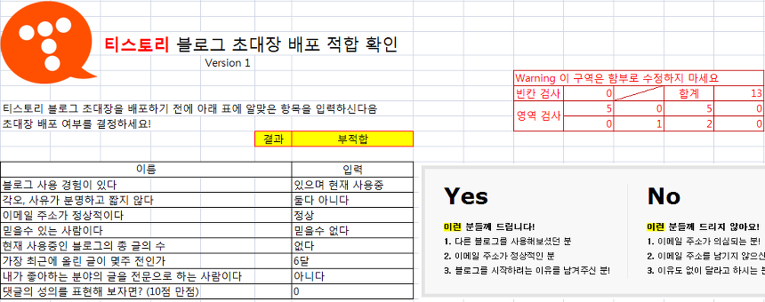

안녕하세요

티스토리는 특이하게도 초대장 이라는 것을 사용하고 있습니다

이 초대장은 얻기도, 만들기도 어렵죠

그래서 블로거들은 생긴 초대장을 아무에게나 기부하려 하지 않으려고 합니다

이 사람이 받을 자격과 끈기가 되는가? 를 판단하기 위해 엑셀을 사용하여 만들어 봤습니다

위와 같은 모습을 가지고 있으며 8개의 물음에 모두 답하게 되면 적합 여부를 판단후 알려줍니다

입력란에는 위처럼 선택박스가 나타나서 쉽게 선택할수 있도록 도와줍니다

너무 아니다 하면 부적합 판정을 내립니다

엑셀 조금 하신다 하는분들이 보시면 바로 원리를 아실수 있을탠대요

각 입력한 항목마다 나름대로 점수를 매겨, 그 매긴 점수의 합을 가지고 적합/부적합 여부를 따지게 됩니다

오른쪽 빈칸검사나 합계같은것은 그냥 결과에 합쳐버릴수도 있으나 그럴경우 너무 코드가 길어지기 때문에 따로 분리하였고

영역 검사까지 합치면 너무 길어져서 나중에 수정에도 곤란하고 가독성도 떨어지기에 모두 분리하였습니다

[티스토리 초대장 배포 적합.xlsx](./file/티스토리 초대장 배포 적합.xlsx)

---

## 첨부파일

- [티스토리 초대장 배포 적합.xlsx](https://github.com/itmir913/archive/releases/download/itmir-attachments/406-tistory-invite.xlsx) `48 KB`
