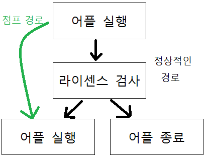
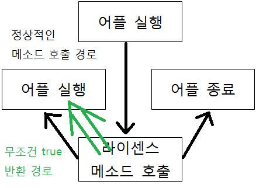
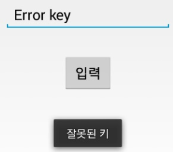
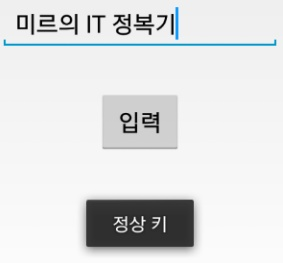
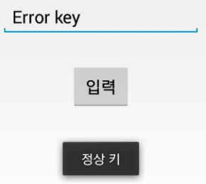

- 안내

제게 크랙을 부탁하는 메일을 전송하지 마세요.

※ 주의

1. 유료 어플의 크랙파일 배포는 저작권 법에 의해 처벌될 수 있습니다.

2. 크랙한 apk파일은 배포하지 마세요.

3. 이 강좌를 따라해서 발생하는 모든 문제는 여러분께 있으며 이 방법이 100% 만능 방법은 아닙니다.

4. 모든 어플이 이 글과 같은 구조가 아닙니다. 그건 스스로 파악하셔야 합니다.

5. 이 글은 링크로만 전해주시고 그대로 퍼가지 마세요.

안드로이드 어플을 사용하다 보면, 사용할 수 있는 기기를 제한한다던지, 마켓에서 라이센스를 확인하여 실행을 막던지하는 어플이 많이 있습니다.

그 예로 기기를 제한하는 경우는 [전에 크랙한 V노트](https://itmir.tistory.com/407)가 있겠고, 라이센스 확인은 대표적으로 [파워 앰프 앱](/archive/itmir/2014/463)이 존재합니다.

(파워앰프는 난독화가 되어 있어, 디컴파일도 안되는점 이해하시고, 크랙이 잘 안됩니다. 삽질하지 마시길....)

이런 어플들이 언제까지나 크랙되지 않는다면 안심이고 다행이지만, 안타깝게도 안드로이드는 java를 이용하여 어플을 만들기 때문에 디컴파일/분해가 가능합니다.

즉 네이티브로 만들지 않는이상 모든 안드로이드 어플이 이론 상 뚤릴 수 있습니다.

이번에는 주로 사용되는 크랙방법과, 제가 주로 사용하는 크랙방법에 대해 모두 다뤄보겠습니다.

다시한번 말하지만 **이 방법을 사용하여 어플을 크랙한뒤에, 그 파일을 절대 배포하지 마세요. 필자는 여러분의 법 위반을 책임질 수 없습니다.**

**학습용으로만 이 글을 읽어주시고, 앱의 보안을 향상시키기 위해 이 글을 읽어주세요.**

그럼, 시작하겠습니다.

제가 사용하는 앱 크랙 방법에는 몇 가지 종류가 있습니다.

그 중에서 이 글에서는 대표적인 두 가지 방법만 다뤄보겠습니다.

1. 건너뛰기 (점프)

2. 무조건 true반환

(각각 이름은 제가 직접 지은 것으로 전문 용어가 아닙니다.)

두 가지로 분류하였지만 사실상 다 비슷한 방법이며, 경우에 따라 두 가지를 모두 써야 할 수도 있습니다.

먼저 첫 번째 방법인 건너뛰기(점프)부터 해보겠습니다.

## 1. 체크 부분 건너뛰기 (점프)

첫 번째인만큼 간단하게 기기명을 검사하는 부분을 점프해보도록 하겠습니다.

이는 저번 포스팅에서 다룬 V노트의 기기명 검사를 우회하는 방법과 같습니다.

[[Application] - [APP] 베가 V 노트 전기종 설치 (VEGA VNote)](https://itmir.tistory.com/407)

기기명 검사의 원리는 아래와 같습니다.

즉, java파일에서 기기명을 가져옵니다.

그 다음 가져온 값을 확인하여 정상일경우 통과, 아닐경우 알림 또는 토스트를 띄우고 종료하는 거죠.

점프의 원리는 어떠한 경우에도 어플이 실행될 수 있도록 검사 부분을 통과하는 겁니다.

이 방법은 대부분의 어플에서 사용이 가능합니다.

점프를 그림으로 표현하면 아래와 같습니다.

이렇게 라이센스 검사를 아에 패스해 버리는 거죠.

여기서 팁 하나 드리겠습니다.

어떤 개발자든 어플 종료로 넘어갈때는 알림을 띄우게 되있습니다.

사용자에게 어떠한 고지도 없이 종료할 경우, 관련 지식이 없는 사용자는 분명히 버그라고 리포트할 것이기 때문입니다.

저 글자는 R.string으로 가져오므로, res/values-ko/string.xml을 찾아보면 나옵니다.

이제 string의 이름 not\_support\_device을 res/values/public.xml에서 찾아주세요.

마지막으로 id값인 0x7f0b01cd을 smali폴더에서 찾아주시면, 저 문장을 띄우는 곳이 어디인지를 알 수 있습니다.

라이센스 체크 부분이 어디인지 발견했으면, 이제 수정해 봅시다.

.method public onCreate(Landroid/os/Bundle;)V

    // 윗부분 코드 생략

    .line 65

    :cond\_0

    sget-object v4, Landroid/os/Build;->**MODEL**:Ljava/lang/String;

    // **[01] 부분**

    // 기기명을 가져오는 부분

    const/4 v5, 0x2

    invoke-virtual {v4, v6, v5}, Ljava/lang/String;->substring(II)Ljava/lang/String;

    move-result-object v2

    .line 67

    .local v2, "modelName":Ljava/lang/String;

    const-string v4, "IM"

    invoke-virtual {v2, v4}, Ljava/lang/String;->**equals**(Ljava/lang/Object;)Z

    move-result v4

**if-nez v4, :cond\_2**

    // **[02] 부분**

    // 정상적이면 cond\_2로 점프해서 어플 종료 부분을 건너뜁니다

.line 69

    const v4, **0x7f0b01cd**

    // 아까 찾은 어플 종료 토스트 문구

    invoke-static {p0, v4, v7}, Landroid/widget/Toast;->makeText(Landroid/content/Context;II)Landroid/widget/Toast;

    move-result-object v4

    invoke-virtual {v4}, Landroid/widget/Toast;->show()V

    // **[03] 부분**

    // 토스트 알림을 띄웁니다

    .line 70

    invoke-virtual {p0}, Lcom/pantech/app/skypen\_extend/page/SkyPenLauncher;->finish()V

    // **[04] 부분**

    // 어플을 종료합니다

    .line 105

    :cond\_1

    :goto\_0

    return-void

    .line 74

**:cond\_2**

    // **[05] 부분**

    // 이 부분으로 넘어와야 어플이 정상 실행됩니다

    sget-boolean v4, Lcom/pantech/app/skypen\_extend/SkyPenFeature;->USE\_MARKET:Z

    // 아래 코드 생략

.end method

위 코드는 onCreate메소드 안에 있는 코드입니다.

onCreate는 어플이 실행될때(자세하게는 액티비티가 실행될 때) 처음으로 호출되는 메소드 입니다.

[01] 부분을 봐주세요.

저부분이 현재 기기의 모델명을 가져오는 부분입니다.

[03] 부분이 토스트 알림을 띄우는 부분이고,

[04] 부분이 어플을 종료하는 부분입니다.

[02] 부분에서 equals이라는 것이 등장하는데, equals은 같다라는 뜻입니다.

그 아래 **if-nez v4, :cond\_2**을 주목해서 볼 필요가 있습니다.

smali문법을 잠시 확인해 보면,

if-nez v0, :cond\_0

v0 값이 0이 아니라면 cond\_0 으로 넘어간다.

라는 뜻입니다. (맨 아래 smali 문법 참고)

v0, v1....이 smali에서 순서대로 붙는 변수 이름이라는것을 생각해보고,

cond\_0으로 점프한다는 것을 생각하면,

if-nez v4, :cond\_2

이 문구가 정말 중요하다는 것을 알 수 있습니다.

[05] 부분으로 넘어가야 어플이 정말로 실행되는데요.

그렇다면 저 if문에서 아래부분 [04]를 생략하고 [05]부분으로 점프해야 합니다.

방법은 두 가지 정도 있습니다.

어플을 종료하는 부분을 지워버리던가, 점프를 하는 if문에서 어떤 값이든 true가 나오도록 하던가.

전자의 경우 잘 맟춰가며 지워버리면 되고, 후자의 경우 if-nez의 반대인 if-eqz을 추가하면 됩니다. (smali의 if를 살펴볼려면 맨 아래로 스크롤하세요.)

.method public onCreate(Landroid/os/Bundle;)V

 // 윗부분 코드 생략

    .line 65

    :cond\_0

    sget-object v4, Landroid/os/Build;->MODEL:Ljava/lang/String;

    const/4 v5, 0x2

    invoke-virtual {v4, v6, v5}, Ljava/lang/String;->substring(II)Ljava/lang/String;

    move-result-object v2

    .line 67

    .local v2, "modelName":Ljava/lang/String;

    const-string v4, "IM"

    invoke-virtual {v2, v4}, Ljava/lang/String;->equals(Ljava/lang/Object;)Z

    move-result v4

    if-nez v4, :cond\_2

if-eqz v4, :cond\_2

    .line 69

    const v4, 0x7f0b01cd

    invoke-static {p0, v4, v7}, Landroid/widget/Toast;->makeText(Landroid/content/Context;II)Landroid/widget/Toast;

    move-result-object v4

    invoke-virtual {v4}, Landroid/widget/Toast;->show()V

    .line 70

    invoke-virtual {p0}, Lcom/pantech/app/skypen\_extend/page/SkyPenLauncher;->finish()V

    .line 105

    :cond\_1

    :goto\_0

    return-void

    .line 74

    :cond\_2

    sget-boolean v4, Lcom/pantech/app/skypen\_extend/SkyPenFeature;->USE\_MARKET:Z

    // 아래 코드 생략

.end method

제일 간단하게 한 문구를 추가해서 0이든 0이 아니든 cond\_2로 점프할수 있도록 수정하면 됩니다.

if를 지우고 goto를 사용하여 어떤 경우든 통과되도록 작업해도 될거라 예상합니다.

goto :cond\_2

이렇게 점프 방법을 알아봤습니다.

if문을 프로그래밍적으로 작업 실행 흐름 제어의 용도로 많이 쓰는데요.

smali에서 if는 ~이면 -으로 건너뛴다의 의미가 강하기 때문에 제가 "점프한다."고 지칭했습니다. 다시 말씀드리지만, "점프"라는 말은 다른 자료를 하나도 참고하지 않은 상태에서 제가 임의로 명명한 것이기 때문에 정식 용어는 아닙니다.

java로 짠 앱을 디컴파일 해보면 java의 if-else가 smali에서 if-nez등으로 표현됩니다.

건너뛴다는 의미로 해석하면 쉬우므로 제가 이 방법을 명명할 때 점프기법이라고 명명했습니다.

## 2. 무조건 true 반환

두번째 방법은 메소드에서 무조건 true를 반환하도록 하는 방법입니다.

이렇게 어플을 실행한후 라이센스 메소드를 호출하여, 그 메소드에서 true, false값을 반환하는 어플의 경우 어울리는 방법입니다.

(코드 수정이 대부분 간단)

무조건 true 반환 예제는 직접 만들어 사용했습니다.

먼저 java소스코드를 보겠습니다.

public class MainActivity extends Activity {

    EditText editText;

    Button button;

    @Override

    protected void onCreate(Bundle savedInstanceState) {

        super.onCreate(savedInstanceState);

        setContentView(R.layout.activity\_main);

        editText = (EditText) findViewById(R.id.editText);

        button = (Button) findViewById(R.id.button);

        button.setOnClickListener(new OnClickListener() {

        @Override

        public void onClick(View v) {

                // TODO Auto-generated method stub

**String inputText = editText.getText().toString();**

                // [01] 부분 : editText에 입력한 값을 가져옵니다

**Boolean license = SerialCheck(inputText);**

                // [02] 부분 : SerialCheck메소드를 호출하여 반환되는 값을 저장합니다

                if(**! license**){

                        Toast.makeText(MainActivity.this, "잘못된 키", Toast.LENGTH\_SHORT).show();

**finish();**

                }else{

                        Toast.makeText(MainActivity.this, "정상 키", Toast.LENGTH\_LONG).show();

                }

        }

    });

    }

    public boolean SerialCheck(String inputText){

**if(inputText.equals("미르의 IT 정복기"))**

**return true;**

            // [03] 부분 : 입력한 값이 맞을경우 true를 반환합니다

**return false;**

    }

}

이 예제를 잘 분석해 봅시다.

심플하긴 하나 이 하나의 파일안에 무조건 true로 반환이라는 목표가 모두 들어 있습니다.

[01] 부분을 보면 EditText에 입력한 값을 가져오도록 하고 있습니다.

[02] 부분에서는 SerialCheck라는 메소드가 호출되고 있는데요 이때 입력한 값을 넘겨주고 있습니다.

즉 시리얼 체크는 SerialCheck메소드에서 이루어 지고 있네요.

[03] 부분이 중요합니다.

입력한 값이 시리얼 키와 동일할경우 true를 반환하지만,

다를경우 false를 반환하고 있습니다.

그렇다면 **어떤 값을 넣어도 true가 반환되도록 smali를 수정**하면 되겠죠?

smali를 보겠습니다.

**MainActivity$1.smali**

.method public onClick(Landroid/view/View;)V

    // 윗부분 코드 생략

    invoke-virtual {v2}, Landroid/widget/EditText;->getText()Landroid/text/Editable;

    move-result-object v2

    invoke-interface {v2}, Landroid/text/Editable;->toString()Ljava/lang/String;

    move-result-object v0

    .line 29

    .local v0, "inputText":Ljava/lang/String;

    iget-object v2, p0, Lwhdghks913/tistory/exampleserial/MainActivity$1;->this$0:Lwhdghks913/tistory/exampleserial/MainActivity;

    invoke-virtual {v2, v0}, Lwhdghks913/tistory/exampleserial/MainActivity;->**SerialCheck(Ljava/lang/String;)**Z

    // [01] 부분 : 시리얼 체크 메소드를 호출하는 부분입니다

    move-result v2

    invoke-static {v2}, Ljava/lang/Boolean;->valueOf(Z)Ljava/lang/Boolean;

    move-result-object v1

    .line 30

    .local v1, "license":Ljava/lang/Boolean;

    invoke-virtual {v1}, Ljava/lang/Boolean;->booleanValue()Z

    move-result v2

**if-nez v2, :cond\_0**

    .line 31

    iget-object v2, p0, Lwhdghks913/tistory/exampleserial/MainActivity$1;->this$0:Lwhdghks913/tistory/exampleserial/MainActivity;

    const-string v3, "\uc798\ubabb\ub41c \ud0a4"

    const/4 v4, 0x0

    invoke-static {v2, v3, v4}, Landroid/widget/Toast;->makeText(Landroid/content/Context;Ljava/lang/CharSequence;I)Landroid/widget/Toast;

    move-result-object v2

    invoke-virtual {v2}, Landroid/widget/Toast;->show()V

    .line 32

    iget-object v2, p0, Lwhdghks913/tistory/exampleserial/MainActivity$1;->this$0:Lwhdghks913/tistory/exampleserial/MainActivity;

**invoke-virtual {v2}, Lwhdghks913/tistory/exampleserial/MainActivity;->finish()V**

    // [02] 부분 : 시리얼 키가 안맞을경우 종료하는 부분

    .line 36

    :goto\_0

    return-void

    .line 34

    :cond\_0

    iget-object v2, p0, Lwhdghks913/tistory/exampleserial/MainActivity$1;->this$0:Lwhdghks913/tistory/exampleserial/MainActivity;

    const-string v3, "\uc815\uc0c1 \ud0a4"

    const/4 v4, 0x1

    invoke-static {v2, v3, v4}, Landroid/widget/Toast;->makeText(Landroid/content/Context;Ljava/lang/CharSequence;I)Landroid/widget/Toast;

    move-result-object v2

    invoke-virtual {v2}, Landroid/widget/Toast;->show()V

    goto :goto\_0

.end method

---

**MainActivity.smali**

.method public SerialCheck(Ljava/lang/String;)Z

    .locals 1

    .param p1, "inputText"    # Ljava/lang/String;

    .prologue

    .line 41

    const-string v0, "\ubbf8\ub974\uc758 IT \uc815\ubcf5\uae30"

    invoke-virtual {p1, v0}, Ljava/lang/String;->**equals**(Ljava/lang/Object;)Z

    move-result v0

**if-eqz v0, :cond\_0**

    .line 42

**const/4 v0, 0x1**

    .line 43

    :goto\_0

    return v0

    :cond\_0

**const/4 v0, 0x0**

    // [03] 부분 : true또는 false를 반환하는 부분

    goto :goto\_0

.end method

[01] 부분을 봐주세요.

이부분이 버튼을 눌렀을때 SerialCheck라는 메소드가 호출되는 부분입니다.

[02] 부분은 반환되는 값이 true면 진행, false면 종료부분인데, 이 부분은 그닥 건들 필요는 없습니다.

[03] 부분이 매우매우 중요합니다.

중요해서 빨강 상자로 묶었습니다.

if-eqz를 볼까요?

맨아래 참고를 보시면 if-eqz는 v0이 0이면 cond\_0으로 넘어가는 구문입니다.

0은 false를 뜻하고 있습니다.

즉 위에 있는 equals(같다)가 false일경우 if-eqz로 인해 cond\_0으로 넘어가게 됩니다.

true일경우 if-eqz를 지나쳐서 아래에 있는 .line 42을 실행하게 되고,

const/4 v0, 0x1으로 true가 반환됩니다.

그렇다면,

const/4 v0, 0x0을 const/4 v0, 0x1으로 바꿔주면 어떤 경우든지 true가 반환될겁니다.

.method public SerialCheck(Ljava/lang/String;)Z

    .locals 1

    .param p1, "inputText"    # Ljava/lang/String;

    .prologue

    .line 41

    const-string v0, "\ubbf8\ub974\uc758 IT \uc815\ubcf5\uae30"

    invoke-virtual {p1, v0}, Ljava/lang/String;->equals(Ljava/lang/Object;)Z

    move-result v0

    if-eqz v0, :cond\_0

    .line 42

    const/4 v0, 0x1

    .line 43

    :goto\_0

    return v0

    :cond\_0

const/4 v0, 0x1

    goto :goto\_0

.end method

정말 되는지 확인해 봅시다.

먼저 수정하기 전 상황입니다.

   

이걸 보시면 "미르의 IT 정복기"라는 문구만 정상 키 라고 나오는 걸 확인할수 있습니다.

아래는 수정한 후 입니다.

Error key라고 입력해도 정상 키가 나타나는 것을 확인할 수 있습니다.

이렇게 해서 무조건 true반환이라는 경우도 살펴봤습니다.

이 포스팅 마치기까지 3시간 정도 걸린거 같아요. ㄷㄷ

그리고 연구 목적으로만 사용하시길 바랍니다. 크랙한 유료 어플의 apk를 배포하면 법으로 처벌받을 수 있습니다.

유료 어플은 구입해서 사용하세요.

정말 힘들게 작성한 글인만큼 꼭 댓글 달아주세요. 읽어주셔서 감사합니다.

[참고] smali에서 로그 찍어보기

해당 메소드에서 변수의 마지막이 v4고 찍어보고 싶은 값이 v2라면

const-string v5, "tag"

invoke-static {v5, v2}, Landroid/util/Log;->d(Ljava/lang/String;Ljava/lang/String;)I

[참고] smali if문법

if-eqz v0, :cond\_0

v0이 0이면 cond\_0으로 넘어간다.

if-nez v0, :cond\_0

v0이 0이 아니라면 cond\_0으로 넘어간다.

if-eq v0, v1, :cond\_0

v0과 v1이 같으면 cond\_0로 넘어간다.

if-ne v0, v1, :cond\_0

v0과 v1이 같지 않다면 cond\_0으로 넘어간다.

if-ge v0, v1, :cond\_0

v0이 v1보다 크거나 같으면 cond\_0으로 넘어간다.

if-le v0, v1, :cond\_0

v0이 v1보다 작거나 같으면 cond\_0으로 넘어간다.

[참고]

smali에서 Toast 알림 띄우기: [[Android/App] - [Smali] Toast 알림 띄우기](/archive/itmir/2013/421)

이 글과 함께 보면 더 도움이 되는 글

[[Development/App] - 인앱결제(Inapp Billing)와 언락커(Unlocker) 크랙하기 (DRM Crack)](/archive/itmir/2014/489)