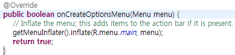
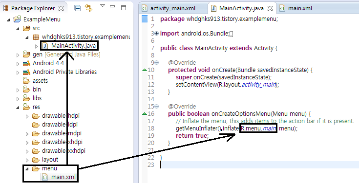
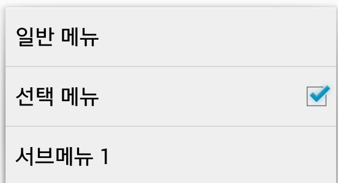

안녕하세요

이번에는 옵션 메뉴에 대해 알아보겠습니다

ps. 4.4로 SDK버전을 업데이트 했더니 예제도 4.4로 만들어 지는군요 ㅋㅋ

## 22. 옵션 메뉴(Menu) 사용방법

### 22-1 메뉴란?

기기의 메뉴버튼을 누르면 나타나는 화면이 있습니다

어쩔때는 이렇게 메뉴 부분 옆에 나타나기도 합니다

이렇게 기기의 설정과 같은 항목이나, 검색같은 기능을 따로 메뉴를 통해 만들어 두게 됩니다

이번에는 이 메뉴에 대해 알아보겠습니다

### 22-2 메뉴는 프로젝트를 만들때 부터 있는데요?

맞습니다 메뉴는 어떤 작업을 하지 않아도 프로젝트를 만들때 부터 생기게 됩니다

우리가 자주 접하던 onCreate()는 액티비티의 생명주기(원래 빨리 배웠어야 하는대 너무 미뤄졌네요)에 의해

액티비티가 처음에 만들어질때 호출되는 메소드인것을 감안하면

그 아래에 있는 onCreateOptionsMenu()메소드가 메뉴와 관련된 메소드 라는것을 알수 있습니다

이제부터 onCreateOptionsMenu와 관련된 코드를 배워 봅시다

### 22-3 메뉴가 나타나는 방법?

아래 사진을 보면 바로 이해가 됩니다

R.menu.main이라는 코드를 통해 res/menu/main.xml에 있는 코드를 읽어 와서 적용하는 방식입니다

그렇다면 저 xml파일에 무엇이 들어갈수 있는지 알아볼까요?

### 22-4 메뉴 레이아웃은 대부분 xml에서 작성해요

화면에 표시되는 메뉴는 자바에서도 add를 이용해 추가할수 있지만 대부분 xml을 통해 작성합니다

그 이유는 구글에서도 권장하고 있으며 코드의 간결성을 유지하기 위한 목적등이 있습니다

그럼 이제부터는 메뉴의 종류와 구현방법에 대해 알아보겠습니다

### 22-5 메뉴는 아래와 같은 종류가 있어요

이제부터는 메뉴의 종류를 알아보고 구현 방법에 대해 알아보겠습니다

먼저 허니콤(3.0)에서 새로 추가된 "액션바"라는것이 있습니다

대부분의 ICS이상 어플들이 이 액션바를 이용하여 구현되고 있는데요

아래 사진처럼 액션바를 이용해서 메뉴를 구현하고 있습니다

일반적인 메뉴는 아래와 같습니다

모두 같은 메뉴지만 엄밀히 따진다면 메뉴의 종류는 4가지 정도라고 볼수 있습니다

일반 보통 메뉴, 선택할수 있는 메뉴, 아이콘이 들어간 메뉴, 서브 메뉴

그렇다고 해서 아이콘과 선택메뉴가 동시에 안되는것은 아닙니다

먼저 일반 메뉴의 xml 구현방식 입니다

<menu xmlns:android="http://schemas.android.com/apk/res/android" >

    <item

        android:id="@+id/SimpleMenu"

**android:orderInCategory**="1"

**android:showAsAction**="never"

        android:title="일반 메뉴"/>

</menu>

메뉴를 구성하는 xml은 맨 처음에 Menu라는 태그로 감싸게 됩니다

그 아래에 item이라는 태그가 위치하게 되는데요

저기 두개의 새로운 속성들이 있습니다

android:orderInCategory

이것은 우선순위 입니다

숫자가 낮을 수록 위에 위치하게 됩니다

android:showAsAction

이것은 ActionBar에 표시할것인지에 관한 속성입니다

들어갈수 있는 값은 never, ifRoom, always, withText, collapseActionView가 있으며 각각의 뜻은 아래와 같습니다

never : 절대로 액션바에 표시하지 않습니다 (기본값)

ifRoom : 표시할수 있는 공간이 존재하면 표시합니다

withText : 메뉴의 아이콘과 텍스트를 함께 표시합니다

always : 항상 액션바에 표시합니다

두개 이상의 옵션을 "|"을 이용해 동시에 사용할수도 있습니다

|은 쉬프트 키를 누른상태에서 \을 누르면 됩니다

collapseActionView는 정보가 부족하여 아직은 저도 모르겠습니다

그 다음으로 선택 메뉴의 구현 방식입니다

<item

    android:id="@+id/clickAbleMenu"

    android:orderInCategory="2"

    android:showAsAction="never"

**android:checkable="true"**

    android:title="선택 메뉴"/>

일반 메뉴와 달라진것이 있다면 android:checkable입니다

그냥 저 코드만 붙혀주면 되며 기본값은 false입니다

또한 기본적으로 체크가 되어야 한다면 android:checked="true" 옵션을 통해 기본값으로 선택이 되어있게 할수도 있습니다

물론 이것도 기본값은 false입니다

세번째는 아이콘이 들어간 메뉴인데요

아쉽게도 메뉴 버튼을 눌러 나오는 창에서는 API 11부터, 즉 허니콤(3.0)부터는 아이콘이 나타나지 않습니다 (각주: 참고 : http://blog.daum.net/joata/6682518)

대신 액션바를 이용해 아이콘을 표시할수 있는데요

그 방법을 살펴보겠습니다

<item

    android:id="@+id/IconMenu"

    android:orderInCategory="3"

    android:showAsAction="**ifRoom**"

**android:icon**="@drawable/ic\_launcher"

    android:title="아이콘 메뉴"/>

볼게 없습니다

그냥 icon옵션을 사용했다는것 외에는 별거 없네요 ㅋㅋ

마지막은 서브 메뉴 입니다

<item

    android:id="@+id/subMenu\_1"

    android:orderInCategory="4"

    android:showAsAction="never"

    android:title="서브메뉴 1" >

**<menu>**

        <item

            android:id="@+id/subMenu\_2"

            android:orderInCategory="5"

            android:showAsAction="never"

            android:title="서브 메뉴 2"/>

        <item

            android:id="@+id/subMenu\_3"

            android:orderInCategory="6"

            android:showAsAction="never"

            android:title="서브 메뉴 3"/>

**</menu>**

</item>

서브메뉴는 아이탬 태그안에 다시 menu태그를 넣어 만든것으로

메뉴를 터치하면 또다시 메뉴가 뜨는 구조입니다

서브메뉴 안에 또다시 서브메뉴를 넣는것은 불가능 하다고 알고있습니다

### 22-6 자바코드에서 메뉴를 추가하는 방법

자, 지금까지 xml을 통해서 메뉴를 추가하는 방법에 대해 배워봤는데요

유동적으로 자바코드를 이용해서 메뉴를 추가해야 하는 경우가 있습니다 이때는 add메소드를 사용합니다

Menu.add(groupId, itemId, order, title)

groupId : 그룹 ID를 지정하며, Menu에서 사용할수 있는 그룹 옵션을 사용할때 쓰입니다

itemId : Menu 각각의 item의 ID를 지정합니다

order : item의 순서이며, android:orderInCategory와 같습니다

title : item의 Title입니다

예) menu.add(0, 7777, 1, "Java Add Menu");

### 22-7 메뉴를 눌렀을때 작업 처리

메뉴가 눌렸을때 무슨 작업을 할지 처리하는 메소드는 onMenuItemSelected라는 메소드 입니다

아래에 기본 형태가 있습니다

@Override

public boolean onMenuItemSelected(int featureId, MenuItem item) {

    return super.onMenuItemSelected(featureId, item);

}

저 메소드안에 처리할 명령어들을 담아야 하는데요

메뉴가 하나라면 몰라도 여러개가 있을땐 각각을 꼭 구분해야 합니다

자주 쓸수 있는 item의 옵션을 나열해 보겠습니다

item.getGroupId() : Groupid를 얻습니다

item.getIcon() : 아이탬의 Icon을 얻습니다

item.getIntent() : 연결된 Intent를 얻습니다

**item.getItemId() : 아이탬의 ID를 얻습니다**

item.getOrder() : 아이탬의 순서를 얻습니다

item.getTitle() : 타이틀을 얻습니다

item.isCheckable() : 현재 체크가 가능한지 여부를 반환합니다

**item.isChecked() : 현재 체크가 되어 있는지 여부를 반환합니다**

이중에서 아이탬을 구분할때 자주 쓸수 있는거라면 item.getItemId()이겠죠?

저 문구와 if문을 이용해서 터치된 아이탬의 id값을 얻어 실행할 작업을 구분하면 됩니다

if(item.getItemId()==R.id.**SimpleMenu**){

    Toast.makeText(this, "기본 메뉴가 터치되었습니다", Toast.LENGTH\_SHORT).show();

}

if(item.getItemId()==R.id.**clickAbleMenu**){

    if(**item.isChecked()**){

**item.setChecked(false);**

        Toast.makeText(this, "체크가 해제되었습니다", Toast.LENGTH\_SHORT).show();

    }else{

**item.setChecked(true);**

        Toast.makeText(this, "체크 되었습니다", Toast.LENGTH\_SHORT).show();

    }

}

if(item.getItemId()==R.id.**IconMenu**){

    Toast.makeText(this, "아이콘 메뉴가 터치되었습니다", Toast.LENGTH\_SHORT).show();

}

if(item.getItemId()==R.id.**subMenu\_2**){

    Toast.makeText(this, "서브메뉴 2가 터치되었습니다", Toast.LENGTH\_SHORT).show();

}

if(item.getItemId()==R.id.**subMenu\_3**){

    Toast.makeText(this, "서브메뉴 3이 터치되었습니다", Toast.LENGTH\_SHORT).show();

}

if(item.getItemId()==R.id.**actionBarMenu**){

    Toast.makeText(this, "액션바 메뉴가 터치되었습니다", Toast.LENGTH\_SHORT).show();

}

제 나름대로 소스를 구성하였습니다

저렇게 item의 id값을 얻어서 if문을 구성해 주시면 됩니다

(간결하게 하려고 else를 넣지 않았습니다)

여기서 하나 지정하지 않은것이 있습니다

바로 subMenu\_1인데요 이 메뉴는 어처피 눌러도 더보기와 같이 서브적인 메뉴를 띄워주는 역할만 하기 때문에

특별히 역할이 필요하지 않는 이상은 지정하지 않았습니다

이렇게 해서 메뉴의 사용법에 대해서도 알아봤습니다

저도 이글을 쓰면서 많이 배우는것 같네요 ㅎㅎ

스크린샷은 뭐 볼게 없어서 생략하겠습니다

메뉴 사용하기 쉽죠?~

[ExampleMenu.zip](https://github.com/itmir913/archive/releases/download/itmir-attachments/ExampleMenu.zip)

---

## 첨부파일

- [ExampleMenu.zip](https://github.com/itmir913/archive/releases/download/itmir-attachments/ExampleMenu.zip) `634 KB`
